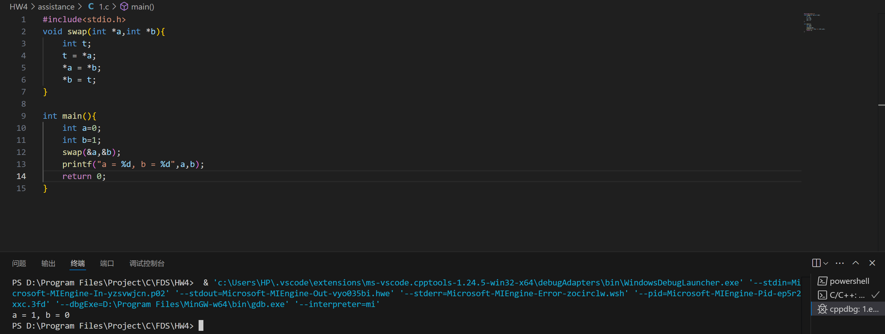
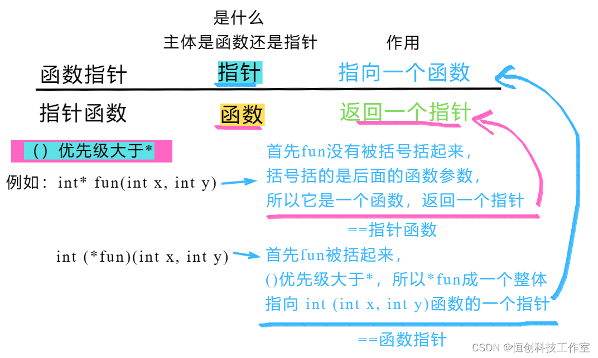

#  ==typedef==和==define==的使用

## 作用：名称替换

> C语言允许用户使用` typedef `和`define`关键字来**定义**自己习惯的数据类型名称，来替代系统默认的基本类型名称。

**语法**（根据使用常规惯例来记，熟练就就好）

```C
typedef  默认名称 自己定义的名称
#define 自己定义的名称 默认名称
```

```c
typedef int BOOL;
#define TRUE 1
#define FALSE 0
```

## ==typedef==的4种用法

1）为基本数据类型定义新的类型名

2）为==自定义数据类型==（结构体、共用体和枚举类型）定义简洁的类型名称

```c
struct Point  //此处struct是关键字，Point是结构（体）名，struct Point是结构类型，就如int为整型类型
{
    double x;
    double y;
    double z;
};
//这一串代码是**类型定义**，表明这种结构类型的内部结构变量的组成和结构。预计int也有结构类型的定义，不过是基础，不需我们定义。
struct Point stu;
//这一串代码是**变量定义**，表明stu是struct Point类型的变量
```

```C
typedef struct Point{
    double x;
    double y;
    double z;
} Stu 	//给类型名称struct Point换了个名字Stu，struct Point ≡ Stu  

/*1.体现了结构体可自定义的特征。
	结构体的变量类型为 struct + 结构名称
2.与其他的变量类型关键字符合
	int 是关键字；struct是关键字*/
    
//-----------注意区别-----------//
    
struct Point{
    double x;
    double y;
    double z;
} Stu	//定义结构类型的同时又有结构变量的定义此处Stu是结构变量，理解成如下
struct Point{
    double x;
    double y;
    double z;
};
struct Point stu;
```

嵌套定义时还是建议按照如下的方法定义。先定义结构类型，再给别名	

```C
struct tagNode
{
    char *pItem;
    struct tagNode *pNext;
};
typedef struct tagNode *pNode;
```

3）为数组定义简洁的类型名称

4）为指针定义简洁的名称

# 函数与指针

## 函数定义与调用

### 函数的定义

函数定义的一般形式为：


>函数类型 函数名( 形式参数表 )		/ * 函数首部 * /
>{
>		函数实现过程			   / * 函数体 * /
>}

函数类型是函数结果的返回类型，无返回结果则为void型，形参表给出函数计算所要用到的相关已知条件，格式为

```tex
类型1 形参1, 类型2, 形参2, ... ,类型n 形参n
```


注：**函数定义末尾无逗号，但是在开头函数声明是要加逗号，声明算是一句命令/一道指令**

### 函数的调用

调用自定义函数时，程序中必须有与调用函数相对应的函数定义。

- 函数调用的形式

函数调用的一般形式为:

> 函数名  (实际参数表)

实际参数(简称实参)可以是常量、变量和表达式。

- 函数调用参数传递

按照C语言的规定，在参数传递过程中，将实参的值**复制**给形参。这种参数传递是单向的，只允许实参把值复制给形参，形参的值即使在函数中改变了，也不会反过来影响实参。**函数调用的过程中，实参不会改变，变的是实际参数**，==可以通过使用指针或者全局变量（不推荐）修改实参。==

- 函数结果返回

形式如下：

> return 返回表达式

作用有两个，一是结束函数的运行；二是带着表达式返回主调函数

注意<font>return函数只能返回一个值</font>

- 函数声明

C语言要求函数**先定义后调用**，就像变量先定义后使用一样。

如果自定义函数被放在主调函数(一般是main函数)的后面，就需要在函数调用前，加上函数原型声明(或称为函数声明)。

```c
/*---自定义函数在前---*/
//main1.c-先定义函数再用
int fact{
    ...
}

int main(){
    int a;
    a = fact(n);
    return 0;
}
```

```c
/*---自定义函数在后---*/
//main2.c-先用再定义，需要声明
int main(){
    int a;
    int fact(n);	//函数声明
    a = fact(n);
    return 0;
}

int fact{
    ...
}
```

## 函数进阶（附指针）

> 先看一个比较drama的，<font>函数指针作为指针函数的参数</font>。
>
> 这是一个大杂烩：指针作为函数的参数、指针作为函数的返回值、指向函数的指针

### 指针作为函数的参数

指针作为参数时，将指针变量的值—也就是指针变量所指向的地址—复制给形参，并可以通过指针运算，改变其所指向的地址单元的内容。这种机制叫做“**引用调用**”。

一般，引用的时候会出现类似`swap(&a,&b)`的情况，因为要把指针赋值进来，而原参数不是指针类型的，所以要将其变成指针类型的；但是在函数的定义中，形参列表一般不会出现这种情况。


```c
#include<stdio.h>
void swap(int *a,int *b){
    int t;
    t = *a;
    *a = *b;
    *b = t;
}

int main(){
    int a=0;
    int b=1;
    swap(&a,&b);
    printf("a = %d, b = %d",a,b);
    return 0;
}
```



### 指针函数--指针作为函数的返回值

即函数可以返回一个地址。不过需要注意的是，**不能返回函数内部定义的自动变量的地址**，因为函数执行完毕之后，自动变量会全部消亡，其值不再具有意义。**例外**：如果自动变量的地址是通过动态内存分配方式建立的，则可以返回

> 此时函数类型为指针类型，可以称之为==*指针函数*==

### 函数指针--指向函数的指针

> 白话：将函数想象成一种类似于数组的东西，C语言会给他分配一个内存，用于存放函数首部和函数体。数组名是一个固定指针，同样的函数名是一个固定指针。（可以更加深刻地理解为什么不可以同时定义  相同的函数名+不同的函数类型）
>
> 其实`将函数看成特殊数组`是极好的办法，只是这个数组里面存放的各个变量是“过程”。

在C语言中，函数名代表函数的入口地址。可以定义一个指针变量，接收函数的入口地址，让它指向函数，这就是指向函数的指针，也称为==*函数指针*==。通过函数指针可以调用函数，它还可以作为函数的参数。

- 函数指针的定义

  函数指针定义的一般格式为:

> 类型名  (*变量名)  (参数类型表);

```c
int (*pfun)(int,int);
/*
①定义了一个指针，变量名加括号表示这个指针指向一个函数f(x)，f(x)是int型。
②函数f(x)有两个参数，两个参数的参数类型 分别是int型，int型
但是给函数指针分配内存的话，就是int类型的内存
*/

/*-----对比-----*/
int *pfun(int,int);		//定义一个函数，返回值是int类型的指针
int (*pfun)(int,int);	//定义一个函数指针，先处理*p，说明是一个指针
```



- 函数指针调用函数

首先是赋值

```c
int fun(int x,int y)
{
	...
}
...
    
    pfun = fun;
/*跟数组一样的，只需要写函数名就好了*/
```

其实是调用。函数调用的基本格式为

> (*函数指针名)(参数表);

比如

```c
fun(3,5);
(*pfun)(3,5);
```

>  <font title="green">函数指针调用函数的意义</font>：
>
>  1.实现回调函数。回调函数是一个通过函数指针传递的函数，它使得你能够将一个函数作为参数传递给另一个函数，并在适当的时候调用它。比如在一个函数中，若是要实现同类函数功能（比如升序排序和降序排序），则将函数指针作为参数传递函数就会显得十分必要。
>
>  2.动态函数调用： 函数指针使得程序可以动态地选择和调用函数。这对于某些需要在运行时决定调用哪个函数的场景非常有用。
>
>  3.多态性和接口实现： 在 C 语言中，函数指针常常用于模拟面向对象编程中的多态性。
>
>  ......

#### 函数指针作为函数的参数--更高阶版

<font>例</font>:编写一个函数calc(f,a,b)，用梯形公式求f(x)在[a,b]区间上的数值积分。即 $$\int_a^b {f(x)dx} = \frac{(b-a)*(f(a) + f(b))}{2}$$，然后调用该函数计算下列数值积分:（1）$\int_0^1 {x^{2}dx}$  ; （2）$\int_1^2 {\frac{sin(x)}{x}dx}$

```c
//使用函数指针，并将函数指针作为函数的参数案例分析--D:\Program Files\Project\C\Learning\test_25_04_27\test1.c
#include<stdio.h>
#include<math.h>

//声明
double calc( double(*fump)(double), double a, double b );
double f1(double x),f2(double x);

int main()
{
    double result;
    double (*funp)(double);
    
    result = calc(f1,0,1);
    printf("1:result=%.4f\n",result);
    funp = f2;
    result=calc(f2,1,2);		//函数指针的调用
    printf("2:result=%.4f\n",result);
    
    return 0;
}

double calc( double(*pfun)(double), double a, double b ){	//参数设置  '参数类型 + (*参数名称) + 被调函数参数类型'
    double z;
    z = (b-a)/2 * ( (*pfun)(a) + (*pfun)(b) );// '/2' 要放在前面，不然会强制改变变量类型
    return z;
}

double f1(double x){
    return (x*x);
}

double f2(double x){
    return( sin(x)/x );
}

```

### 数组名作为函数的参数

当进行参数传递时，主函数传递的是数组a的**基地址**，数组元素本身不被复制。作为一种<u>表示习惯</u>，编译器允许在作为参数声明的指针中使用*数组方括号*。为了说明这点，下面以一个对int型数组的元素进行累加的程序作为示例

```c
int sum(int a[],int n){
	int i，s=0;
    for(i=0;i<n;++i)
        s+=a[i];
	return s;
}//数组的形参a实际上是一个指针！
```

### 结构指针--指向结构的指针

就是结构指针，与指向函数的指针类似，不过更加便于理解

```c
struct student{
	int num;
    char name[100];
    int computer,english,math;
    double average;
};
...
struct student stu=[101,'zhang',78,87,85];
struct student *p;
p = &stu;
...
```

### 结构指针作为函数的参数

其实就想象成和‘数组名作为函数的参数’一样就可以了

### 指针数组--存储变量是指针的数组

数组的类型由数组内存储的变量类型决定。指针数组的意思就是数组内的变量都是指针类型

- 指针数组定义的一般格式

> 类型名 *数组名[数组长度]

说明：优先级要注意，'[]'优先级更高，所以是数组，'类型名 *'则指明了数组内存储的变量类型

```c
// D:\Program Files\Project\C\Learning\test_25_04_27\test2.c
#include <stdio.h>

int main(){
    const char *color[5] = {"red","blue","yellow","purple","brown"};	//关键字const作用是限定变量的值不改变
    int i=0;
    for(i=0;i<5;i++)
        printf("color[%d] = %s\n",i,color[i]);
    return 0;
}
```


### 二级指针/指针指针--指向指针的指针

定义的一般格式

> 类型名  **变量名

**二维数组**

int $a\left[ 3 \right]\left[ 4 \right]  $ 表示a[0],a[1],a[2]分别存储了三个内存为3个int型变量的数组

# 变量

## 变量类型

教材第六章：回顾数据类型和表达式

###  格式化字符串

#### 格式化输出函数printf()

`printf()`是系统提供的库函数，在`系统文件stdio.h`中声明，调用此函数需要包含头文件`stdio.h`。

> printf(格式控制字符串,输出参数1,输出参数2,......);如
>
> `printf("fahr=%d,celsius=%d\n"，fahr,celsius);`

格式控制字符串中包含两种信息，格式控制说明和普通字符。

- 格式控制说明:按指定的格式输出数据，它包含以`%`开头的格式控制字符，不同类型的数据采用不同的格式控制字符
- 普通字符:在输出数据时，需要原样输出的字符。

`printf()`函数的输出参数必须和格式控制字符串中的格式控制说明相对应，并且它们的**类型、个数和位置**要一一对应。

#### 格式化输入函数scanf()

> scanf(格式控制字符串,输入参数1，输入参数2,......);
>
> `scanf("%lf",&x);`

输入多个数据时，对于数值型的数据，之间加空格/制表符/回车即可。对于字符型数据，由于字符仅一个即可，所以不需要回车直接输入就行，不过这会产生另一个问题：虽然直接输入比如`'c'`就可以正确scanf，但是若不加回车，程序并不知道我们要结束scanf语句，所以有时候会多输入一个`'\n'`。对于字符串类数据，则需要以回车作为结束标志。

#### 格式控制

`printf("%4d%6.1f\n",fahr,celsius);`

`%m.nf`指定输出宽度为m位（缺则左端补空格，满溢则保留输出实际宽度），保留n位小数


### 字符型数据的输入和输出

`ch = getchar()`

`putchar(ch)`


## 数据类型

 ```mermaid
 %% graph定义了这是流程图，方向从左到右
 graph LR;
 %% 然后别急着画图，我们把每个节点定义成变量。（写代码是一门艺术，一定要写的逻辑清楚，我用o表示根节点，后面按层级的规律给它编码）
 o(数据类型)
 o1(基本数据类型)
 o2(构造数据类型)
 o3(指针类型)
 o4(空类型)
 o11(整型)
 o12(字符型)
 o13(实型/浮点型)
 o21(数组)
 o22(结构)
 o23(联合)
 o24(枚举)
 o131(单精度型)
 o132(双精度型)
 %% 定义变量后再开始连接节点。
 o --- o1
 o --- o2
 o --- o3
 o --- o4
 o1 --- o11
 o1 --- o12
 o1 --- o13
 o2 --- o21 
 o2 --- o22
 o2 --- o23
 o2 --- o24
 o13 --- o131
 o13 --- o132
 %% 到这里连接就写完了，其实这里就足够了，下面是美化样式的方法，精益求精，也可以不求。
 style o fill:black,stroke:black,stroke-width:1px,color:white
 style o1 fill:#f22816,stroke:#f22816,stroke-width:1px,color:white
 style o2 fill:#f2b807,stroke:#f2b807,stroke-width:1px,color:white
 style o3 fill:#233ed9,stroke:#233ed9,stroke-width:1px,color:white
 
 style o11 fill:#fcd4d0,stroke:#fcd4d0,stroke-width:1px
 style o12 fill:#fcd4d0,stroke:#fcd4d0,stroke-width:1px
 style o13 fill:#fcd4d0,stroke:#fcd4d0,stroke-width:1px
 style o21 fill:#fcf1cd,stroke:#fcf1cd,stroke-width:1px
 style o22 fill:#fcf1cd,stroke:#fcf1cd,stroke-width:1px
 style o23 fill:#fcf1cd,stroke:#fcf1cd,stroke-width:1px
 style o24 fill:#fcf1cd,stroke:#fcf1cd,stroke-width:1px
 style o131 fill:#fcd4d0,stroke:#fcd4d0,stroke-width:1px
 style o132 fill:#fcd4d0,stroke:#fcd4d0,stroke-width:1px
 
 %% 下面开始绘制线条的样式，以第一个为例子，0代表第一根线，顺序以代码的线出现的位置为准
 linkStyle 0 stroke:#f22816,stroke-width:5px;
 linkStyle 1 stroke:#f2b807,stroke-width:5px;
 linkStyle 2 stroke:#233ed9,stroke-width:5px;
 linkStyle 4 stroke:#f22816,stroke-width:3px;
 linkStyle 5 stroke:#f22816,stroke-width:3px;
 linkStyle 6 stroke:#f22816,stroke-width:3px;
 linkStyle 7 stroke:#f2b807,stroke-width:3px;
 linkStyle 8 stroke:#f2b807,stroke-width:3px;
 linkStyle 9 stroke:#f2b807,stroke-width:3px;
 linkStyle 10 stroke:#f2b807,stroke-width:3px;
 ```


## 全局变量


