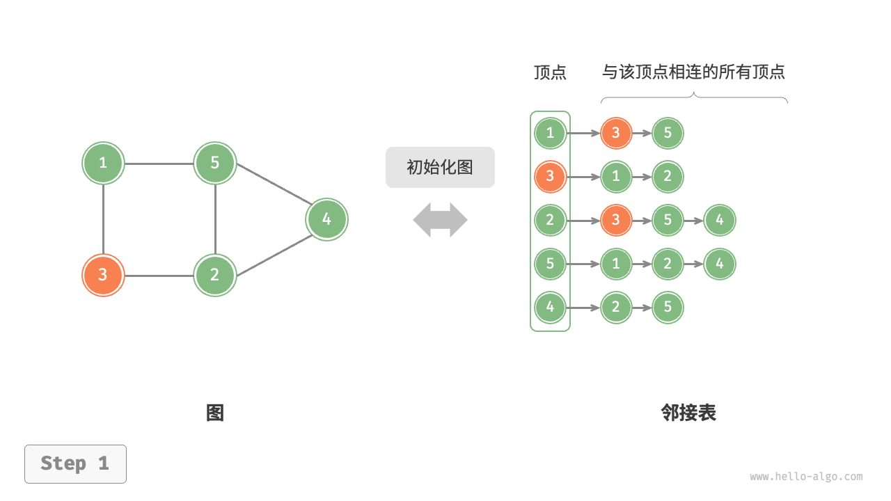

# 图

## 图的概念

一种非线性数据结构，由`顶点`（**vertex**）和`边`（edge）组成。（地图的图，可以联想地图）对于有向图来说，边就是一条`弧`，且`弧头`和`弧尾`分别是两个顶点。


### 图的分类

根据边是否具有方向，可分为`有向图`和`无向图`两类。无向图中，若n顶点有$\frac{1}{2}n(n-1)$个边，则是<u>完全图</u>，有向图中，若n顶点有$n(n-1)$个弧的图是<u>有向完全图</u>，也大致分为<u>稀疏图</u>和<u>稠密图</u>

根据所有顶点是否连通，可分为`连通图`和`非连通图`，有`生成树`概念。在有向图中，有<u>强连通图</u>

还可以添加`权重`变量，使图变为`有权图`

### 图的几个概念/术语

- 邻接（**adj**acency）：当两顶点之间存在边相连时，称这两顶点“邻接”。
  - 两个顶点**互为邻接点**
  - 边**依附**于两个顶点
- 路径（path）：从顶点 A 到顶点 B 经过的边构成的序列集合被称为从 A 到 B 的“路径”。
  - 路径的长度
  - 特殊路径：回路/环
  - 简单路径：序列中顶点不重复出现的部分
  - 简单回路/简单环：除了一与最后一个，其他不重复出现
- 度（degree）：一个顶点拥有的边数。
  - 对于有向图，**入度**（in-degree）表示指向该顶点的弧/以该顶点为头的弧的数量，**出度**（out-degree）表示有多少条边从该顶点指出
- 连通分量：极大连通子图，可以多个

## 图的表示方法

由于图的结构比较复杂，任意两个顶点
之间都可能存在联系，因此无法以数据元素在存储
区中的物理位置来表示元素之间的关系，即**图没有
顺序映像的存储结构**。可以借助数组的数据类型

也可以用多重链表表示，但是空间浪费太大

| 英文变量 | 含义     | 类型 |
| -------- | -------- | ---- |
| Vertex   | 顶点     | 数组 |
| arc      | 弧       | 略   |
| adj-     | 邻接前缀 |      |


### 数组表示方法

用两个数组分别存储数据元素（顶点）的信息和数据元素之间的关系（边或弧）的信
息。其形式描述如下：

```c
/*----教材关于邻接矩阵定义图----*/
//------图的数组（邻接矩阵）存储表示
#define INFINITY INT_MAX//最大值∞
#define MAX_VERTEX_NUM 20//最大顶点个数
typedef enum{DG,DN,UDG,UDN} GraphKind;//联合-（有向图，有向网，无向图，无向网）

typedef struct ArcCell{		//=====定义弧/边的数据结构====
    VRType adj;//VRType是顶点关系类型。对无权图，用1或0
    //表示相邻否；对带权图，则为权值类型。
    InfoType *info；//该弧相关信息的指针
}ArcCell,AdjMatrix[MAX_VERTEX_NUM][MAX_VERTEX_NUM];

typedef struct{		//====定义图的结构====
    VertexType VeXs[MAX_VERTEX_NUM];//顶点向量，标示各个顶点的顺序
    AdjMatrix arcs;//邻接矩阵
    int vexnum,arcnum;//图的当前顶点数和弧数
    GraphKind kind;//图的种类标志
}MGraph;
```

>  用矩阵元素来表示边，1表示有，0表示无；此外，可以将1/0换成权重，就成为有权图

### 邻接表

邻接表用链表存储图，链表节点表示顶点，后续元素存储了与其相连的所有顶点。节约了空间利用效率，但是增加了操作时间

- 可以参考哈希表的“链式地址”提高效率

```c
#define MAX_VERTEX_NUM 20
typedef struct ArcNode{  //----弧节点
    int adjvex;		//该弧所指向的顶点的位置
    struct ArcNode *nextarc;	//指向下一条弧的指针
    InfoType *info;		//该弧相关信息的指针
}ArcNode;
typedef struct VNode{	//----顶点节点
    VertexType data;	//顶点信息
    ArcNode *firstarc;	//指向第一条依附该顶点的弧的指针
}VNode,AdjList[MAX_VERTEX_NUM];
//=====将头节点和其他节点分开来，便于管理和理解=====
typedef struct{			//--图的结构
    AdjList vertices;	
    int vexnum,arcnum;
    int kind;	//图的种类标志
}ALGraph
```


### 十字链表--有向图

将有向图看成邻接表和逆邻接表结合起来的一种表


```c
#define MAX_VERTEX_NUM  20
typedef srtuct ArcBox{   //---十字链表的弧节点
    int tailvex,headvex;		//该弧的尾和头顶点的位置
    struct ArcBox *hlink,*tlink;	//分别为弧头相同和弧尾相同的弧的链域
    InfoType *info;		//该弧相关信息的指针
}ArcBox;

typedef struct VexNode{	//---十字链表的顶点节点/头节点
    Vertextype data;//顶点数据域
    ArcBox *firstin,*firstout;//入边和出边单链头指针
}VexNode;
typedef struct {
    VexNode xlist[MAX_VERTEX_NUM];//包含各个头节点，以创造多个链表
    int vexnum,arcnum;
}OLGraph;
```

### 邻接多重表--无向图
结点：

| mark               | ivex     | ilink  | jvex     | jlink  | info |
| ------------------ | -------- | ------ | -------- | ------ | ---- |
| 标志域：是否搜索过 | 顶点位置 | 下一边 | 顶点位置 | 下一边 | 信息 |

顶点：


```c
typedef struct tagEbox {//====边的结构====
     VisitIf       mark;      // 访问标记
     int      ivex, jvex;
                    //该边依附的两个顶点的位置
     struct tagEBox  *ilink, *jlink; 
     InfoType     *info;          // 该边信息指针
} EBox;

typedef struct VexBox {//====顶点结构====
   VertexType  data;
   EBox  *firstedge; // 指向第一条依附该顶点的边
} VexBox;

typedef struct {  //====邻接多重表====
    VexBox  adjmulist[MAX_VERTEX_NUM];
     int   vexnum, edgenum;    
  } AMLGraph;
```


## 图的基本操作

### 基于邻接矩阵实现

```c
/* 基于邻接矩阵实现的无向图结构体 */
typedef struct {
    int vertices[MAX_SIZE];
    int adjMat[MAX_SIZE][MAX_SIZE];
    int size;
} GraphAdjMat;

/* 构造函数 */
GraphAdjMat *newGraphAdjMat() {
    GraphAdjMat *graph = (GraphAdjMat *)malloc(sizeof(GraphAdjMat));
    graph->size = 0;
    for (int i = 0; i < MAX_SIZE; i++) {
        for (int j = 0; j < MAX_SIZE; j++) {
            graph->adjMat[i][j] = 0;
        }
    }
    return graph;
}

/* 析构函数 */
void delGraphAdjMat(GraphAdjMat *graph) {
    free(graph);
}

/* 添加顶点 */
void addVertex(GraphAdjMat *graph, int val) {
    if (graph->size == MAX_SIZE) {
        fprintf(stderr, "图的顶点数量已达最大值\n");
        return;
    }
    // 添加第 n 个顶点，并将第 n 行和列置零
    int n = graph->size;
    graph->vertices[n] = val;
    for (int i = 0; i <= n; i++) {
        graph->adjMat[n][i] = graph->adjMat[i][n] = 0;
    }
    graph->size++;
}

/* 删除顶点 */
void removeVertex(GraphAdjMat *graph, int index) {
    if (index < 0 || index >= graph->size) {
        fprintf(stderr, "顶点索引越界\n");
        return;
    }
    // 在顶点列表中移除索引 index 的顶点
    for (int i = index; i < graph->size - 1; i++) {
        graph->vertices[i] = graph->vertices[i + 1];
    }
    // 在邻接矩阵中删除索引 index 的行
    for (int i = index; i < graph->size - 1; i++) {
        for (int j = 0; j < graph->size; j++) {
            graph->adjMat[i][j] = graph->adjMat[i + 1][j];
        }
    }
    // 在邻接矩阵中删除索引 index 的列
    for (int i = 0; i < graph->size; i++) {
        for (int j = index; j < graph->size - 1; j++) {
            graph->adjMat[i][j] = graph->adjMat[i][j + 1];
        }
    }
    graph->size--;
}

/* 添加边 */
// 参数 i, j 对应 vertices 元素索引
void addEdge(GraphAdjMat *graph, int i, int j) {
    if (i < 0 || j < 0 || i >= graph->size || j >= graph->size || i == j) {
        fprintf(stderr, "边索引越界或相等\n");
        return;
    }
    graph->adjMat[i][j] = 1;
    graph->adjMat[j][i] = 1;
}

/* 删除边 */
// 参数 i, j 对应 vertices 元素索引
void removeEdge(GraphAdjMat *graph, int i, int j) {
    if (i < 0 || j < 0 || i >= graph->size || j >= graph->size || i == j) {
        fprintf(stderr, "边索引越界或相等\n");
        return;
    }
    graph->adjMat[i][j] = 0;
    graph->adjMat[j][i] = 0;
}

/* 打印邻接矩阵 */
void printGraphAdjMat(GraphAdjMat *graph) {
    printf("顶点列表 = ");
    printArray(graph->vertices, graph->size);
    printf("邻接矩阵 =\n");
    for (int i = 0; i < graph->size; i++) {
        printArray(graph->adjMat[i], graph->size);
    }
}
```

### 基于邻接表实现

```c
/* 节点结构体 */
typedef struct AdjListNode {
    Vertex *vertex;           // 顶点
    struct AdjListNode *next; // 后继节点
} AdjListNode;

/* 查找顶点对应的节点 */
AdjListNode *findNode(GraphAdjList *graph, Vertex *vet) {
    for (int i = 0; i < graph->size; i++) {
        if (graph->heads[i]->vertex == vet) {
            return graph->heads[i];
        }
    }
    return NULL;
}

/* 添加边辅助函数 */
void addEdgeHelper(AdjListNode *head, Vertex *vet) {
    AdjListNode *node = (AdjListNode *)malloc(sizeof(AdjListNode));
    node->vertex = vet;
    // 头插法
    node->next = head->next;
    head->next = node;
}

/* 删除边辅助函数 */
void removeEdgeHelper(AdjListNode *head, Vertex *vet) {
    AdjListNode *pre = head;
    AdjListNode *cur = head->next;
    // 在链表中搜索 vet 对应节点
    while (cur != NULL && cur->vertex != vet) {
        pre = cur;
        cur = cur->next;
    }
    if (cur == NULL)
        return;
    // 将 vet 对应节点从链表中删除
    pre->next = cur->next;
    // 释放内存
    free(cur);
}

/* 基于邻接表实现的无向图类 */
typedef struct {
    AdjListNode *heads[MAX_SIZE]; // 节点数组
    int size;                     // 节点数量
} GraphAdjList;

/* 构造函数 */
GraphAdjList *newGraphAdjList() {
    GraphAdjList *graph = (GraphAdjList *)malloc(sizeof(GraphAdjList));
    if (!graph) {
        return NULL;
    }
    graph->size = 0;
    for (int i = 0; i < MAX_SIZE; i++) {
        graph->heads[i] = NULL;
    }
    return graph;
}

/* 析构函数 */
void delGraphAdjList(GraphAdjList *graph) {
    for (int i = 0; i < graph->size; i++) {
        AdjListNode *cur = graph->heads[i];
        while (cur != NULL) {
            AdjListNode *next = cur->next;
            if (cur != graph->heads[i]) {
                free(cur);
            }
            cur = next;
        }
        free(graph->heads[i]->vertex);
        free(graph->heads[i]);
    }
    free(graph);
}

/* 查找顶点对应的节点 */
AdjListNode *findNode(GraphAdjList *graph, Vertex *vet) {
    for (int i = 0; i < graph->size; i++) {
        if (graph->heads[i]->vertex == vet) {
            return graph->heads[i];
        }
    }
    return NULL;
}

/* 添加边 */
void addEdge(GraphAdjList *graph, Vertex *vet1, Vertex *vet2) {
    AdjListNode *head1 = findNode(graph, vet1);
    AdjListNode *head2 = findNode(graph, vet2);
    assert(head1 != NULL && head2 != NULL && head1 != head2);
    // 添加边 vet1 - vet2
    addEdgeHelper(head1, vet2);
    addEdgeHelper(head2, vet1);
}

/* 删除边 */
void removeEdge(GraphAdjList *graph, Vertex *vet1, Vertex *vet2) {
    AdjListNode *head1 = findNode(graph, vet1);
    AdjListNode *head2 = findNode(graph, vet2);
    assert(head1 != NULL && head2 != NULL);
    // 删除边 vet1 - vet2
    removeEdgeHelper(head1, head2->vertex);
    removeEdgeHelper(head2, head1->vertex);
}

/* 添加顶点 */
void addVertex(GraphAdjList *graph, Vertex *vet) {
    assert(graph != NULL && graph->size < MAX_SIZE);
    AdjListNode *head = (AdjListNode *)malloc(sizeof(AdjListNode));
    head->vertex = vet;
    head->next = NULL;
    // 在邻接表中添加一个新链表
    graph->heads[graph->size++] = head;
}

/* 删除顶点 */
void removeVertex(GraphAdjList *graph, Vertex *vet) {
    AdjListNode *node = findNode(graph, vet);
    assert(node != NULL);
    // 在邻接表中删除顶点 vet 对应的链表
    AdjListNode *cur = node, *pre = NULL;
    while (cur) {
        pre = cur;
        cur = cur->next;
        free(pre);
    }
    // 遍历其他顶点的链表，删除所有包含 vet 的边
    for (int i = 0; i < graph->size; i++) {
        cur = graph->heads[i];
        pre = NULL;
        while (cur) {
            pre = cur;
            cur = cur->next;
            if (cur && cur->vertex == vet) {
                pre->next = cur->next;
                free(cur);
                break;
            }
        }
    }
    // 将该顶点之后的顶点向前移动，以填补空缺
    int i;
    for (i = 0; i < graph->size; i++) {
        if (graph->heads[i] == node)
            break;
    }
    for (int j = i; j < graph->size - 1; j++) {
        graph->heads[j] = graph->heads[j + 1];
    }
    graph->size--;
    free(vet);
}
```

## 图的遍历

### 深度优先探索-DFS

>  **深度优先遍历是一种优先走到底、无路可走再回头的遍历方式**。

```c
/* 检查顶点是否已被访问 */
int isVisited(Vertex **res, int size, Vertex *vet) {
    // 遍历查找节点，使用 O(n) 时间
    for (int i = 0; i < size; i++) {
        if (res[i] = = vet) {
            return 1;
        }
    }
    return 0;
}

/* 深度优先遍历辅助函数 */
void dfs(GraphAdjList *graph, Vertex **res, int *resSize, Vertex *vet) {
    // 记录访问顶点
    res[(*resSize)++] = vet;
    // 遍历该顶点的所有邻接顶点
    AdjListNode *node = findNode(graph, vet);
    while (node != NULL) {
        // 跳过已被访问的顶点
        if (!isVisited(res, *resSize, node->vertex)) {
            // 递归访问邻接顶点
            dfs(graph, res, resSize, node->vertex);
        }
        node = node->next;
    }
}

/* 深度优先遍历 */
// 使用邻接表来表示图，以便获取指定顶点的所有邻接顶点
void graphDFS(GraphAdjList *graph, Vertex *startVet, Vertex **res, int *resSize) {
    dfs(graph, res, resSize, startVet);
}
```


### 广度优先探索（BFS）

>  **广度优先遍历是一种由近及远的遍历方式，从某个节点出发，始终优先访问距离最近的顶点，并一层层向外扩张**。

```c
/* 节点队列结构体 */
typedef struct {
    Vertex *vertices[MAX_SIZE];//顶点指针数组
    int front, rear, size;	//前，后，大小
} Queue;

/* 构造函数 */
Queue *newQueue() {	//====队列创造函数====
    Queue *q = (Queue *)malloc(sizeof(Queue));
    q->front = q->rear = q->size = 0;
    return q;
}

/* 判断队列是否为空 */
int isEmpty(Queue *q) {
    return q->size == 0;
}

/* 入队操作 */
void enqueue(Queue *q, Vertex *vet) {
    q->vertices[q->rear] = vet;	//------//
    q->rear = (q->rear + 1) % MAX_SIZE;
    q->size++;
}

/* 出队操作 */
Vertex *dequeue(Queue *q) {
    Vertex *vet = q->vertices[q->front];
    q->front = (q->front + 1) % MAX_SIZE;	//队列操作，先入先出
    q->size--;
    return vet;
}

/* 检查顶点是否已被访问 */
int isVisited(Vertex **visited, int size, Vertex *vet) {
    // 遍历查找节点，使用 O(n) 时间
    for (int i = 0; i < size; i++) {
        if (visited[i] == vet)
            return 1;
    }
    return 0;
}

/* 广度优先遍历 */
// 使用邻接表来表示图，以便获取指定顶点的所有邻接顶点
void graphBFS(GraphAdjList *graph, Vertex *startVet, Vertex **res, int *resSize, Vertex **visited, int *visitedSize) {
    // 队列用于实现 BFS
    Queue *queue = newQueue();
    enqueue(queue, startVet);
    visited[(*visitedSize)++] = startVet;
    // 以顶点 vet 为起点，循环直至访问完所有顶点
    while (!isEmpty(queue)) {
        Vertex *vet = dequeue(queue); // 队首顶点出队
        res[(*resSize)++] = vet;      // 记录访问顶点
        // 遍历该顶点的所有邻接顶点
        AdjListNode *node = findNode(graph, vet);
        while (node != NULL) {
            // 跳过已被访问的顶点
            if (!isVisited(visited, *visitedSize, node->vertex)) {
                enqueue(queue, node->vertex);             // 只入队未访问的顶点
                visited[(*visitedSize)++] = node->vertex; // 标记该顶点已被访问
            }
            node = node->next;
        }
    }
    // 释放内存
    free(queue);
}
```


## 第七章：图

本章介绍了比树形结构更复杂的一种数据结构——图（Graph）。图在表示多对多关系中非常重要，例如社交网络、交通地图、任务依赖关系等。

### 7.1 图的定义和基本术语

#### 图的结构定义
一个图 `G` 是由一个**顶点集** `V` (*Vertex*) 和一个描述顶点之间关系的**边集** `E` (*Edge*) 构构成的。记为 `G = (V, E)`。

*  **有向图 (*Directed Graph*/Digraph)**: 边集 E 是有方向的，称为**弧 (*Arc*)** 。每条弧是一个顶点的有序对 `<v, w>`，表示从 `v` (**弧尾**/tail) 到 `w` (**弧头**/head) 的连接 。<font>弧尾是起点，弧头是终点</font>。**入度对应弧头，出度对应弧尾**。

  ```
  弧尾 ---> 弧头
  ```

*  **无向图 (*Undirected Graph*)**: 边集 E 是没有方向的，称为**边 (Edge)**  。每条边是一个顶点的无序对 `(v, w)`，表示 `v` 和 `w` 之间是双向连通的 。

#### 名词和术语

*  **网 (Network)**: 边或弧上带有**权值 (Weight)** 的图，权值表示两个顶点间的某种度量（如距离、成本、时间等） 。
* **邻接 (*Adjacent*)**:
    *  在无向图中，若存在边 `(v, w)`，则称顶点 `v` 和 `w` 互为邻接点 。
    *  在有向图中，若存在弧 `<v, w>`，则称顶点 `v` **邻接到** `w`，而 `w` **邻接自** `v` 。
* **度 (Degree)**:
    *  **无向图**: 顶点 `v` 的度 `TD(v)` 是与其关联的边数 。所有顶点的度之和等于边数的两倍: $\sum TD(v) = 2e$。
    * **有向图**:
        *  **入度 (In-degree) `ID(v)`**: 以 `v` 为弧头的弧的数量 。
        *  **出度 (Out-degree) `OD(v)`**: 以 `v` 为弧尾的弧的数量 。
        *  顶点的度 `TD(v) = ID(v) + OD(v)` 。所有顶点的入度之和等于出度之和，等于总弧数: $\sum ID(v) = \sum OD(v) = e$。
* **路径与回路 (Path & Cycle)**:
    *  **路径**: 从顶点 `u` 到 `w` 的一个顶点序列，序列中相邻顶点间都有边/弧 。
    *  **路径长度**: 路径上边或弧的数目 。[ 这部分<u>长度</u>和树一致 ]
    *  **简单路径**: 序列中顶点不重复出现的路径 。
    *  **回路 (或环)**: 第一个顶点和最后一个顶点相同的路径 。

- **子图 (*Subgraph*)**: 设图 `G=(V, E)` 和 `G'=(V', E')`，若 `V'` 是 `V` 的子集且 `E'` 是 `E` 的子集，则称 `G'` 是 `G` 的子图 。

* **连通性 (Connectivity)**:

    无向图：

    *  **连通图 (Connected Graph)**: 在**无向图**中，若<u>任意</u>两个顶点 `v` 和 `w` 之间都存在路径，则称图是连通的 。
    *  **连通分量 (Connected Component)**: 若无向图为非连通图，则图中各个<u>极大连通子图</u>称作此图的**连通分量**。

    有向图：

    *  **强连通图 (Strongly Connected Graph)**: 在**有向图**中，若任意两个顶点 `v` 和 `w` 之间都存在从 `v`到`w`的路径**以及**从`w`到`v`的路径，则称图是强连通的 
    *  **强连通分量 (Strongly Connected Component)**: 若有向图为非强连通图,有向图中的<u>极大强连通子图</u> 

* **生成树/森林 (Spanning Tree/Forest)**:

    *  一个连通图的**生成树**是其一个<u>极小连通子图</u>，它包含图中所有 `n` 个顶点，但只有足以构成一棵树的 `n-1` 条边 。
    *  非连通图的每个<u>连通分量</u>都可以有生成树，这些生成树的集合构成了该图的**生成森林** 。

    

    ```
    对此连通图：
        A -- B -- C
         |    |  / |
         F -- D -- E
     生成树如下：
         A -- B -- C
              |
         D -- E -- F
    对此非连通图：
           A -- F
               |
               E -- C
          B -- D
    生成森林为{T1,T2}
    T1：   A -- F
               |
               E -- C
    
    T2:   B -- D
    ```

    

* **完全图 (Complete Graph)**:

  *  **无向完全图**：任意两个顶点之间都存在一条边。对于 n 个顶点的图，边数为 $e = n(n-1)/2$ 。

    无向完全图必定是连通图，但是连通图不一定是无向完全图。

  *  **有向完全图**: 任意两个顶点之间都存在方向相反的两条弧。对于 n 个顶点的图，弧数为 $e = n(n-1)$ 。

    有向完全图必定是强连通图，但是强连通图不一定是有向完全图。

* **稀疏图 (Sparse Graph)** vs. **稠密图 (Dense Graph)**:

  *  当边数 $e$ 远小于顶点数的平方时（通常以 $e < n \log n$ 为界），称为稀疏图 
  *  反之，则称为稠密图 。存储结构的选择（邻接表 vs 邻接矩阵）通常取决于图的稀疏程度。

---

### 7.2 图的存储表示

#### 1. 邻接矩阵 (Adjacency Matrix)

使用一个二维数组 `A` 来表示图。对于一个有 `n` 个顶点的图，这是一个 `n x n` 的矩阵。

```
节点关系：0→1, 0→2, 1→2, 2→0, 2→3, 3→3

   0  1  2  3
0 [0, 1, 1, 0]
1 [0, 0, 1, 0]
2 [1, 0, 0, 1]
3 [0, 0, 0, 1]
```

* **定义**:
    $A[i][j] = \begin{cases} w_{ij} & \text{if } (v_i, v_j) \text{ or } <v_i, v_j> \text{ is an edge/arc with weight } w_{ij} \\ 1 & \text{if an unweighted edge/arc exists} \\ 0 \text{ or } \infty & \text{if no edge/arc exists} \end{cases}$

    此外要事先定义一个顶点向量

* **特点**:
    * 无向图的邻接矩阵是**对称**的。
    * 有向图的邻接矩阵**不一定对称** 。

* **优点**: 判断两个顶点是否邻接非常快 ($O(1)$)，方便计算顶点的度。

* **缺点**: 对于稀疏图，空间浪费严重 ($O(n^2)$)。

* **C语言定义**:
    ```c
    #define MAX_VERTEX_NUM 100
    // #define INFINITY ...
    
    typedef enum {DG, DN, UDG, UDN} GraphKind; // {有向图,有向网,无向图,无向网}
    typedef int VRType; // 关系类型，对无权图用1或0，对带权图为权值类型 Vertex relationship type
    typedef void* InfoType; // 弧相关信息的指针
    typedef char VertexType; // 顶点类型
    
    typedef struct {				// 弧的定义
        VRType adj;      // 顶点关系类型 
        InfoType *info;  // 弧相关信息的指针 
    } ArcCell, AdjMatrix[MAX_VERTEX_NUM][MAX_VERTEX_NUM];
    //AdjMatrix[MAX_VERTEX_NUM][MAX_VERTEX_NUM]的每个元素都是Arcell的一个结构体，AdjMatrix类型是ArcCell的一个m*m数组
    
    typedef struct {	//图的定义
        VertexType vexs[MAX_VERTEX_NUM];    // 顶点向量 
        AdjMatrix arcs;                     // 邻接矩阵 
        int vexnum, arcnum;                 // 顶点数和弧数 
        GraphKind kind;                     // 图的种类标志 
    } MGraph;
    ```

#### 2. 邻接表 (Adjacency List)

为图中每个顶点建立一个单链表，存储所有与该顶点邻接的顶点。

```
0 -> 1 -> 2
1 -> 2
2 -> 0 -> 3
3 -> 3
```

* **结构**: 一个包含所有顶点的数组（称为**表头节点数组**），数组的每个元素包含顶点信息和一个指向其邻接链表第一个节点的指针。
* **特点**:
  
    * **优点**: 空间效率高，只存储存在的边/弧，空间复杂度为 $O(n+e)$。特别适合表示**稀疏图**。
    * **缺点**: 判断两个顶点是否邻接需要遍历链表，效率不如邻接矩阵。
    * **有向图**: 邻接表只存储出边。为了方便查找入边，可以额外建立一个**逆邻接表**。
    
* **C语言定义**:
    ```c
    #define MAX_VERTEX_NUM 100
    
    // ... 其他类型定义同上 ...
    
    typedef struct ArcNode {//----弧节点
        int adjvex;                 // 该弧指向的顶点的位置 
        struct ArcNode *nextarc;    // 指向下一条弧的指针 
        InfoType *info;             // 该弧相关信息的指针 
    } ArcNode;
    
    typedef struct VNode {//----顶点节点
        VertexType data;        // 顶点信息 
        ArcNode *firstarc;      // 指向第一条依附该顶点的弧的指针 
    } VNode, AdjList[MAX_VERTEX_NUM];
    //=====将头节点和其他节点分开来，便于管理和理解=====
    typedef struct {//--图的结构
        AdjList vertices;       // 邻接表 
        int vexnum, arcnum;     // 顶点数和弧数 
        GraphKind kind;         // 图的种类标志 
    } ALGraph;
    ```


***

#### 3. 十字链表 (Orthogonal List)

这是一种专为**有向图**设计的链式存储结构。它通过将邻接表（存储出弧）和逆邻接表（存储入弧）结合，使得计算顶点的出度和入度都变得非常高效。

```
顶点节点数组：
[ {data:0, firstin:→e2, firstout:→e0},
  {data:1, firstin:→e0, firstout:→e1},
  {data:2, firstin:→e1, firstout:→e3},
  {data:3, firstin:→e4, firstout:→e5} ]
  
边节点链表：
    e0: (tailvex=0, headvex=1, hlink=→e1, tlink=→e2)
    e1: (tailvex=1, headvex=2, hlink=→NULL, tlink=→NULL)
    e2: (tailvex=0, headvex=2, hlink=→e3, tlink=→NULL)
    e3: (tailvex=2, headvex=0, hlink=→NULL, tlink=→e4)
    e4: (tailvex=2, headvex=3, hlink=→e5, tlink=→NULL)
    e5: (tailvex=3, headvex=3, hlink=→NULL, tlink=→NULL)

顶点数组：
┌─────┬────────┬────────┐
│ 0 │ firstin→e2 │ firstout→e0 │
├─────┼────────┼────────┤
│ 1 │ firstin→e0 │ firstout→e1 │
├─────┼────────┼────────┤
│ 2 │ firstin→e1 │ firstout→e3 │
├─────┼────────┼────────┤
│ 3 │ firstin→e4 │ firstout→e5 │
└─────┴────────┴────────┘

边节点链表：
e0: 0→1 ──┐
e1: 1→2   │ hlink
e2: 0→2 ──┘
e3: 2→0
e4: 2→3 ──┐
e5: 3→3   │ hlink

```

**结构:**
* **顶点节点 (VexNode):** 数组中的每个顶点节点包含三个域：
    * `data`: 存储顶点信息。
    * `firstin`: 指向以该顶点为**弧头**的第一条弧的指针。
    * `firstout`: 指向以该顶点为**弧尾**的第一条弧的指针。
* **弧节点 (ArcBox):** 链表中的每个弧节点代表图中的一条有向弧，包含五个域：
    * `tailvex`, `headvex`: 分别存储该弧的弧尾和弧头在顶点数组中的位置。
    * `hlink`: 指向与该弧有**相同弧头**的下一条弧的指针。
    * `tlink`: 指向与该弧有**相同弧尾**的下一条弧的指针。
    * `info`: 指向该弧相关信息的指针。

**特点:**
* **优点:** 结构清晰，能够快速获得一个顶点的所有出边（通过`firstout`和`tlink`链）和所有入边（通过`firstin`和`hlink`链），方便地计算出度和入度。
* **缺点:** 结构比邻接表更复杂，空间开销更大。

**C语言定义:**
```c
#define MAX_VERTEX_NUM 100

// ... 其他类型定义同上 ...

typedef struct ArcBox {
    int tailvex, headvex;       // 该弧的弧尾和弧头顶点的位置
    struct ArcBox *hlink, *tlink; // 分别指向弧头相同和弧尾相同的下一条弧
    InfoType *info;             // 该弧相关信息的指针
} ArcBox;

typedef struct VexNode {
    VertexType data;            // 顶点信息
    ArcBox *firstin, *firstout; // 分别指向该顶点第一条入弧和出弧
} VexNode;

typedef struct {
    VexNode xlist[MAX_VERTEX_NUM]; // 顶点表（十字链表）
    int vexnum, arcnum;          // 顶点数和弧数
} OLGraph;
```

#### 4. 邻接多重表 (Adjacency Multilist)

这是一专为**无向图**设计的链式存储结构，其主要优点是方便对**边**进行操作（例如删除一条边）。

```
顶点：0, 1, 2, 3
边：(0,1), (0,2), (1,2), (2,3)

顶点数组：
[ 
  {data:0, firstedge:→(0,1)}, 
  {data:1, firstedge:→(0,1)}, 
  {data:2, firstedge:→(0,2)}, 
  {data:3, firstedge:→(2,3)} 
]

边节点链表：
(0,1) → ilink: (0,2) → ilink: NULL
        jlink: (1,2) → jlink: NULL

(0,2) → ilink: NULL
        jlink: (2,3) → jlink: NULL

(1,2) → ilink: NULL
        jlink: NULL

(2,3) → ilink: NULL
        jlink: NULL
        
顶点数组：
┌─────┬─────────────┐
│ 0 │ firstedge→(0,1) │
├─────┼─────────────┤
│ 1 │ firstedge→(0,1) │
├─────┼─────────────┤
│ 2 │ firstedge→(0,2) │
├─────┼─────────────┤
│ 3 │ firstedge→(2,3) │
└─────┴─────────────┘

边节点链表：
(0,1) ┌──→ (0,2) → NULL
      └──→ (1,2) → NULL

(1,2) → NULL (无后续边)

(0,2) └──→ (2,3) → NULL

(2,3) → NULL (无后续边)
```

**结构:**

* **顶点节点 (Vex):** 数组中的每个顶点节点包含两个域：
    * `data`: 存储顶点信息。
    * `firstedge`: 指向第一条依附于该顶点的<u>边</u>的指针。（这是邻接表和邻接多重表的不同之处来源）

* **边节点 (ENode):** 链表中的每个边节点代表图中的一条边，包含六个域：
    * `mark`: 标记域，用于在图的遍历中标记该边是否已被访问过。
    * `ivex`, `jvex`: 分别存储该边所依附的两个顶点在顶点数组中的位置。
    * `ilink`: 指向下一条依附于顶点 `ivex` 的边的指针。
    * `jlink`: 指向下一条依附于顶点 `jvex` 的边的指针。
    * `info`: 指向该边相关信息的指针。

**特点:**

* **优点:** 边的表示非常灵活，每条边只用一个节点表示，删除边或顶点等操作非常高效。
* **缺点:** 结构比邻接表更为复杂，实现和遍历都需要更复杂的逻辑。

**C语言定义:**

```c
#define MAX_VERTEX_NUM 100

// ... 其他类型定义同上 ...

typedef enum {unvisited, visited} Vistited;

typedef struct ENode {
    Vistited mark;              // 访问标记
    int ivex, jvex;             // 该边依附的两个顶点的位置
    struct ENode *ilink, *jlink;// 分别指向依附这两个顶点的下一条边
    InfoType *info;             // 该边相关信息的指针
} ENode;

typedef struct {
    VertexType data;            // 顶点信息
    ENode *firstedge;           // 指向第一条依附该顶点的边的指针
} Vex;

typedef struct {
    Vex adjmulist[MAX_VERTEX_NUM]; // 邻接多重表
    int vexnum, edgenum;         // 顶点数和边数
} AMLGraph;
```


---

### 7.3 图的遍历

 图的遍历是从图中某个顶点出发，访问图中所有顶点，且每个顶点仅被访问一次 。为了防止在有环的图中无限循环，需要一个 `visited` 数组来记录顶点的访问状态。

```
      A
     /|\
    B-C-D
    |
    E
```

#### 1. 深度优先搜索 (DFS - Depth First Search)

类似于树的先序遍历，其基本思想是“走到底再回头”。

* **过程**:
  
    1.  从起始顶点 `v` 出发，访问 `v` 并标记为已访问。
    2.  选择 `v` 的一个未被访问的邻接点 `w`，从 `w` 出发递归地进行 DFS。
    3.  如果 `v` 的所有邻接点都已被访问，则回溯到 `v` 的上一个访问节点。
    4.   对于非连通图，需要对每个连通分量重复此过程 。
    
* **C语言递归实现**:
    ```c
    int visited[MAX_VERTEX_NUM]; // 全局访问标志数组
    
    void DFS(ALGraph G, int v) {
        //使用邻接表
        visited[v] = 1; // 设为TRUE
        VisitFunc(G.vertices[v].data); // 访问顶点v
        //G.vertices 是一个数组，数组的每个元素代表一个顶点。
        ArcNode *p = G.vertices[v].firstarc;//获取顶点 v 的第一个邻接点的指针。那是如何递归的呢
        while (p) {
            int w = p->adjvex;
            if (!visited[w]) {
                DFS(G, w); // 对v的尚未访问的邻接顶点w递归调用DFS 
            }
            p = p->nextarc;
        }
    }
    
    void DFSTraverse(ALGraph G) {  //满足当图非连通时也能访问到所有节点
        int v;
        for (v = 0; v < G.vexnum; ++v) {
            visited[v] = 0; // 初始化访问标志数组 
        }
        for (v = 0; v < G.vexnum; ++v) {
            if (!visited[v]) {
                DFS(G, v); // 对尚未访问的顶点调用DFS 
            }
        }
    }
    ```
    * **时间复杂度**: 邻接矩阵 $O(n^2)$，邻接表 $O(n+e)$。

#### 2. 广度优先搜索 (BFS - Breadth First Search)
类似于树的层序遍历，其基本思想是“逐层扩展”。

* **过程**:
    1.  从起始顶点 `v` 出发，访问 `v` 并将其入队列。
    2.  当队列不为空时，队头元素 `u` 出队。
    3.  依次访问 `u` 的所有未被访问的邻接点，将它们标记为已访问，并入队。
    4.  重复步骤2-3直到队列为空。

* **实现**: 需要一个**辅助队列**。

*  **特性**: 对于无权图，BFS 找到的从起点到任一其他顶点的路径，是**边数最少**的路径，即最短路径 。

* **时间复杂度**: 邻接矩阵 $O(n^2)$，邻接表 $O(n+e)$。

* C语言实现

    ```c
    // BFS函数：从指定顶点v开始进行广度优先搜索
    void BFS(ALGraph G, int v) {
        Queue Q;
        InitQueue(&Q); // 初始化队列
    
        visited[v] = 1; // 标记起始顶点v已访问
        // VisitFunc(G.vertices[v].data); // 访问顶点v (通常是在出队时访问)
        EnQueue(&Q, v); // 顶点v入队
    
        while (!QueueEmpty(&Q)) { // 队列不空则循环
            int u = DeQueue(&Q); // 顶点u出队
    
            // 在这里访问顶点u，因为它是当前层被取出的顶点
            // 或者也可以在入队时访问，但通常在出队时访问更符合“层序”的逻辑
            VisitFunc(G.vertices[u].data); 
    
            // 遍历u的所有邻接点
            ArcNode *p = G.vertices[u].firstarc;
            while (p) {
                int w = p->adjvex; // 邻接点w的下标
                if (!visited[w]) { // 如果w尚未访问
                    visited[w] = 1; // 标记w已访问
                    EnQueue(&Q, w); // w入队
                }
                p = p->nextarc; // 指向下一个邻接点
            }
        }
    }
    
    // BFS遍历整个图的函数
    void BFSTraverse(ALGraph G) {
        int v;
        for (v = 0; v < G.vexnum; ++v) {
            visited[v] = 0; // 初始化所有顶点为未访问
        }
    
        // 遍历所有顶点，确保所有连通分量都被访问到
        for (v = 0; v < G.vexnum; ++v) {
            if (!visited[v]) { // 如果顶点v尚未访问（表示它属于一个新的连通分量）
                BFS(G, v);     // 对v所在的连通分量进行BFS
            }
        }
    }
    ```


#### 3. 遍历应用举例
* **求一条从顶点i到顶点s的简单路径**:
    * [cite_start]**问题分析**: 从顶点i出发进行DFS，必然能搜索到s（如果路径存在）。但遍历过程中访问的顶点不一定都在最终路径上。  需要在递归和回溯时记录和删除路径上的顶点。
    * **算法描述**:
        ```c
        // PATH用于记录路径，found为全局标志
        void DFSearch(Graph G, int v, int s, char* PATH) {
            visited[v] = 1; // 标记访问
            Append(PATH, getVertex(v)); [cite_start]// 将当前顶点加入路径 
            
            if (v == s) { found = 1; return; } // 找到终点
            
            for (w = FirstAdjVex(G, v); w != 0 && !found; w = NextAdjVex(G,v,w)) {
                if (!visited[w]) DFSearch(G, w, s, PATH);
            }
        
            if (!found) Delete(PATH, v); // 回溯：如果从v出发的所有路径都找不到s，则将v从路径中删除 
        }
        ```
    
* **求两顶点间长度最短的路径（无权图）**:
  
    * **问题分析**: BFS访问顶点的次序是按“路径长度”（边数）递增的。  因此，BFS是解决此类问题的基础。
    * **算法思路**: 在BFS中，需要记录每个顶点在最短路径上的前驱。修改队列结构为**双向链表**，在入队时用`prior`指针记录其前驱结点（即刚刚出队的结点），这样遍历结束后就可以从终点s沿着`prior`指针链回溯到起点，从而得到完整路径。 
    * C语言实现
    
    ```c
    // 双向链队列节点结构
    typedef struct DuLQNode {
        int data;                  // 顶点在数组中的下标
        struct DuLQNode   *prior;  // 指向路径中的前驱节点
        struct DuLQNode   *next;   // 指向队列中的下一个节点
    } DuLQNode, *DuLQPtr;
    
    // 双向链队列结构
    typedef struct {
        DuLQPtr front; // 队头指针
        DuLQPtr rear;  // 队尾指针
    } LinkQueue;
    
    // visited[] 数组需在外部定义并初始化
    // G: 图的邻接表, v: 起点下标, s: 终点下标
    void FindShortestPath_BFS(ALGraph G, int v, int s) {
        LinkQueue Q;
        InitQueue(&Q); // 初始化队列
    
        // 如果起点就是终点
        if (v == s) {
            printf("Path is: %c\n", G.vertices[v].data);
            return;
        }
    
        visited[v] = 1; // 标记起点已访问
        EnQueue(&Q, v); // 起点入队
    
        int found = 0;
        while (!QueueEmpty(Q) && !found) {
            int u;
            DeQueue(&Q, &u); // 顶点u出队
    
            // 遍历u的所有邻接点
            for (ArcNode *p = G.vertices[u].firstarc; p; p = p->nextarc) {
                int w = p->adjvex;
                if (!visited[w]) {
                    visited[w] = 1;
                    // 修改入队操作以记录前驱
                    // p_w 是为w新创建的队列节点，它的prior指向u所在的队列节点
                    DuLQPtr p_w = EnQueue_with_prior(&Q, w, Q.front);
    
                    if (w == s) { // 找到了终点
                        found = 1;
                        printf("最短路径为: ");
                        PrintPath(&G, p_w); // 从终点回溯打印路径
                        break;
                    }
                }
            }
        }
    
        if (!found) {
            printf("顶点 %c 到 %c 不存在路径。\n", G.vertices[v].data, G.vertices[s].data);
        }
    }
    
    // 打印路径的辅助函数
    void PrintPath(ALGraph *G, DuLQPtr p) {
        if (p != NULL) {
            PrintPath(G, p->prior); // 递归回溯到路径起点
            printf("%c ", G->vertices[p->data].data); // 顺序打印
        }
    }
    
    ```
    
    


---

### 7.4 最小生成树 (MST - Minimum Spanning Tree)

 用于解决如何用最低成本连通所有顶点的问题，例如建设通信网络 。只适用于**带权的连通无向图**。
**定义**: 在一个带权连通图中，所有边的权值之和最小的生成树。

#### 1. 普里姆算法 (Prim's Algorithm)

是一种“加点”的贪心策略。

* **思想**:
    1.  从任意一个顶点 `V` 开始，将其加入集合 `U`（表示已在生成树中的顶点）。
    2.  重复 `n-1` 次：在所有一端在 `U` 中、另一端在 `V-U` 中的边里，找到一条权值最小的边 `(u, v)`。
    3.  将顶点 `v` 加入 `U`，并将边 `(u, v)` 加入生成树。
* **实现**: 通常使用一个辅助数组 `closedge` 来记录从 `V-U` 中每个顶点到 `U` 中顶点的最短边的信息 。
* **时间复杂度**: $O(n^2)$，适合**稠密图**。

```c
// 辅助数组，用于存储从V-U集合到U集合的最小边信息
struct {
    VertexType adjvex;  // U中那个提供最小边的顶点
    VRType lowcost;     // 对应的最小边的权值
} closedge[MAX_VERTEX_NUM];

// Prim算法，从顶点u出发构造网G的最小生成树
void MiniSpanTree_PRIM(MGraph G, VertexType u) {
    int k = LocateVex(G, u); // 找到顶点u的下标

    // 初始化辅助数组closedge
    for (int j = 0; j < G.vexnum; ++j) {
        if (j != k) {
            closedge[j].adjvex = u; // 初始时，所有顶点都与u相连
            closedge[j].lowcost = G.arcs[k][j].adj; // 记录权值
        }
    }
    closedge[k].lowcost = 0; // 将起点u加入集合U

    // 主循环，重复n-1次，找到n-1条边
    for (int i = 1; i < G.vexnum; ++i) {
        // 1. 在closedge中寻找lowcost最小的边，其顶点为k
        k = minimum(G, closedge); // minimum函数找到最小lowcost的下标

        // 2. 输出这条最小生成树的边
        printf("边: (%c, %c) 权值: %d\n", closedge[k].adjvex, G.vexs[k], closedge[k].lowcost);

        // 3. 将顶点k加入集合U
        closedge[k].lowcost = 0;

        // 4. 更新closedge数组
        // 因为新加入了顶点k，需要检查V-U中的其他顶点j
        // 到k的距离是否比它们原来到U的距离更近
        for (int j = 0; j < G.vexnum; ++j) {
            if (G.arcs[k][j].adj < closedge[j].lowcost) {
                closedge[j].adjvex = G.vexs[k];
                closedge[j].lowcost = G.arcs[k][j].adj;
            }
        }
    }
}
```


#### 2. 克鲁斯卡尔算法 (Kruskal's Algorithm)
一种“加边”的贪心策略。

* **思想**:
    1.  将图中所有 `e` 条边按权值从小到大排序。
    2.  依次考察每条边 `(u, v)`。
    3.  如果这条边连接的两个顶点 `u` 和 `v` 当前不属于同一个连通分量（即加入这条边**不会形成环**），则将这条边加入生成树。
    4.  重复直到选出 `n-1` 条边。
* **实现**: 需要判断两个顶点是否在同一连通分量，通常用**并查集**数据结构实现。
* **时间复杂度**: $O(e \log e)$，主要取决于边的排序时间。适合**稀疏图**。

---

### 7.5 最短路径问题

#### 1. 单源最短路径 (Dijkstra's Algorithm)
求从一个**源点** `v0` 到其余所有顶点的最短路径。适用于**权值为非负**的图。

* **思想**:
    1.  初始化：源点 `v0` 到自身的距离为0，到其他顶点的距离为无穷大（或直接相连的弧的权值）。创建一个集合 `S`，初始只包含 `v0`。
    2.  重复 `n-1` 次：从 `V-S` 中选取一个距离 `v0` 最短的顶点 `u`，将其加入 `S`。
    3.  **松弛操作**: 对 `u` 的所有邻接点 `w`，更新 `v0` 到 `w` 的距离：如果 `dist(v0, u) + weight(u, w) < dist(v0, w)`，则更新 `dist(v0, w)`。
* **时间复杂度**: 朴素实现为 $O(n^2)$。使用优先队列（堆）优化后可达 $O(e \log n)$。

#### 2. 所有顶点对之间的最短路径 (Floyd-Warshall Algorithm)
求图中任意两个顶点之间的最短路径。

* **思想**: 动态规划。定义 `D[k][i][j]` 为从 `i` 到 `j` 只允许经过编号从 `1` 到 `k` 的顶点作为中间点的最短路径长度。递推关系为：
    $D[k][i][j] = \min(D[k-1][i][j], D[k-1][i][k] + D[k-1][k][j])$
* **实现**: 使用一个二维数组 `D[i][j]` 存储距离，一个 `path[i][j]` 存储路径上的中转点。通过 `n` 次迭代，每次迭代加入一个中间点 `k` 来更新所有顶点对 `(i, j)` 的距离。
* **时间复杂度**: $O(n^3)$。

---

### 7.6 拓扑排序

**应用**: 用于解决一个工程或活动的时序安排问题。一个工程可以表示为一个**有向无环图 (DAG - Directed Acyclic Graph)**，顶点表示活动，弧表示活动间的优先关系。

* **拓扑序列**: 对一个 DAG 的顶点进行排序，使得若存在一条从 `v` 到 `w` 的路径，则在序列中 `v` 出现在 `w` 之前。
* **算法**:
    1.  在图中找到一个**入度为 0** 的顶点并输出。
    2.   从图中删除该顶点及其所有出边（即将其邻接点的入度减 1） 。
    3.  重复以上两步，直到所有顶点都被输出。
    4.   如果过程中找不到入度为 0 的顶点，说明图中存在**环**，无法进行拓扑排序 。
* **实现**: 通常用一个**栈或队列**来存放所有入度为 0 的顶点，避免每次都遍历图来查找。

---

### 7.7 关键路径

**应用**: 在项目管理中，估算工程的最短完成时间，并找出影响工期的“关键活动”。使用**带权有向图（通常是DAG）**，顶点表示**事件（Event）**，弧表示**活动（Activity）**，权值表示活动持续时间。

* **核心概念**:
    *  **事件最早发生时间 `ve(j)`**: 从源点到顶点 `j` 的**最长**路径长度 。按拓扑顺序计算：$ve(k) = \max_{j \to k} \{ve(j) + \text{duration}(<j, k>)\}$。
    *  **事件最迟发生时间 `vl(j)`**: 在不推迟整个工程完成时间的前提下，事件 `j` 最晚必须发生的时间 。按逆拓扑顺序计算：$vl(j) = \min_{j \to k} \{vl(k) - \text{duration}(<j, k>)\}$。
    * **活动最早开始时间 `ee(i)`**: 对于活动 `<j, k>`，其最早开始时间为 `ve(j)`。
    * **活动最迟开始时间 `el(i)`**: 对于活动 `<j, k>`，其最迟开始时间为 `vl(k) - duration(<j, k>)`。
    * **关键活动**: `ee(i) == el(i)` 的活动。这些活动没有任何时间余量，延迟会影响整个工期。
    * **关键路径**: 由关键活动构成的从源点到汇点的路径。其长度决定了整个工程的最短完成时间。
