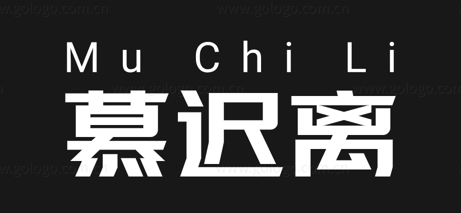

# Chapter2 处理器设计导论

一个简单的处理器可由以下结构构成

- 算术逻辑单元（ALU）；
- 控制逻辑（Control Logic）；
- 寄存器（Register）（PC, IR, ACC）

---
## MU0-一个简单的处理器

MU0 是曼彻斯特大学基于上述设计开发的第一类机器，常用于教学。

### 流水线
流水线的典型步骤如下：

1)从存储器读取指令 **(fetch)** 

2)译码以鉴别它是哪一类指令 **(dec)**。

3)从寄存器堆取得所需的操作数 **(reg)**

4)将操作数进行组合以得到结果或存储器地址 **(ALU)**

5)如果需要, 则访问存储器以存取数据 **(mem)**。

6)将结果回写到寄存器堆 **(res)**

>  [!TIP]
>  流水线的冒险会影响流水线的效率。因此有规定，流水线要求：指令执行步骤一致、指令集长度固定、没有转移指令，一般 3—5 级为好

---
## 精简指令集计算机
（Reduced Instruction Set Computer）
RISC 体系结构：

- 固定的指令长度（32 位），指令类型很少；
- **Load-Store 结构，数据处理只访问寄存器，与访问存储器的指令分开**；
- 大量的寄存器，不少于 32 个。可以用于任何用途；

RISC 组织：

- 硬连线的指令译码逻辑；
- 流水线执行；
- 指令单周期执行；
- 较高的时钟频率；

RISC 优点：面积小、开发快、<u>性能高</u>
RISC 缺点：代码密度低（指令长度固定，单周期导致代码无用部分多，在 ARM 中采用 **16 位 Thumb** 代码弥补）

----

## 小结

| 特性         | CISC                                                         | RISC                                                         |
| ------------ | ------------------------------------------------------------ | ------------------------------------------------------------ |
| 价格         | 由硬件完成部分软件功能，硬件复杂性增加，芯片成本高           | 由软件完成部分硬件功能，软件复杂性增加，芯片成本低           |
| 性能         | 减少代码尺寸，增加指令的执行周期数                           | 使用流水线降低指令的执行周期数，增加代码尺寸                 |
| 指令集       | 大量的混杂型指令集，有简单快速的指令，也有复杂的多周期指令，符合 HLL | 简单的单周期指令，在汇编指令方面有相应的 CISC 微代码指令       |
| 高级语言支持 | 硬件完成                                                     | 软件完成                                                     |
| 寻址模式     | 复杂的寻址模式，支持内存到内存寻址                           | 简单的寻址模式，仅允许 LOAD 和 STORE 指令存取内存，其它所有的操作都基于寄存器到寄存器 |
| 控制单元     | 微码                                                         | 直接执行                                                     |
| 寄存器数目   | 寄存器较少                                                   | 寄存器较多                                                   |

# 第二章、处理器设计导论

## Chapter1. 处理器体系结构和组织

计算机系统 = 软件 + 硬件/固件  
体系结构描述从用户角度看到的计算机，即概念性结构与功能特性。

是否把指令和数据放在同一存储器中？

**优点**：

- 不必预先区分指令和数据，易实现存储管理软件；
- 程序和指令在执行过程中可以被修改，因而可以编写出灵活的可修改的程序；
- 对于存取指令和数据仅需一套读/写和寻址电路，硬件简单；
- 数据可以分配于任何可用空间，从而可更有效地利用存储空间等。

**缺点**：

- 不利于进行程序调试诊断；
- 不利于实现程序的可再入性和程序的递归调用；
- 不利于重叠和流水方式的操作。

现在绝大多数计算机都规定，在执行进程中不准修改程序。

## Chapter2. 简单处理器设计介绍-MU0

采用冯·诺伊曼结构，指令存储在外部存储器中，I/O 模块提供对外接口，MPU、存储器、I/O 模块之间通过处理器总线（数据、地址、控制）相连。

MPU 包括：
- 算术逻辑单元（ALU）；
- 控制逻辑（Control Logic）；
- 寄存器（Register）（PC, IR, ACC）

执行程序步骤：
取值（存储器）→ 译码（MPU）→ 取操作数（存储器）→ 执行

指令集：
12 位地址空间、16 位数据总线（指令长度可达 16 位 4 操作+12 地址）

每条指令占用的周期数由访问存储器的次数决定

指令一般包括：操作码与操作数

## Chapter3. 指令集设计与流水线

指令地址（相加为例）：

- 四地址
- 三地址：下一条指令地址为隐含的（ARM 指令集采用）
- 二地址：一个源操作数用作目标寄存器
- 一地址：将目的寄存器隐含
- 零地址：堆栈

寻址模式：
立即寻址、绝对寻址、间接寻址、寄存器寻址、寄存器间接寻址、基址偏移寻址、基址变址寻址、基址比例变址寻址、堆栈寻址

指令类型：
数据处理指令（使用率最高）、数据传送指令、控制流指令、控制处理器执行状态的特殊指令

让处理器运行更快：
流水线技术、高速缓存、超标量指令执行

流水线典型步骤：
取指令译码 → 取操作数 → 操作数进行组合 → 访问存储器 → 回写

流水线要求：
指令执行步骤一致、指令集长度固定、没有转移指令，一般 **3—5 级为好**

## Chapter4. RISC VS CISC

RISC 体系结构：

- 固定的指令长度（32 位），指令类型很少；
- **Load-Store 结构，数据处理只访问寄存器，与访问存储器的指令分开**；
- 大量的寄存器，不少于 32 个。可以用于任何用途；

RISC 组织：

- 硬连线的指令译码逻辑；
- 流水线执行；
- 指令单周期执行；
- 较高的时钟频率；

RISC 优点：面积小、开发快、性能高  
RISC 缺点：代码密度低（指令长度固定，单周期导致代码无用部分多，在 ARM 中采用 **16 位 Thumb** 代码弥补）

CISC 整体反之：
昂贵、代码尺寸小（周期多）、大量混杂型指令集、寻址模式复杂等。

| 特性         | CISC                                                         | RISC                                                         |
| ------------ | ------------------------------------------------------------ | ------------------------------------------------------------ |
| 价格         | 由硬件完成部分软件功能，硬件复杂性增加，芯片成本高           | 由软件完成部分硬件功能，软件复杂性增加，芯片成本低           |
| 性能         | 减少代码尺寸，增加指令的执行周期数                           | 使用流水线降低指令的执行周期数，增加代码尺寸                 |
| 指令集       | 大量的混杂型指令集，有简单快速的指令，也有复杂的多周期指令，符合 HLL | 简单的单周期指令，在汇编指令方面有相应的 CISC 微代码指令       |
| 高级语言支持 | 硬件完成                                                     | 软件完成                                                     |
| 寻址模式     | 复杂的寻址模式，支持内存到内存寻址                           | 简单的寻址模式，仅允许 LOAD 和 STORE 指令存取内存，其它所有的操作都基于寄存器到寄存器 |
| 控制单元     | 微码                                                         | 直接执行                                                     |
| 寄存器数目   | 寄存器较少                                                   | 寄存器较多                                                   |

---