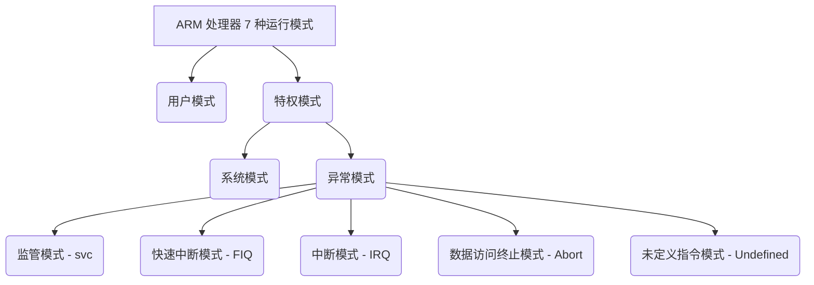
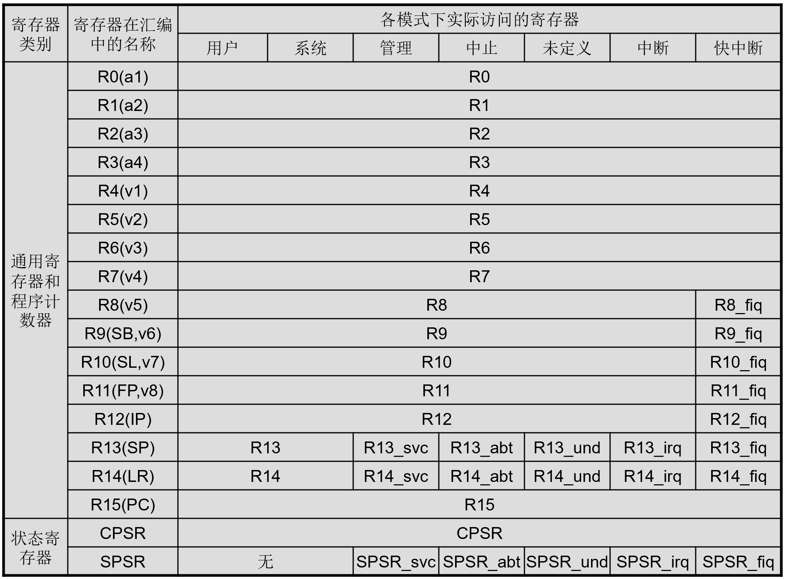

# 第四章、ARM 编程模型

## Chapter1、数据类型 处理器工作状态

支持的数据类型：
- **字节：8 位**
- **半字：16 位**
- **字：32 位**

工作状态：
- ARM 状态（字对齐的 ARM 指令）
- Thumb 状态（半字对齐的 Thumb 指令）

## Chapter2、存储器及存储器映射 I/O

ARM 处理器将存储器看作是一个从 **0 开始的线性递增的字节集合（以字为基本单元）**

跳转目标的计算方法：
$
\text{（当前指令的地址）} + 8\text{（两个字即跳转指令长度）} + \text{偏移量} 
$

下一条指令位置的计算方法：
$
\text{（当前指令的地址）} + 4\text{（四个字节）} 
$

存储器格式：
- 位于地址 A 的字包含的字节位于地址 A, A+1, A+2 和 A+3；
- 位于地址 A 的半字包含的字节位于地址 A 和 A+1；
- 位于地址 A 的字包含的半字位于地址 A 和 A+2；

小端模式：在一个字中，高位数据存放在高位地址中，大端模式反之

未对齐的存储器访问：
不是字对齐的访问均为未对齐的存储器访问。

指令的预取：
在前一条指令的执行尚未完成时将指令从存储器中取出，可能最终不被执行，因为：发生异常、发生跳转

预取可能存在的问题：
在存储器中的指令可能在它被预取之后，被执行之前发生改变。如果发生这种情况，对存储器中的指令进行修改一般不能阻止已取消的指令的执行。

## Chapter3、处理器模式

ARM 体系结构支持 7 种处理器模式，分别为：用户模式、系统模式、快中断模式、中断模式、管理模式、中止模式、未定义模式。

| 处理器模式  | 说明                            | 备注                                                         |
| ----------- | ------------------------------- | ------------------------------------------------------------ |
| 用户(usr)   | 正常程序工作模式                | 不能直接切换到其它模式                                       |
| 系统(sys)   | 用于支持操作系统的特权任务等    | 与用户模式类似，但具有可以直接切换到其它模式等特权，与用户模式共用寄存器，此模式修改寄存器更方便 |
| 快中断(fiq) | 支持高速数据传输及通道处理      | FIQ 异常响应时进入此模式                                     |
| 中断(irq)   | 用于通用中断处理                | IRQ 异常响应时进入此模式                                     |
| 管理(svc)   | 操作系统保护代码                | 系统复位和软件中断响应时进入此模式                           |
| 中止(abt)   | 用于支持虚拟内存和/或存储器保护 | 在 ARM7TDMI 没有大用处                                       |
| 未定义(und) | 支持硬件协处理器的软件仿真      | 未定义指令异常响应时进入此模式                               |

后六种为特权模式，可以访问一些片内外设和内部寄存器，特权模式下可以自由切换；后五种为异常模式，还可以通过特定的异常进入，都有独立的寄存器。

处理器启动时的模式转换：
管理模式（复位后默认）→ 多种特权模式（主要设置各模式堆栈）→ 用户程序运行模式

| **模式**                   | **占有的寄存器**                           | **可访问系统资源**                   | **模式切换方式**                 | **模式进入方式**                           |
| -------------------------- | ------------------------------------------ | ------------------------------------ | -------------------------------- | ------------------------------------------ |
| **用户模式 (User)**        | 用户程序运行使用的一组**寄存器**           | 多数受操作系统**保护的资源不能**访问 | **不能**直接进行处理器模式的切换 | 正常程序执行的默认模式                     |
| **系统模式 (System, sys)** | 与用户模式**完全一样**的一组**寄存器**     | **所有**系统资源                     | **可以直接**进行处理器模式的切换 | 执行特权级操作系统程序（不是通过异常进入） |
| **异常模式 (Abnormal)**    | **一组**寄存器（供相应的异常处理程序使用） | **所有**系统资源                     | **可以直接**进行处理器模式的切换 | 发生**中断**或**异常**时，处理器进入的模式 |

## Chapter4、寄存器组织

ARM 有 37（31+6）个物理寄存器，其中有 18 个可编程访问的寄存器。（31 个通用 32 位寄存器，6 个状态寄存器）

18 个可编程访问寄存器中：

- （15个）R0-R14 为保存数据或地址值的==通用寄存器==，不会被指定为特殊用途；

  - a. R0-R7 为==未分组寄存器==，即对于任何处理器模式，都对应于相同的 32 位物理寄存器
  - b. R8-R14 为==分组寄存器==，即对应的物理寄存器取决于当前的处理器模式；

    - R8-R12 为两个分组的物理寄存器。其中一个特殊用于 FIQ（快中断）模式；
    - R13、R14 为两个分组的物理寄存器。1个**共用**于用户和系统模式，其余 5 个分别用于异常模式
      **R13** 常作为堆栈指针（SP），指向各异常模式专用堆栈；
      **R14** 为链接寄存器（LR）
      - 在每种模式下，模式自身的 R14 版本用于保存子程序返回地址；
      
      - 当发生异常时，将 R14 对应的异常模式版本设置为异常返回地址（有些异常有一个小的固定偏移量）。
      
      - 注意要点：当发生异常嵌套时，这些异常之间可能会发生冲突。（保存的地址可能被覆盖）
      
      - 解决办法：R14 的对应版本在发生中断嵌套时不再保存任何有意义的值（将 R14 入栈），或者切换到其它处理器模式下。
  
- c. **R15** 为==程序计数器==（PC），指向正在取指的地址，可以认为是通用寄存器，但是使用受限

  - 当前正在执行指令的地址加上 8 个字节（三级流水线）；

  - 由于 ARM 指令总是以字为单位，所以 R15 寄存器的最低两位总是为 0（4 的倍数）；

  - 写 R15 值相当于执行一次无条件跳转

- d. **CPSR**：程序状态寄存器

  - 4 个条件代码标志（最高四位）：负，零（前两主用于比较），进/借位，溢出（后两者主要用于加减）；

  - 最低八位（0-7）为控制位，发生异常时被硬件改变或恢复模式下软件改变：
    - 2 个中断控制位（IRQ 中断禁止（7）、FIQ 快中断禁止（6））；
    - 5 个对当前七种处理器模式进行编码的位（最低五位 0-4）；
    - 1 个指示当前执行指令的工作状态位（ARM/Thumb）；

  - 保留位（8-27），保留使用，提高程序可移植性。

- e. **SPSR**：程序状态保存寄存器（异常模式下）
  - 每种<u>异常</u>均有自己对应的 SPSR--SPSR有5个，保存异常发生之前的 CPSR

Thumb 状态寄存器是 ARM 状态集的子集：
R0-R7, PC（R15), LR（R14), SP（R13), 有条件访问 CPSR

发生异常时，处理器自动进入 ARM 状态；

## Chapter5. 异常

正常的程序流被暂时中止，处理器就进入异常模式

**进入异常**：
1. 在对应模式的 LR 中保存下一条指令的地址
   异常入口为当前指令+8/4（ARM 状态）或当前指令+2/4（Thumb 状态）
2. 将 CPSR 复制到对应 SPSR 中；
3. 强制设置 CPSR 处理器模式位为与异常类型相对应的值；
4. 强制 PC 从相关的异常向量取出（进入异常）。

IRQ 和 FIQ 应置位禁止标志，防止不受控制的异常嵌套。

**退出异常**：
1. 将 LR 中的值减去偏移量后存入 PC，偏移量根据异常的类型而有所不同；
2. 将 SPSR 的值复制回 CPSR；
3. 请零在入口置位的中断禁止标志。

恢复 CPSR 的动作会将 T（状态位）、F 和 I 位（禁止标识）自动恢复为异常发生前的值。

**快速中断请求**：
对异常的快速响应（得益于八个专用的寄存器），返回时 R14_fiq 减 4；

**中断请求**：
优先级低于 FIQ，返回时 R14_irq 减 4 存入 PC，SUBS PC, R14_irq,#4；

**中止**：发生在对存储器的访问不能完成时
- 预取中止——指令预取过程中，但在到达流水线执行阶段才进入异常
- 数据中止——数据访问时
SUBS PC, R14_abt,#8

**软件中断指令（SWI）**：可以进入管理模式
MOVS PC, R14_svc

**未定义的指令**：遇到无法处理的指令
MOVS PC, R14_und

**异常优先级**：

| 异常类型   | 优先级          |
| ---------- | --------------- |
| 复位       | 1（最高优先级） |
| 数据中止   | 2               |
| FIQ        | 3               |
| IRQ        | 4               |
| 预取中止   | 5               |
| 未定义指令 | 6               |
| SWI        | 7（最低优先级） |

未定义的指令和 SWI 异常互斥。因为同一条指令不能既是未定义的，又能产生有效的软件中断；

数据中止的优先级必须高于 FIQ 以确保数据转移错误不会被漏过。

当 FIQ 使能，并且 FIQ 和数据中止异常同时发生时：
1. ARM 内核进入数据中止处理程序
2. 立即跳转到 FIQ 向量。
3. 在 FIQ 处理结束后返回到数据中止处理程序。

---