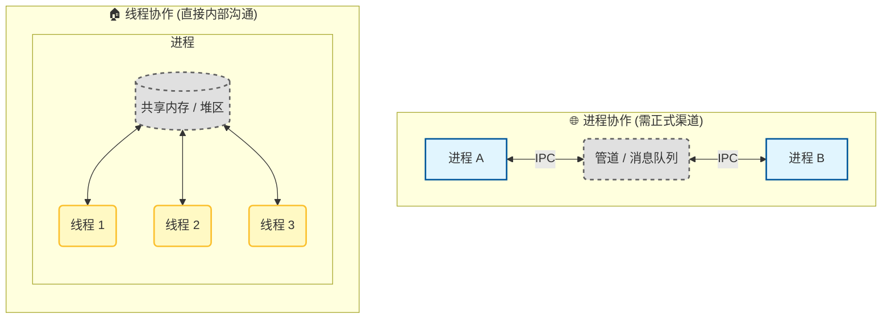
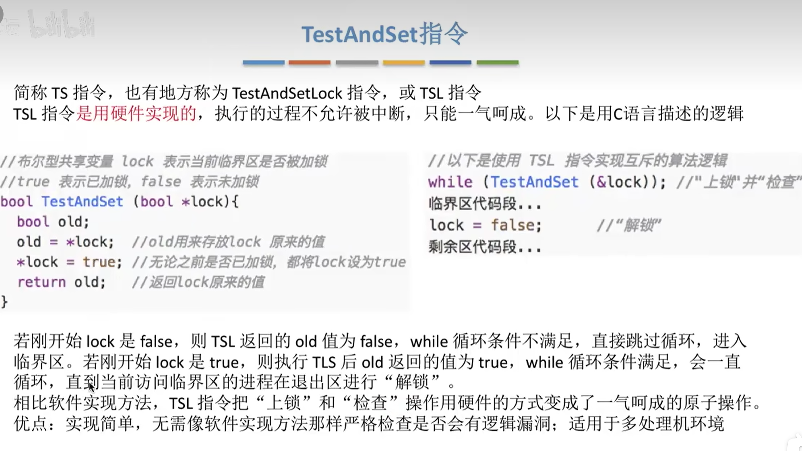
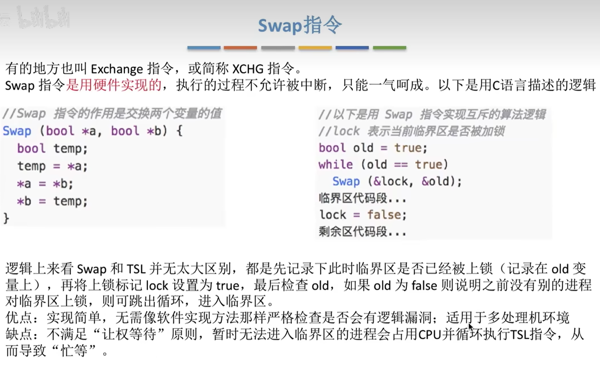

# 嵌入式系统-操作系统

《进程》、《线程》、《同步与互斥》以及《死锁与饥饿》四份课件的核心知识点。

## 第一部分：进程 (Process)

### 1. 基本概念

- **定义**：进程是一个正在运行的程序，是计算机上运行的程序的一个实例，是可以被分配给处理器并运行的一个实体。
- **进程的组成 (进程元素)**：
  - **程序代码**：可能被多个进程共享。
  - **数据集**：进程操作的数据。
  - **PCB (进程控制块)**：OS 用于管理进程的核心数据结构，是<span style="color:#FF0000; font-weight:bold;">OS中最重要的数据结构</span>。

### 2. 进程控制块 (PCB)

PCB 是进程存在的唯一标志，OS 依靠 PCB 感知进程，由 OS 创建和管理。PCB 包含：

- **进程标识符 (PID)**：唯一标识。
- **进程状态**：运行、就绪、阻塞等。
- 进程优先级
- **程序计数器 (PC)**：下一条要执行的指令地址。
- **CPU 寄存器**：累加器、索引寄存器等上下文数据。
- **内存管理信息**：页表、段表等。
- **I/O 状态**：分配给该进程的 I/O 设备列表。
- 其他说明见下

**进程轨迹**

- **轨迹 (Trace) 的定义**：我们可以通过列出进程执行的指令序列来描述单个进程的行为，这个序列就是进程的轨迹。
- **分派器 (Dispatcher)**：操作系统中的一个模块，负责将处理器从一个进程切换到另一个进程。（更准确的应该是—分发器直接操作的是 **线程** ）
- **处理器的视角**：从处理器的角度来看，它按照特定的逻辑（如时间片轮转），在多个进程之间穿插执行。因此，处理器的执行轨迹是多个进程轨迹的 **交错 (Interleaving)**。
- **图示理解**：
  - 单个进程看：是连续的指令流。
  - 宏观系统看：进程 A 运行一段 -> 分派器介入 -> 进程 B 运行一段 -> 分派器介入 -> 进程 A 运行一段...

### 3. 进程状态模型

表示进程的特性和运行状态.。课件中重点展示了以下状态模型：

1. **两状态模型**：运行 (Running)、未运行 (Not Running)。
2. **五状态模型 (UNIX 常用)**：
   - **New (新建)**：进程刚被创建。
   - **Ready (就绪)**：已准备好，等待 CPU 分配时间片。
   - **Running (运行)**：正在执行指令。
   - **Blocked/Waiting (阻塞)**：等待某事件（如 I/O）发生。
   - **Exit (退出)**：进程结束。
3. **挂起状态 (Suspend)**：当内存不足时，OS 会将阻塞的进程交换（Swap）到磁盘，形成“阻塞挂起（Blocked/Suspend）”或“就绪挂起（Ready/Suspend）”状态。挂起状态会在平时状态模型上新增加状态。当然挂起的原因还有很多：内存交换、其它 OS 原因、交互用户的请求、分时处理、父进程请求等（会表述即可）—内存、OS、用户、程序、父进程

**用于管理进程的数据结构**

操作系统为了管理进程和资源，必须维护关于当前系统状态的信息。OS 通常维护以下四类核心表格：

1. **内存表 (Memory Tables)**：
   - 用于跟踪主存（实内存）和辅存（虚拟内存）。
   - 信息包含
     - 记录分配给进程的主存部分。
     - 记录分配给进程的辅存部分。
     - 包含内存保护属性（如共享内存块、只读块等）。
     - 管理虚拟内存所需的映射信息。
2. **I/O 表 (I/O Tables)**：
   - 用于管理计算机系统中的 I/O 设备和通道。
     - 记录 I/O 设备的状态（可用/已分配）。
     - 记录 I/O 操作的状态（操作源、目的地、传输进度）。
3. **文件表 (File Tables)**：
   - 提供信息：
     - 提供关于文件存在的信息。
     - 记录文件在辅存中的位置。
     - 记录当前状态（如打开/关闭）和其他属性。
   - 维护：文件管理系统维护。
4. **进程表 (Process Table)**：
   - 这是 OS 管理进程的核心。
   - 主要用于定位和管理 **进程映像 (Process Image)**。
   - **进程映像**：OS 将进程视为一个整体，包括 **程序代码**、**数据**、**栈** 和 **PCB**。这四部分集合称为进程映像。
   - 进程表项指向各进程的 PCB，通过 PCB 可以访问进程映像的其他部分。

### 4. Unix SVR4 进程管理

- **系统进程**：仅在内核模式运行。
- **用户进程**：在用户模式运行，调用系统调用时切换到内核模式。
- **进程创建 (fork)**：
  - `fork()` 是 Unix 创建进程的核心机制。
  - 父进程调用 `fork()`
    - 分配一个独一无二的 PID
    - 给进程分配内存空间
    - 初始化 PCB
    - 设置相应的链接
    - 建立其它的数据结构
  - **返回值**：子进程中返回 0，父进程中返回子进程 PID。

  - **写时复制 (Copy-on-Write)**：课件暗示了父子进程数据独立，实际上现代 OS 采用写时复制技术优化效率。
- 进程切换：外部中断、内部陷阱（与当前指令相关的中断）、管理调用

```c
pid = fork (); // 父进程的返回值为子进程的pid,子进程调用fork返回值为0
pid = getpid();//可以用getpid()获得真实pid
```

---

## 第二部分：线程 (Thread)

### 1. 进程 vs 线程

这是最重要的区分点（课件图 3.15 重点）：

- **进程 (Process)**：是 **资源分配** 的单位（资源所有权）。有两个特性，2 个特性在操作系统中是分别处理的
  - –**资源所有权**- 进程包含一个虚拟地址空间来存放进程映像
  - –**调度/执行** – 依照一个执行顺序，中间会被其它进程穿插
- **线程 (Thread)**：是 **调度和执行** 的单位（轻量级进程）。
  - 每个线程拥有独立的：**程序计数器 (PC)**、**堆栈 (Stack)**、**寄存器状态**。
  - 同一进程内的线程共享：**代码段**、**数据段 (全局变量)**、**打开的文件**。

图表与图示的比较

| **方面**     | **进程**                           | **线程**                               |
| ------------ | ---------------------------------- | -------------------------------------- |
| **定义**     | 程序的执行实例，资源分配的基本单位 | 进程内的执行单元，CPU 调度的基本单位    |
| **内存**     | 有独立的地址空间                   | 共享进程的地址空间                     |
| **通信**     | 需要 IPC 机制（管道、共享内存等）    | 可直接读写共享变量，不必通过内核，方便 |
| **创建开销** | 大（需要复制资源）                 | 小（共享已有资源）                     |
| **崩溃影响** | 只影响自己                         | 可能导致整个进程崩溃                   |
| **切换开销** | 大（需要切换地址空间）             | 小（只需切换上下文）                   |

```
操作系统
├── 进程A (QQ)
│   ├── 线程1 (消息接收)
│   ├── 线程2 (文件传输)
│   └── 线程3 (UI渲染)
├── 进程B (Chrome)
│   ├── 线程1 (网络下载)
│   ├── 线程2 (JavaScript执行)
│   └── 线程3 (页面渲染)
└── 进程C (Word)
    ├── 线程1 (拼写检查)
    ├── 线程2 (自动保存)
    └── 线程3 (打印预览)
```




### 2. 为什么要使用多线程？

- **创建快**：新建线程比新建进程快得多（无需分配新地址空间）。
- **终止快**：销毁线程更快。
- **切换快**：同一进程内线程切换不涉及内存映射切换，开销小。
- **通信方便**：线程直接共享内存，无需内核介入即可通信（但也带来了同步问题）。

### **多线程场景**

- **Word 文档处理**：同时进行拼写检查、自动保存、打印预览
- **游戏引擎**：渲染线程、物理计算线程、音效线程
- **Web 服务器**：一个请求一个线程，共享连接池

### 3. 线程的实现方式

- **用户级线程** (User Level Thread，**ULT)**：OS 内核不知道线程的存在，线程库在用户空间管理。

  - 优点：切换不需要内核模式，跨操作系统。
  - 缺点：一个线程阻塞，整个进程阻塞。

- **内核级线程** (Kernel level Thread，**KLT)**：

  - 又称—内核支持线程 kernel-supported threads、

    轻量进程 lightweight processes

  - OS 内核直接管理线程（如 Windows, Linux）。

    - 优点：多处理器并行，一个线程阻塞不影响其他线程。
    - 缺点：切换需要内核模式，开销稍大。

---

## 第三部分：同步与互斥 (Synchronization & Mutex)

<span style="color:#FF0000; font-weight:bold;">强烈推荐看《王道操作系统》，光看 PPT 是看不懂的，概念有些晦涩难懂。</span>

---

[2.3.2_2 进程互斥的硬件实现方法](https://www.bilibili.com/video/BV1YE411D7nH?spm_id_from=333.788.player.switch&vd_source=c3043cbd3615e538d6bcae14948ab2f7&p=30)、[2.3.2_1 进程互斥的软件实现方法](https://www.bilibili.com/video/BV1YE411D7nH?spm_id_from=333.788.videopod.sections&vd_source=c3043cbd3615e538d6bcae14948ab2f7&p=29)

### 1. 并发 (Concurrency) 的核心概念

现代 OS 设计的核心议题是如何管理多个进程。

- **多进程环境的类型**：
  - **多道程序设计 (Multiprogramming)**：在 **单处理器** 上管理多个进程。
  - **多处理 (Multiprocessing)**：在 **多处理器** 上管理多个进程。
  - **分布式处理 (Distributed Processing)**：在分布式计算机系统（集群/网络）上管理多个进程。
- **并发的表现形式**：
  - **交叉 (Interleaving)**：在单处理器上，进程交替执行。宏观上看似同时，微观上是串行。
  - **重叠 (Overlapping)**：在多处理器上，进程不仅可以交叉，还可以真正地重叠执行（并行）。
- **并发带来的挑战**：
  1. **全局资源的共享**：例如两个进程读写同一个全局变量，读/写的顺序至关重要。
  2. **资源分配的优化管理**：OS 难以决定最优分配。例如，一个进程获得了 I/O 通道后被挂起，可能导致死锁。
  3. **定位错误困难**：由于并发执行的非确定性，结果不可复现，错误难以定位。

### 2. 关键术语与竞争条件 (Race Condition)

- **原子操作 (Atomic Operation)**：一个或一组指令的序列，对外看来是不可分割的。要么全做，要么全不做，中间不能被中断。

- **临界区 (Critical Section)**：一段访问共享资源（如公共变量、文件）的代码。

- **互斥 (Mutual Exclusion)**：当一个进程在临界区访问共享资源时，其他进程不能进入该临界区。

- **死锁 (Deadlock)**：两个或多个进程因相互等待对方持有的资源而无限期阻塞。

- **饥饿 (Starvation)**：一个可运行的进程被调度器无限期地忽视，无法获得执行机会。

- **竞争条件 (Race Condition)**：

  - **定义**：多个进程或线程读写共享数据，最终的结果取决于指令执行的相对时间顺序。

  - **经典案例 (echo 函数)**：

    ```c
    void echo() {
        chin = getchar();
        chout = chin;
        putchar(chout);
    }
    ```

    - **场景**：进程 P1 执行 `chin = getchar()` 读入 'x'，然后被中断；进程 P2 执行完整 echo 读入 'y' 并输出 'y'；P1 恢复执行，可能发生数据覆盖或丢失。最终结果取决于谁先写回内存。

### 3. 互斥的实现：硬件支持

操作系统需要保证临界区的互斥性。

- **方法一：关中断 (Disabling Interrupts)**
  - **原理**：在单处理器中，并发通过交叉实现。OS 只有在中断发生时（如时间片到）才会切换进程。如果进程在进入临界区前关闭中断，就能保证独占 CPU。
  - **缺点**：
    1. 用户进程滥用关中断可能导致系统挂起。
    2. **不适用于多处理器**：因为关中断只能禁止当前 CPU 的中断，其他 CPU 仍可访问共享内存。
- **方法二：专用机器指令 (Special Machine Instructions)**
  - CPU 提供的 **原子指令**，执行过程中不会被中断（很重要，C 语言只是示例，方便理解原理罢了）。
  - ✔**Test and Set /比较并交换 指令：**
    -  原子性地读取内存单元的旧值并比较，再将其设置为 1（忙状态）。（虽然不是很懂为什么要比较...）
    - 相比代码实现，好处是代码不是原子操作，无法同时比较和置1。
  - ✔**Exchange 指令**：
    - 原子性地交换寄存器和内存单元的值。
    - 其实本质和 Test and Set 是一样的，同时比较和设置值。
  - **优点**：适用于多处理器（通过锁总线实现）；支持多个临界区；简单易验证。
  - **缺点**：
    1. **忙等待 (Busy Waiting)**：进程在等待锁时会不断循环查询，消耗 CPU 时间。
    2. **饥饿**：竞争锁的进程可能无限期等待。
    3. **死锁**：低优先级进程持有锁被中断，高优先级进程抢锁空转，导致死锁。
<details open>
<summary> <b> 🛠️ 比较交换指令 (Test and Set / Compare And Swap)图文详解 </b> </summary>
<br>

</details>

<details>
<summary> <b> 🔄 Exchange 指令 (SWAP)</b> </summary>
<br>

</details>


### 4. 互斥的实现：信号量 (Semaphores)

信号量是 OS 或编程语言提供的一种更高级的机制，无需忙等待。

- **基本原理**：
  - 信号量是一个整数变量。
  - 除了初始化，只能通过两个 **原子操作** 访问：**semWait** (P 操作) 和 **semSignal** (V 操作)。
- **操作定义**：
  - `semWait(s)`：
    - `s.value--`
    - 如果 `s.value < 0`，则将调用该操作的进程阻塞，并放入等待队列。
    - 如果 `s.value >= 0`，进程继续执行。
  - `semSignal(s)`：
    - `s.value++`
    - 如果 `s.value <= 0`，则从等待队列中移除（唤醒）一个进程，将其变为就绪态。
- **分类**：
  - **二元信号量 (Binary Semaphore)**：值只能是 0 或 1。功能等同于互斥锁 (Mutex)。
  - **计数信号量 (Counting Semaphore)**：值可以是任意整数，常用于表示可用资源的数量。
- **强信号量 vs 弱信号量**：
  - **强信号量 (Strong Semaphore)**：等待队列采用 **FIFO (先进先出)** 策略，被阻塞最久的进程先被唤醒。这也是 OS 提供的标准实现，能防止饥饿。
  - **弱信号量**：未规定唤醒顺序。

### 5. 生产者-消费者问题 (Producer-Consumer Problem)

- **问题描述**：一个或多个生产者生成数据放入缓冲区；一个消费者取出数据。

- **约束**：

  1. 缓冲区满时，生产者必须等待。
  2. 缓冲区空时，消费者必须等待。
  3. 一次只能有一个进程访问缓冲区（互斥）。

- **基于信号量的解决方案 (有限缓冲 Bounded Buffer)**：

  - **变量**：

    - `s` (semaphore, init = 1)：互斥信号量，保护缓冲区的插入/删除操作。
    - `n` (semaphore, init = 0)：同步信号量，表示缓冲区中 **已有的数据项**。
    - `e` (semaphore, init = Size)：同步信号量，表示缓冲区中 **剩余的空位**。

  - **逻辑**：

    - **生产者**：

      ```c
      semWait(e);  // 等待有空位
      semWait(s);  // 申请互斥锁
      append();    // 放入数据
      semSignal(s);// 释放互斥锁
      semSignal(n);// 增加“数据项”计数（可能唤醒消费者）
      ```

    - **消费者**：

      ```c
      semWait(n);  // 等待有数据
      semWait(s);  // 申请互斥锁
      take();      // 取出数据
      semSignal(s);// 释放互斥锁
      semSignal(e);// 增加“空位”计数（可能唤醒生产者）
      ```

### 6. 消息传递 (Message Passing)

当进程间进行交互时，需要满足两个基本要求：**同步 (Synchronization)** 和 **通信 (Communication)**。消息传递机制同时提供了这两个功能。

- **基本原语**：
  - `send (destination, message)`
  - `receive (source, message)`
- **同步机制 (Synchronization)**：
  - **阻塞发送，阻塞接收 (Blocking send, Blocking receive)**：
    - 发送方发出消息后阻塞，直到接收方收到。接收方也阻塞直到消息到达。
    - 这种紧密的同步称为 **Rendezvous (会合)**。
  - **非阻塞发送 (Non-blocking Send)**：
    - 发送方发出消息后继续执行，不等待。这是更自然的并发方式。
    - 接收方两种情况
      - **接收方阻塞**：最常见的组合（如服务器等待请求）。
      - **接收方非阻塞**：双方都不等。
- **寻址方式 (Addressing)**：
  - **直接寻址**：
    - `send` 原语中包含目标进程的 ID。
    - `receive` 原语中可以指定源进程 ID，也可以不指定（接收任意）。
  - **间接寻址 (Indirect Addressing)**：
    - 消息发送到共享的数据结构，称为 **信箱 (Mailboxes)** 或 **端口 (Ports)**。
    - 发送方和接收方解耦。
    - 支持多种关系：一对一、多对一（客户/服务器）、一对多（广播）、多对多。
- **消息格式与排队**：
  - 消息通常由 **Header** (包含 ID, 源, 目的, 长度, 类型等) 和 **Body** (内容) 组成。
  - 排队原则通常是 FIFO (先进先出)，也可以基于优先级。

### 7. 读者-写者问题 (Readers/Writers Problem)

- **场景**：多个进程共享一个数据区（文件或内存）。
  - **Readers**：只读数据，不修改。
  - **Writers**：读且修改数据。
- **规则**：
  1. 多个 Reader 可以同时读取文件（共享）。
  2. 当 Writer 在写时，不允许其他 Writer 写，也不允许 Reader 读（独占）。
- **挑战**：如何设计优先级，既保证互斥，又防止某一方饥饿（例如，如果 Reader 总是优先，Writer 可能会一直等不到机会）。

---

## 第四部分：死锁与饥饿 (Deadlock & Starvation)

### 1. 死锁定义

一组进程中，每个进程都在等待由该组中另一个进程触发的事件（通常是释放资源），导致所有进程都无限期阻塞。

### 2. 死锁产生的四个必要条件

1. **互斥 (Mutual Exclusion)**：资源不能被共享，一次只能被一个进程使用。
2. **持有且等待 (Hold and Wait)**：进程持有一个资源，同时等待其他资源。
3. **不可抢占 (No Preemption)**：资源不能被强行剥夺。
4. **循环等待 (Circular Wait)**：P1 等 P2，P2 等 P3 ... Pn 等 P1，形成环路。

### 3. 处理死锁的策略

- **死锁预防 (Prevention)**：破坏上述四个条件之一。

  - 例如，要求进程一次性申请所有资源（破坏占有且等待）。
  - 无法避免互斥
  - “不可抢占”只有在资源状态可以很容易恢复才可用
  - 可破坏循环等待。

- **死锁避免 (Avoidance)**：在分配资源前判断是否安全（如 **银行家算法**）。

  - 进程启动拒绝—只有资源全部满足才启动，不好
  - **资源分配拒绝 / 银行家算法**—是否存在所有进程依次顺利结束的方法

- **死锁检测 (Detection)**：允许死锁发生，但定期检测并恢复（如杀死进程）。

- 通用算法：（Q, W, A 三者的相互关系注意--Q是请求矩阵、W是可用资源、A是分配矩阵）

  - 1. 标记 **分配矩阵 A** 中一行全 0 的进程（因为没占用任何资源）。

  - 2. 初始化一个临时向量 W，令其等于可用向量 / 可用资源。（初始化可用资源）

  - 3. 查找下标 ***i*** --**进程** ***i*** **当前未标记** 且 **请求 Q 的第 *i* 行小于等于 *W*。（** 查找分配掉所有现有可用资源后可以完成的进程）

    - 即对所有 1 ≤ k ≤ m,  Qik ≤ Wk 。Qi1 ≤ W1 ……
    - 如果没有这样的行，则算法终止

  - 4. 如果找到这样的一行

    - 标记进程 *i* 并把 **分配矩阵 A** 中的相应行加到 W 中( 可用资源增加 )
      - 即. 对所有 1 ≤ k ≤ m ，令 Wk = Wk + Aik。
    - 返回步骤 3.

  - 当且仅当算法的最后结果有未标记的进程时，存在死锁

    - 每个未标记的进程都是死锁的.
    
  - 小结：初始化AQW，找Q<W的，把A给W；进行循环

### 4. 经典案例：哲学家就餐问题 ✔

- **场景**：5 个哲学家围坐，5 把叉子。吃面需要左右两把叉子。
- **死锁情况**：每个人都拿起左边的叉子，然后等待右边的叉子。所有人都被阻塞。
- **解决方案 (课件提到的)**：
  - **资源分级 (Resource Hierarchy)**：给叉子编号。
  - **策略**：总是先拿编号小的叉子，再拿编号大的叉子。
  - **效果**：第 4 号哲学家原本应该先拿 4 再拿 0（因为他是圆桌），但在该策略下，他必须先拿 0（被第 0 号哲学家占有）再拿 4。这打破了循环等待链。
  - 详见 `dining_philosophers_solution.c` 代码。