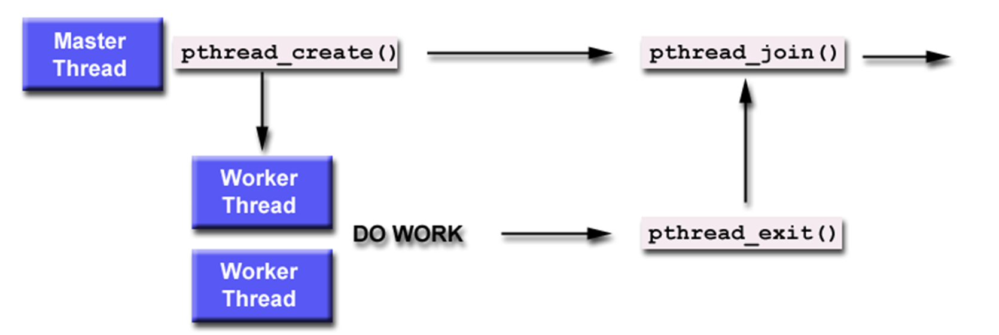

# Linux 嵌入式系统-线程编程全面详解

这份文档基于《Linux线程编程》课件，对其中的所有知识点进行了全面、详细的梳理和讲解。

代码见`D:\Program Files\Project\C\Embedded_System\Code_By_PPT`

## 第一部分：线程简介 (Thread Introduction)

### 1. 为什么要使用多线程？

在嵌入式Linux开发中，多线程（Multi-threading）是一种非常重要的并发编程模型。课件中特别强调了它相对于多进程（Multi-process）的“节俭”特性：

- **资源消耗少**：
    - **启动开销**：启动一个线程所花费的空间和资源远远小于启动一个进程。进程需要独立的地址空间、文件描述符表等，而线程依附于进程存在。
    - **地址空间共享**：运行于同一个进程中的多个线程，它们彼此之间**使用相同的地址空间**，共享大部分数据（如全局变量、堆内存、文件描述符）。
- **切换效率高**：
    - **上下文切换**：线程间彼此切换所需的时间远远小于进程间切换所需要的时间。因为线程切换不需要切换页表（内存映射），只需要切换寄存器状态和栈。
- **通信方便**：
    - **直接数据访问**：因为共享地址空间，一个线程的数据可以直接被其他线程访问，无需像进程间通信（IPC）那样通过复杂的管道、消息队列或共享内存机制。

### 2. Linux 线程标准

- **POSIX 线程 (pthread)**：Linux 系统下的多线程遵循 POSIX (Portable Operating System Interface) 线程接口标准。
- **开发环境**：
    - 头文件：`#include <pthread.h>`
    - 编译链接：需要链接 `libpthread.a` 或动态库，编译时通常需加上 `-lpthread` 参数（例如：`gcc main.c -lpthread`）。

## 第二部分：线程的基本管理 (Creation & Termination)

这一部分涉及如何产生一个线程以及如何结束它。

### 1. 创建线程 (`pthread_create`)

这是多线程编程的入口函数。

- **函数原型**：

  ```c
  int pthread_create(pthread_t *thread, const pthread_attr_t *attr, 
                     void *(*start_routine)(void *), void *arg);
  ```

- **参数详解**：

  1. `thread`: 指向 `pthread_t` 类型变量的指针，用于存储新创建线程的**标识符**（ID）。
  2. `attr`: 用于设置线程属性（如优先级、栈大小）。如果为 `NULL`，则使用默认属性。
  3. `start_routine`: 线程启动后执行的函数指针。该函数必须形如 `void *func_name(void *arg)`。
  4. `arg`: 传递给运行函数的参数。如果需要传递多个参数，通常传入一个结构体的指针。

- **返回值**：

    - 成功：返回 `0`。
    - 失败：返回错误码（不为0）。
        - `EAGAIN`: 系统限制创建新线程（如线程数过多）。
        - `EINVAL`: 属性值非法。

- **执行流程**：创建成功后，新线程开始运行 `start_routine`，而原线程（主线程）继续执行下一行代码。

### 2. 结束线程

线程可以通过以下三种方式结束：

1. **自然结束**：线程函数执行完毕，自然返回。
2. **自我结束 (`pthread_exit`)**：
     - 原型：`void pthread_exit(void *value_ptr);`
     - 参数：`value_ptr` 是线程的返回值（退出码），可以被其他线程通过 `pthread_join` 获取。
3. **被动结束 (`pthread_cancel`)**：
     - 原型：`int pthread_cancel(pthread_t thread);`
     - 功能：请求结束另一个线程。
     - 注意：如果线程所在的**进程**结束了（例如主函数 `main` 返回或调用 `exit`），那么该进程内的**所有线程**都会被强行终止。

> **案例参考**：请查看生成的代码文件 `01_thread_basic.c`

## 第三部分：线程属性与同步等待 (Attributes & Join)

### 1. 线程属性 (`pthread_attr_t`)

线程创建时可以通过属性对象来精细控制线程的行为。

- **初始化与销毁**：
    - `pthread_attr_init(pthread_attr_t *attr)`: 初始化属性对象为默认值（必须在 `pthread_create` 前调用）。
    - `pthread_attr_destroy(pthread_attr_t *attr)`: 销毁属性对象，释放资源。
- **分离状态 (Detach State)**：这是课件中重点提到的属性。
    - **绑定/非分离 (Joinable/Non-detached)**: 默认状态。线程结束时，其资源不会立即释放，必须由其他线程调用 `pthread_join` 来回收并获取返回值。
    - **分离 (Detached)**: 线程结束时，系统自动回收资源。不能被 join。
- **相关函数**：
    - `pthread_attr_setdetachstate(attr, detachstate)`: 设置分离状态。
    - `pthread_attr_getdetachstate(attr, detachstate)`: 获取分离状态。
    - `detachstate` 可选值：`PTHREAD_CREATE_JOINABLE` (默认), `PTHREAD_CREATE_DETACHED`。

### 2. 线程等待 (`pthread_join`)

用于同步，等待一个线程结束。

- **函数原型**：

  ```c
  int pthread_join(pthread_t thread, void **value_ptr);
  ```

- **功能**：调用此函数的线程会被**阻塞**，直到标识符为 `thread` 的线程结束。

- **参数**：

    - `thread`: 等待的目标线程 ID。
    - `value_ptr`: 指向指针的指针，用于存储目标线程 `pthread_exit` 时返回的数据。



### 3. 动态分离 (`pthread_detach`)

如果在创建后想将线程设为分离状态（不关心其返回值，希望它结束后自动释放资源），可以使用：

- `int pthread_detach(pthread_t thread);`

> **案例参考**：请查看生成的代码文件 `02_thread_join_detach.c`

## 第四部分：线程互斥锁 (Mutex)

当多个线程需要访问同一个公共资源（如全局变量）时，需要使用互斥锁来防止竞争条件（Race Condition）。

- **概念**：互斥锁只有两种状态：**锁定 (Lock)** 和 **非锁定 (Unlock)**。
- **数据类型**：`pthread_mutex_t`
- **核心函数**：
    1. **初始化**：
        - `pthread_mutex_init(&mutex, NULL)`: 动态初始化，`NULL` 表示默认属性。
        - 或者静态初始化：`pthread_mutex_t mutex = PTHREAD_MUTEX_INITIALIZER;`
    2. **上锁**：
        - `pthread_mutex_lock(&mutex)`: 尝试上锁。如果锁已被其他线程占用，当前线程**阻塞**（睡眠），直到锁被释放。
        - `pthread_mutex_trylock(&mutex)`: 非阻塞版本。如果锁被占用，立即返回 `EBUSY`，不会等待。可用于防止死锁。
    3. **解锁**：
        - `pthread_mutex_unlock(&mutex)`: 释放锁，唤醒正在等待该锁的线程。

> **案例参考**：请查看生成的代码文件 `03_mutex_lock.c`

## 第五部分：条件变量 (Condition Variables)

互斥锁用于“排他性”访问，而条件变量用于“等待某个事件发生”。它弥补了互斥锁的不足，允许线程在条件不满足时挂起，条件满足时被唤醒。通常与互斥锁配合使用。

- **工作机制**：
  1. 线程 A 获得互斥锁，检查条件。
  2. 如果条件不满足，线程 A 调用 `pthread_cond_wait`。这会**原子地**释放互斥锁并进入睡眠状态。
  3. 线程 B 获得互斥锁，改变条件（例如生产了数据）。
  4. 线程 B 调用 `pthread_cond_signal` 通知等待的线程。
  5. 线程 A 被唤醒，重新获得互斥锁，继续执行。


- **核心函数**：

  1. **初始化**：
       - `pthread_cond_init(&cond, attr)`: 动态初始化。

  2. **等待**：
       - `pthread_cond_wait(&cond, &mutex)`: 阻塞等待信号。注意必须传入互斥锁，因为需要在等待前解锁，唤醒后加锁。
       - `pthread_cond_timedwait(&cond, &mutex, &abstime)`: 限时等待，超时后自动解除阻塞。
       
  3. **唤醒**：
       - `pthread_cond_signal(&cond)`: 唤醒**一个**等待该条件的线程。
       - `pthread_cond_broadcast(&cond)`: 唤醒**所有**等待该条件的线程。

> **案例参考**：请查看生成的代码文件 `04_cond_var.c`

## 第六部分：信号量 (Semaphores)

信号量本质上是一个非负的整数计数器，用来控制对公共资源的访问数量。它常用于“生产者-消费者”模型。

- **头文件**：`#include <semaphore.h>` (注意不是 pthread.h，虽然常一起使用)
- **核心操作**：
    - **P操作 (Wait/Decrease)**: 想要使用资源，信号量减1。如果信号量为0，则阻塞等待。
    - **V操作 (Post/Increase)**: 释放资源，信号量加1。如果有线程在等待，唤醒它。
- **核心函数**：
  1. `sem_init(sem_t *sem, int pshared, unsigned int value)`: 初始化。`value` 是初始值。
  2. `sem_wait(sem_t *sem)`: 阻塞等待，直到信号量 > 0，然后减1。
  3. `sem_trywait(sem_t *sem)`: 非阻塞等待。
  4. `sem_post(sem_t *sem)`: 增加信号量（V操作）。
  5. `sem_destroy(sem_t *sem)`: 销毁信号量。

> **案例参考**：请查看生成的代码文件 `05_sem_producer_consumer.c`

## 总结

嵌入式Linux操作系统中的线程编程核心在于**资源共享**与**同步互斥**。

1. **基础**：利用 `pthread_create` 和 `pthread_exit` 管理线程生命周期。
2. **属性**：利用 `pthread_attr` 控制线程是 Joinable 还是 Detached。
3. **安全**：利用 **互斥锁 (Mutex)** 保护临界区，防止数据竞争。
4. **协作**：利用 **条件变量 (Cond)** 实现线程间的事件通知。
5. **流控**：利用 **信号量 (Semaphore)** 控制并发资源的数量（如缓冲区大小）。

---

## EXAM


```c
// pthread
int pthread_create(pthread_t *thread, const pthread_attr_t *attr, void *(*start_routine)(void *), void *arg);

// join
int pthread_join(pthread_t thread, void **value_ptr);

// mutex
pthread_mutex_init(&mutex, NULL);
pthread_mutex_lock(&mutex);
pthread_mutex_unlock(&mutex);

// con
pthread_cond_init(&cond, attr);
pthread_cond_wait(&cond, &mutex);
pthread_cond_signal(&cond);

// sem
sem_init(sem_t *sem, int pshared, unsigned int value);
sem_wait(sem_t *sem);
sem_post(sem_t *sem);
sem_destroy(sem_t *sem);
```

地址、其他参数、关键参数


