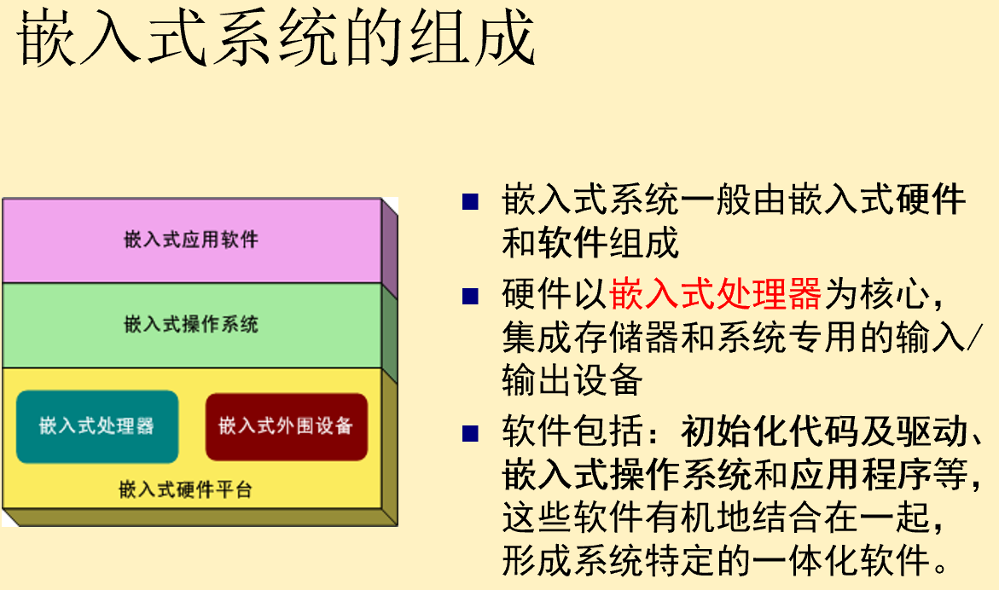
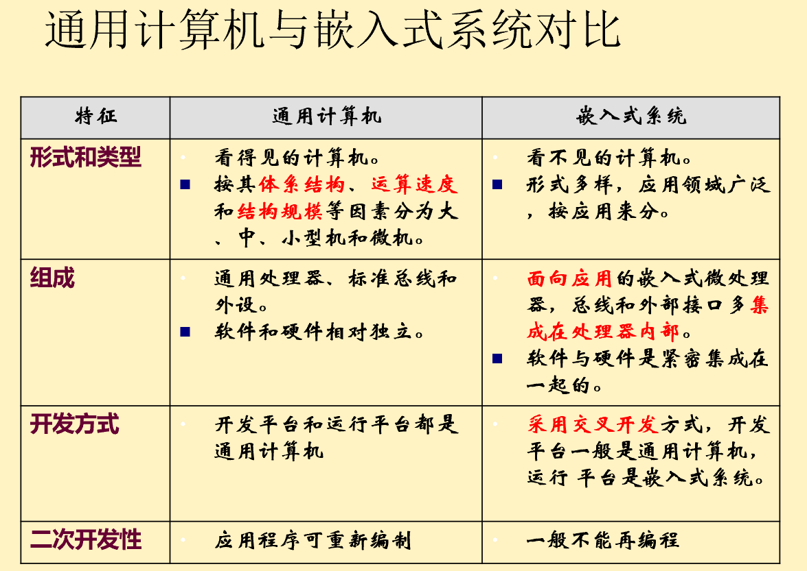
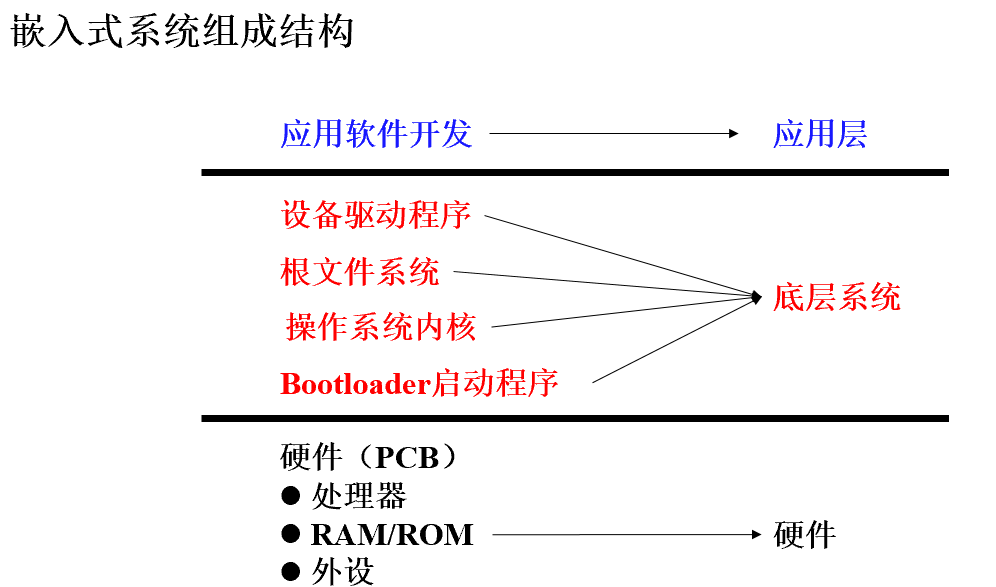
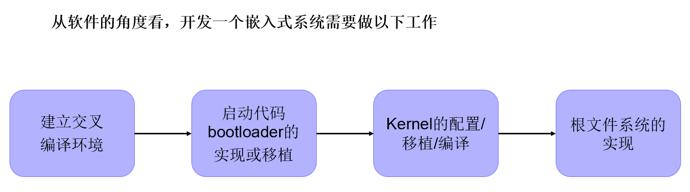
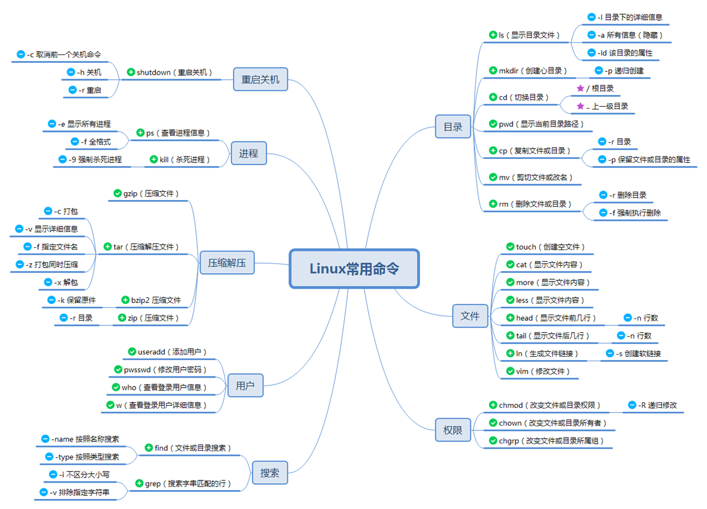
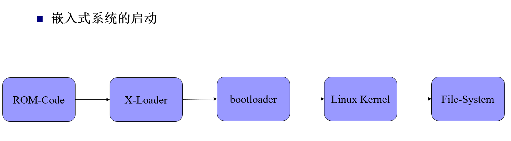
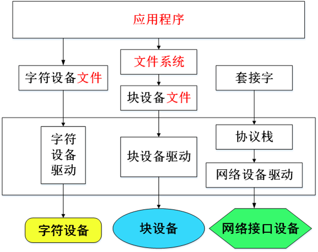

[TOC]

# Exam

## 1& 2. 导论  

  嵌入式系统是以应用为中心、以计算机技术为基础、软件硬件可裁剪、适应应用系统对功能、可靠性、成本、体积、功耗严格要求的专用计算机系统

---

- 计算机系统中的层次概念 
  - 计算机系统 ＝ 软件 ＋ 硬件/固件 
  - 计算机语言由低级向高级发展。高级语言的语句相对于低级语言功能更强，更便于应用，但又都以低级语言为基础。 
  - 从计算机语言的角度，把计算机系统按功能划分成多级层次结构。 
    - 第 6 级：应用语言虚拟机（软件） 
    - 第 5 级：高级语言虚拟机（软件） 
    - 第 4 级：汇编语言虚拟机（软件） 
    - 第 3 级：操作系统虚拟机（软件） 
    - 第 2 级：机器语言（传统机器级）（硬件或固件） 
    - 第 1 级：微程序机器级（硬件或固件）

- 体系结构描述从用户角度看到的计算机，即概念性结构与功能特性。 
- 按照计算机系统的多级层次结构，不同级程序员所看到的计算机具有不同的属性。 
- Amdahl 提出的体系结构：传统机器级的体系结构。 

对于通用寄存器型机器，这些属性主要指

- 数据表示 
- 寻址规则 
- 寄存器定义 
- 指令集 
- 中断系统 
- 机器工作状态的定义和切换 
- 存储系统 
- 信息保护 
- I/O 结构

这些属性是计算机系统中由硬件或固件完成的功能

**经典计算机体系结构概念的实质：** 

- 计算机系统中软硬件界面的确定，其界面之上的是软件的功能，界面之下的是硬件和固件的功能。 

计算机组织描述从用户角度不能看到的体系结构的实现方式：

- 流水线结构 （Pipeline）
- 高速缓存（Cache）
- 步行表硬件（table-walking）
- 转换后备缓冲（TLB）

---

1. 指令集结构 (Instruction Set Architecture, ISA)

- **定义与地位**：指令集结构被定义为 **计算机体系结构的核心**。
- **接口作用**：它是 **硬件与低层软件之间的接口层次**。这意味着软件通过指令集来告诉硬件需要执行的操作，而硬件则负责实现这些指令。

2. 主流的指令集结构

目前行业内主流的几种指令集结构：

- **ARM**：广泛应用于智能手机、平板电脑及嵌入式设备，以高能效比著称。
- **x86**：主要由 Intel 和 AMD 使用，统治了个人电脑（PC）和服务器市场。
- **PowerPC**：曾广泛用于苹果电脑和游戏机（如 PS3、Wii）。
- **MIPS**：一种经典的精简指令集（RISC）架构，常用于网络设备和学术教学。
- **DEC Alpha、SPARC、HP**：这些多为高性能工作站或小型机所采用的经典架构。

ARM支持的寻址模式：立即寻址、寄存器寻址、寄存器间接寻址、基址偏移寻址、基址变址寻址、堆栈寻址

**指令类型 (Instruction Types)**

- **数据处理**：算术逻辑运算。 
- **数据传送**：Load/Store 等，是处理器中 **使用率最高** 的指令（占 43%）。 
- **控制流**：改变程序执行顺序
  - **条件转移**
  - **子程序调用与返回**
  - **系统调用**
  - **异常**。 
- **特殊指令**：控制处理器执行状态。

| **特性**        | **CISC (复杂指令集)**    | **RISC (精简指令集)**                                  |
| --------------- | ------------------------ | ------------------------------------------------------ |
| **设计逻辑**    | 增加复杂度以减小语义差距 | 简化指令以提升频率和流水线效率                         |
| **指令长度**    | 可变长度，执行需多个周期 | **固定长度 (32 位)**，单周期执行                        |
| **寻址/寄存器** | 寻址模式多，寄存器少     | **Load-Store 结构**（只在 Load/Store 访问内存），寄存器多 |
| **控制单元**    | 采用微码 (Microcode)     | **硬连线逻辑** 直接执行                                 |
| **性能优化**    | 减少代码尺寸             | 使用 **流水线** 降低执行周期                             |

RISC的优缺点：

- 芯片面积小、开发时间短、性能高
- 代码密度低，不能执行x86代码

RISC体系结构：

- 32位指令，固定的指令长度，指令类型少
- 大量的寄存器
- LS架构，数据处理只访问寄存器，与访问存储器的指令分开。

RISC组织：

- 流水线结构
- 硬连线的指令译码逻辑
- 指令单周期执行
- 较高的时钟频率

RISC精简指令集的主要特点：

- 指令集  RISC减少了指令集的种类，通常一个周期一条指令，采用固定长度的指令格式，几条指令完成一个复杂的操作。而CISC指令集的指令长度通常不固定
- 流水线  RISC采用单周期指令，且指令长度固定，便于流水线操作
- 寄存器  RISC的处理器拥有更多的通用寄存器，寄存器操作较多。例如ARM处理器具有37个寄存器
- Load/Store结构  使用Load/Store指令批量从内存中读写数据，提高数据的传输效率
- 寻址  寻址方式简化，指令长度固定，指令格式和寻址方式种类减少

---

## 3.ARM体系结构

ARM体系结构的主要特点：

- Load/Store结构
- 3地址的数据处理指令
- 所有指令条件执行

- 强大的多寄存器Load/Store指令
- 单时钟周期，单条指令完成一项普通的移位操作和一项普通的ALU操作
- 通过协处理器指令集扩展ARM指令集，在编程模型中增加了新的寄存器和数据类型
- 在THUMB体系结构中以高密度的16位压缩形式表示的指令集

ARM 采用的技术特征：

- Load/Store 体系结构
- 固定的 32 位指令
- 3 地址指令格式

ARM 未采用的技术特征：

- 寄存器窗口
- 延迟转移
- 所有指令单周期执行（单时钟周期 不等于 单周期执行）

ARMv7 定义了 3 种不同的处理器配置（processor profiles）: 

- Profile A 是面向复杂、基于虚拟内存的 OS 和应用的
- Profile R 是针对实时系统的
- Profile M 是针对低成本应用的优化的微控制器的

​    所有ARMv7 profiles实现**Thumb-2**技术，同时还包括了**NEON™**技术的扩展，提高DSP和多媒体处理吞吐量400％ ，并提供**浮点支持**以满足下一代3D图形、游戏以及传统嵌入式控制应用的需要。三级流水.

ARMv8-A 将 64 位架构支持引入 ARM 架构中。

ARMv9-A 具有三大特点：

- 安全计算
  - 采用新的保密计算架构
  - 基于硬件的安全环境保护敏感数据
- 性能优化
  - 相比于上一代性能提升30％
  - 降低内存延迟（150ns降至90ns）
  - 提升频率（2.6GHz升至3.3GHz）
  - 提升内存带宽（20GB/s生至60GB/s）
- SVE2指令集
  - 将矩阵运算直接转换成SVE2指令，而不是若干加法操作的集合
  - SVE2的操作数可变长度，范围为128-2048bits
  - 大大提速矩阵运算

---

## 4.2 编程模型

[ARM 处理器模式](./4-ARM编程模型.md)

---

## 7.1 存储器层次与高速缓存

Cache 的有效性依赖于程序具有空间局部性和时间局部性的特性

主存储器与后援存储器之间的性能差别远大于其他相邻级之间的差别
寄存器中的数据可以由编译器或者汇编语言直接控制，其他层次中的内容通常为自动管理
Cache 对于应用程序往往是不可见的，指令和数据以块或页的形式移动
主存储器与后援存储器的映射由操作系统控制，对于应用程序是透明的

片上存储器

- 支持零等待状态访问速度，具有较好的功耗效率，减小了电磁干扰
- 许多嵌入式系统采用简单的片上 RAM，而不是 Cache
  - 简单、便宜且功耗低
    有更确定的行为
    使程序员能够根据对将来处理工作量的了解来划分 RAM 空间
    缺点是需要程序员直接管理，不是透明的，不易于程序的混合

Cache

- 高速缓冲存储器中存放当前使用得最多的程序代码和数据，即主存中部分内容的副本
  在嵌入式系统中 Cache 全部都集成在嵌入式微处理器内
  可分为数据 Cache、指令 Cache 或统一 Cache
  不同的处理器其 Cache 的大小不一样
  一般 32 位的嵌入式微处理器都内置 Cache

Cache构造方法
统一的 Cache，指令和数据用同一个 Cache。可以根据当前程序的需要自动调整指令在 Cache 里的比例，比固定划分有更好的性能。
指令和数据分开的 Cache，称为改进的哈佛结构。速度更快，使 Load/Store 指令单周期执行

- Cache 命中（hit）：CPU每次读取主存时，Cache 控制器都要检查CPU 送出的地址，判断 CPU 要读取的数据是否在 Cache 中，如果在就称为命中

- Cache 未命中（miss）：读取的数据不在 Cache 中，则对主存储器进行操作，并将有关内容置入 Cache

- 设计良好的 Cache 的未命中率应该只有百分之几

  未命中率依赖于 Cache 大小和组织等参数

Cache组织

- 直接映射Cache
  - 最简单的 Cache 组织，数据行（Cache Line）连同存储器地址Tag一起保存，Tag 由存储器地址中的一部分（Index）来寻址
  - 用地址的 index 位访问 Cache 的标志项，将高地址位与存储的tag进行比较，相等说明内容在 Cache 中，低地址位用于访问行中相应内容
  - 特点：
    - 特定存储器项只能保存到 cache 的唯一位置
    - Tag 存储器保存除行内寻址和 cache RAM 寻址所需要的位之外的其他位
    - Tag 和数据访问可以同时进行，速度最快
    - Tag RAM 通常远小于数据 RAM，因此其访问时间短
- 组相联映射 Cache
  - 组相联 Cache 使存储器块可以保存到多个位置以减小竞争问题，复杂性较高
  - 一个两组相联Cache由两个可以有效并行工作的直接映射Cache构成
  - 存储器地址可以保存到两者中的任何一个，使Cache两者都命中
  - 当一个新数据项要放到 Cache 时，必须决定放到哪一半。选择方式如下：
    - 随机存放——存放取决于一个随机或伪随机数
    - 最近未使用（LRU）——Cache 记录两个位置中哪一个是最后访问的，并将新数据放到另外一个
    - 循环使用——Cache 记录两个位置中哪一个是最近分配的，并将新数据放到另外一个
- 全相联 Cache 组织
  - 不是将直接映射Cache继续分为更小的元件，而是使用内容寻址存储器CAM来设计Tag RAM
    - CAM 单元是具有内建比较器的 RAM 单元，基于 CAM 的 Tag 存储器能够并行查寻并定位任何位置地址
  - 特点是减小了存储器之间的竞争问题，Cache 利用率很高，但需要访问速度很高的 CAM，其代价很高

Cache写策略

- 写策略按照复杂程度由低到高可以有：
  - 写直达（write through）
    所有的写操作直接写入主存储器。如果所寻址的数据正好保存在 Cache 中，则 Cache 更新以保存新数据。在写操作时处理器必须降到主存储器的速度
  - 带缓冲的写直达
    与写直达操作基本一致，只是在处理器与主存储器之间增加了高速接收写信息的写缓冲器（write buffer），不必降低处理器执行速度
  - 写回法（write back）
    写操作只更新 Cache，并不更新主存储器。因此，Cache 行必须记录是否被修改过（通过设置 dirty 位实现），如果新数据要调入到一个标记 dirty 的 Cache 行中，那么这个行必须先写回到主存中

Cache 写策略的特点

- 写直达 Cache 实现最简单，优点是主存随时更新，缺点是每个写操作过程中处理器都降低到主存速度
- 加上写缓冲的写直达可以使处理器继续高速工作直至写速度超过外部写带宽
- 写回式 Cache 在最终值写入主存之前，一个位置可以被多次写入，降低了对外部写带宽的需求，但是实现上更为复杂，缺乏一致性而难于管理

物理与虚拟Cache

- 当系统同时实现了 MMU 和 Cache 时，Cache 可以工作于虚拟（MMU 之前）地址或物理（MMU 之后）地址
- 虚拟Cache优点是处理器产生一个地址之后可以立即开始一个Cache访问，缺点是可能包含同义项（synonyms），同一主存数据项在 Cache 中有重复拷贝，导致 Cache 不一致性
- 物理 Cache 由于地址与数据项的唯一相关性，避免了同义项问题，但是 MMU 必须在每个 Cache 访问时激活，导致Cache延迟增加

---

## 7.2 AMBA 规范/外设资源

ARM 研发的 AMBA 提供一种特殊的机制，可将 RISC 处理器集成在其它 IP 芯核和外设中。

AMBA v4.0：
适合于高带宽和低延迟设计
在不使用复杂的桥接方式下，允许更高频率的操作
满足普遍情况下的元件接口要求
适用于高初始访问延迟的存储器控制器
为互联结构的实现提供了灵活性
与已有的 AHB 和 APB 接口向下兼容

- AHB（the Advanced High-performance Bus）
  应用于高性能、高时钟频率的系统模块，它构成了高性能的系统骨干总线（ back-bone bus ）。
- ASB（the Advanced System Bus）
  第一代 AMBA 系统总线，同 AHB 相比，它数据宽度要小一些，它支持的典型数据宽度为 8 位、16 位、32 位。
  后来由 AHB 取代。
- APB（the Advanced Peripheral Bus）
  是本地二级总线（local secondary bus ），通过桥和 AHB/ASB 相连。它主要是为了满足不需要高性能流水线接口或不需要高带宽接口的设备的互连。
  - APB主要由下面2部分组成：
    APB桥
    APB从单元（Slave）
  - APB桥是APB中唯一的主单元，是AHB/ASB的从单元

---

## 9.嵌入式系统开发基础

ROM-Code

- 系统上电后执行的第一条指令，一般存储在CPU的复位地址，只能存在于ROM或
  FLASH中，由处理器厂家提前烧录，用于：
  - 初始化最小运行系统，初始化时钟、片内SRAM和一些芯片级外设
  - 读取系统启动引脚配置，按启动设备列表顺序依次读取相关设备，直到将X-Loader成功下载进片内RAM中
  - 在X-Loader下载完成后，将CPU控制权移交给X-Loader，执行后续的加载操作

X-Loader

- 由于部分嵌入式处理器片内RAM空间太小，无法执行后续的bootloader代码，因此需要简化的bootloader配置片外SDRAM，并将bootloader引导至片外SDRAM中执行，用于：
  - 配置复用引脚，初始化片外SDRAM存储器
  - 板级外设、串口控制台初始化
  - 将bootloader装载进片外SDRAM中，并将CPU控制权交给bootloader，执行后续操作

bootloader

- bootloader完成系统初始化工作，加载内核，开始启动操作系统
  - 初始化硬件设备
  - 建立内存空间映射图
  - 将系统软硬件环境带到一个合适的状态，以便为最终调用操作系统内核准备好正确的环境
  - 加载操作系统内核映像到RAM中，并将系统控制权传递给它

Linux Kernel

- 内核是操作系统最核心的部分，主要包括内存管理、进程调度、虚拟文件系统、
  网络接口和进程间通信，启动过程包括：

  - 内核自解压

  - 设置处理器工作模式，使能MIMU，设置页表等初始化工作

    

File-System

- 配置根文件系统，至少包括 /etc/  bin  /sbin  /lib  /dev 这五大目录

---

## 8.1 JTAG测试与调试结构

Joint Test Action Group。联合测试行动组开发了用于印制板测试标准，即IEEE1149

JTAG边界扫描结构标准描述了一个用于数字电路引脚信号电平访问和控制的5引脚串行协议，并扩展到测试芯片上的电路

基本思想：在靠近芯片的输入输出管脚上增加一个移位寄存器单元，称为边界扫描寄存器。边界扫描（移位）寄存器单元可以相互连接起来，在芯片的周围形成一个边界扫描链（Boundary-Scan Chain）
**正常模式**：对芯片透明，不影响运行 。
**测试模式**：将芯片核心与外围隔离开，通过串行方式观察或控制引脚电平 

TAP总共包括5个信号接口，其中4个是输入信号接口和另外1个是输出信号接口：

- Test Clock Input (TCK)－测试时钟，独立于任何系统时钟，用于控制测试接口的时序
- Test Mode Selection Input (TMS)－测试模式选择信号，控制测试接口状态机的操作
- Test Data Input (TDI)－测试数据输入，给边界扫描链或指令寄存器提供数据
- Test Data Output (TDO)－测试数据输出，输出边界扫描链的采样值
- Test Reset Input (TRST)－测试复位输入，用于测试接口的初始化。这是可选信号

重要指令：

- BYPASS：器件将TDI经过1个时钟延时连接到TDO，用于同一个测试环中其他器件的测试
- EXTEST：将边界扫描寄存器连接到TDI和TDO之间，能够捕获和控制引脚状态。这条指令用于支持板级连接测试
- IDCODE：将ID寄存器连接到TDI和TDO之间。
- INTEST：将边界扫描寄存器连接到TDI和TDO之间，能够捕获和控制核逻辑的输入及输出状态。这条指令用于内部逻辑核的测试。

PCB测试

- JTAG测试的主要目的是测试印制板上走线与焊盘之间的连接
- 支持JTAG测试接口的器件可以通过EXTEST指令
- 不支持JTAG测试接口的器件还需要使用探针技术
- 探针与JTAG接口相结合可以降低制造产品测试仪的成本及难度

VLSI测试

- VLSI 测试的背景与挑战

  - 高复杂度IC芯片通过非常昂贵的测试仪进行测试

  - JTAG测试电路以串行方式工作，不能高速的将测试向量加到核逻辑上，不能以器件正常速度测试性能

- 尽管存在速度瓶颈，但 JTAG 提供了其他测试手段难以替代的功能。JTAG在VLSI（超大规模集成电路）产品测试中作用：
  - 能用于IC内部电路功能测试（INTEST指令）
  - 能较好的控制IC引脚用于参数测试（EXTEST指令）
  - 用于内部扫描路径，提高从引脚难以访问的内部节点的可控性和可观察性
  - 用于访问片上调试功能（EmbeddedICE），不需要额外引脚，也不会干扰系统的功能
  - 提供了基于宏单元设计的功能测试方法

宏单元测试

- 系统芯片使用大量的复杂、已设计好的宏单元
- 宏单元的产品测试向量主要依赖于宏单元供应商
- 将测试向量加到宏单元的方法：
  - 通过多路器使每个宏单元的信号依次连接到系统芯片的引脚上的测试模式
  - 片上总线（AMBA总线）可以支持每个连接到总线上的宏单元的直接测试访问
  - 每个宏单元可以有一个边界扫描路径，使用扩展的JTAG结构，测试向量可以通过扫描路径加到宏单元上

ARM调试结构

桌面调试与嵌入式调试

- 桌面调试：**调试器**与**要调试的系统**都是运行在同一台PC上的不同程序，所有用户接口准备好，采用断点和调试符号表，普遍缺乏观察点工具
- 嵌入式调试：调试工具必须在远程机上运行，并通过某种通信方式与目标机器连接。通常采取在线仿真器（ICE）替代目标系统中的处理器，并包含缓冲器以实现硬件跟踪

几种常见的调试方法：

- 指令集模拟器
      一种利用PC机端的仿真开发软件模拟调试的方法。
- 驻留监控软件
  	驻留监控程序运行在目标板上，PC机端调试软件可通过并口、串口、网口与之交互，以完成程序执行、存储器及寄存器读写、断点设置等任务
- JTAG仿真器
  	通过ARM芯片的JTAG边界扫描口与ARM核进行通信，不占用目标板的资源，是目前使用最广泛的调试手段
- 在线仿真器
  	使用仿真头代替目标板上的CPU，可以完全仿真ARM芯片的行为。但结构较复杂，价格昂贵，通常用于ARM硬件开发中

宿主机调试器

- 宿主机调试器通过固定的协议控制下位机（协议转换器）。比如，SDT中通过Angel协议或者第三方调试器所提供的协议
- 宿主机调试器只发送宏观的命令，比如：程序运行、终止。读些内存、ARM寄存器等
- 通讯的介质可以是串口、并口、以太网、USB等

---

## 10.Linux设备驱动

驱使硬件设备行动，负责软硬件之间的沟通。
设备驱动作为独立的“黑盒”，使某个特定硬件响应一个定义良好的内部编程接口，这些接口完全隐藏了设备的工作细节，使用户和开发者不需要了解硬件具体的工作细节。

用户的操作通过一组标准化调用执行，这些调用独立于特定的驱动程序，由驱动程序将这些调用映射到作用于实际硬件的设备特有操作上。

驱动与底层硬件直接交互，按照硬件设备具体的工作方式，读写设备的寄存器，完成设备的轮询、中断处理、DMA通讯等操作

驱动程序的作用在于提供机制，而不是策略；需要提供什么功能而不是如何使用这些功能

驱动程序的开发设计主要考虑以下三个方面：

- 提供给用户尽量多的选项
- 开发程序的时间
- 程序的复杂度，保证代码简洁、高效

设备驱动程序往往工作于**系统内核状态**，因⽽，其运行性能、可靠性制约着应用系统的性能和可靠性

不带策略的驱动程序具备以下典型特征：

- 同时支持**同步和异步**操作
- 驱动程序能够被**多次打开**
- 充分利用**硬件特性**
- 不具备用来“简化任务”或提供与策略相关的**软件层**

**设备驱动调用过程**

针对不同的设备类别，用户空间的应用程序通过不同的系统调用接口调用到不同的设备驱动程序，从而控制硬件设备.

Linux操作系统下，应用程序使用各设备过程如下图：

Linux内核功能划分：

- **进程管理**
- **设备控制**
- **网络功能**
- **内存管理**
- **文件系统**

Linux设备分类

Linux系统将设备分成三种基本类型，每个模块通常实现其中的某一类：

- 字符模块
- 块模块
- 网络模块

相对应的，设备驱动程序也可分为

- 字符设备驱动程序
- 块设备驱动程序
- 网络接口驱动程序

---

## 8.2 存储器管理单元

程序间切换是由**操作系统管理**的，它构造了一个运行程序的<u>虚拟机器</u>，使程序能够在其期望的存储器位置访问其代码及数据。程序切换是通过**存储器管理单元支持**的，操作系统进行存储器地址转换，使向程序调入代码及数据的物理存储器位置出现在相应的逻辑地址处

存储器管理的两种基本方法：

- 段式管理（segmentation）
- 页式管理（paging）ARM体系结构支持页式管理，n大多数页式系统采用两级以上的页表，以节约存储器

MMU完成两个基本功能：

- 将虚拟**地址转换**为物理地址
- 控制存储器**访问权限**，中止非法访问

ARM MMU使用具有步行表（table-walking）硬件的两级页表和一个保存最近使用的页转换的TLB

MMU可能产生对齐、转换、页域以及权限故障

---

专注线程上。

`D:\Program Files\Project\C\Embedded_System\Code_By_PPT`

主要是同步和互斥。线程、同步互斥的基本概念；同步互斥的编程；死锁的算法、死锁的条件、死锁的避免；避免的算法、死锁检测的算法

---

