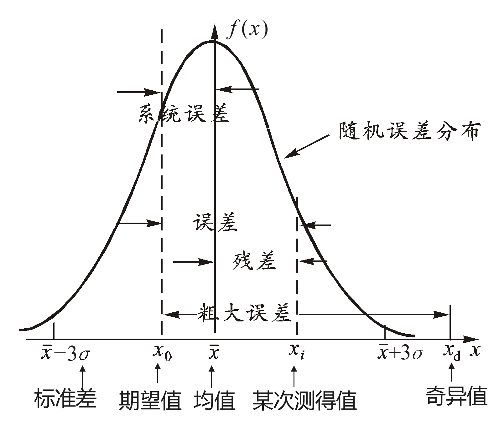

[TOC]

# 一、基本概念

## (一)误差

### 1. 误差的基本概念

>  **测量的定义**: 为确定被测对象的量值而进行的实验，是将被测量与一个作为测量单位的标准进行比较，获得比值的过程。
>
>  $\text{被测量} \quad \text{标准量} \quad E \rightarrow q=\frac{L}{E} \quad \text{理想状态 } q=1 \text{}$

*  **标准量**: 精度最高的标准量称为基准。是约定真值。
*  **$q$ 反映被测量的数字**: 反应被测量的数字包含数值、单位量纲和误差三个部分。

### 2. 误差的定义及表示法

* **误差** = `测得值 - 真值`

  **真值**: 观测一个量时，该量 **本身** 所具有的 **真实** 大小。

  *  **理论真值**: 如三角形内角之和恒为 $180^\circ$。
  *  **约定真值/指定值/最佳估计值/约定值/参考值**: 指对于给定用途具有适当不确定度的、赋予特定量的值。这个术语在计量学中常用。如国际千克基准 $1 \text{kg}$。==约定真值== 也具有一定的不确定度。

> [!NOTE]
> 误差是针对真值而言的，真值一般指约定真值。

* **误差的表示与性质** 误差的分类

  * 从表示形式上：误差可以分为 ``绝对误差``、``相对误差``。

  * 性质特点:

    ​	① 系统误差: 准确性。

    ​	② 随机误差: 精确性。

    ​	③ 粗大误差。

> [!TIP]
> 下面分别讲述六种误差形式：绝对误差、相对误差、引用误差；最大绝对误差、最大相对误差、最大引用误差

**（1）绝对误差**
$$
绝对误差 = 测得值 - 真值\\
 \Delta L = L - L_0
$$

   * $\Delta L$：绝对误差；$L$：测得值；$L_0$：被测量的真值，常用约定真值代替。绝对误差就是一般所说的误差

     ① 绝对误差是一个具有确定的 **大小、符号及单位** 的量。
     
     ② 单位给出了被测量的量纲，其单位与测得值相同。

**（2）修正值**

* **定义**: 为了消除固定的系统误差，用代数法而加到测量结果上的值。
  $$
  \text{真值} \approx \text{测得值} + \text{修正值} \\
  \text{修正值} \approx \text{真值} - \text{测得值} \approx -\text{误差},\\
  测得值 = 真值+误差\\
  测得值 = 真值-修正值、真值 = 测得值+修正值
  $$

   ​	① 与误差大小 **近似相等，但方向相反**。

   ​	② 修正值本身还有误差。

* **Example**: 用某电压表测量电压，示值为 $226\text{V}$ (测得值)，查检定证书，得知该电压表在 $220\text{V}$ (真值) 附近的误差为 $5\text{V}$ (绝对误差)，被测电压的修正值为 $-5\text{V}$ (修正值)，则修正后的测量结果为 $226 + (-5\text{V}) = 221\text{V}$ (测得值 + 修正值)。

**（3）相对误差**

* **定义**: 绝对误差与 **被测量<u>真值</u>** 之比。
  $$
  r = \frac{\Delta L}{L_0} \text{}
  $$

  * $r$: 相对误差；$\Delta L$: 绝对误差；$L_0$: 真值。

    ① 相对误差有大小和符号。

    ② **无量纲**，一般用百分数来表示。

    ③ 用相对误差可以 **比较不同量值、不同单位、不同物理量** 等的精确度。

**（4）引用误差** <-- **相对误差**

* **定义**:
  $$
  r_F = \frac{\Delta x}{x_m}
  $$

  *  $r_F$: 引用误差；$\Delta x$: 仪器某一刻度点的示值误差；$x_m$: 该标称范围上限 (或量程) 。
  *  引用误差是引用了特定值——标称范围上限（或量程）——得到的， 故该误差又称为 `引用相对误差`、`满度误差`。

**（5）最大引用误差**

* **定义**:
  $$
  r_m = \frac{\Delta x_m}{x_m}
  $$

  *  $r_m$: 最大引用误差；$\Delta x_m$: 仪器某标称范围 (或量程) 内的最大绝对误差；$x_m$: 该标称范围 (或量程) 上限。

> [!WARNING]
> 对于某一 ==仪器仪表== 而言，最大引用误差具有 **唯一性**，其与实测值大小无关。用于表示仪器仪表的 **精度等级** $ s=r_m$，简单方便。

**（6）电工仪表、压力表的准确度等级**

当一个仪表的等级 $s$ 选定后，用此表测量某一被测量时：

   * 最大绝对误差为 (公式 1)

$$
\Delta x_m = \pm x_m \times s\% \text{}
$$

   * 最大相对误差为 (公式 2)

$$
r_x = \frac{\Delta x_m}{x} = \pm \frac{x_m}{x} \times s\% \text{}
$$

​	①: 绝对误差的最大值与该仪表的标称范围 (或量程) 上限 $x_m$ 成正比。

​	②: 选定仪表后，被测量的值越接近于标称范围 (或量程) 上限，测量的相对误差越小，测量越准确。对比最大引用误差的公式，知：**在不超量程的情况下，最大引用误差是最大相对误差的最小值**

   `Example.1`
   检定一只 $2.5$ 级、量程为 $100\text{V}$ 的电压表，发现在 $50\text{V}$ 处误差最大，其值为 $2\text{V}$，而其他刻度处的误差均小于 $2\text{V}$，问这只电压表是否合格?

​	解: 由公式 2，该电压表的最大引用误差为
   		 $$ r_m = \displaystyle \frac{\Delta U_m}{U_m} = \frac{2}{100} = 2\% \text{} $$
  	 由于 $2\% < 2.5\%$，所以该电压表合格。

   `Example.2`
   某 $1.0$ 级微安电流表，满度值 (标称范围上限) 为 $100$，求测量值分别为 $100, 80$ 和 $20$ 时的最大绝对误差和最大相对误差。

​	解：根据题意，$s = 1.0, x_{m} = 100, x_1 = 100, x_2 = 80, x_3 = 20 $，有
​		最大绝对误差 $\Delta x_m = \pm s \cdot x_m \% = \pm 1 uA$,
​		最大相对误差分别为：
​			$r_{x_1} = \displaystyle \frac{\Delta x_m}{x_1} = \pm 1\% $
​			$r_{x_2} = \displaystyle \frac{\Delta x_m}{x_2} = \pm 1.25\% $
​			$r_{x_3} = \displaystyle \frac{\Delta x_m}{x_3} = \pm 5\% $

> [!IMPORTANT]
>
> |     含义     |                    表达式                    |
> | :----------: | :------------------------------------------: |
> |   绝对误差   |       $\Delta L = L - L_0$, $\Delta x$       |
> |   相对误差   |   $r = \displaystyle \frac{\Delta L}{L_0}$   |
> |   引用误差   | $r_F = \displaystyle  \frac{\Delta x}{x_m}$  |
> | 最大引用误差 | $r_m= \displaystyle  \frac{\Delta x_m}{x_m}$ |
> | 最大绝对误差 |      $\Delta x_m = \pm s \cdot x_m \% $      |
> | 最大相对误差 |  $r_x = \displaystyle \frac{\Delta x_m}{x}$  |

### 3. 误差的来源

* **误差来源分类**:

  *  **(1) 测量装置误差**: 零部件配合的不稳定性、变形、表面油膜不均匀、摩擦等。仪器机构设计原理上的缺点，零件制造和安装不正确，附件制造偏差。

  *  **(2) 测量环境误差**: 指各种环境因素与要求条件不一致而造成的误差。

  *  **(3) 测量方法误差 (理论误差)**: 指使用的测量方法不完善，或采用近似的计算公式等原因所引起的误差。

  *  **(4) 测量人员误差**: 测量人员的工作责任心、技术熟练程度、生理感官与心理因素、测量习惯等的不同而引起的误差。

  ---

### 4. 误差分类

> [!CAUTION]
> 这一章节有一个常用到的概念 ① “[对同一被测量] [进行无限多次测量] [所得结果的平均值]” 
> 

*  系统误差
*  随机误差
*  粗大误差

**（1）系统误差**

**a.定义**: [在重复性条件下，对同一被测量进行无限多次测量所得结果的平均值](#one) 与被测量的真值之差。

**b.特征**: 在相同条件下，多次测量同一量值时，该误差的绝对值和符号 **保持不变**，或者在条件改变时，按某一 **确定规律变化** 的误差。

**`Example`**:

① 用天平计量物体质量时，砝码的质量偏差。

② 用千分表读数时，表盘安装偏心引起的示值误差。

③ 刻线尺的温度变化引起的示值误差。

**c. 分类**:

    **① 按对误差掌握程度**
      1）**已定系统误差**: 误差绝对值和符号已经明确的系统误差。
      2）**未定系统误差**: 误差绝对值和符号未能确定的系统误差，但通常估计出误差范围。
      
    **② 按误差出现规律**
      1）**不变系统误差 (恒定系统误差)**: 误差绝对值和符号固定不变的系统误差。
      2）**变化系统误差 (可变系统误差)**: 误差绝对值和符号变化的系统误差。按其变化规律，可分为线性系统误差、周期性系统误差和复杂规律系统误差。

**（2）随机误差**

**a.  定义**: 测得值与 [在重复性条件下对同一被测量进行无限多次测量结果的平均值](#one) 之差。又称为 **偶然误差**。

**b.  特征**: 在相同测量条件下，多次测量同一量值时，绝对值和符号以 **不可预定方式变化** 的误差。

**c.  产生原因**: 实验条件的 **偶然性微小变化**，如温度波动、噪声干扰、电磁场微变、电源电压的随机起伏、地面振动等。

**d.  性质**: 随机误差的大小、方向均 **随机不定，不可预见，不可修正**。经过大量的重复测量可以发现，它是 **遵循某种统计规律** 的，可以用概率统计的方法处理。

 随机误差分布图 

**（3）粗大误差**

**a.  定义**: 指 **明显超出统计规律预期值** 的误差。又称为 **疏忽误差**、**过失误差** 或简称 **粗差**。

**b. 产生原因**:
	① **测量方法不当或错误**，测量操作疏忽和失误 (如未按规程操作、读错读数或单位、记录或计算错误等)。
	② **测量条件的突然变化** (如电源电压突然增高或降低、雷电干扰、机械冲击和振动等)。

---

## (二)精度

* **准确度**: 只考虑 **系统误差** 的大小时，准确度称为准确度。

* **精密度**: 只考虑 **随机误差** 的大小时，准确度称为精密度。

* **精确度**: 表示测量结果与被测量真值之间的 **一致程度**。就误差分析而言，精确度是测量结果中 **系统误差和随机误差的综合**。误差大，则精确度低；误差小，则精确度高。

  > [!WARNING]
  > 精确度 (精度) 在数值上一般多用 **相对误差** 来表示，但不用百分数。如某一测量结果的相对误差为 $0.001\%$，则其精度为 $10^{-5}$。

**（1）准确度、精密度和精确度三者之间的关系**

| 情况 | 弹着点分布描述           | 误差特点               | 精度结论                           |
| :--: | :----------------------- | :--------------------- | :--------------------------------- |
| (a)  | 弹着点全部在靶上，但分散 | 系统误差小，随机误差大 | 精密度低，准确度高                 |
| (b)  | 弹着点集中，但偏向一方   | 系统误差大，随机误差小 | 精密度高，准确度低                 |
| (c)  | 弹着点集中靶心，命中率高 | 系统误差与随机误差均小 | 精密度、准确度都高，从而精确度亦高 |

**（2）常用名词术语**

* **a.  重复性**: 指在 **相同条件下在短时间内** 对同一个量进行多次测量所得测量结果之间的一致程度。一般用测量结果的分散性来定量表示。
* **b.  复现性 (再现性)**: 指在 **变化条件下**，对同一个量进行多次测量所得测量结果之间的一致程度。一般用测量结果的分散性来定量表示。
* **c.  稳定性**: 指测量仪器保持其计量特性随时间恒定的能力。可以用计量特性变化某个规定的量所经过的时间；或用计量特性经规定的时间所发生的变化等来定量表示。
* **d.  示值误差**: 指测量仪器的示值与对应输入量的真值之差。实际应用中常采用约定真值。
* **e.  偏移**: 指测量仪器示值的 **系统误差**。通常用适当次数重复测量的示值误差的平均来估计。
* **f.  最大允许误差 (允许误差限)**: 指对于给定的测量仪器，规范、规程等所允许的误差极限值。
* **e.  不确定度**: 与测量结果相关联的、用于合理表征被测量值 **分散性大小** 的参数。它是定量评定测量结果的一个重要质量指标。

---

## (三)有效数字

### （1）有效数字

* **定义**:  含有误差的任何数 ，如果其绝对误差界是最末尾数的半个单位，那么从这个近似数左方起的第一个非零的数字，称为第一位有效数字。从第一位有效数字起到最末一位数字止的所有数字，不管是零或非零的数字，都叫有效数字。

  > [!NOTE]
  > 实际测量的数字除 **最后一位是可疑** 的，其余的数字都是确定的。

​	**`Example`**:

​		① 对于小数，第一个非零有效数字前面的零不是有效数字。如: $0.0023$ 有效数字为最后 $2$ 位。

​		② 数据末尾的一个或数个零应为有效数字。如 $1450$ 有效数字应为 $4$ 位， $0.460$ 有效数字为 $3$ 位。

​		③ 数字末尾的零的含义有时并不清楚，此时往往采用 $10$ 的方次表示。如 $12000 \text{m}$ 表示为 $1.2 \times 10^4$，有效数字为 $2$ 位，若写成 $1.20 \times 10^4$，有效数字为 $3$ 位。

* **测量结果保留原则**:

  ​	① 最末一位数字是 **不可靠** 的，而倒数第二位数字是 **可靠** 的。
  ​	② 在进行重要的测量时，测量结果和测量误差可比上述原则 **再多取一位数字** 作为参考。

### **（2）数字舍入规则：四舍六入五留双**

​		① （<u>6入</u>）若舍去部分的数值，**大于** 保留部分末位的半个单位，则末位数 **加 1**。

​		② （<u>4舍</u>）若舍去部分的数值，**小于** 保留部分末位的半个单位，则末位数 **不变** (此处原文似有误，应为“末位数不变”)。

​		③ （<u>5留双</u>）若舍去部分的数值，**等于** 保留部分末位的半个单位，则末位 **凑成偶数**，即当末位为偶数时则末位不变，当末位是奇数时则末位加 1。

​	**`Example.1`**:

* (1) 将 $3.14159$ 分别取 $3$、$4$ 位有效数字?

  ​	答: 根据规则一、规则二，舍入后的有效数字分别为 $3.14$ 和 $3.142$。

* (2)  $2.55$ (保留二位有效数字) 为 $2.6$

* (3)  $2.64$ (保留二位有效数字) 为 $2.6$

### **（3）数字运算规则**

① （过程）近似数运算时，为保证最后结果有尽可能高的精度，所有残余 **运算** 的数字，在有效数字后 **可多保留一位数字** 作为参考数字(或称为安全数字)。

② （加减）近似数做加减运算，运算数据以 **小数位数最少** 的数据位数 **为准**，其余数据 **可多取一位小数**，但最后结果应与小数位数最少的数据小数位相同。

③ （乘除）近似数做乘除运算，运算数据以 **有效位数最少** 的数据位数 **为准**，其余数据 **可多取一位有效数**，但最后结果应与有效位数最少的数据位数相同。

④ （幂次）在近似数平方或开方运算时，近似数的选取与乘除运算相同。

⑤ （对数）在对数运算时，n 位有效数字的数据应该用 n 位对数表，或用（n+1） 位对数表，以免损失精度。 

⑥ （三角）三角函数运算时，所取函数值的位数应随角度误差的减小而增多， 其对应关系：

| 角度误差   | 10‘  | 1'   | 0.1' | 0.01' |
| ---------- | ---- | ---- | ---- | ----- |
| 函数值位数 | 5    | 6    | 7    | 8     |

> [!TIP]
>
> 1. **精度的确定**
>    加减看小数位数最少的数据，保留到该小数位
>    乘除看有效数字位数最少的数据，保留到该小数位
>    其他规则见上
> 2. **运算过程的精度**
>    可多取一位运算，及运算时的精度为，目标精度/目标精度多一位

   * (1)  $2643.0 + 987.7 + 4.187 + 0.2354$

     ​	$2643.0 + 987.7 + 4.19 + 0.24$ (加减法按照小数点保留，但是计算过程中比基准精确度多取一位)

     ​	$= 3635.13$

     ​	$\approx 3635.1$ (加减法按照小数点保留)

   * (2)  $15.13 \times 4.12 = 62.3356 \approx 62.3$ (乘法按照有效数字保留)

计算要有过程

---
