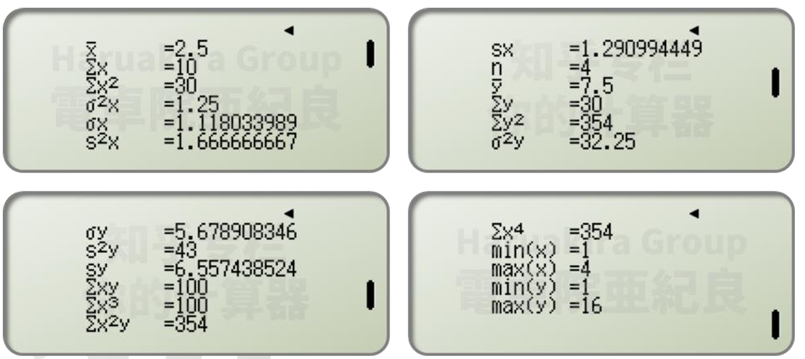
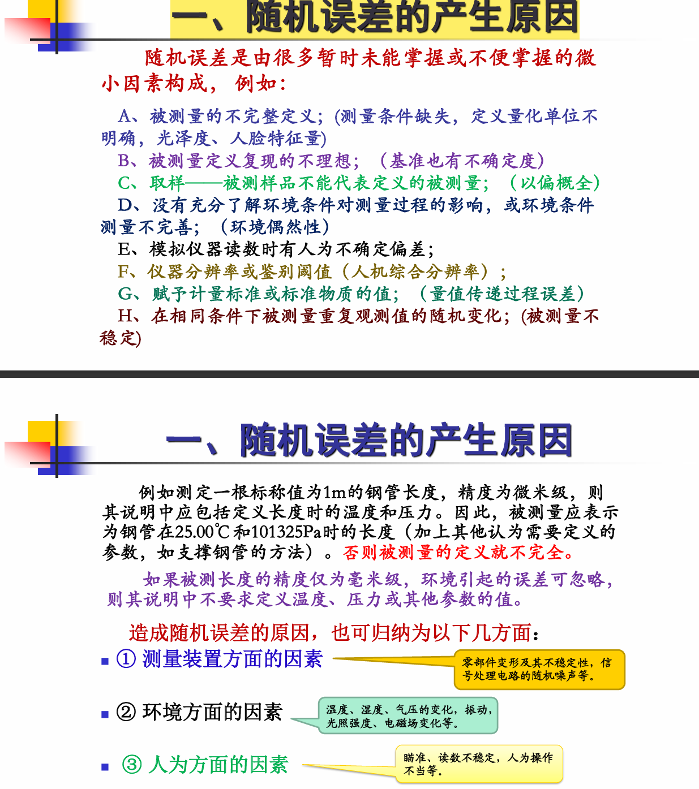
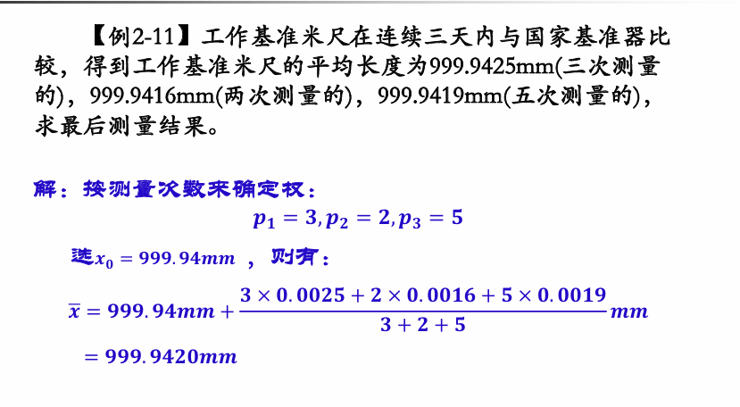
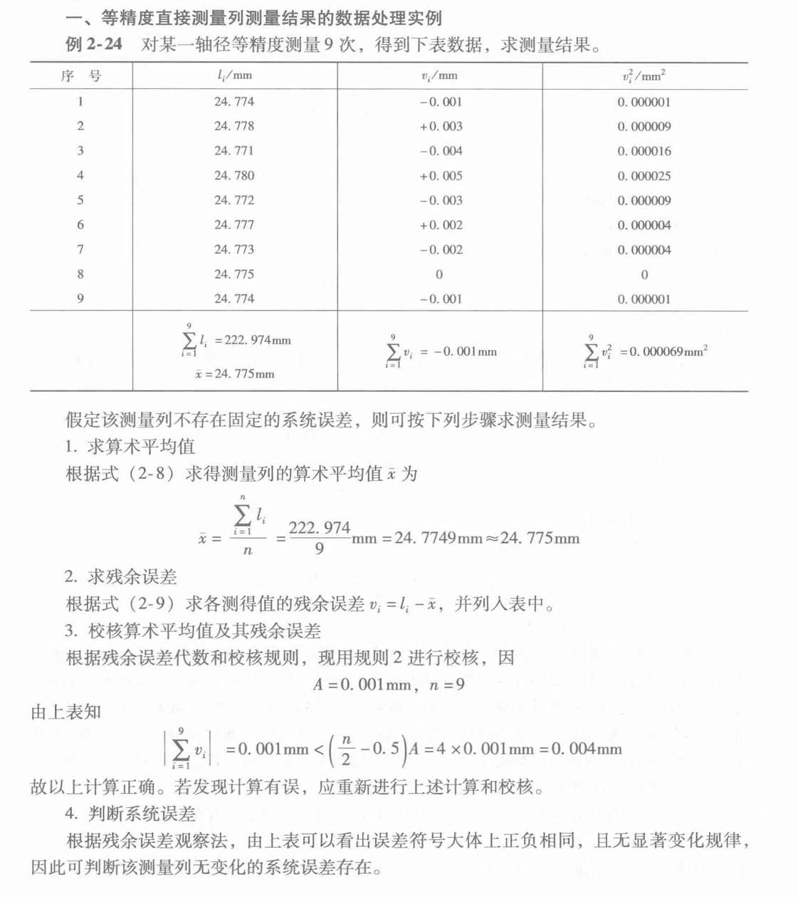
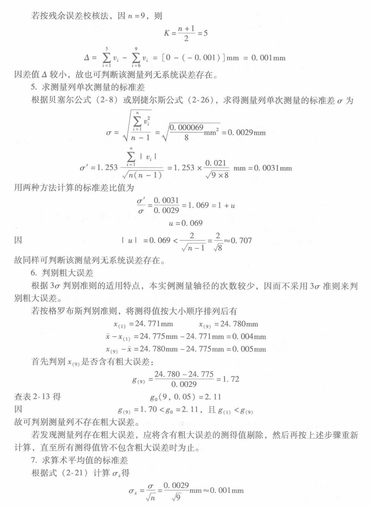
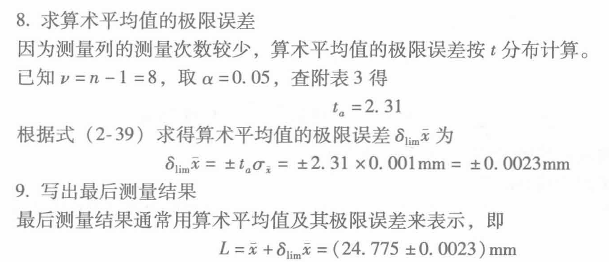

[TOC]

# 二、误差的基本性质与处理

> [!IMPORTANT]
>
> 在卡西欧计算器中，计算结果 $S_x$ 是我们本章所求得的 $\sigma_x$。
>
> - 可以找课件的 p34 页数据进行检验，结果显示卡西欧计算器的 $S_x$ 就是我们要的结果
> - t 检验需要的 $S_x$ 则是 Casio 里的 $\sigma_x$
> - 输入一串数据后，结果如下图所示。看到 $S_x > \sigma_x$。
>
> 

## (一)随机误差

*  随机误差产生的原因
*  正态分布
*  算数平均值
*  测量的标准差
*  测量的极限误差
*  不等精度测量
*  随机误差的其它分布

### 1. 随机误差产生的原因

[问答题]

**随机误差的特征**: 对同一测量值进行多次等精度的重复测量时，得到一系列不同的测量值 (常称为测量列) ，每个测量值都含有误差 ，这些误差的出现 **没有确定的规律** 。但就误差整体而言，却明显具有 **某种统计规律**。

**等精度的重复测量**: 是指测量仪器、测量环境、测量方法过程、测量人员等各种能准确知道的影响量均相同的条件下进行的重复测量 (数学上表现为样本方差相同) 。

**随机误差的构成**:

*  a.  被测量的不完整定义；
*  b.  被测量定义复现的不理想 (基准也有不确定度)；
*  c.  取样 (被测样品不能代表定义的被测量)；
*  d.  没有充分了解环境条件对测量过程的影响，或环境条件测量不完善 (环境偶然性)；
*  e.  模拟仪器读数时有人为不确定偏差；
*  f.  仪器分辨率或鉴别阈值 (人机综合分辨率)；
*  g.  赋予计量标准或标准物质的值 (量值传递过程误差)；
*  h.  在相同条件下被测量重复观测值的随机变化 (被测量不稳定)。

### 2. 正态分布 (多数随机误差符合正态分布)

多数随机误差符合正态分布

*  设被测量值的真值为 $L_0$ ，一系列测得值为 $l_i$，则测量列的随机误差 $\delta_i$ 可表示为:

$$
\delta_i = l_i - L_0 \quad   \text{ }
$$

*  **正态分布概率密度 $f(\delta)$ 与分布函数 $F(\delta)$**:

$$
f(\delta) = \frac{1}{\sigma \sqrt{2\pi}} e^{-\frac{\delta^2}{2\sigma^2}} \quad   \text{}
$$

$$
F(\delta) = \frac{1}{\sigma \sqrt{2\pi}} \int_{-\infty}^{\delta} e^{-\frac{\delta^2}{2\sigma^2}} d\delta \quad   \text{}
$$

<svg xmlns="http://www.w3.org/2000/svg" xmlns:xlink="http://www.w3.org/1999/xlink" width="480" height="223pt" viewBox="0 0 360 223">     <defs>         <symbol overflow="visible" id="a">             <path d="M5.29-2.191H.55v-.82h4.74zm0 0"/>         </symbol>         <symbol overflow="visible" id="b">             <path d="M3.234 0v-1.715H.125v-.805l3.27-4.636h.714v4.636h.97v.805h-.97V0zm0-2.52v-3.226L.992-2.52zm0 0"/>         </symbol>         <symbol overflow="visible" id="c">             <path d="M5.035-.844V0H.305a1.54 1.54 0 01.101-.61c.121-.324.313-.64.578-.953.266-.312.649-.671 1.149-1.085.777-.637 1.304-1.141 1.578-1.516.273-.371.41-.723.41-1.055 0-.347-.125-.644-.375-.883-.246-.238-.574-.359-.973-.359-.421 0-.761.129-1.015.383-.254.254-.383.605-.387 1.055L.47-5.117c.062-.672.293-1.188.699-1.54.402-.355.945-.53 1.625-.53.687 0 1.23.19 1.629.57.402.383.601.855.601 1.418 0 .285-.058.566-.175.844-.118.277-.313.566-.582.875-.274.304-.723.726-1.356 1.257-.527.442-.867.743-1.015.903a2.868 2.868 0 00-.372.476zm0 0"/>         </symbol>         <symbol overflow="visible" id="d">             <path d="M3.727 0h-.88v-5.602c-.21.204-.488.407-.831.606a5.902 5.902 0 01-.926.457v-.852c.492-.23.922-.511 1.289-.84.367-.328.629-.648.781-.957h.567zm0 0"/>         </symbol>         <symbol overflow="visible" id="e">             <path d="M.906 0v-1H1.91v1zm0 0"/>         </symbol>         <symbol overflow="visible" id="f">             <path d="M.414-3.531c0-.844.09-1.528.262-2.043.176-.516.433-.914.777-1.192.344-.28.774-.421 1.297-.421.383 0 .719.078 1.008.23.289.156.531.379.719.672.187.289.335.644.445 1.062.11.418.16.985.16 1.692 0 .84-.086 1.52-.258 2.035-.172.516-.43.914-.773 1.195-.344.281-.778.422-1.301.422-.691 0-1.234-.246-1.625-.742-.473-.594-.71-1.567-.71-2.91zm.906 0c0 1.176.137 1.957.41 2.347.278.387.614.582 1.02.582.402 0 .742-.195 1.016-.586.277-.39.414-1.171.414-2.343 0-1.18-.137-1.961-.414-2.348-.274-.387-.618-.582-1.028-.582-.402 0-.726.172-.965.516-.304.433-.453 1.238-.453 2.414zm0 0"/>         </symbol>         <symbol overflow="visible" id="g">             <path d="M.414-1.875l.922-.078c.07.45.23.785.476 1.012.25.226.551.34.903.34.422 0 .781-.16 1.074-.477.293-.32.438-.742.438-1.27 0-.504-.141-.898-.422-1.187-.282-.29-.649-.434-1.106-.434a1.526 1.526 0 00-1.3.692L.57-3.383l.696-3.68h3.558v.844H1.97l-.387 1.922c.43-.3.879-.45 1.352-.45a2.14 2.14 0 011.582.65c.43.433.644.992.644 1.671 0 .649-.187 1.207-.566 1.68-.457.578-1.086.867-1.88.867-.651 0-1.183-.18-1.593-.547-.41-.363-.648-.847-.707-1.449zm0 0"/>         </symbol>     </defs>     <path d="M7.66 35.668l5.371 8.715 5.367 9.754L23.77 64.78l5.37 11.371 5.372 11.914 5.367 12.274L50.62 125.2l5.371 12.198 5.367 11.786 5.371 11.195 5.372 10.426 5.367 9.492 5.37 8.414 5.372 7.203 5.371 5.883 5.367 4.465 5.371 2.98 5.371 1.453 5.368-.105 5.37-1.656 5.372-3.18 5.37-4.66 5.368-6.063 5.371-7.37 5.371-8.567 5.367-9.625 5.372-10.535 5.37-11.286 5.372-11.851 10.738-24.668 5.371-12.434 5.367-12.234 5.371-11.856 5.371-11.28 5.372-10.536 5.367-9.629 5.37-8.566 5.372-7.371 5.367-6.063 5.371-4.656 5.371-3.184 5.371-1.652 5.368-.105 5.37 1.449 5.372 2.984 5.367 4.465 5.371 5.879 5.371 7.203 5.371 8.418 5.367 9.492 5.372 10.426 5.37 11.191 10.739 23.985 5.371 12.418 5.371 12.441 5.367 12.277 5.371 11.914 5.371 11.368 5.372 10.644 5.367 9.758 5.37 8.715" fill="none" stroke-width="1.6" stroke-linecap="square" stroke="#5e81b5" stroke-miterlimit="3.25"/>     <path d="M7.66 111.129v-4" fill="none" stroke-width=".2" stroke="#666" stroke-miterlimit="3.25"/>     <use xlink:href="#a" x="1.66" y="123.128" fill="#666"/>     <use xlink:href="#b" x="7.66" y="123.128" fill="#666"/>     <path d="M29.14 111.129v-2.402M50.621 111.129v-2.402M72.102 111.129v-2.402M93.578 111.129v-4" fill="none" stroke-width=".2" stroke="#666" stroke-miterlimit="3.25"/>     <use xlink:href="#a" x="87.58" y="123.128" fill="#666"/>     <use xlink:href="#c" x="93.58" y="123.128" fill="#666"/>     <path d="M115.059 111.129v-2.402M136.54 111.129v-2.402M158.02 111.129v-2.402M179.5 111.129v-4M200.98 111.129v-2.402M222.46 111.129v-2.402M243.941 111.129v-2.402M265.422 111.129v-4" fill="none" stroke-width=".2" stroke="#666" stroke-miterlimit="3.25"/>     <use xlink:href="#c" x="262.42" y="123.128" fill="#666"/>     <path d="M286.898 111.129v-2.402M308.379 111.129v-2.402M329.86 111.129v-2.402M351.34 111.129v-4" fill="none" stroke-width=".2" stroke="#666" stroke-miterlimit="3.25"/>     <use xlink:href="#b" x="348.34" y="123.128" fill="#666"/>     <path d="M.5 111.129h358M179.5 220.813h2.398M179.5 210.84h4" fill="none" stroke-width=".2" stroke="#666" stroke-miterlimit="3.25"/>     <use xlink:href="#a" x="156.5" y="213.34" fill="#666"/>     <g fill="#666">         <use xlink:href="#d" x="162.5" y="213.34"/>         <use xlink:href="#e" x="168.062" y="213.34"/>         <use xlink:href="#f" x="170.84" y="213.34"/>     </g>     <path d="M179.5 200.867h2.398M179.5 190.898h2.398M179.5 180.926h2.398M179.5 170.957h2.398M179.5 160.984h4" fill="none" stroke-width=".2" stroke="#666" stroke-miterlimit="3.25"/>     <use xlink:href="#a" x="156.5" y="163.484" fill="#666"/>     <g fill="#666">         <use xlink:href="#f" x="162.5" y="163.484"/>         <use xlink:href="#e" x="168.062" y="163.484"/>         <use xlink:href="#g" x="170.84" y="163.484"/>     </g>     <path d="M179.5 151.012h2.398M179.5 141.043h2.398M179.5 131.07h2.398M179.5 121.098h2.398M179.5 111.129h4M179.5 101.156h2.398M179.5 91.188h2.398M179.5 81.215h2.398M179.5 71.242h2.398M179.5 61.273h4" fill="none" stroke-width=".2" stroke="#666" stroke-miterlimit="3.25"/>     <g fill="#666">         <use xlink:href="#f" x="162.5" y="63.772"/>         <use xlink:href="#e" x="168.062" y="63.772"/>         <use xlink:href="#g" x="170.84" y="63.772"/>     </g>     <path d="M179.5 51.3h2.398M179.5 41.328h2.398M179.5 31.36h2.398M179.5 21.387h2.398M179.5 11.418h4" fill="none" stroke-width=".2" stroke="#666" stroke-miterlimit="3.25"/>     <g fill="#666">         <use xlink:href="#d" x="162.5" y="13.916"/>         <use xlink:href="#e" x="168.062" y="13.916"/>         <use xlink:href="#f" x="170.84" y="13.916"/>     </g>     <path d="M179.5 1.445h2.398M179.5 221.758V.5" fill="none" stroke-width=".2" stroke="#666" stroke-miterlimit="3.25"/> </svg>

*  **数学期望**:

$$
E = \int_{-\infty}^{\infty} \delta f(\delta) d\delta = 0 \quad   \text{}
$$

*  **方差**:

$$
\sigma^2 = \int_{-\infty}^{\infty} \delta^2 f(\delta) d\delta \quad   \text{}
$$

*  **平均误差**:

$$
\theta = \int_{-\infty}^{\infty} |\delta| f(\delta) d\delta \approx \frac{4}{5} \sigma \quad   \text{}
$$

*  **或然误差 ( $\displaystyle \int_{-p}^{+p} f(\delta) d\delta = \frac{1}{2}$) 为**:

$$
\rho = 0.6745 \sigma \approx \frac{2}{3} \sigma \quad   \text{}
$$

> [!NOTE]
>
> 随机误差的四性
>
> ① **误差的对称性**:  $f(+\delta) = f(-\delta)$。
>
> ② **误差的单峰性**: 绝对值小的误差比绝对值大的误差出现的次数多。
>
> ③ **误差的有界性**: 虽然函数 $f(\delta)$ 的存在区间是 $[-\infty, +\infty]$ ，但实际上，随机误差只是出现在一个有限的区间内，即 $[-k\sigma, +k\sigma]$。
>
> ④ **误差的抵偿性**: 随着测量次数的增加，随机误差的算术平均值趋向于零。
>
> $$
> \lim_{n \rightarrow \infty} \frac{\displaystyle \sum_{i = 1}^{n} \delta_i}{n} = 0 \text{}
> $$

### 3. 算数平均值

#### **（1）算数平均值的意义**

*  当测量次数无限增加时，算术平均值必然 **趋近于真值 $L_0$**。

$$
\bar{x} = \frac{l_1 + l_2 + l_3 + \dots + l_n}{n} = \frac{1}{n} \displaystyle \sum_{i = 1}^{n} l_i \quad   \text{}
$$

*  算术平均值是该测量总体期望的一个 **最佳的估计量**，即满足无偏性、有效性、一致性，并满足最小二乘法原理 ；在正态分布条件下满足最大似然原理。

#### **（2）残余误差 (残差)**

*  残差的概念：由于真值未知，可用算术平均值代替真值进行计算，此时的差值称为残余误差，简称残差  :

$$
v_i = l_i - \bar{x} \quad   \text{}
$$

*  **算数平均值的简化算法**: 任选一个接近所有测得值的数 $l_0$ 作为参考值 ，计算 $\Delta l_i = l_i - l_0$，则:

$$
\bar{x} = \frac{\displaystyle \displaystyle \sum_{i = 1}^{n} l_i}{n} = \frac{\displaystyle \sum_{i = 1}^{n} (l_0 + \Delta l_i)}{n} = l_0 + \Delta \bar{x}_0 \quad   \text{}
$$

#### **（3）算术平均值的计算校核**（不要求）

* 当求得的 $\bar{x}$ 为未经凑整的准确数时，则有:
  
$$
\displaystyle \sum_{i = 1}^{n} v_i = 0 \quad   \text{}
$$

* 残余误差代数和为零这一性质，可用来校核算术平均值及其残余误差计算的正确性 (需注意这是未经凑整的情况，实际存在 ==舍入误差==)。即 $\quad \bar{x} = \frac{1}{n} \displaystyle \sum_{i=1}^{n} l_i  + \Delta$。

> [!NOTE]
>
> 校核算术平均值及其残差规则 :
>
> ①
>
> - $\frac{1}{n} \displaystyle \sum_{i=1}^{n} l_i =  n\bar{x} $，求得的 $\bar{x}$ 为非凑整的准确数时，$\displaystyle \sum_{i=1}^{n} v_i = 0$
> - $\frac{1}{n} \displaystyle \sum_{i=1}^{n} l_i >  n\bar{x} $，求得的 $\bar{x}$ 为非凑整的准确数时, $\displaystyle \sum_{i=1}^{n} v_i > 0$，其大小为求 $\bar{x}$ 时的余数
> - $\frac{1}{n} \displaystyle \sum_{i=1}^{n} l_i <  n\bar{x} $，求得的 $\bar{x}$ 为非凑整的准确数时, $\displaystyle \sum_{i=1}^{n} v_i < 0$，其大小为求 $\bar{x}$ 时的亏数
>
> ②
>
>   * 当 $n$ 为偶数时， $|\displaystyle \displaystyle \sum_{i=1}^{n} v_i|  \le \frac{n}{2} A$；
>   * 当 $n$ 为奇数时， $|\displaystyle \displaystyle \sum_{i=1}^{n} v_i|  \le (\frac{n}{2} - 0.5) A$ (此处原文 $n$ 为偶数，与 $n/2-0.5$ 矛盾，疑为 $n$ 为奇数)；
>     * 式中的 $A$ 为实际求得的算术平均值末位数的一个单位。

**Example**: $n=10$ ， $\bar{x} = 1897.64$ ， $\sum v_i = 0.01$ (计算得出)。
    -  解: 因为 $n$ 为偶数 ，所以 $\frac{n}{2} = 5$ ， $A = 0.01$。
        -  $|\displaystyle \sum_{i=1}^{n} v_i|  = 0.01 < \frac{n}{2} A = 0.05$ ，计算结果正确。

### 4. 测量的标准差

#### **（1）基本概念**

##### **A. 均方根误差 (标准偏差，简称标准差) $\sigma$**:

    *  ① $\sigma$ 的大小只说明，在一定条件下等精度测量列随机误差的概率分布情况。
    *  ② 认为这一系列测量列中所有测得值都属于同样一个标准差的概率分布。
    *  ③ 在不同条件下，对同一被测量进行两个系列的等精度测量，其标准差也不相同。

##### **B. 或然误差 $\rho$** :

    *  将整个测量列的 $n$ 个随机误差分为个数相等的两半 。一半随机误差的数值落在 $[-\rho, +\rho]$ 范围内 ，另一半落在 $[-\rho, +\rho]$ 范围以外。
    *  意义: 等精度测量列的测量值随机误差落在区间 $[-\rho, +\rho]$ 之内的概率为 $50\%$。

$$
  \rho = 0.6745 \sigma \approx \frac{2}{3} \sigma \text{}
$$

##### **C. 算术平均误差 $\theta$** :

    *  定义是: 该测量列全部随机误差 **绝对值** 的算术平均值。($\frac{1}{0.7979} = 1.253 $)

$$
\theta = \frac{1}{n} \sum_{i = 1}^{n}\delta_i =\sigma \sqrt{\frac{\pi}{2}} = 0.7979\sigma = \frac{4}{5} \sigma, \quad n \rightarrow \infty
$$

#### **（2）==等精度测量列单次测量== 标准差的计算**

| 方法| 公式| 适用性与优缺点  |
| :----------------- | :----------------------------------------------------------- | :----------------------------------------------------------- |
| **A. Bessel 公式** | $\sigma = \pm \sqrt{\displaystyle  \frac{\displaystyle \sum_{i=1}^{n} v_i^2}{n-1}} = \sqrt{\displaystyle  \frac{\displaystyle \sum_{i=1}^{n} \delta_i^2}{n}}$ | （`误差` 变 `残差` 计算）计算精度较高，但计算麻烦，速度慢。 |
| **B. 别捷尔斯(Peters)法** (不要求) |$\sigma = 1.253 \cdot \frac{\displaystyle  \sum_{i=1}^{n} \vert v_i \vert }{\displaystyle \sqrt{n(n-1)}}$ | 计算速度较快，但计算精度较低 (约为 贝塞尔 公式的 $1.07$ 倍)。 |
| **C. 极差法** | $\sigma = \displaystyle \frac{\displaystyle \omega_n}{\displaystyle d_n}$, $\displaystyle \omega_n = \displaystyle x_{\max} - \displaystyle x_{\min}$ | 非常迅速方便，可作校对公式 。当 $n < 10$ 时，计算精度高于 Bessel 公式。 |
| **D. 最大误差法** | $\sigma = \displaystyle \frac{1}{\displaystyle K_n'} \displaystyle \vert v_i\vert _{\max} = \frac{1}{\displaystyle K_n} \displaystyle \vert \sigma_i\vert _{\max}$ | 更为简捷，容易掌握 。当 $n < 10$ 时，计算精度大多高于 Bessel 公式 。尤其是对于破坏性实验 ($n=1$) 只能应用最大误差法。 |

**Example**: 激光管波长检定 $\lambda_1 = 0.63299130 \mu\text{m}$ ，后测得更精确值 $\lambda_2 = 0.63299144 \mu\text{m}$。求原检定波长的标准差。

*  解: 认为 $\lambda_2$ 为约定真值。
*  随机误差: $\delta = \lambda_1 - \lambda_2 = -14 \times 10^{-8} \mu\text{m}$。
*  查表得 $\frac{1}{K_1} = 1.25$。
*  标准差: $\sigma = \frac{|\delta|}{K_1} = 1.25 \times 14 \times 10^{-8} \mu\text{m} = 1.75 \times 10^{-7} \mu\text{m}$。

#### **（3）==多次测量的算术平均值的== 标准差**

* 测量列算术平均值的标准差 $\sigma_{\bar{x}}$:
  
$$
  \sigma_{\bar{x}} = \sqrt{\frac{\sigma^2}{n}} = \frac{\sigma}{\sqrt{n}} \text{}
$$

    *  当 $n$ 愈大，算术平均值越接近被测量的真值，测量精度也愈高。
* **评定算术平均值的精度标准 (或然误差 $R$ 或平均误差 $T$)**:
  
$$
  R = 0.6745 \sigma_{\bar{x}} \approx \frac{2}{3} \sigma_{\bar{x}} = \frac{2}{3} \frac{\sigma}{\sqrt{n}} = \frac{\rho}{\sqrt{n}} \text{}
$$

$$
  T = 0.7979 \sigma_{\bar{x}} \approx \frac{4}{5} \sigma_{\bar{x}} = \frac{4}{5} \frac{\sigma}{\sqrt{n}} = \frac{\theta}{\sqrt{n}} \text{} 
$$

* **若用残余误差表示**:
$$
R = \frac{2}{3} \sqrt{\frac{\displaystyle \sum_{i = 1}^{n} v_i^2}{n(n-1)}} \text{}
$$

$$
T = \frac{4}{5} \sqrt{\frac{\displaystyle \sum_{i = 1}^{n} v_i^2}{n(n-1)}} \text{}
$$

>  [!TIP]
>
> 测量数据的算术平均值和测量数据的标准差：Bssel
>
> 求算术平均值及算术平均值的标准差: $\sqrt{n}$

### 5. 测量的极限误差

#### **（1）单次测量的极限误差**

* 研究误差落在区间 $(-\delta, +\delta)$ 之间的概率 $P$:
  
$$
  P = \int_{-\delta}^{+\delta} f(\delta) d\delta = \frac{1}{\sigma \sqrt{2\pi}} \int_{-\delta}^{+\delta} e^{-\frac{\delta^2}{2\sigma^2}} d\delta \text{} 
$$

* **变量置换 $t = \delta / \sigma$**:
  
$$
  P = \frac{1}{\sqrt{2\pi}} \int_{-t}^{+t} e^{-\frac{t^2}{2}} dt = \frac{2}{\sqrt{2\pi}} \int_{0}^{+t} e^{-\frac{t^2}{2}} dt = 2 \Phi(t) \text{}  
$$

$$
  \Phi(t) = \frac{1}{\sqrt{2\pi}} \int_{0}^{+t} e^{-\frac{t^2}{2}} dt \text{} 
$$

* 通常把绝对值大于 $3\sigma$ 的误差称为单次测量的 **极限误差**，即:
  
$$
  \delta_{\lim x} = \pm 3 \sigma \text{} 
$$

    *  当 $t=3$ 时，对应的概率 $P = 99.73\%$。

#### **（2）算术平均值的极限误差**

*  算术平均值误差: $\delta_{\bar{x}} = \bar{x} - L_0$。(算术平均值 - 真值)
*  正态分布时，算术平均值的极限表达式为:

$$
\delta_{\lim \bar{x}} = \pm t \sigma_{\bar{x}} \text{}
$$

式中的 $t$ 为 **置信系数** ， $\sigma_{\bar{x}}$ 为算术平均值的标准差。通常取 $t=3$，则:
$$
\delta_{\lim \bar{x}} = \pm 3 \sigma_{\bar{x}} \text{}
$$

*  当测量次数较少时，应按 **“学生氏”分布 ($t$ 分布)** 来计算极限误差:

$$
\delta_{\lim \bar{x}} = \pm t_{\alpha} \sigma_{\bar{x}} \text{}
$$

$t_{\alpha}$: 置信系数，由给定的 **置信概率 $P=1-\alpha$** 和 **自由度 $v=n-1$** 来确定 。$\alpha$: 超出极限误差的概率 (显著度或显著水平)。

`Example`: 对某量进行 $6$ 次测量 802.40，802.50，802.38，802.48，802.42，802.46，求算术平均值及其极限误差。

*  算术平均值: $\bar{x} = 802.44$。
*  单次测量标准差: $\sigma = 0.047$。
*  算术平均值的标准差: $\sigma_{\bar{x}} = 0.019$。
*  **按 $t$ 分布计算** ($v=5, \alpha=0.01$ 时 $t_{\alpha}=4.03$):

$$
\delta_{\lim \bar{x}} = \pm t \sigma_{\bar{x}} = \pm 4.03 \times 0.019 = \pm 0.076 \text{}
$$

*  **按正态分布计算** ($\alpha=0.01, P=0.99$ 时 $t=2.60$):

$$
\delta_{\lim \bar{x}} = \pm t \sigma_{\bar{x}} = \pm 2.60 \times 0.019 = \pm 0.049 \text{}
$$

> [!NOTE]
> 
> 当测量次数较少时，按两种分布计算的结果有明显差别，应使用 $t$ 分布。

### 6. 不等精度测量

**（1）权的概念**

*  **等精度测量**: 各个测量值认为同样可靠，取算术平均值作为结果。
*  **不等精度测量**: 各个测量结果的可靠程度不一样 。可靠程度大的测量结果在最后测量结果中占比重大些。
*  **权 $p$**: 表示各测量结果的可靠程度的数值 。可以理解为对该测量结果所给予的信赖程度。

**（2）权的确定方法**

*  **按测量次数确定**: 测量条件和测量者水平相同，重复测量次数愈多，可靠程度也愈大，可由测量的次数确定权的大小，即 $p_i = n_i$。

$$
p_1 : p_2 : \dots : p_m = \frac{1}{\sigma_{\bar{x}1}^2} : \frac{1}{\sigma_{\bar{x}2}^2} : \dots : \frac{1}{\sigma_{\bar{x}m}^2} \text{}
$$

*  **结论**: 每组测量结果的 **权与其相应的标准偏差平方 $\sigma_{\bar{x}i}^2$ 成反比**。

**（3）加权算术平均值**

*  对同一被测量进行 $m$ 组不等精度测量，得到 $m$ 个测量结果 $\bar{x}_1, \bar{x}_2, \dots, \bar{x}_m$。
*  全部测量的算术平均值 (加权算术平均值) 应为:

$$
\bar{x} = \frac{n_1 \bar{x}_1 + n_2 \bar{x}_2 + \dots + n_m \bar{x}_m}{n_1 + n_2 + \dots + n_m} = \frac{p_1 \bar{x}_1 + p_2 \bar{x}_2 + \dots + p_m \bar{x}_m}{p_1 + p_2 + \dots + p_m} \text{}
$$

$$
\text{或简写为: } \bar{x} = \frac{\sum_{i = 1}^{m} p_i \bar{x}_i}{\sum_{i = 1}^{m} p_i} \text{}
$$

*  **简化计算**:

$$
\bar{x} = x_0 + \frac{\sum_{i = 1}^{m} p_i (\bar{x}_i - x_0)}{\sum_{i = 1}^{m} p_i} \text{}
$$

*  $x_0$ 为接近 $\bar{x}_i$ 的任选参考值。

**（4）单位权的概念**

*  权数为 $1$ 的方差 $\sigma^2$ 称为 **具有单位权的测得值方差** ，其对应的标准差称为 **具有单位权的测得值标准差**。

**（5）加权算术平均值的标准差**

*  若已知各组测量的次数 $n_i$ (即 $p_i=n_i$) ，且已知单位权测得值的标准差 $\sigma$，则全部测得值的算术平均值的标准差为:

$$
\sigma_{\bar{x}} = \frac{\sigma}{\sqrt{\sum_{i = 1}^{m} n_i}} = \frac{\sigma}{\sqrt{\sum_{i = 1}^{m} p_i}} \text{}
$$

*  若各组测量结果的标准差末知，需用各测量结果的残余误差来计算:

$$
\sigma_{\bar{x}} = \sqrt{\frac{\sum_{i = 1}^{m} p_i v_{\bar{x}i}^2}{(m-1) \sum_{i = 1}^{m} p_i}} \text{}
$$

*  **Example**: 求例 $2-11$ 的加权算术平均值的标准差。

* 已知 $\bar{x} = 999.9420 \text{mm}$ ，残余误差 $v_{\bar{x}1} = 0.5 \mu\text{m}, v_{\bar{x}2} = -0.4 \mu\text{m}, v_{\bar{x}3} = -0.1 \mu\text{m}$。

* $m=3, p_1=3, p_2=2, p_3=5$。

  

$$
\sigma_{\bar{x}} = \sqrt{\frac{3 \times 0.5^2 + 2 \times (-0.4)^2 + 5 \times (-0.1)^2}{  \times (3+2+5)}} \mu\text{m} = 0.24 \mu\text{m} \approx 0.0002 \text{mm} \text{}
$$

### 7. 随机误差的其他分布

**（1）均匀分布 (矩形分布或等概率分布)**

*  **特点**: 误差有一确定的范围 $[-a, +a]$ ，在此范围内，误差出现的概率各处相等。
*  **概率密度 $f(\delta)$**:

$$
f(\delta) = \begin{cases} \frac{1}{2a}, & |\delta| \le a \\ 0, & |\delta| > a \end{cases}
$$

*  **标准差**:

$$
\sigma = \frac{a}{\sqrt{3}} \text{}
$$

*  **图示**:

**（2）反正弦分布**

*  **特点**: 随机误差与某一角度成正弦关系。
*  **概率密度 $f(\delta)$**:

$$
f(\delta) = \begin{cases} \frac{1}{\pi} \frac{1}{\sqrt{a^2 - \delta^2}}, & |\delta| \le a \\ 0, & |\delta| >  a \end{cases} \text{}
$$

*  **标准差**:

$$
\sigma = \frac{a}{\sqrt{2}} \text{}
$$

*  **图示**:

**（3）三角形分布 (辛普逊 Simpson 分布)**

*  **特点**: 两个误差限相同且服从均匀分布的随机误差求和时的分布规律。
*  **概率密度 $f(\delta)$**:

$$
f(\delta) = \begin{cases} \frac{a + \delta}{a^2}, & -a \le \delta \le 0 \\ \frac{a - \delta}{a^2}, & 0 \le \delta \le a \\ 0, & |\delta| >  a \end{cases} \text{}
$$

*  **标准差**:

$$
\sigma = \frac{a}{\sqrt{6}} \text{}
$$

*  **图示**:

**（4）$\chi^2$ 分布 (卡埃平方分布，卡方分布)**

*  **定义**: $\chi^2 = \xi_1^2 + \xi_2^2 + \dots + \xi_{\nu}^2$ ，其中 $\xi_i$ 为 $\nu$ 个独立且服从标准化正态分布的随机变量 。 $\chi^2$ 称为自由度为 $\nu$ 的卡埃平方变量。
*  **数学期望**: $E = \nu$。
*  **方差**: $\sigma^2 = 2\nu$ ，标准差: $\sigma = \sqrt{2\nu}$。
*  **图示**:

**（5）$t$ 分布 (学生氏分布)**

*  **定义**: $t = \frac{\eta}{\sqrt{\xi / \nu}}$ ，其中 $\eta$ 具有标准化正态分布函数 ，$\xi$ 具有自由度为 $\nu$ 的 $\chi^2$ 分布函数 。 $t$ 称为自由度为 $\nu$ 的学生氏变量。
*  **数学期望**: $E = 0$。
*  **方差**: $\sigma^2 = \frac{\nu}{\nu - 2}$ ，标准差: $\sigma = \sqrt{\frac{\nu}{\nu - 2}}$。
*  **图示**:

**（6）$F$ 分布**

*  **定义**: $F = \frac{\xi_1 / \nu_1}{\xi_2 / \nu_2} = \frac{\xi_1 \nu_2}{\xi_2 \nu_1}$ ，其中 $\xi_1$ 具有自由度 $\nu_1$ 的 $\chi^2$ 分布函数 ，$\xi_2$ 具有自由度 $\nu_2$ 的 $\chi^2$ 分布函数 。 $F$ 称为自由度为 $\nu_1, \nu_2$ 的 $F$ 变量。
*  **数学期望**: $E = \frac{\nu_2}{\nu_2 - 2}$。

---

## (二)系统误差

### 1. 系统误差产生的原因

*  **测量装置方面** 的因素 (计量校准后发现的偏差、仪器设计原理缺陷、仪器制造和安装的不正确等)。
*  **环境方面** 的因素 (测量时的实际温度对标准温度的偏差、温度、湿度按一定规律变化的误差等)。
*  **测量方法** 的因素 (采用近似的测量方法或计算公式引起的误差等)。
*  **测量人员** 的因素 (测量人员固有的测量习性引起的误差等)。

### 2. 系统误差的特征

*  在同一条件下，多次测量同一测量值时，误差的绝对值和符号 **保持不变** ，或者在条件改变时，误差 **按一定的规律变化**。
*  系统误差 **不具有抵偿性**。

**（1）系统误差的分类 (按变化特性)**

*  **恒定系统误差**: 在整个测量过程中，误差的大小和符号始终是 **不变** 的。
*  **Example**: 千分尺或测长仪读数装置的调零误差 ，量块或其它标准件尺寸的偏差等。
*  **可变系统误差 (变化系统误差)**: 在整个测量过程中，误差的大小和方向随测试的某一个或某几个因素按 **确定的函数规律而变化**。
* **A.  线性变化的系统误差**: 随某因素而线性递增或递减。
    *  **Example**: 刻线尺的刻线误差 ，用电位差计测电动势，工作蓄电池随时间放电。
* **B.  周期变化的系统误差**: 随某因素作周期变化。
    *  **Example**: 仪表指针的回转中心与刻度盘中心有偏离 $e$。
* **C.  复杂规律变化的系统误差**: 随某因素变化，误差按确定的更为复杂的规律变化。
    *  **Example**: 微安表的指针偏转角与偏转力距间不严格保持线性关系，但表盘仍采用均匀刻度所产生的误差。

**（2）系统误差对测量结果的影响**

* **A. 定值系统误差 $\epsilon_0$ 的影响**:
  
$$
\bar{x} = \frac{1}{n} \displaystyle \sum_{i = 1}^{n} x_i \approx x_0 + \epsilon_0 \text{}
$$

$$
v_i = x_i - \bar{x} \approx \delta_i \text{}
$$

    *  **NOTE**: 定值系统误差 $\epsilon_0$ **不影响残差计算**，因此也 **不影响标准误差的计算** 。它只引起随机误差分布密度曲线的 **位置变化 (平移值)**。
* **B. 变化系统误差 $\epsilon_i$ 的影响**:
  
$$
\bar{x} = \frac{1}{n} \displaystyle \sum_{i = 1}^{n} x_i \approx x_0 + \bar{\epsilon} \text{}
$$

$$
v_i = x_i - \bar{x} \approx \delta_i + (\epsilon_i - \bar{\epsilon}) \text{}
$$

    *  **NOTE**: 变化系统误差 $\epsilon_i$ **直接影响残差 $v_i$ 的数值**，因此也必然要影响标准误差的计算 。它不仅使随机误差的分布密度曲线的形状和分布范围发生变化，也使曲线的位置产生平移。

### 3. 系统误差的发现

**发现系统误差的方法**:

*  **组内方法**: 实验对比法 ，残余误差观察法 ，残余误差校核法 ，不同公式计算标准差法。
*  **组间方法**: $T$ 检验法 ， $F$ 检验法 ，计算数据比较法 ，正态检验法 ，秩和检验法。

#### **（1）测量列组内的系统误差发现方法**

* **A.  实验对比法**: 适用于发现 **不变的系统误差**。
* **B.  残差误差观察法**: 适于发现 **有规律变换的系统误差**。
* **C. 残余误差校核法**:
    * ① 用于发现 **线性系统误差** (**马列科夫准则**):

$$
\Delta \approx \sum_{i = 1}^{K} (\Delta l_i - \Delta \bar{x}) - \sum_{j = K+1}^{n} (\Delta l_i - \Delta \bar{x})
$$

 (原文公式有误，根据描述推断)。
 *  若 $\Delta$ 显著不为 $0$，则有理由认为存在线性系统误差。
    * ② 用于发现 **周期性系统误差** (**阿卑-赫梅特 $Abbe-Helmert$ 准则**):

$$
u = |\sum_{i = 1}^{n-1} v_i v_{i+1}| = |v_1 v_2 + v_2 v_3 + \dots + v_{n-1} v_n|  \text{}
$$

 *  若 $u > \sqrt{n-1} \sigma$ ，则认为含有周期性系统误差。
* **D. 不同公式计算标准差比较法**:
    *  按贝塞尔公式: $\sigma_1 = \sqrt{\frac{\sum v_i^2}{n-1}}$。
    *  按别捷尔斯公式: $\sigma_2 = 1.253 \frac{\sum |v_i|}{\sqrt{n(n-1)}}$。
    *  令 $\frac{\sigma_1}{\sigma_2} = 1 + u$。
    *  若 $|u|  \ge \frac{2}{\sqrt{n-1}}$ ，则怀疑存在系统误差。

#### **（2）测量列组间的系统误差发现方法**

* **A. 计算数据比较法**:
    * 任意两组结果 $\bar{x}_i$ 与 $\bar{x}_j$ 间 **不存在系统误差** 的标志是:
  
$$
|\bar{x}_i - \bar{x}_j|  < 2 \sqrt{\sigma_i^2 + \sigma_j^2} \text{}
$$

 *  $\sigma_i, \sigma_j$ 为两组的标准差。
* **B.  秩和检验法**: 根据两组分布是否相同来判断是否存在系统误差。
    *  **步骤**: 将两组数据混合后按大小顺序重新排列 ，数出测量次数较少的那一组的测得值在混合后的次序 (秩) ，再将该组所有测得值的次序相加，即得 **秩和 $T$**。
    *  **结果**:
    *  **$n_1, n_2 \le 10$**: 若 $T_- < T < T_+$ (查表得 $T_-, T_+$)  ，则 **无根据怀疑** 两组间存在系统误差。
    *  **$n_1, n_2 > 10$**: 秩和 $T$ 近似服从正态分布 $N(a, \sigma)$。
  
$$
\begin{aligned}
t &= \frac{T - a}{\sigma}\\
a = \frac{(n_1+n_2+1)n_1 }{2}, &\quad \sigma =\displaystyle \sqrt{ \frac{n_1n_2(n_1+n_2+1)}{12} }
\end{aligned}
$$

    * 若 $|t|  \le t_{\alpha}$ (查正态分布表得 $t_{\alpha}$)  ，则 **无根据怀疑** 两组间存在系统误差。
* **C. $t$ 检验法**:
    *  **条件**: 当两组测量数据服从正态分布，或偏离正态不大但样本数不是太少 (最好不少于 $20$) 时，可用 $t$ 检验法。
    *  **变量 $t$**:
  
$$
t = (\bar{x} - \bar{y}) \sqrt{\frac{n_1 n_2 (n_1 + n_2 - 2)}{(n_1 + n_2) (n_1 S_x^2 + n_2 S_y^2)}} \text{}
$$

    *  $t$ 服从自由度 $v = n_1 + n_2 - 2$ 的 $t$ 分布。
    *  $S_x^2 =\displaystyle  \frac{1}{n_1} \sum (x_i - \bar{x})^2 = \displaystyle  \frac{1}{n_1} \sum x_i^2 - \bar{x}^2$
      $S_y^2 = \frac{1}{n_2} \sum (y_i - \bar{y})^2$
    *  **判断**: 取显著性水平 $\alpha$ ，查 $t$ 分布表得 $t_{\alpha}$。若 $|t|  < t_{\alpha}$ ，则 **无根据怀疑** 两组间有系统误差。

### 4. 系统误差的减小和消除（不做要求）

*  **代替法**: 用标准量代替被测量进行测量 ，求出被测量或被测量和标准量的差值。
*  **抵消法**: 进行两次测量，使两次读数时出现的系统误差 **大小相等，符号相反** ，取两次测得值的平均值即可消除。
*  **交换法**: 根据误差产生原因，将某些条件交换，以消除系统误差。
*  **对称法**: 将测量对称安排 ，取各对称点两次读数的算术平均值作为测得值 ，可消除 **线性系统误差**。
*  **半周期法**: 对 **周期性误差**，相隔半个周期进行两次测量，取两次读数平均值 ，即可有效地消除。

---

## (三)粗大误差

### 1. 粗大误差产生的原因

*  **测量人员的主观原因**: 工作责任感不强、过于疲劳、缺乏经验操作不当 ，造成错误的读数或记录。
*  **客观外界条件的原因**: 测量条件意外地改变 (如机械冲击、外界振动、电磁干扰等)。

### 2. 防止与消除粗大误差的方法

*  **避免粗大误差**: 加强测量人员的工作责任心 ，保证测量条件的稳定。
*  **消除粗大误差**: 采用数据校核的方法 ，两种以上不同的测量方法。

### 3. 判别粗大误差的准则

#### **（1）$3\sigma$ 准则** ✔

*  **判别**: 对某个可疑数据计算残差 $v_d$，若其残差满足:

$$
|v_d| = |x_d - \bar{x}| >  3\sigma \text{}
$$

 则可认为该数据含有粗大误差，应予以剔除。
*  **NOTE**: 剔除完粗大误差后 **需要再计算一次标准差** 来检测剩余的数据中是否还有粗大误差。

*  **Example**: 对某量进行 $15$ 次等精度测量。
*  计算得 $\bar{x} = 20.404$ ， $\sigma = 0.033$。
*  $3\sigma = 0.099$。
*  第八测得值的残余误差 $|v_d|  = 0.104 > 0.099$ ，故剔除。
*  用剩下的 $14$ 个测得值重新计算，得 $\bar{x}' = 20.411$ ， $\sigma' = 0.016$。
*  剩下的 $14$ 个测得值的残余误差均满足 $|v_i'|  < 3\sigma'$ ，故认为不再含有粗大误差。

#### **（2）罗曼诺夫斯基准则 ($t$ 检验准则)**

*  **步骤**: 剔除一个可疑的测得值 $x_j$ ，计算剩余数据的平均值 $\bar{x}'$  和标准差 $\sigma'$。
*  **判别**: 根据测量次数 $n$ 和显著度 $\alpha$，查表得检验系数 $K(n, \alpha)$。
* 若 $|x_j - \bar{x}'| >  K_{\alpha}$ ，则认为 $x_j$ 含有粗大误差，剔除是正确的。

#### **（3）格拉布斯准则**

*  **步骤**: 计算所有 $n$ 个测得值的平均值 $\bar{x}$ 和标准差 $\sigma$  。将 $x_i$ 按大小顺序排列 $x_{(1)} \le x_{(2)} \le \dots \le x_{(n)}$。
*  **统计量**: 检验低端异常 $x_{(1)}$ 的统计量为 $g_{(1)} = \frac{\bar{x} - x_{(1)}}{\sigma}$ 。检验高端异常 $x_{(n)}$ 的统计量为 $g_{(n)} = \frac{x_{(n)} - \bar{x}}{\sigma}$。
*  **判别**: 选定显著度 $\alpha$ ，查表得临界值 $g_0(n, \alpha)$。
*  若 $g_{(i)} \ge g_0(n, \alpha)$ ，即判别该测得值含有粗大误差，应予剔除。

#### **（4）狄克松准则** ✔

*  **步骤**: 将样本 $x_i$ 按大小顺序排列 $x_{(1)} \le x_{(2)} \le \dots \le x_{(n)}$。
*  **构造检验统计量** $r_{ij}$ 和 $r_{ij}'$: (分为 $n \le 7, n: 8 \sim 10, n: 11 \sim 13, n \ge 14$ 几种情形，公式复杂) 。
*  **判别**: 选定显著性水平 $\alpha$ ，查表得临界值 $r_0(n, \alpha)$。
*  当测量的统计值 $r_{ij}$ 或 $r_{ij}'$ **大于临界值** 时，则认为 $x_{(n)}$ 或 $x_{(1)}$ 含有粗大误差。

---

## 测量结果处理实例

**等精度测量结果实例-2-24**

