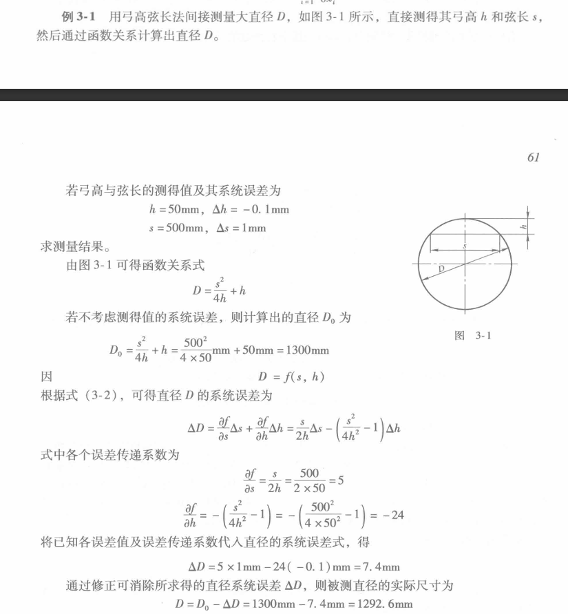
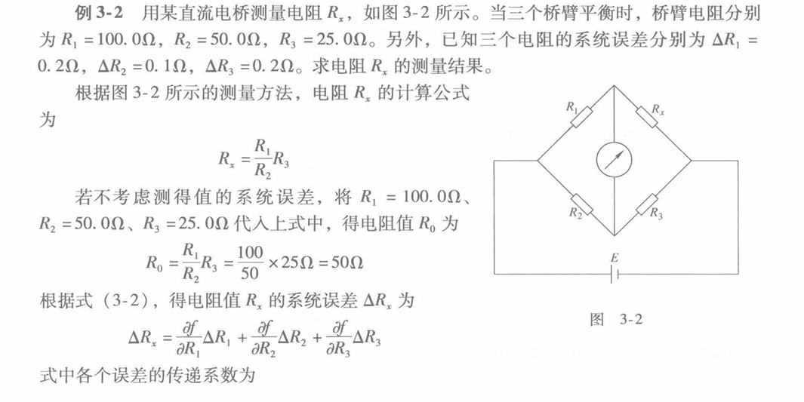
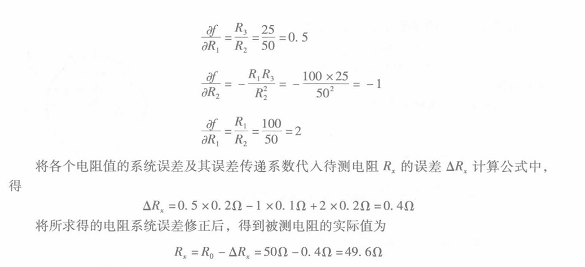
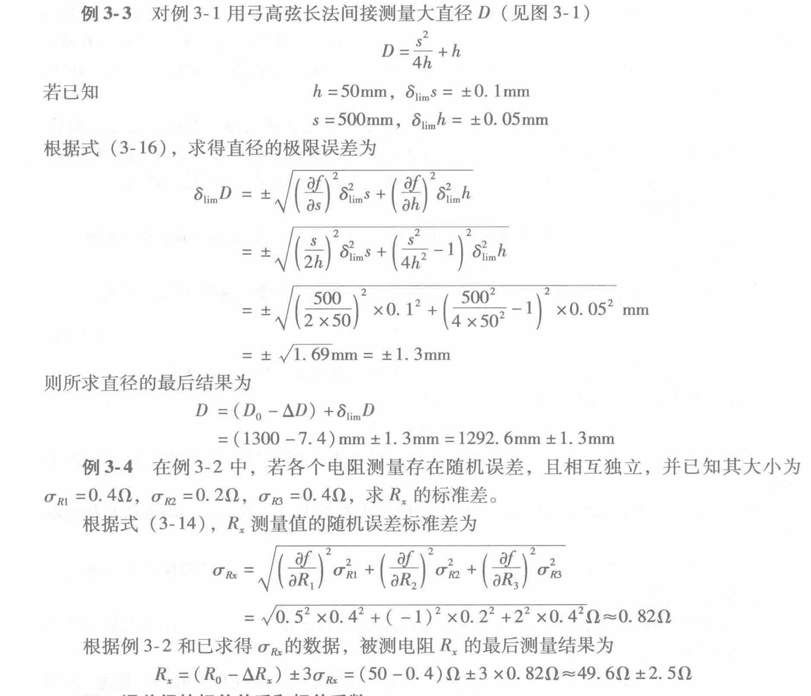

Obsidian、edge标签页、Typora

# 第一章 绪论

误差的定义、分类、来源

精度: 精密度、准确度

四舍六入五留双-数据运算规则，位数保留，保留计算过程

---

# 第二章 误差的基本性质和处理

## 随机误差
* **产生原因**：问答题
* **四性**：
* **算术平均值：计算**
    * 测量标准差 $\sigma$，非常重要，贝塞尔公式
    * 测量列算术平均值的误差：看题表述（测量平均值及其标准差）
    * 标准差其他计算方法：极差法、最大误差法
* **极限误差**：$3\sigma$ 准则、查 $t$ 分布表，计算极限误差、算术平均值的极限误差
* **不等精度**
    * 权的确定方法
    * 加权算术平均值

## 系统误差
* **产生原因**
* **发现方法**
    * **例题**：2-19（p119）、2-18（p116）

## 粗大误差
* **$3\sigma$ 准则判定**
* **狄克松准则**，**例题 2-23**(p146)，表 2-14（已知量）
* **例题 2-24** (p149)十分综合的一道题

---

# 第三章 误差合成与分配

一定会有一道题目-函数随机误差、随即系统误差的合成

* **误差合成**
    * 作业、例题，最简单函数求导掌握
    * 例题 3-3, 3-4
    * 绝大多数不考察相关系数，有的话也简单，为 $\rho = \pm 1, 0$
* **随机误差和系统误差的合成和分配**：共一道大题
* **例题 3-8**  (p62)

---

# 第四章 不确定度（大题）

* **测量不确定度的实例**
    * 步骤考察（参考体积例题-p37）
    * 题干中会提供已知量：相对标准差、示值

---

# 第五章 最小二乘法（大题）

* 考察方法：线性方程组，最小二乘法去做。
* **矩阵法（一定掌握）**
    * 矩阵求逆：最多三阶
    * 不等精度测量，权矩阵
    * 例题：5-1(p22)、5-5(p25)、5-4(p64)
    * 精度估计也一定会有
* **作业题 5-7**

---

# 第六章 回归分析（大题）

* 作业题 6-1、6-2
* 例题 6-1(p20)(p42)
* 估计方程写出，**列出 $\bar{x}, \bar{y}, l_{xx}, l_{xy}, l_{yy}$**
* 方差分析表，统计检验表，显著性分析

---

# 第七章 不考

woc了。还是得先划重点。

