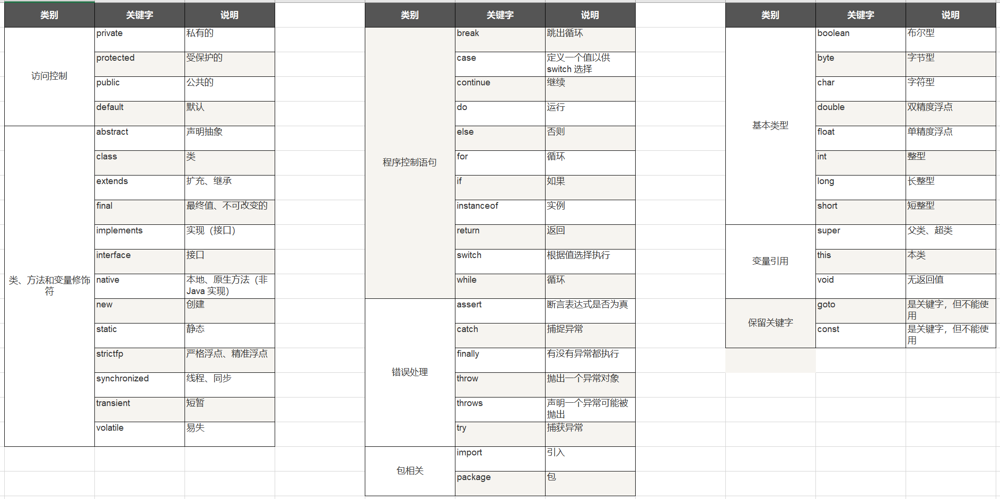
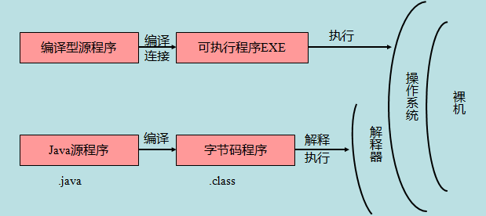

# Java 基础语法

## Java 标识符

关于 Java 标识符，有以下几点需要注意：

- 所有的标识符都应该以字母（`A-Z 或者 a-z`）, **美元符**（`$`）、或者 **下划线**（`_`）开始
- 首字符之后可以是字母（A-Z 或者 a-z）,美元符（$）、下划线（_）或数字的任何字符组合
- 关键字不能用作标识符
- 标识符是大小写敏感的

> [!EXAMPLE]
>
> - 合法标识符举例：`age`、`$salary`、`_value`、`__1_value`
> - 非法标识符举例：`123abc`、`-salary`

## Java 修饰符

像其他语言一样，Java 可以使用修饰符来修饰类中方法和属性。主要有两类修饰符：

- 访问控制修饰符 : default, public , protected, private
- 非访问控制修饰符 : final, abstract, static, synchronized

在 [后面的章节中](./Java修饰符) 我们会深入讨论 Java 修饰符。

------

## Java 变量

Java 中主要有如下几种类型的变量。

- 局部变量
- 类变量（静态变量）
- 成员变量（非静态变量）

具体分析见 [Java 变量类型](./Java变量类型)

------

## Java 数组

数组是储存在堆上的对象，可以保存多个同类型变量。在【后面的章节】中，我们将会学到如何声明、构造以及初始化一个数组。

------

## Java 枚举

Java 5.0 引入了枚举，枚举限制变量只能是预先设定好的值。使用枚举可以减少代码中的 bug。

例如，我们为果汁店设计一个程序，它将限制果汁为小杯、中杯、大杯。这就意味着它不允许顾客点除了这三种尺寸外的果汁。

### 实例

**注意：** 枚举可以单独声明或者声明在类里面。方法、变量、构造函数也可以在枚举中定义。

------

## Java 关键字

下面列出了 Java 关键字。这些保留字不能用于常量、变量、和任何标识符的名称。

[关键字表](./关键字.xlsx)

**注意：** Java 的 null 不是关键字，类似于 true 和 false，它是一个字面常量，不允许作为标识符使用。

------

## Java 注释

类似于 C/C++、Java 也支持单行以及多行注释。

注释中的字符将被 Java 编译器忽略。

更多内容可以参考：[Java 注释](https://www.runoob.com/java/java-comments.html)。

------

## Java 空行

空白行或者有注释的行，Java 编译器都会忽略掉。

------

## 继承

在 Java 中，一个类可以由其他类派生。如果你要创建一个类，而且已经存在一个类具有你所需要的属性或方法，那么你可以将新创建的类继承该类。

利用继承的方法，可以重用已存在类的方法和属性，而不用重写这些代码。被继承的类称为超类（super class），派生类称为子类（sub class）。

------

## 接口

在 Java 中，接口可理解为对象间相互通信的协议。接口在继承中扮演着很重要的角色。

接口只定义派生要用到的方法，但是方法的具体实现完全取决于派生类。

------

## Java 源程序与编译型运行区别

如下图所示：

## Java 源文件声明规则

当在一个源文件中定义多个类，并且还有 import 语句和 package 语句时，要特别注意这些规则。

- 一个源文件中**只能有一个 public 类**
- 一个源文件可以有**多个非 public 类**
- 源文件的名称应该和 public 类的类名保持一致
- 如果一个类定义在某个包中，那么 package 语句应该在源文件的首行。
- 如果源文件包含 import 语句，那么应该放在 package 语句和类定义之间。如果没有 package 语句，那么 import 语句应该在源文件中最前面。
- import 语句和 package 语句对源文件中定义的所有类都有效。在同一源文件中，不能给不同的类不同的包声明。

