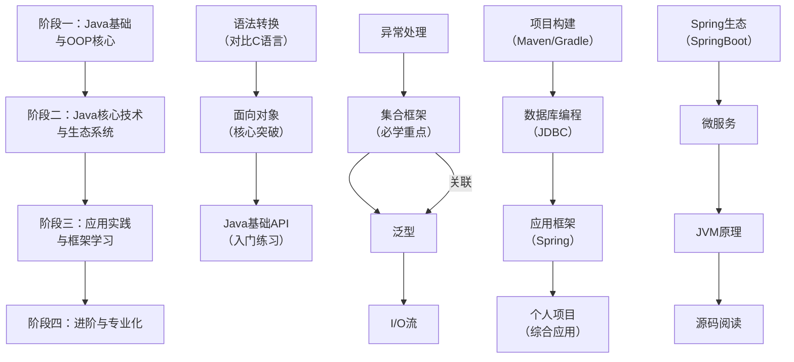

# Java学习路线

## 学习曲线参考

### 阶段一

这个阶段的目标是完成从“过程式编程”到“面向对象编程”的思维转变。

1. **语法快速入门（利用你的C基础）**：
   - **目标**：快速掌握与C相似但写法不同的语法。
   - **内容**：
     - 数据类型：`int`, `double`, `boolean`等（与C类似，但完全平台无关）。
     - 流程控制：`if-else`, `for`, `while`, `switch`（几乎与C一模一样）。
     - **重点对比**：
       - **从 `printf` 到 `System.out.println`**：学习Java的输出方式。
       - **从 `scanf` 到 `Scanner`**：学习Java的简单输入。
       - **从“函数”到“方法”**：本质上是一样的，只是叫法不同。
       - **从“指针”到“引用”**：这是关键！Java中没有显式的指针，你操作对象的都是“引用”。理解“所有对象都在堆上，通过引用来访问”这一核心概念。
2. **面向对象编程（OOP）核心（本阶段重中之重）**：
   - **这是Java的灵魂，也是你最大的新知识**。C是过程式的，Java是面向对象的。
   - **四大核心概念**：
     - **类和对象**：`class` 和 `new` 关键字。理解“类是蓝图，对象是实例”。
     - **封装**：`private`, `public` 等访问修饰符。为什么要隐藏数据，提供方法？
     - **继承**：`extends` 关键字。代码复用的重要手段。
     - **多态**：这是最抽象但也最强大的概念。理解“父类引用指向子类对象”以及`@Override`（重写）。
3. **Java基础API和工具**：
   - **字符串**：`String` 和 `StringBuilder`/`StringBuffer` 的区别（非常重要，Java中字符串是对象，不可变）。
   - **数组**：`int[] arr`，和C的数组类似，但它是对象，有`length`属性。
   - **基本开发工具**：学会使用`IDEA`（强烈推荐）或`Eclipse`这样的集成开发环境，它比你用过的任何C IDE都强大。

### 阶段二

掌握基础后，需要学习Java标准库提供的高级工具。

1. **异常处理**：`try-catch-finally` 和 `throws`。Java强制处理异常，这是一种健壮性的保障。
2. **集合框架**：这是Java最常用、最重要的库之一，用来替代C中的数组（因为数组长度固定，很不方便）。
   - 必学：`List`（顺序列表，如 `ArrayList`）， `Set`（无序集合，如 `HashSet`）， `Map`（键值对，如 `HashMap`）。
3. **泛型**：`ArrayList<String>`。它提供了编译时类型安全检查，让集合用起来更安全。可以类比C语言中的`void*`，但泛型更安全、更直观。
4. **I/O流**：`InputStream`, `OutputStream`, `Reader`, `Writer`等。用于文件读写、网络通信。

### 阶段三

学完核心库，就可以开始尝试做点真正有用的东西了。

1. **项目构建与管理**：学习使用**Maven**或**Gradle**。它们帮你管理项目依赖（第三方库），再也不用手动下载`.jar`文件了。
2. **数据库编程**：学习**JDBC**。这是Java连接数据库的标准API。学会如何从Java程序里操作MySQL等数据库。
3. **应用框架**：进入企业级开发的核心。
   - **Spring框架**（特别是**Spring Boot**）：这是Java世界事实上的标准。它极大地简化了企业级应用的开发。学习如何使用Spring Boot快速创建一个带Web界面的应用程序。
4. **做一个个人项目**：这是最关键的一步！**光看不练假把式**。可以是一个简单的博客系统、图书管理系统等。用上你学过的所有东西。

### 阶段四

- **Spring生态**：Spring MVC, Spring Security, Spring Data等。
- **微服务**：学习基于Spring Boot和Spring Cloud的微服务架构。
- **JVM底层**：了解垃圾回收机制、内存模型等（你的C语言内存基础这里会派上用场）。
- **多线程并发**：`java.util.concurrent`包。
- **阅读源码**：尝试阅读Java标准库（如HashMap）或Spring等优秀开源项目的源码。
