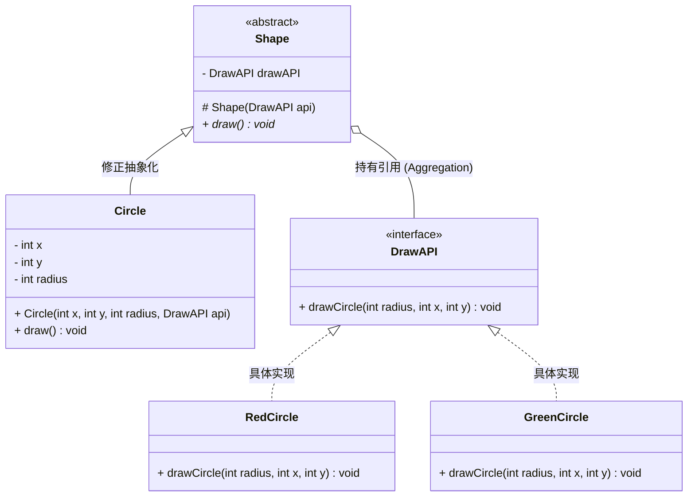

# Java 设计模式全解

这份文档基于《高级程序设计-14 设计模式实例.pptx》整理，涵盖了课件中涉及的 **创建型**、**结构型**、**行为型** 三大类共 14 种设计模式。

## 第一部分：创建型模式

*关注对象的创建过程，隐藏创建逻辑。*

### 1. 工厂模式 (Factory Pattern)

**课件定义：** 定义一个创建对象的接口，让其子类自己决定实例化哪一个工厂类。

场景分析：

你需要根据字符串（如 "CIRCLE"）来获取一个形状对象，而不是直接 new Circle()。

**代码还原与分析：**

```java
// 1. 公共接口
interface Shape {
    void draw();
}

// 2. 实体类
class Rectangle implements Shape {
    public void draw() { 
        System.out.println("Inside Rectangle::draw() method."); 
    }
}
class Circle implements Shape {
    public void draw() { 
        System.out.println("Inside Circle::draw() method."); 
    }
}

// 3. 工厂类 (关键)
class ShapeFactory {
    // 使用 getShape 方法获取对象类型
    public Shape getShape(String shapeType){
        if(shapeType == null){
            return null;
        }
        if(shapeType.equalsIgnoreCase("CIRCLE")){
            return new Circle();
        } else if(shapeType.equalsIgnoreCase("RECTANGLE")){
            return new Rectangle();
        }
        return null;
    }
}

// 4. 使用端
public class FactoryPatternDemo {
    public static void main(String[] args) {
        ShapeFactory shapeFactory = new ShapeFactory();
        // 获取 Circle 的对象，并调用它的 draw 方法
        Shape shape1 = shapeFactory.getShape("CIRCLE");
        shape1.draw();
    }
}
```

**核心点：** `ShapeFactory` 承担了 `if-else` 的判断责任，客户端与具体的 `Circle` 类解耦。

### 2. 单例模式 (Singleton Pattern)

**课件定义：** 保证一个类仅有一个实例，并提供一个访问它的全局访问点。

**代码还原与分析：**

```java
public class SingleObject {
    // 1. 创建 SingleObject 的一个对象 (饿汉式：类加载时就创建)
    private static SingleObject instance = new SingleObject();

    // 2. 让构造函数为 private，这样该类就不会被实例化
    private SingleObject(){}

    // 3. 获取唯一可用对象的方法
    public static SingleObject getInstance(){
        return instance;
    }

    public void showMessage(){
        System.out.println("Hello World!");
    }
}

// 使用端
public class SingletonPatternDemo {
    public static void main(String[] args) {
        // 不合法的构造函数
        // SingleObject object = new SingleObject(); // 编译错误！

        // 获取唯一对象
        SingleObject object = SingleObject.getInstance();
        object.showMessage();
    }
}
```

**核心点：** `private` 构造函数是关键，防止外部 `new`。

这种模式涉及到一个单一的类，该类负责创建自己的对象，同时确保只有单个对象被创建。这个类提供了一种访问其唯一的对象的方式，可以直接访问，不需要实例化该类的对象。

- 意图：保证一个类仅有一个实例，并提供一个访问它的全局访问点。
- 主要解决：一个全局使用的类频繁地创建与销毁。
- 注意：
  - 1、单例类只能有一个实例。
  - 2、单例类必须自己创建自己的唯一实例。
  - 3、单例类必须给所有其他对象提供这一实例。

## 第二部分：结构型模式

*关注类和对象的组合。*

### 3. 适配器模式 (Adapter Pattern)

**课件定义：** 作为两个不兼容的接口之间的桥梁。

场景分析：

Audio Player 只会放 mp3。Advanced Media Player 能放 vlc 和 mp4。我们需要一个适配器让 Audio Player 也能放 mp4。

**代码还原与分析：**

```java
// 1. 目标接口 (老接口) AudioPlayer
interface MediaPlayer {
    void play(String audioType, String fileName);
}

// 2. 高级接口 (新功能) AdvancedMediaPlayer
interface AdvancedMediaPlayer {
    void playVlc(String fileName);
    void playMp4(String fileName);
}

// 3. 高级接口的实现类
class Mp4Player implements AdvancedMediaPlayer {
    public void playVlc(String fileName) { /* 什么也不做 */ }
    public void playMp4(String fileName) { 
        System.out.println("Playing mp4 file: " + fileName); 
    }
}

// 4. 适配器 (关键：实现了老接口，内部持有新接口对象)
class MediaAdapter implements MediaPlayer {
    AdvancedMediaPlayer advancedMusicPlayer;

    public MediaAdapter(String audioType){
        if(audioType.equalsIgnoreCase("vlc") ){
            // advancedMusicPlayer = new VlcPlayer(); // 假设有这个类
        } else if (audioType.equalsIgnoreCase("mp4")){
            advancedMusicPlayer = new Mp4Player();
        }
    }

    @Override
    public void play(String audioType, String fileName) {
        if(audioType.equalsIgnoreCase("mp4")){
            advancedMusicPlayer.playMp4(fileName); // 转换调用
        }
    }
}

// 5. 客户端 (AudioPlayer)
class AudioPlayer implements MediaPlayer {
    MediaAdapter mediaAdapter;

    @Override
    public void play(String audioType, String fileName) {
        // 内置支持 mp3
        if(audioType.equalsIgnoreCase("mp3")){
            System.out.println("Playing mp3 file: " + fileName);
        }
        // 使用适配器支持其他格式
        else if(audioType.equalsIgnoreCase("vlc") || audioType.equalsIgnoreCase("mp4")){
            mediaAdapter = new MediaAdapter(audioType);
            mediaAdapter.play(audioType, fileName);
        }
    }
}
```

**核心点：** `AudioPlayer` 遇到不懂的格式，就甩锅给 `MediaAdapter`，适配器再找更厉害的 `AdvancedMediaPlayer` 处理。

> [!TIP]
>
> **何时使用：** 
>
> 1、系统需要使用现有的类，而此类的接口不符合系统的需要。
>
>  2、想要建立一个可以重复使用的类，用于与一些彼此之间没有太大关联的一些类，包括一些可能在将来引进的类一起工作，这些源类不一定有一致的接口。 
>
> 3、通过接口转换，将一个类插入另一个类系中。

这种模式涉及到一个单一的类，该类负责加入独立的或不兼容的接口功能。比如，读卡器是作为内存卡和笔记本之间的适配器。将内存卡插入读卡器，再将读卡器插入笔记本，这样就可以通过笔记本来读取内存卡。

- 意图：将一个类的接口转换成客户希望的另外一个接口。适配器模式使得原本由于接口不兼容而不能一起工作的那些类可以一起工作。
- 主要解决：主要解决在软件系统中，常常要将一些 "现存的对象" 放到新的环境中，而新环境要求的接口是现对象不能满足的。
- 何时使用： 
  - 1、系统需要使用现有的类，而此类的接口不符合系统的需要。
  - 2、想要建立一个可以重复使用的类，用于与一些彼此之间没有太大关联的一些类，包括一些可能在将来引进的类一起工作，这些源类不一定有一致的接口。 
  - 3、通过接口转换，将一个类插入另一个类系中。

- 关键代码：适配器继承或依赖已有的对象，实现想要的目标接口。

### 4. 桥接模式 (Bridge Pattern)

**课件定义：** 把抽象化与实现化解耦，使得二者可以独立变化。

场景分析：

形状（Shape）和颜色（DrawAPI）是两个独立的维度。我们可以画“红色的圆”、“绿色的圆”。不应该写 RedCircle 类，而应该把“颜色绘制”抽离出来。

**代码还原与分析：**

```java
// 1. 实现化接口 (DrawAPI - 负责“怎么画颜色”)
interface DrawAPI {
    public void drawCircle(int radius, int x, int y);
}

// 2. 具体实现化
class RedCircle implements DrawAPI {
    public void drawCircle(int radius, int x, int y) {
        System.out.println("Drawing Circle[ color: red, radius: " + radius + ", x: " + x + ", " + y + "]");
    }
}
class GreenCircle implements DrawAPI {
    public void drawCircle(int radius, int x, int y) {
        System.out.println("Drawing Circle[ color: green, ...]");
    }
}

// 3. 抽象化 (Shape - 负责“形状结构”)
abstract class Shape {
    protected DrawAPI drawAPI; //【关键】：持有实现化接口的引用成员变量声明，类型是接口
	
    //构造函数
    protected Shape(DrawAPI drawAPI){
        this.drawAPI = drawAPI;
    }
    public abstract void draw();
}

// 4. 修正抽象化
class Circle extends Shape {
    private int x, y, radius;

    // 构造方法
    public Circle(int x, int y, int radius, DrawAPI drawAPI) {
        super(drawAPI); // 注入颜色实现
        this.x = x; this.y = y; this.radius = radius;
    }

    public void draw() {
        drawAPI.drawCircle(radius, x, y); // 调用实现化部分的具体逻辑
    }
}

public class BridgePatternDemo{
    public static void main(String[] args) {
        Shape redcircle = new Circle(100,100, 10, new Redcircle()); //shape和circle独立开来，左侧shape，右侧circle
        Shape greencircle = new Circle(100,100, 10, new Greencircle());
        redcircle.draw();
        greencircle.draw();
    }
}
```

**核心点：** `Shape` 类中包含 `DrawAPI`。通过组合，形状和颜色可以自由搭配（M * N 种组合，而不是 M + N 个子类）。

通过这行代码，我们将“形状”和“颜色（画法）”分开了：

- **组合胜过继承：** `Shape` 类不再自己负责画颜色，而是 **持有（Has-a）** 一个专门负责画画的工具（`drawAPI`）。
- **动态切换：** 只要是实现了 `DrawAPI` 接口的对象（比如 `RedCircle` 或 `GreenCircle`），都可以赋值给这个变量。

逻辑流：

1. **声明：** `protected DrawAPI drawAPI;` —— “我这里预留了一个画图工具的位置。”

2. **注入（构造函数）：** `protected Shape(DrawAPI drawAPI){ this.drawAPI = drawAPI; // 把具体的工具（红或绿）传进来 }`

3. **使用（Circle 类中）：**

   ```Java
   public void draw() {
       drawAPI.drawCircle(radius, x, y); // 我不知道你是红是绿，我只管下达“画图”指令
   }
   ```

| **组成部分**    | **名称**   | **作用**                                                    |
| --------------- | ---------- | ----------------------------------------------------------- |
| **`protected`** | 访问修饰符 | 表示这个变量可以被 **子类**（如 `Circle`）直接访问。        |
| **`DrawAPI`**   | 数据类型   | 这是一个 **接口类型**。它不是一个具体的类，而是一套规范。   |
| **`drawAPI`**   | 变量名     | 这是一个引用变量，用来指向任何实现了 `DrawAPI` 接口的对象。 |




### 5. 外观模式 (Facade Pattern)

**课件定义：** 隐藏系统的复杂性，向客户端提供一个访问系统的接口。

场景分析：

画圆、画方、画长方形太麻烦了，我们搞一个“图形制造者”（ShapeMaker）类，只暴露 drawCircle() 等简单方法。

**代码还原与分析：**

```java
// 外观类 (Facade)
class ShapeMaker {
    private Shape circle;
    private Shape rectangle;
    private Shape square;
	
    // 构造函数
    public ShapeMaker() {
        circle = new Circle();
        rectangle = new Rectangle();
        square = new Square();
    }

    // 提供统一的入口.draw方法
    public void drawCircle(){
        circle.draw();
    }
    public void drawRectangle(){
        rectangle.draw();
    }
    public void drawSquare(){
        square.draw();
    }
}

// 客户端
// 不用去 new Circle()，直接找 ShapeMaker
ShapeMaker shapeMaker = new ShapeMaker();
shapeMaker.drawCircle();
```

**核心点：** “接待员”模式。客户端不直接跟子系统（各种形状类）打交道，只跟外观类打交道。

这种模式涉及到一个单一的类，该类提供了客户端请求的简化方法和对现有系统类方法的委托调用。

- 意图：为子系统中的一组接口提供一个一致的界面，外观模式定义了一个高层接口，这个接口使得这一子系统更加容易使用。
- 主要解决：降低访问复杂系统的内部子系统时的复杂度，简化客户端之间的接口。
- 何时使用： 
  - 1、客户端不需要知道系统内部的复杂联系，整个系统只需提供一个 "接待员" 即可。 
  - 2、定义系统的入口。
- 如何解决：客户端不与系统耦合，外观类与系统耦合。
- 关键代码：在客户端和复杂系统之间再加一层，这一层将调用顺序、依赖关系等处理好。

### 6. 代理模式 (Proxy Pattern)

**课件定义：** 为其他对象提供一种代理以控制对这个对象的访问。

场景分析：

加载高清大图 (Real Image) 很耗内存。我们用一个代理 (Proxy Image)，只有当用户真的调用 display() 时，才去加载真实图片。

**代码还原与分析：**

```java
interface Image {
    void display();
}

class RealImage implements Image {
    private String fileName;

    public RealImage(String fileName){
        this.fileName = fileName;
        loadFromDisk(fileName); // 假设这里很耗时
    }

    private void loadFromDisk(String fileName){
        System.out.println("Loading " + fileName);
    }

    @Override
    public void display() {
        System.out.println("Displaying " + fileName);
    }
}

class ProxyImage implements Image {
    private RealImage realImage;
    private String fileName;

    public ProxyImage(String fileName){
        this.fileName = fileName;
    }

    @Override
    public void display() {
        // 【关键】：延迟加载 (Lazy Loading)
        if(realImage == null){
            realImage = new RealImage(fileName);
        }
        realImage.display();
    }
}

public class ProxyPatternDemo{
    public static void main(String[] args) {
    	Image image = new ProxyImage("test_10mb.jpg");
    	// 调用display才开始加载，实现延迟加载
        image.display();// 图像将从磁盘加载
   		System.out.println("") ;
        
        image.display();//刚才加载过，现在图像不需要从磁盘加载
    }
}
```

**核心点：** 代理类控制了真实类的实例化时机。

- 意图：为其他对象提供一种代理以控制对这个对象的访问。
- 主要解决：在直接访问对象时带来的问题，比如说：要访问的对象在远程的机器上。在面向对象系统中，有些对象由于某些原因（比如对象创建开销很大，或者某些操作需要安全控制，或者需要进程外的访问），直接访问会给使用者或者系统结构带来很多麻烦，我们可以在访问此对象时加上一个对此对象的访问层。
- 何时使用：想在访问一个类时做一些控制。
- 如何解决：增加中间层。
- 关键代码：实现与被代理类组合。

> [!CAUTION]
>
> 注意事项： 
>
> 1、和 **适配器模式** 的区别：适配器模式主要改变所考虑对象的接口，而代理模式不能改变所代理类的接口。 
>
> - 适配器：如果不行，换另一个接口
> - 代理模式：要用到时再使用这个接口
>
> 2、和 **装饰器模式** 的区别：装饰器模式为了增强功能，而代理模式是为了加以控制。
>
> - 装饰器模式：

### 7. 装饰器模式 (Decorator Pattern)

**课件定义：** 允许向一个现有的对象添加新的功能，同时又不改变其结构。

场景分析：

我们已经有了 Circle 和 Rectangle。现在想给它们加一个“红色边框”，但不想修改原有的类，也不想搞 RedBorderCircle 这种子类。

**代码还原与分析：**

```java
// 1. 抽象装饰器 (实现了 Shape，也持有一个 Shape)
abstract class ShapeDecorator implements Shape {
    protected Shape decoratedShape;

    public ShapeDecorator(Shape decoratedShape){
        this.decoratedShape = decoratedShape;
    }

    public void draw(){
        decoratedShape.draw(); // 默认行为：直接转发
    }
}

// 2. 具体装饰器 (红色边框)
class RedShapeDecorator extends ShapeDecorator {

    public RedShapeDecorator(Shape decoratedShape) {
        super(decoratedShape);
    }

    @Override
    public void draw() {
        decoratedShape.draw(); // 先画原来的形状
        setRedBorder(decoratedShape); // 再加点料
    }

    private void setRedBorder(Shape decoratedShape){
        System.out.println("Border Color: Red");
    }
}
```

**核心点：** 就像给手机套手机壳。你可以套一层，也可以套多层。

## 第三部分：行为型模式

*关注对象之间的通信。*

### 8. 观察者模式 (Observer Pattern)

**课件定义：** 定义对象间的一种一对多的依赖关系，当一个对象的状态发生改变时，所有依赖于它的对象都得到通知并被自动更新。

*(这部分在之前的对话中已详细拆解，核心在于 Subject 持有 Observer 的 List)*

```java
import java.util.ArrayList;
import java.util.List;

// 1. 观察者接口 (Observer)
// 就像所有订阅者都必须有的“手机”，用来接收通知
abstract class Observer {
    protected Subject subject;
    public abstract void update();
}

// 2. 主题类 (Subject)
// 就像“公众号”或“UP主”
class Subject {
    // 核心数据 (比如：气温)
    private int state;
    // 【关键结构】：用一个列表存所有的粉丝 (ArrayList)
    private List<Observer> observers = new ArrayList<>();

    // 获取状态
    public int getState() {
        return state;
    }

    // 改变状态 (发布新视频/天气变了)
    public void setState(int state) {
        this.state = state;
        // 【触发点】：一旦状态变了，立马通知所有人
        notifyAllObservers();
    }

    // 订阅 (关注)
    public void attach(Observer observer) {
        observers.add(observer);
    }

    // 【核心通信逻辑】：遍历列表，挨个打电话
    public void notifyAllObservers() {
        // 循环遍历 ArrayList
        for (Observer observer : observers) {
            // 调用观察者的 update() 方法
            observer.update(); 
        }
    }
}

// 3. 具体观察者 (Concrete Observer)
class BinaryObserver extends Observer {
    public BinaryObserver(Subject subject) {
        this.subject = subject;
        this.subject.attach(this); // 自动订阅
    }

    @Override
    public void update() {
        // 收到通知后的反应
        System.out.println("收到通知！Binary String: " + Integer.toBinaryString(subject.getState()));
    }
}
```


### 9. 模板模式 (Template Pattern)

**课件定义：** 一个抽象类公开定义了执行它的方法的方式/模板。

场景分析：

玩游戏（Game）通常都有三个步骤：initialize() -> startPlay() -> endPlay()。无论是板球（Cricket）还是足球（Football），流程都是一样的，只是具体玩法不同。

**代码还原与分析：**

```java
abstract class Game {
    abstract void initialize();
    abstract void startPlay();
    abstract void endPlay();

    // 【关键】：模板方法，定义了算法骨架
    // 设置为 final，防止子类修改流程
    public final void play(){
        initialize(); // 步骤 1
        startPlay();  // 步骤 2
        endPlay();    // 步骤 3
    }
}

class Cricket extends Game {
    @Override
    void endPlay() { System.out.println("Cricket Game Finished!"); }
    @Override
    void initialize() { System.out.println("Cricket Game Initialized!"); }
    @Override
    void startPlay() { System.out.println("Cricket Game Started!"); }
}

public class TemplatePatternDemo{
public static void main(String[] args) {
	Gamegame = new Cricket();
    game.play();
    System.out.println();
    game = new Football();
    game.play();
}
```

**核心点：** 父类控制流程（流程图），子类填充具体步骤（填空题）。

### 10. 命令模式 (Command Pattern)

**课件定义：** 将一个请求封装成一个对象，从而使您可以用不同的请求对客户进行参数化。

场景分析：

股票交易。有 BuyStock（买股票）和 SellStock（卖股票）两个动作。我们将这些动作封装成“命令对象”，交给经纪人（Broker/Invoker）去执行。

**代码还原与分析：**

```java
// 1. 命令接口
interface Order {
    void execute();
}

// 2. 请求接收者 (真正干活的)
class Stock {
    private String name = "ABC";
    private int quantity = 10;
    public void buy(){ 
        System.out.println("Stock [ Name: "+name+", Quantity: " + quantity +" ] bought"); 
    }
    
    public void sell(){ 
        System.out.println("Stock [ Name: "+name+", Quantity: " + quantity +" ] sold"); 
    }
}

// 3. 具体命令 (封装请求)
class BuyStock implements Order {
    private Stock abcStock;
    public BuyStock(Stock abcStock){ 
        this.abcStock = abcStock; 
    }
    
    public void execute() { 
        abcStock.buy(); 
    } // 指挥 Stock 去买
}

// 4. 调用者 (Broker - 保存并执行命令)
class Broker {
    private List<Order> orderList = new ArrayList<Order>();

    public void takeOrder(Order order){
        orderList.add(order);
    }

    public void placeOrders(){
        for (Order order : orderList) {
            order.execute();
        }
        orderList.clear();
    }
}


public class CommandPatternDemo{
	public static void main(String[] args) {
        Stock abcStock = new Stock();
        BuyStock buyStockorder = new BuyStock(abcStock);
        sellstock sellstockorder = new SellStock(abcStock);
        Broker broker = new Broker();
        broker.take0rder(buyStockorder);
        broker.take0rder(sellStockorder);
        broker.place0rders();
}
```

**核心点：** 解耦了“谁发出的命令”和“谁执行命令”。支持撤销/重做（只要记录下 Command 历史即可）。

### 11. 迭代器模式 (Iterator Pattern)

**课件定义：** 用于顺序访问集合对象的元素，不需要知道集合对象的底层表示。

**代码还原与分析：**

```java
interface Iterator {
    public boolean hasNext();
    public Object next();
}
interface Container {
    public Iterator getIterator();
}

class NameRepository implements Container {
    public String names[] = {"Robert" , "John" ,"Julie" , "Lora"};

    @Override
    public Iterator getIterator() {
        return new NameIterator();
    }

    // 内部类实现迭代器
    private class NameIterator implements Iterator {
        int index;
        @Override
        public boolean hasNext() {
            return index < names.length;
        }
        @Override
        public Object next() {
            if(this.hasNext()){
                return names[index++];
            }
            return null;
        }
    }
}
```

**核心点：** 统一了遍历方式。无论底层是数组还是链表，使用者只管 `hasNext()` 和 `next()`。

### 12. 空对象模式 (Null Object Pattern)

**课件定义：** 一个空对象取代 NULL 对象实例的检查。

场景分析：

在数据库查不到用户时，不要返回 null（容易报 NullPointerException），而是返回一个“空用户”对象。

**代码还原与分析：**

```java
abstract class AbstractCustomer {
    protected String name;
    public abstract boolean isNil(); // 是否是空对象
    public abstract String getName();
}

class RealCustomer extends AbstractCustomer {
    public RealCustomer(String name) { this.name = name; }
    @Override
    public String getName() { return name; }
    @Override
    public boolean isNil() { return false; }
}

class NullCustomer extends AbstractCustomer {
    @Override
    public String getName() { return "Not Available in Customer Database"; }
    @Override
    public boolean isNil() { return true; }
}

// 工厂
class CustomerFactory {
    public static AbstractCustomer getCustomer(String name){
        if(checkIfNameExists(name)){ // 伪代码
            return new RealCustomer(name);
        }
        // 【关键】：查不到时不返 null，返 NullCustomer
        return new NullCustomer();
    }
}
```

**核心点：** 减少了代码中大量的 `if (obj != null)` 检查。

### 13. 策略模式 (Strategy Pattern)

**课件定义：** 一个类的行为或其算法可以在运行时更改。

场景分析：

做数学运算。可以是加法、减法、乘法。我们将这些算法封装成不同的策略类。

**代码还原与分析：**

```java
// 1. 策略接口
interface Strategy {
    public int doOperation(int num1, int num2);
}

// 2. 具体策略
class OperationAdd implements Strategy{
    public int doOperation(int num1, int num2) { return num1 + num2; }
}
class OperationSub implements Strategy{
    public int doOperation(int num1, int num2) { return num1 - num2; }
}

// 3. 上下文 (Context - 持有策略)
class Context {
    private Strategy strategy;

    public Context(Strategy strategy){
        this.strategy = strategy;
    }

    public int executeStrategy(int num1, int num2){
        return strategy.doOperation(num1, num2);
    }
}

// 使用
Context context = new Context(new OperationAdd()); // 选加法策略
context.executeStrategy(10, 5); // 输出 15
```

**核心点：** 算法可以自由切换（热插拔）。避免了多重条件判断 (`if type == ADD ... else if type == SUB ...`)。

### 14. MVC 模式

**课件定义：** Model-View-Controller（模型-视图-控制器）模式。用于应用程序的分层开发。

场景分析：

Student（数据）、Student View（显示）、Student Controller（胶水）。

**代码还原与分析：**

```java
// 1. Model (数据模型)
class Student {
    private String rollNo;
    private String name;
    // getter setters...
}

// 2. View (视图 - 只管打印)
class StudentView {
    public void printStudentDetails(String studentName, String studentRollNo){
        System.out.println("Student: ");
        System.out.println("Name: " + studentName);
        System.out.println("Roll No: " + studentRollNo);
    }
}

// 3. Controller (控制器 - 协调两者)
class StudentController {
    private Student model;
    private StudentView view;

    public StudentController(Student model, StudentView view){
        this.model = model;
        this.view = view;
    }

    public void setStudentName(String name){
        model.setName(name); // 更新数据
    }

    public void updateView(){
        // 把数据取出来给视图去显示
        view.printStudentDetails(model.getName(), model.getRollNo());
    }
}
```

---

## 第四部分：总结与对比

本节对上述 14 种模式进行横向对比，帮助你理解它们在 **接口使用**、**设计目的** 和 **操作手法** 上的深层联系与区别。

### 15. 14 种模式横向对比表

| 模式名称       | 类型   | 核心意图 (Purpose)             | 接口/类使用特点 (Interface Usage)         | 操作手法与关键词 (Operation)                              |
| -------------- | ------ | ------------------------------ | ----------------------------------------- | --------------------------------------------------------- |
| **工厂模式**   | 创建型 | **解耦** 对象的创建与使用       | 必须有共同的 `Interface`，工厂返回接口类型 | **关键词：封装创建** 根据参数 `if-else` 返回不同子类。       |
| **单例模式**   | 创建型 | 保证 **唯一** 实例               | 构造函数为 `private`，提供 `static` 方法     | **关键词：独占** 自我实例化，拒绝外部 `new`。               |
| **适配器模式** | 结构型 | **转换** 接口，让不兼容的能合作 | 实现 `旧接口`，内部持有 `新接口` 对象        | **关键词：翻译** 外层披着旧皮，里层调用新功能。            |
| **桥接模式**   | 结构型 | **分离** 抽象与实现，独立变化   | 抽象类持有实现接口，构造时注入            | **关键词：组合维度** 将 M+N 个类变成 M*N 种组合。              |
| **外观模式**   | 结构型 | **简化** 接口，提供统一入口     | 不强制实现接口，通常是具体类              | **关键词：接待员** 一个方法调用背后的一组方法。            |
| **代理模式**   | 结构型 | **控制** 访问 (权限/性能)       | 实现 `相同接口`，持有真实对象              | **关键词：中介/拦截** 在调用真实方法前/后加料。            |
| **装饰器模式** | 结构型 | **增强** 功能，动态叠加         | 实现 `相同接口`，持有 `相同接口` 对象        | **关键词：套娃** 层层嵌套，无限增强。                      |
| **观察者模式** | 行为型 | **通知** 变化 (1 对多)           | `Subject` 持有 `Observer` 列表               | **关键词：广播** 遍历列表，循环调用 `update()`。            |
| **模板模式**   | 行为型 | **固定** 流程，子类定制步骤     | 抽象父类定义 `final` 主流程方法             | **关键词：填空题** 父类定骨架，子类填肉。                  |
| **命令模式**   | 行为型 | **封装** 请求，参数化调用       | 命令实现统一接口 `execute()`               | **关键词：打包** 把方法调用打包成对象传递。                |
| **迭代器模式** | 行为型 | **遍历** 集合，隐藏细节         | 实现 `hasNext()` 和 `next()`                 | **关键词：游标** 统一访问方式，不管底层是数组还是链表。    |
| **空对象模式** | 行为型 | **替代** null 检查               | 实现接口，但在方法里啥都不干              | **关键词：默认值** 用一个不做事的各种去顶替 null。          |
| **策略模式**   | 行为型 | **切换** 算法 (热插拔)          | 实现统一算法接口                          | **关键词：替换** Context 持有接口，运行时换实现类。         |
| **MVC 模式**    | 架构型 | **分层** 关注点                 | Model/View/Controller 各司其职             | **关键词：协调** Controller 监听 View，更新 Model，刷新 View。 |

### 16. 易混淆模式深度辨析

#### A. 接口“整容”三兄弟：适配器 vs 装饰器 vs 代理

这三个模式结构极其相似，都是“一个类持有另一个类”，但 **接口的使用目的** 完全不同：

1. **适配器 (Adapter)**
   - **目的：** **改变接口**。
   - **接口关系：** 实现的是 `Target` 接口，持有的是 `Adaptee`（完全不同的接口）。
   - **口诀：** “指鹿为马”。把圆孔充电器塞进方孔插座。
2. **装饰器 (Decorator)**
   - **目的：** **增强功能**，但不改变接口。
   - **接口关系：** 实现 `Interface A`，持有的也是 `Interface A`。
   - **口诀：** “锦上添花”。照片还是那张照片，只是加了个相框。
3. **代理 (Proxy)**
   - **目的：** **控制访问**，不改变接口，通常也不增强核心功能（只做辅助，如鉴权、日志）。
   - **接口关系：** 实现 `Interface A`，持有的也是 `Interface A`。
   - **口诀：** “狐假虎威”。经纪人代表明星，但他不是为了让你听得更爽，而是为了挡驾。

#### B. 算法“封装”双子星：策略 vs 模板

两者都是为了处理“做事情的步骤”，但 **操作手法** 相反：

1. **策略模式 (Strategy)**
   - **手法：** **组合 (Composition)**。
   - **特点：** 客户端可以自由切换整个算法（做加法还是做减法）。
   - **侧重：** 算法的 **可替换性**。
2. **模板模式 (Template)**
   - **手法：** **继承 (Inheritance)**。
   - **特点：** 父类控制了整体流程（先 A 后 B 再 C），子类只能改 A、B、C 的具体细节，不能改流程。
   - **侧重：** 流程的 **复用性**。

#### C. 解耦“中间人”：外观 vs 适配器 vs 桥接

1. **外观 (Facade)**：是 **单向** 的，为了让后面的一堆乱七八糟的类看起来简单。它是为了 **方便** 客户端。
2. **适配器 (Adapter)**：是 **双向协调** 的，为了让两个已有的、由于接口不兼容而没法在一起工作的类能工作。它是为了 **兼容**。
3. **桥接 (Bridge)**：是 **预先设计** 的，为了让抽象和实现能各自发展，不让类爆炸。它是为了 **架构扩展**。


---

## 小结

### 一、 设计原则 (Design Principles) - 软件质量的基石

在设计模式之前，PPT 强调了高质量软件架构必须遵循的七大原则，这是衡量代码“好坏”的根本标准：

1. **开-闭原则 (Open-Closed Principle, OCP)**：
   - **核心**：对扩展开放，对修改关闭。
   - **意义**：当需求变化时，应通过添加新代码来扩展功能，而不是修改已有的源代码。
2. **里氏代换原则 (Liskov Substitution Principle, LSP)**：
   - **核心**：子类必须能够替换其基类。
   - **意义**：任何基类可以出现的地方，子类一定可以出现。保证了继承关系的正确性。
3. **依赖倒置原则 (Dependency Inversion Principle, DIP)**：
   - **核心**：高层模块不应依赖低层模块，二者都应依赖其抽象。
   - **意义**：针对接口编程，而不针对实现编程，降低模块间的耦合。
4. **接口隔离原则 (Interface Segregation Principle, ISP)**：
   - **核心**：客户端不应被迫依赖它不使用的方法。
   - **意义**：使用多个专门的接口，而不使用单一的总接口。
5. **合成/聚合复用原则 (Composite/Aggregate Reuse Principle, CARP)**：
   - **核心**：尽量使用合成/聚合（组合关系），而不是继承。
   - **意义**：继承是“白盒复用”，破坏封装性；组合是“黑盒复用”，更灵活。
6. **迪米特法则 (Law of Demeter, LoD)**：
   - **核心**：低耦合，高内聚。
   - **意义**：一个对象应当对其他对象有尽可能少的了解（只与朋友通信）。
7. **单一职责原则 (Single Responsibility Principle, SRP)**：
   - **核心**：一个类只负责一项职责。
   - **意义**：降低类的复杂度，提高可维护性。

### 二、 设计模式分类 (Categories of Design Patterns)

PPT 将 23 种设计模式根据目的分为三大类：

| **类型**                | **描述**                                                  | **包含模式**                                                 |
| ----------------------- | --------------------------------------------------------- | ------------------------------------------------------------ |
| **创建型 (Creational)** | 隐藏创建逻辑，不直接使用 `new` 实例化，使创建对象更灵活。 | Factory, Abstract Factory, Singleton, Builder, Prototype     |
| **结构型 (Structural)** | 关注类和对象的组合，通过继承或组合接口定义新功能。        | Adapter, Bridge, Filter, Composite, Facade, Decorator, Flyweight, Proxy |
| **行为型 (Behavioral)** | 特别关注对象之间的通信。                                  | Observer, Mediator, Iterator, Interpreter, Command, Memento, State, Strategy, Template, Visitor, Chain of Responsibility, Null Object |

### 三、 核心模式详解、代码实现与深度分析

#### 1. 观察者模式 (Observer Pattern) - [行为型]

- **定义**：定义一对多依赖，当主体（Subject）状态改变时，通知并自动更新所有依赖者。
- **关键代码分析**：

```
// 1. 观察者抽象类
public abstract class Observer {
   protected Subject subject;
   public abstract void update(); // 观察者收到通知后的反应
}

// 2. 主体类 (目标)
import java.util.ArrayList;
import java.util.List;

public class Subject {
   // 关键：ArrayList 存放所有观察者
   private List<Observer> observers = new ArrayList<Observer>();
   private int state;

   public int getState() { return state; }

   public void setState(int state) {
      this.state = state;
      notifyAllObservers(); // 状态改变时，自动触发通知
   }

   public void attach(Observer observer){
      observers.add(observer); // 绑定观察者
   }

   public void notifyAllObservers(){
      for (Observer observer : observers) {
         observer.update(); // 遍历并调用观察者的更新方法
      }
   } 	
}

// 3. 具体观察者 (以二进制观察者为例)
public class BinaryObserver extends Observer {
   public BinaryObserver(Subject subject){
      this.subject = subject;
      this.subject.attach(this); // 在构造时将自己加入通知名单
   }

   @Override
   public void update() {
      // 具体的业务处理逻辑
      System.out.println("Binary String: " + Integer.toBinaryString(subject.getState())); 
   }
}
```

- **深度分析**：
  - **优点**：目标与观察者解耦；支持广播通信。
  - **应用场景**：触发链机制（A -> B -> C）。

#### 2. 适配器模式 (Adapter Pattern) - [结构型]

- **定义**：作为不兼容接口间的桥梁。
- **PPT案例**：`AudioPlayer` (MP3) 通过适配器兼容播放 VLC 和 MP4。

```
// 1. 目标接口 (客户期待的接口)
public interface MediaPlayer {
   public void play(String audioType, String fileName);
}

// 2. 现存不兼容接口
public interface AdvancedMediaPlayer {	
   public void playVlc(String fileName);
   public void playMp4(String fileName);
}

// 3. 适配器类：实现目标接口，持有所需实现的引用
public class MediaAdapter implements MediaPlayer {
   AdvancedMediaPlayer advancedMusicPlayer;

   public MediaAdapter(String audioType){
      if(audioType.equalsIgnoreCase("vlc") ){
         advancedMusicPlayer = new VlcPlayer();			
      } else if (audioType.equalsIgnoreCase("mp4")){
         advancedMusicPlayer = new Mp4Player();
      }	
   }

   @Override
   public void play(String audioType, String fileName) {
      if(audioType.equalsIgnoreCase("vlc")){
         advancedMusicPlayer.playVlc(fileName);
      } else if(audioType.equalsIgnoreCase("mp4")){
         advancedMusicPlayer.playMp4(fileName);
      }
   }
}
```

- **分析**：通过继承或**组合**已有的类，实现目标接口，解决接口不匹配问题。

#### 3. 桥接模式 (Bridge Pattern) - [结构型]

- **定义**：抽象与实现解耦，使二者独立变化。
- **解决**：多维度变化导致的“类爆炸”问题。

```
// 1. 实现化接口 (DrawAPI)
public interface DrawAPI {
   public void drawCircle(int radius, int x, int y);
}

// 2. 抽象化类 (Shape)，持有一个实现化接口的引用 (桥)
public abstract class Shape {
   protected DrawAPI drawAPI; // 桥接点
   
   protected Shape(DrawAPI drawAPI){
      this.drawAPI = drawAPI;
   }
   public abstract void draw();	
}

// 3. 具体实现化类 (RedCircle)
public class RedCircle implements DrawAPI {
   @Override
   public void drawCircle(int radius, int x, int y) {
      System.out.println("Drawing Circle[ color: red, radius: " + radius + ", x: " + x + ", " + y + "]");
   }
}

// 4. 扩充抽象化类 (Circle)
public class Circle extends Shape {
   private int x, y, radius;

   public Circle(int x, int y, int radius, DrawAPI drawAPI) {
      super(drawAPI);
      this.x = x; this.y = y; this.radius = radius;
   }

   public void draw() {
      drawAPI.drawCircle(radius,x,y); // 调用桥接接口
   }
}
```

- **核心技巧**：通过组合代替继承。

#### 4. 工厂模式 (Factory Pattern) - [创建型]

- **定义**：定义创建对象的接口，由子类决定实例化哪一个类。

```
// 1. 共同接口
public interface Shape { void draw(); }

// 2. 具体产品 (Circle, Rectangle...)
public class Rectangle implements Shape {
   public void draw() { System.out.println("Inside Rectangle::draw() method."); }
}

// 3. 工厂类
public class ShapeFactory {
   // 根据名称返回不同的对象实例
   public Shape getShape(String shapeType){
      if(shapeType == null) return null;		
      if(shapeType.equalsIgnoreCase("CIRCLE")) return new Circle();
      else if(shapeType.equalsIgnoreCase("RECTANGLE")) return new Rectangle();
      return null;
   }
}
```

- **分析**：屏蔽产品实现细节，增加产品只需扩展工厂。

#### 5. 单例模式 (Singleton Pattern) - [创建型]

- **定义**：保证类仅有一个实例。

```
public class SingleObject {
   // 1. 创建唯一实例
   private static SingleObject instance = new SingleObject();

   // 2. 关键：私有化构造函数，外部无法 new
   private SingleObject(){}

   // 3. 提供全局访问点
   public static SingleObject getInstance(){
      return instance;
   }

   public void showMessage(){ System.out.println("Hello World!"); }
}
```

#### 6. 外观模式 (Facade Pattern) - [结构型]

- **定义**：为复杂子系统提供一致的界面。
- **角色**：外观类作为“接待员”，客户端只需与外观类交互。

```
public class ShapeMaker {
   private Shape circle;
   private Shape rectangle;

   public ShapeMaker() {
      circle = new Circle();
      rectangle = new Rectangle();
   }

   // 简化客户端调用
   public void drawCircle(){ circle.draw(); }
   public void drawRectangle(){ rectangle.draw(); }
}
```

#### 7. 代理模式 (Proxy Pattern) - [结构型]

- **定义**：为对象提供代理以控制访问。
- **区别**：适配器改接口，装饰器增功能，代理重在**控制**。

```
public class ProxyImage implements Image {
   private RealImage realImage;
   private String fileName;

   public ProxyImage(String fileName){ this.fileName = fileName; }

   @Override
   public void display() {
      if(realImage == null){ // 懒加载：需要时才创建对象
         realImage = new RealImage(fileName);
      }
      realImage.display();
   }
}
```

#### 8. 模板模式 (Template Pattern) - [行为型]

- **定义**：在抽象类中固定算法骨架，具体步骤延迟到子类。

```
public abstract class Game {
   abstract void initialize();
   abstract void startPlay();
   abstract void endPlay();

   // 模板方法：final 防止子类修改算法结构
   public final void play(){
      initialize();
      startPlay();
      endPlay();
   }
}
```

#### 9. 命令模式 (Command Pattern) - [行为型]

- **定义**：将请求封装为对象。
- **三角色**：`Receiver` (执行者), `Command` (命令接口), `Invoker` (请求者)。

```
// 调用者 Invoker
public class Broker {
   private List<Order> orderList = new ArrayList<Order>(); 

   public void takeOrder(Order order){ orderList.add(order); }

   public void placeOrders(){
      for (Order order : orderList) { order.execute(); } // 统一执行封装的命令
      orderList.clear();
   }
}
```

#### 10. 装饰器模式 (Decorator Pattern) - [结构型]

- **定义**：动态添加职责，比继承更灵活。

```
public abstract class ShapeDecorator implements Shape {
   protected Shape decoratedShape; // 引用被装饰的对象

   public ShapeDecorator(Shape decoratedShape){
      this.decoratedShape = decoratedShape;
   }

   public void draw(){ decoratedShape.draw(); }	
}
```

#### 11. 迭代器模式 (Iterator Pattern) - [行为型]

- **定义**：顺序访问集合元素，无需暴露内部表示。
- **关键接口**：`hasNext()`, `next()`。

#### 12. 空对象模式 (Null Object Pattern) - [行为型]

- **定义**：用“不做事”的对象代替 NULL 检查。
- **目的**：解决频繁的 `if (obj != null)` 逻辑判断。

#### 13. 策略模式 (Strategy Pattern) - [行为型]

- **定义**：封装一系列算法，使其可互相替换。
- **优势**：避免多重 `if...else` 或 `switch` 语句。

#### 14. MVC 模式 (Model-View-Controller) - [综合架构型]

- **Model**：存取数据和逻辑。
- **View**：数据可视化（控制台输出等）。
- **Controller**：指挥部，数据流向 Model，并更新 View。

```
public class StudentController {
   private Student model;
   private StudentView view;

   public void updateView(){				
      view.printStudentDetails(model.getName(), model.getRollNo());
   }
}
```

### 四、 总结

这份 PPT 通过丰富的实例，将抽象的设计原则具体化。掌握这些模式的核心在于：

1. **明确分类**：知道什么时候用创建型、结构型或行为型。
2. **找准关键代码**：如单例的私有构造、观察者的列表容器、装饰器的对象引用、桥接的接口组合。
3. **理解解耦核心**：所有的模式本质上都是在寻找“变化点”，并将其与“不变点”隔离。