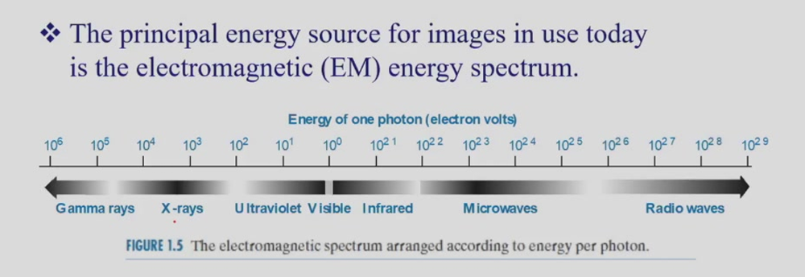

# Lecture 1

[TOC]

## 电磁波谱

## 图像

位图与矢量图差异： 

- 因为矢量图形是通过几何图形来描绘轮廓的，所以图像可以无限放大而依然能清晰显示。 
- 矢量图形不太适合用来生成具有丰富色调或过多色彩变化的图像，比如自然场景图像。 
- 位图通过像素来构成图像，适用于展示色彩丰富的图像。医学图像基本上都是位图形式。 
- 位图文件通常比矢量图形要大

> [!NOTE]+ "拓展笔记"
>
> 数字图像的存储格式：
>
> - BMP（未压缩格式） 每个像素位置都对应着图像中该像素的物理位置，而位图数据值则对应着相应像素的亮度值。 
> - TIFF（标签图像文件格式） 支持多种编码方式，包括未压缩的 RGB 编码、RLE 压缩和 JPEG 压缩等，具有可扩展性、便利性和可修改性。一张 TIFF 图像由三个数据结构组成，即文件头、一个或多个称为 IFD 的包含标记指针的目录以及数据本身。 
> - GIF（图形交换格式） 基于 LZW 算法的连续色调无损压缩格式，其压缩率通常约为 50%，常用于网络动画中。
> - JPEG / JPG (Joint Photographic Experts Group)  目前世界上应用最广泛的图像格式。它采用离散余弦变换 (DCT) 进行有损压缩。文件极小，非常适合存储包含数百万种颜色的数码照片。
> - PNG (Portable Network Graphics)  最初是为了替代 GIF 而开发的无损压缩格式（规避了当时 LZW 算法的专利问题）。优势： 支持 24 位真彩色，并且支持 Alpha 通道（透明度）。非常适合网页设计、Logo 和需要透明背景的素材。
> - WebP  由 Google 开发的现代图像格式，旨在替代 JPEG、PNG 和 GIF。同时支持有损和无损压缩，支持动画，支持透明度。在同等画质下，WebP 的文件体积通常比 JPEG 和 PNG 小 25% 到 34%。
> - RAW。数码相机的“数字底片”。它记录了图像传感器捕获的未经任何处理的原始数据。保留了最宽广的动态范围和色彩信息，为后期的白平衡、曝光调整提供了极大的空间。
>
> ---
>
> **BMP (Bitmap，未压缩位图)**
>
> - **特点：** 最基础的图像格式，通常不进行压缩（Uncompressed）。
> - **原理：** 文件中的数据点（像素）在内存中的排布与其在屏幕上的物理空间位置严格一一对应。每个像素的数据值直接记录了该位置的亮度值或色彩值（RGB）。
> - **优缺点：** 读取速度极快，不会丢失任何图像细节；但文件体积非常庞大，不适合网络传输。
>
> **TIFF (Tag Image File Format，标签图像文件格式)**
>
> - **特点：** 一种极其灵活、可扩展性强的格式，深受出版和印刷行业青睐。
> - **原理：** 它不仅仅是一种压缩格式，更像是一个“容器”。它支持多种编码方式，你可以选择不压缩（RGB uncompressed），也可以选择 RLE 压缩或 JPEG 压缩。
> - **结构：** TIFF 文件由三个核心数据结构组成：文件头（File Header）、包含标记指针的图像文件目录（IFDs, Image File Directories）以及图像数据本身。
>
> **GIF (Graphics Interchange Format，图形交换格式)**
>
> - **特点：** 早期互联网非常流行的格式，主要特色是支持多帧动画（网页动画）。
> - **原理：** 采用基于 **LZW 算法** 的无损压缩技术。虽然是无损压缩，但它的颜色深度最多只支持 8 位（即 256 种颜色），因此被称为“连续色调”的压缩。其平均压缩率约为 50%。
>
> **JPEG / JPG (Joint Photographic Experts Group)**
>
> - 目前世界上应用最广泛的图像格式。它采用离散余弦变换 (DCT) 进行有损压缩。
> - **优势：** 文件极小，非常适合存储包含数百万种颜色的数码照片。
>
> **PNG (Portable Network Graphics)**
>
> - 最初是为了替代 GIF 而开发的无损压缩格式（规避了当时 LZW 算法的专利问题）。
> - **优势：** 支持 24 位真彩色，并且支持 **Alpha 通道（透明度）**。非常适合网页设计、Logo 和需要透明背景的素材。
>
> **WebP**
>
> - 由 Google 开发的现代图像格式，旨在替代 JPEG、PNG 和 GIF。
> - **优势：** 同时支持有损和无损压缩，支持动画，支持透明度。在同等画质下，WebP 的文件体积通常比 JPEG 和 PNG 小 25% 到 34%。
>
> **RAW**
>
> - 数码相机的“数字底片”。它记录了图像传感器捕获的未经任何处理的原始数据。
> - **优势：** 保留了最宽广的动态范围和色彩信息，为后期的白平衡、曝光调整提供了极大的空间。
>
> 
>
> **无损压缩 (Lossless)：** 压缩后解压的图像与原图完全一致，没有任何数据丢失。**GIF、PNG、BMP** 属于此类。适合保存文字、图标、线条图等需要边缘清晰的图像。
>
> **有损压缩 (Lossy)：** 通过丢弃人眼不易察觉的细节数据来大幅减小文件体积。解压后的图像与原图存在微小差异。**JPEG、WebP (部分模式)** 属于此类。适合保存色彩丰富的照片。

医学图像的处理格式是DICOM

## 常见概念

