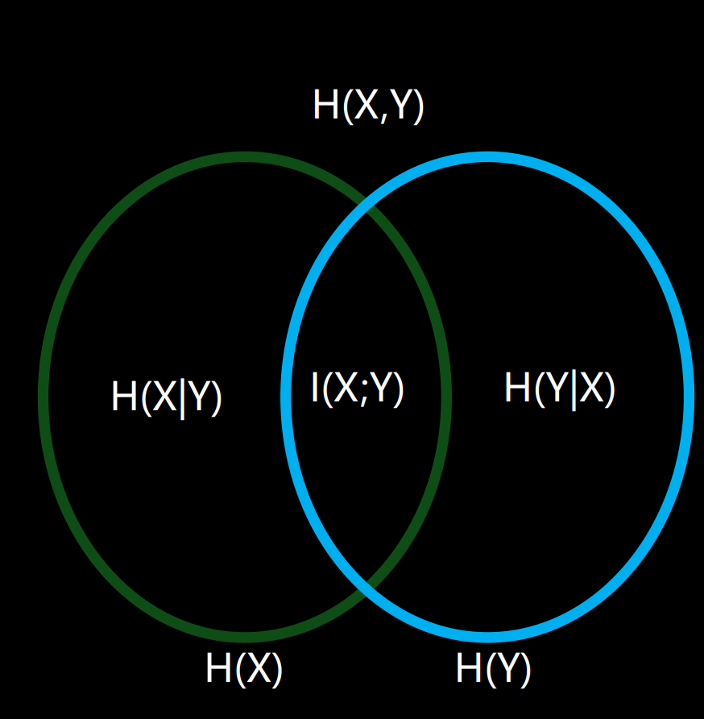

# Lecture12_13 Image Registration 复习笔记

## 本讲内容的整体逻辑

### 1. 本讲核心问题

本讲讨论的是 **医学图像配准（image registration）**。核心问题不是单独改善一幅图像的视觉质量，而是把两幅或多幅图像放到 **同一个空间坐标框架** 下，使同一解剖位置在不同时间、不同模态、不同个体之间能够对应起来。

在医学图像处理中，很多后续任务都建立在配准之上，例如：

- 同一患者不同时刻扫描结果的比较；
- CT、MRI、PET、fMRI 等不同模态之间的信息融合；
- 个体脑图像向标准模板空间的归一化；
- 群体统计分析、脑区比较、形变分析与纵向随访。

因此，配准解决的是“**哪里与哪里对应**”的问题。只有对应关系建立起来，后续的分割、测量、统计和功能定位才有可靠基础。

### 2. 本讲展开主线

本讲按“**先建立配准基本框架，再讨论核心模块，最后进入非线性配准与工具链**”的顺序展开。

1. 先说明什么是配准，以及为什么临床场景一定需要配准。这里建立的是任务定义：源图像、目标图像、空间变换、重采样和优化目标。
2. 然后给出配准流程，把问题拆成几个标准模块：变换模型、插值、相似性度量、优化器与输出结果。这样做的意义是把复杂问题模块化，明确每一步分别在解决什么。
3. 接着讨论线性配准。线性配准负责处理整体位置差异，例如平移、旋转、尺度变化和剪切，适合描述整体刚体运动或全局几何差异。
4. 再讨论相似性度量与优化。变换模型只规定“允许怎样动”，相似性度量决定“怎样算配得更好”，优化器则决定“怎样找到最优参数”。
5. 在线性框架之后，引入非线性配准。因为真实人体结构差异、组织变形和群体模板归一化往往无法只用刚体或仿射变换解释，必须引入局部形变场。
6. 最后落到微分同相、Jacobian、空间归一化和常用软件工具。这一部分把配准从算法概念推进到计算解剖学和实际 neuroimaging workflow。

### 3. 各主章节在宏观上的作用

- **Linear registration**：建立配准的基础框架，解决全局空间对齐问题。
- **Transform**：规定图像允许怎样几何变化，是配准模型本身。
- **Interpolation**：解决变换后目标坐标通常不落在整数像素点上的问题，是重采样的基础。
- **Metric**：定义“配准得好不好”，决定优化目标。
- **Optimizer**：负责在参数空间中搜索最佳解，把“定义好的目标”真正算出来。
- **Non-linear registration**：引入局部连续形变，用于更精细的组织对应与模板归一化。
- **Diffeomorphic transformation / Jacobian**：保证形变场平滑、可逆、保持拓扑，并进一步定量分析局部体积变化。
- **Toolbox and pipeline**：说明实际工作中如何把上述模块组合成完整处理流程。

### 4. 学习时应如何把握本讲

复习本讲时，应优先抓住四条主线：

- 配准的本质是“建立对应关系”，不是单纯让两张图看起来相似。
- 配准由“变换模型 + 重采样 + 相似性度量 + 优化”四个核心环节组成。
- 线性配准解决全局差异，非线性配准解决局部形变。
- Jacobian 和模板空间是把配准结果用于群体分析与计算解剖学的关键接口。

最容易混淆的地方包括：

- **registration** 与 **resampling**：前者是求变换参数，后者是按变换生成新图像；
- **刚体 / 仿射 / 投影 / 非线性**：自由度逐步增加，表达能力和过拟合风险也逐步增加；
- **插值方法** 与 **相似性度量**：插值用于赋值，度量用于评价；
- **intra-modality** 与 **inter-modality**：前者更适合 SSD、CC 等，后者通常依赖 MI/NMI；
- **形变场** 与 **Jacobian**：前者描述“怎么变”，后者描述“变后局部体积如何变化”。

---

## Linear Registration（线性配准）

### Registration Basic（配准基础）

图像配准可以定义为：寻找一个空间变换，把源图像中的点映射到目标图像中的对应点。若源图像为 moving / source，目标图像为 fixed / target，则配准的目标是寻找参数 $p$，使变换

$$
x' = f(x; p)
$$

能够尽可能正确地建立对应关系。

配准任务至少包含两个层面：

- **Registration**：优化参数，确定变换；
- **Transformation / Resampling**：在确定参数后，把源图像真正变换到目标空间。

从信息来源看，配准方法可分为三类：

- **Point-based methods**：基于对应特征点或 landmark；
- **Surface-based methods**：基于轮廓、皮层表面、网格或边界；
- **Intensity-based methods**：直接利用体素强度分布进行匹配。

三类方法的差别在于“对应关系”的定义方式不同。点法依赖少量明确地标，表面法依赖结构边界，强度法则不需要显式提取对应点，更适合自动化流程。

### Registration Pipeline（配准流程）

标准配准流程可概括为：

1. 选择 fixed image 和 moving image；
2. 指定变换模型；
3. 用当前参数将 moving image 映射到 fixed space；
4. 通过插值完成重采样；
5. 计算相似性度量或代价函数；
6. 用优化器更新参数；
7. 迭代直到收敛并输出配准结果。

这说明配准不是单一步骤，而是一个闭环优化过程：

$$
\text{Image} \rightarrow \text{Transform} \rightarrow \text{Resampling} \rightarrow \text{Metric} \rightarrow \text{Optimizer}
$$

配准失败通常也可以从这几个环节定位原因，例如：

- 变换模型太弱，无法表达真实差异；
- 插值过粗，重采样误差大；
- 度量与模态不匹配；
- 优化陷入局部最优；
- 初始化过差，导致搜索起点错误。

### Transform（变换模型）

#### 1. 2D / 3D 刚体变换

刚体变换只允许 **平移和旋转**，不改变长度、角度和形状。2D 刚体一般有 3 个自由度，3D 刚体一般有 6 个自由度：

- 3 个平移：沿 $x,y,z$ 方向；
- 3 个旋转：绕 $x,y,z$ 轴。

3D 刚体常写为：

$$
x' = Rx + t
$$

其中 $R$ 为旋转矩阵，$t$ 为平移向量。

它适用于同一对象仅发生整体运动的情形，例如头动校正、同一受试者短时间内的结构像对齐。需要注意，**旋转顺序会影响最终结果**，因此参数化方式和实现细节不能忽略。

#### 2. 仿射变换

仿射变换在刚体基础上进一步允许：

- 各向同性或各向异性缩放；
- 剪切（shearing）。

因此仿射变换既能表示刚体运动，也能表示整体尺度和形状的线性变化。它的一般形式为：

$$
x' = Ax + t
$$

其中 $A$ 是线性变换矩阵。

仿射变换的意义在于：它比刚体更灵活，适用于不同个体、不同扫描协议、不同视野下的整体对齐。但它仍然只能描述 **全局线性差异**，不能表达局部形变。

#### 3. 投影与更一般的线性映射

课件还提到 projective transform。它允许更一般的射影关系，直线仍映射为直线，但平行关系、比例关系不一定保持。医学图像常规配准中最核心的仍是刚体和仿射，投影变换更多出现在视觉几何或特殊成像模型中。

#### 4. 非线性形变场的引出

当线性变换不足以描述图像差异时，就要引入形变场。若位移场为 $u(x)$，则非线性变换可写为：

$$
\phi(x) = x + u(x)
$$

这里 $u(x)$ 是随空间位置变化的局部位移向量。线性配准可以看成所有点共享同一组有限参数，而非线性配准则允许不同位置有不同位移。

### Interpolation（插值与重采样）

#### 1. 为什么必须插值

图像变换后，目标空间中的坐标一般不是整数格点，而数字图像只在离散像素/体素上有定义，因此必须通过插值为这些非整数位置赋值。

插值本质上是：根据邻域已知离散样本，估计连续空间中的函数值。它是旋转、缩放、配准和归一化都离不开的基础步骤。

#### 2. 常见插值方法

- **Nearest neighbor**：直接取最近邻像素。速度最快，但块状感明显，适合标签图像，不适合连续强度图像。
- **Bilinear / Trilinear**：利用局部线性加权，结果更平滑，是很多配准流程中的基础选择。
- **Bicubic**：利用更大邻域和三次多项式，平滑性更好，但计算量更高。

对二维双线性插值，若周围四个点强度分别为 $f_{11},f_{21},f_{12},f_{22}$，则可以写成

$$
f(x, y) = axy + bx + cy + d
$$

也可以理解为先沿一个方向做一次线性插值，再沿另一个方向再插一次。

#### 3. 插值方法的使用原则

- 连续灰度图像通常用线性或更高阶插值；
- 分割标签图像通常用最近邻插值，避免类别混合；
- 插值越平滑，越可能削弱边缘与细节；
- 插值越粗糙，越可能引入块状伪影和度量误差。

复习时必须明确：**插值不是配准度量本身，但会影响度量值和优化稳定性**。尤其 mutual information 这类基于直方图的度量，对插值方式比较敏感，因为插值可能创造新的灰度符号。

### Metric（相似性度量）

相似性度量决定“什么叫配得更好”。它必须与图像关系模型匹配。

#### 1. Intra-modality 与 Inter-modality

相似性度量有以下两种情况：

- **Intra-modality**：同一模态，例如 MRI-MRI。强度关系更稳定，适合 SSD、CC 等。
- **Inter-modality**：不同模态，例如 CT-MRI、MR-PET。强度不再是一一线性对应，通常需要信息论度量，例如 MI。

#### 2. SSD / MSE

平方强度差的基本形式为：

$$
\text{SSD} = \sum_{x \in \Omega} (I(x)-J(x))^2
$$

其核心假设是：两幅图像本质上相同，只存在高斯噪声或小扰动。因此它适合同一对象、同一模态、成像条件变化不大的情况。

优点是简单、计算快；缺点是对噪声、强度缩放和伪影较敏感。一旦亮度关系明显偏离“几乎相同”这一前提，SSD 就不再可靠。

#### 3. RIU 与 CC

- 比值图像均匀性 **RIU** 适合存在整体增益差异的同模态图像。
- **Correlation Coefficient, CC** 适合两幅图像强度近似线性相关的情况。

CC 可以理解为“去均值、归一化后的线性相关程度”。它适合同模态但亮度或对比度略有变化的场景，比 SSD 更稳健。

#### 4. 信息、熵与互信息

> [!NOTE]- 信息熵
> $$
> \text{低概率 (Low probability)} \longrightarrow \text{小概率事件 (Unlikely)} \longrightarrow \text{高惊奇度 (More surprise)} \longrightarrow \text{高信息量 (More information)}
> $$

> [!TIP]
>
> Core concepts：
>
> - 信息量；熵；
> - 联合熵；条件熵；相对熵；
> - 互信息

对事件 $x$，<u>信息量</u>定义为：
$$
I(x) = -\log p(x)
$$

概率越低，信息量越大。随机变量 $X$ 的<u>熵</u>（Entropy）为信息的期望值：

$$
H(X) = -\sum_x p(x)\log p(x)
$$

熵描述的是平均不确定性。

- 基底为 2 时 (log2)：存储该数据所需的 **最小比特数** (Minimum bits to store the data)。

> [!TIP]
>
> - **信息量（Self-information）**
>
>     $I(x)=−log⁡P(x)I(x)=-\log P(x)I(x)=−logP(x)$
>
>     衡量某个具体事件发生时带来的“惊讶程度”。
>
> - **熵（Entropy）**
>
>     $H(X)=−∑p_i \log(⁡p_iH(X))=-\sum p_i \log(p_iH(X))=−∑p_i \log pi$, 是信息量的期望值，衡量一个随机源的平均不确定性。
>
>     > 信息量关注：“<u>这件事</u>发生有多意外？”，信息量没法说“不确定性”，因为针对的是一件事情。
>     >
>     > - 简单的理解：信息量是单次的惊讶程度，也是单次的不确定性；而熵则是这类事情的。
>
>     > 熵关注：“在<u>这种事情</u>发生之前，我平均有多不确定？”，熵可以说不确定性，因为针对的是一类事情。
>
> - 从直觉上说：
>
> > **信息量是单次开奖带来的惊喜程度；熵是开奖前整个彩票系统的不确定程度。**

关系维恩图：展示了联合熵 $H(X,Y)$、条件熵 $H(X|Y)$、条件熵 $H(Y|X)$、互信息 $I(X;Y)$ 以及独立熵 $H(X)$ 和 $H(Y)$ 之间的重叠区域关系。

- 联合熵 $H(X,Y)$ 描述两个变量共同的不确定性，条件熵 $H(X|Y)$ 描述已知 $Y$ 后 $X$ 还剩多少不确定性。

    展开式：
    $$
    H(Y|X) = -\sum p(x)H(Y|X = x) = -\sum_{x, y} p(x, y) \log p(y|x)=-\sum_{x, y} p(x, y) [\log p(x, y) - \log p(x)]
    $$
    

<u>互信息</u>定义为：
$$
I(X; Y)= H(X)+H(Y)-H(X, Y)
$$

也可写成/理解成联合分布 $p(x,y)$ 与边缘分布乘积 $p(x)p(y)$ 之间的相对熵。其含义是：已知一个变量后，另一个变量的不确定性减少了多少；包含在 $Y$ 中的关于 $X$ 的信息量。

> [!SUCCESS]
>
> 1. 概念辨析
>
>     条件熵：$H(X|Y)$ 已知 $Y$ 的情况下， $X$ 还剩多少不确定性。
>
>     互信息：$I(X;Y)$ 通过了解 $Y$，我们能为 $X$ 消除多少不确定性。
>
> 2. **概率的维恩图** 和 **信息熵的维恩图**，逻辑是 **完全相反** 的！
>
>     在概率的维恩图里，面积代表“概率”；信息论的维恩图，面积代表“不确定性”（混乱度）。

**相对熵 / KL Divergence**

相对熵又称 Kullback-Leibler divergence，常记为 $D_{KL}(p\|q)$。它用于衡量两个概率分布之间的差异：真实分布为 $p(x)$，估计分布或模型分布为 $q(x)$ 时，KL 散度定义为：

$$
D_{KL}(p\|q)=\sum_x p(x)\log\frac{p(x)}{q(x)}
$$

连续情形下可写为：

$$
D_{KL}(p\|q)=\int p(x)\log\frac{p(x)}{q(x)}dx
$$

它的含义是：如果真实数据服从 $p$，但用 $q$ 去编码或建模，会比直接使用真实分布 $p$ 多付出多少信息代价。因此 KL 散度不是普通欧氏距离，它有两个重要性质：

- $D_{KL}(p\|q)\geq 0$，当且仅当 $p=q$ 时为 0；
- 一般情况下 $D_{KL}(p\|q)\neq D_{KL}(q\|p)$，所以它不是对称距离。

例如，设真实分布和估计分布分别为：

$$
p =(0.5,0.4,0.1),\quad q =(0.4,0.5,0.1)
$$

则：

$$
D_{KL}(p\|q)
= 0.5\log\frac{0.5}{0.4}+0.4\log\frac{0.4}{0.5}+0.1\log\frac{0.1}{0.1}
$$

第三项为 0，因为 $\log 1=0$。若使用以 2 为底的对数，则可近似得到：

$$
D_{KL}(p\|q)\approx 0.5\log_2(1.25)+0.4\log_2(0.8)\approx 0.029\ \text{bits}
$$

这个数值较小，说明 $q$ 与 $p$ 比较接近。若 $q$ 在 $p$ 概率较大的位置给出很小概率，则 KL 会显著增大；如果 $p(x)>0$ 但 $q(x)=0$，KL 会趋于无穷大，表示模型完全无法解释真实会发生的事件。

互信息也可以用相对熵来解释：

$$
I(X; Y)= D_{KL}(p(x, y)\|p(x)p(y))
$$

这说明互信息衡量的是联合分布 $p(x,y)$ 与独立假设分布 $p(x)p(y)$ 之间的差异。若 $X$ 与 $Y$ 独立，则 $p(x,y)=p(x)p(y)$，互信息为 0；若二者依赖关系越强，联合分布与独立分布差异越大，互信息越大。

互信息 $I(X;Y)$ 具有以下重要性质：

1. **对称性**：

$$
I(X; Y)= I(Y; X)
$$

这说明从 $X$ 中获得的关于 $Y$ 的信息量，等于从 $Y$ 中获得的关于 $X$ 的信息量。

2. **非负性**：

$$
I(X; Y)\geq 0
$$

当且仅当 $X$ 与 $Y$ 相互独立时，$I(X;Y)=0$。在图像配准中，如果两幅图像完全没有统计依赖，互信息就很低。

3. **与熵的关系**：

$$
I(X; Y)= H(X)-H(X|Y)= H(Y)-H(Y|X)
$$

这说明互信息可以理解为：已知 $Y$ 后，$X$ 的不确定性减少了多少；也可以理解为已知 $X$ 后，$Y$ 的不确定性减少了多少。

4. **上界关系**：

$$
I(X; Y)\leq \min\{H(X), H(Y)\}
$$

互信息不能超过任一变量自身所包含的信息量。若 $Y$ 完全由 $X$ 决定，互信息可以达到 $H(Y)$；若二者只部分相关，互信息只占各自熵的一部分。

5. **对一一灰度变换不敏感**：

若 $F$ 是一一映射，则：

$$
I(X; F(X))= I(X; X)
$$

这说明互信息不依赖两幅图像灰度值是否数值相等，而更关注统计对应关系。这个性质正是 MI 能用于多模态配准的重要原因。

在配准问题中，互信息越大，通常表示两幅图像之间的统计依赖越强。但互信息本身不提供空间方向信息，仍然需要结合变换模型、插值和优化器来寻找最佳空间对应。

**Cross Entropy（交叉熵）**

交叉熵用于衡量：当真实分布是 $p(x)$，但使用估计分布 $q(x)$ 进行编码或预测时，平均需要付出的信息代价。它定义为：

$$
H(p, q)=-\sum_x p(x)\log q(x)
$$

其中，$p(x)$ 是真实分布，$q(x)$ 是模型给出的估计分布。注意，交叉熵的期望权重来自真实分布 $p$，而对数项使用的是估计分布 $q$。

交叉熵可以由熵和 KL 散度分解得到：

$$
D_{KL}(p\|q)=\sum_x p(x)\log\frac{p(x)}{q(x)}
$$

展开可得：

$$
D_{KL}(p\|q)=\sum_x p(x)\log p(x)-\sum_x p(x)\log q(x)
$$

由于：

$$
H(p)=-\sum_x p(x)\log p(x)
$$

且：

$$
H(p, q)=-\sum_x p(x)\log q(x)
$$

所以有：

$$
H(p, q)= H(p)+D_{KL}(p\|q)
$$

这个分解非常重要：交叉熵由两部分组成，一部分是真实分布自身不可避免的不确定性 $H(p)$，另一部分是估计分布 $q$ 与真实分布 $p$ 不一致带来的额外代价 $D_{KL}(p\|q)$。

因此，交叉熵的组成架构可以理解为：

$$
\text{Cross Entropy}=\text{True Entropy}+\text{Divergence from }q\text{ to }p
$$

也就是：

$$
H(p, q)= H(p)+D_{KL}(p\|q)
$$

在分类问题中，若真实类别分布 $p$ 是 one-hot，交叉熵会退化为对正确类别预测概率的负对数。例如二分类中，真实标签为 dog，即 $p(1)=1,p(0)=0$，模型预测 $q(1)=0.9$ 时：

$$
CE =-0\cdot \log(1-0.9)-1\cdot \log(0.9)
$$

预测正确类别概率越高，交叉熵越小；预测正确类别概率越低，交叉熵越大。若真实分布不是 one-hot，而是 $p(0)=0.5,p(1)=0.5$，则模型过度偏向任一类别都会带来较高交叉熵，因为它偏离了真实的不确定性结构。

交叉熵和配准中的相似性度量关系在于：它们都把图像或标签关系转化为概率分布之间的差异。互信息更强调两幅图像之间的统计依赖；交叉熵更强调模型分布 $q$ 对真实分布 $p$ 的解释代价。

#### 5. 为什么 MI 适合多模态配准

多模态图像之间往往不存在简单的灰度线性关系，但它们在正确对齐时，联合直方图会更集中，联合熵降低，互信息升高。因此：

- 正确配准时，$H(X,Y)$ 倾向减小；
- 正确配准时，$MI(X;Y)$ 倾向增大。

这就是 MI 能同时适用于 CT-MRI、MR-PET 等多模态配准的原因。它不要求两模态灰度值相同，只要求它们具有稳定统计依赖。

#### 6. 度量之间的区别/ Inter-modality & Intra-modality

**模态间配准 (Inter-modal registration)**：

- 匹配来自 **相同受试者但不同模态/相机** 的图像 (Match images from same subject but different modalities / cameras)
- 用于单人激活区的 **解剖定位** (Anatomical localisation of single subject activations)
- 利用解剖图像（如结构脑 MR）实现功能图像（如 fMRI、PET）更精确的空间归一化。可使用 PIU 度量。

**模态内配准 (Intra-modal registration)**：

- 来自同一模态/相机的不同受试者 (Different subjects from the same modality / camera)
- 用于 **空间 归一化 (Spatial normalization)**
- 包含：仿射配准 (Affine) 和非线性配准 (Non-linear)
- 需要使用 **模板图像 (Template Images)**。

**💚PIU（Partitioned Intensity Uniformity，分区强度均匀性）**

PIU 是一种主要用于 **跨模态配准** 的相似性度量，典型场景是 MR-PET 配准。它的基本假设是：在 MR 图像中具有相同灰度值的一组像素，通常可以近似看成同一类组织；如果 PET 图像已经与 MR 图像正确对齐，那么这些 MR 同灰度分区所对应的 PET 像素值也应该在各自分区内相对均匀。

因此，PIU 并不要求 MR 与 PET 的灰度值一一相等，而是利用一种更弱的组织一致性假设：**同一 MR 强度分区对应的另一模态强度分布应尽量集中**。这使它比 SSD 更适合多模态场景。

设参考模态图像为 $A$，待配准模态图像为 $B$。对 $A$ 中某个灰度值或灰度区间 $a$，定义对应像素集合为：

$$
\Omega_a = \{x\mid A(x)= a\}
$$

在该集合中，取 $B$ 的对应强度值 $B(x)$，计算分区内均值与方差：

$$
\mu_a =\frac{1}{|\Omega_a|}\sum_{x\in\Omega_a}B(x)
$$

$$
\sigma_a^2 =\frac{1}{|\Omega_a|}\sum_{x\in\Omega_a}(B(x)-\mu_a)^2
$$

PIU 的思想可以概括为最小化所有分区内的强度离散程度，常见形式可写成加权分区方差和：

$$
PIU = \sum_a |\Omega_a|\sigma_a^2
$$

也可以使用归一化形式，使不同分区之间更可比较：

$$
PIU_{norm}=\sum_a |\Omega_a|\frac{\sigma_a}{\mu_a}
$$

其中，$|\Omega_a|$ 表示该强度分区内的像素数。正确配准时，同一 MR 强度分区对应的 PET 强度应该更均匀，因此分区内方差或标准差应更小，PIU 值也应更低。

PIU 的主要性质可以总结为：

- 它适合 inter-modal registration，尤其适合 MR-PET 这类不同模态但组织对应关系稳定的图像。
- 它不要求两幅图像灰度值相同，只要求参考模态中同类组织在另一模态中具有较稳定的响应。
- 它依赖参考图像的强度分区质量，如果参考图像中同一灰度并不代表同一组织，PIU 的假设会变弱。
- 它本质上利用的是条件分布的集中程度，因此和互信息一样，都比 SSD 更适合跨模态问题，但表达角度不同。

复习时可以把 PIU 理解为：先按 MR 强度把像素分组，再看每一组在 PET 中是否足够均匀。若配准正确，同一组对应的 PET 值应更集中；若配准错误，同一组会混入不同组织，PET 值离散程度增大。

| 度量 | 主要适用场景 | 核心假设 | 特点 |
| --- | --- | --- | --- |
| SSD / MSE | 同模态 | 差异近似为噪声 | 简单快速，但不稳健 |
| RIU | 同模态且有增益差异 | 比值稳定 | 适合强度整体缩放 |
| CC | 同模态且近似线性关系 | 线性相关 | 比 SSD 更抗亮度变化 |
| MI | 多模态或一般场景 | 统计依赖稳定 | 适用广，但计算更复杂 |

### Optimizer（优化器）

#### 1. 优化的本质

配准通常没有闭式解，因此必须通过迭代搜索最优参数。优化器面对的是一个代价函数或相似性函数，它在参数空间中往往存在多个局部极值，而我们真正想要的是全局最优或足够好的可用解。

#### 2. 常见优化思路

图像配准问题 **不存在闭式解/解析解 (Closed form solution does not exist)**。代价函数必须 **通过迭代进行最小化**（可以通过暴力搜索，或更智能的优化算法）。优化通常需要计算 **导数（或梯度） (derivative / gradient computation)**。

- 常见算法包括：一维搜索 (One-dimensional search)、共轭梯度法 (Conjugate Gradient)、变尺度法 (Variable metric)、gradient descent。

其中梯度下降最容易理解。若目标函数为 $C(F,M;p)$，则更新可写为：

$$
p_{k+1}= p_k-\alpha \nabla C(F, M; p_k)
$$

其中 $\alpha$ 为步长。

#### 不同场景下的目标函数选择 (Similarity Index / Object function)

- **模态内配准 (Intra-modal)**：
    - 均方差 (Mean squared difference) $\rightarrow$ 最小化
    - 归一化互相关 (Normalised cross correlation) $\rightarrow$ 最大化
    - 差异熵 (Entropy of difference) $\rightarrow$ 最小化
- **模态间（或模态内）配准 (Inter-modal)**：
    - 互信息 (Mutual information) $\rightarrow$ 最大化
    - 归一化互信息 (Normalised mutual information) $\rightarrow$ 最大化

#### 3. 数值梯度与直接梯度

若无法直接推导梯度，可以用数值差分近似：

$$
\frac{\partial C}{\partial p_i}\approx \frac{C(p_1,\dots, p_i+\Delta p_i,\dots, p_n)-C(p)}{\Delta p_i}
$$

数值梯度实现简单，但会受到步长选择影响；若能直接从代价函数推导解析梯度，通常更稳定、更高效。

#### 4. 局部最优与多分辨率

配准优化最常见的问题不是“不会收敛”，而是“收敛到错误位置”。因此必须警惕：

- 初始化太差；
- 参数空间过大；
- 度量表面过于粗糙；
- 局部极值过多。

解决思路包括：

- 多初始点（multi-start）；
- 先做刚体，再做仿射，再做非线性；
- 多分辨率策略：先在低分辨率粗配准，再逐步细化。

多分辨率的意义非常关键。低分辨率阶段先对齐大尺度结构，减少局部极值；高分辨率阶段再补细节，这几乎是现代配准流程的标准做法。

#### 5. 结果评估

配准结果的评估方式包括：

- **金标准 (Gold standard)** 可用时：通常衍生自模拟数据 (simulated data) 或物理基准标记物 (fiducial markers)。
- 可以使用用户手动选择的地标 (Landmarks) 或手动勾画的解剖结构来验证配准结果。
- **视觉评估方法 (Visual assessment)**：图像叠加 (overlays)、棋盘格交错模式 (checkerboard patterns)、平均图像 (average images)。

需要注意：**代价函数更优不一定等价于解剖对应一定正确**。所以视觉评估和解剖先验仍然很重要。

### 小结

线性配准解决的是全局空间对齐问题。它由变换模型、插值、度量和优化共同组成。真正理解线性配准，不是背几个变换矩阵，而是明确：

- 变换决定“允许怎样动”；
- 插值决定“怎么给新坐标赋值”；
- 度量决定“怎样算对齐得更好”；
- 优化决定“如何找到那组最优参数”。

---

## Non-linear Registration（非线性配准）

### Diffeomorphic Transformation（微分同相形变）

#### 1. 为什么需要非线性配准

当任务从“同一受试者的姿态校正”扩展到“不同个体脑结构对齐”时，仅靠刚体或仿射已经不够。因为不同个体之间存在：局部解剖差异；脑沟脑回位置变化；组织体积增减；病灶引起的局部变形。这时必须使用形变场描述局部位移，即让不同位置有不同变换。

#### 2. 形变场表示

非线性变换通常写作：

$$
\phi(x) = x + u(x)
$$

其中 $u(x)$ 为位移场。它描述了每个体素从原位置移动到新位置的偏移量。

#### 3. 微分同相的意义

微分同相要求变换满足：

- 一一对应；
- 可逆；
- 正变换与逆变换都可微；
- 形变平滑；
- 保持拓扑结构，不出现撕裂、折叠和穿插。

这使它特别适合计算解剖学。因为医学图像配准不仅要“配上”，还要保证变换本身具有合理生物学意义。

#### 4. 微分同相为什么比一般非线性更重要

普通非线性配准若自由度过高，可能产生不合理折叠。微分同相通过把大形变视为多个小形变的连续复合，既允许复杂配准，又尽量保持解剖结构连续性。因此它是现代脑模板归一化和群体形态学分析中的核心思想。

### Demons 与 LDDMM

#### 1. Demons

Demons 是经典的非参数可变形配准方法。它通过图像强度差和梯度反复更新位移场，把一幅图像逐步“推”向另一幅图像。

它的直观理解类似光流：若两幅图像存在小位移，就可利用强度梯度估计应该沿哪个方向移动，才能减少差异。

优点是：

- 思路直观；
- 实现相对简单；
- 对局部形变有较强表达能力。

局限是：

- 对初始化较敏感；
- 需要平滑正则化；
- 若不加拓扑约束，可能产生不合理形变。

#### 2. Diffeomorphic Demons

在 Demons 基础上加入微分同相约束，可以在保持 Demons 迭代思想的同时，使更新更接近可逆、平滑的形变模型。其核心目标不是简单求一个位移场，而是求一个更合理的变换群元素。

#### 3. LDDMM

LDDMM（Large Deformation Diffeomorphic Metric Mapping）是大形变微分同相映射框架。它把配准问题写成对一系列时间变化速度场的优化，通过 geodesic flow 生成平滑、可逆的大形变。

它的特征是：

- 理论框架完整；适合大形变；适合计算解剖学和群体差异分析；计算代价通常较高。

复习时不必陷入推导细节，但必须明白：LDDMM 不是普通插值式形变，而是从“变换群上的最短路径 / 最小能量演化”视角构造配准。

### Jacobian Matrix（Jacobian 矩阵与体积变化）

#### 1. Jacobian 的定义

设三维变换为 $\phi(x)=(\phi_1(x),\phi_2(x),\phi_3(x))$，则 Jacobian 矩阵是：

$$
J_\phi(x)=
\begin{bmatrix}
\displaystyle \frac{\partial \phi_1}{\partial x} & \displaystyle \frac{\partial \phi_1}{\partial y} & \displaystyle \frac{\partial \phi_1}{\partial z}\\
\displaystyle \frac{\partial \phi_2}{\partial x} & \displaystyle \frac{\partial \phi_2}{\partial y} & \displaystyle \frac{\partial \phi_2}{\partial z}\\
\displaystyle \frac{\partial \phi_3}{\partial x} & \displaystyle \frac{\partial \phi_3}{\partial y} & \displaystyle \frac{\partial \phi_3}{\partial z}
\end{bmatrix}
$$

它描述的是局部线性近似下，邻域如何被拉伸、压缩和剪切。

#### 2. Jacobian determinant 的含义

Jacobian 行列式, 记作 $|J(x)|$

$$
\det(J_\phi(x))
$$

衡量的是该点附近 **无穷小体积元素的变化倍数**：

-  $|J(x)|>1$：局部膨胀；
- $=1$：局部体积保持不变；
- $<1$：局部收缩。

因此 Jacobian 不是单纯的数学附属量，而是把形变场转换为局部形态变化指标的重要工具。

#### 3. 在医学图像中的作用

Jacobian 常用于：

- **Tensor-based morphometry, TBM**；
- 群体比较中的局部体积增减分析；
- 疾病相关脑结构变化研究；
- 发育、衰老和纵向随访中的形态学变化定量。

实践中常对 Jacobian determinant 取对数，以便把膨胀和收缩放在更对称的数值范围内分析。

### 小结

非线性配准解决的是线性模型无法解释的局部形变问题。微分同相强调平滑、可逆和拓扑保持，使非线性配准不仅能“对齐”，还能产生具有形态学意义的变换。Jacobian 则把这种形变进一步量化为局部体积变化，是配准结果进入统计分析的关键桥梁。

---

## Toolbox and Pipeline（工具链与实际流程）

### Spatial Normalization（空间归一化）

空间归一化是配准的重要应用：把个体图像映射到标准模板空间，以便跨个体比较。其核心用途包括：

- voxel-wise 群体统计分析；
- 组织分割与脑区标注；
- 解剖图谱构建；
- 功能连接分析中的标准化种子选择。

常见模板包括：

- **MNI305**；
- **Collin27**；
- **MNI152 linear / nonlinear**；
- **MNI152NLin6Asym**；
- **MNI152NLin2009cAsym**；
- **fsaverage**。

需要明确：模板不是“更真实的某一张脑图”，而是一个 **统一参照空间**。配准到模板空间的价值在于建立群体可比较性。

### 常见软件工具

#### 1. SPM / DARTEL

SPM 是经典神经影像处理平台，覆盖配准、分割、fMRI 统计等。DARTEL 是其代表性的微分同相配准模块，适合高质量结构像归一化。

#### 2. FSL

FSL 提供：

- **FLIRT**：线性配准；
- **FNIRT**：非线性配准。

它广泛用于结构像、功能像和弥散数据处理，是标准 neuroimaging workflow 的常见组成部分。

#### 3. FreeSurfer / FastSurfer

FreeSurfer 不仅做体积配准，还强调皮层表面重建与表面配准，特别适合大脑皮层形态学分析。其 CVS 等流程把体积信息与表面信息结合起来，适合精细脑结构研究。

#### 4. ANTs

ANTs 提供从 rigid、affine 到 SyN 等多种高级非线性配准方法，是现代高质量模板构建和跨个体配准中非常常用的工具。它的特点是算法强、可配置性高、群体形态学研究中表现突出。

### 实际使用时的流程理解

真实工作流通常不是“一次配准直接完成”，而是分层推进：

1. 先做预处理，例如 skull stripping、bias correction；
2. 做刚体或仿射粗对齐；
3. 根据任务选择合适度量；
4. 需要时进行非线性归一化；
5. 检查 overlay、checkerboard、边界吻合情况；
6. 再将变换用于分割传播、统计分析或形态学定量。

这说明配准是一种 **基础设施型步骤**。它本身往往不是最终目标，但几乎决定后续分析能否成立。

---

## 复习总结

### 1. 本课核心知识点清单

- 图像配准的定义：通过空间变换建立不同图像之间的对应关系；
- 配准流程：变换模型、重采样、相似性度量、优化器；
- 刚体、仿射和非线性形变场的区别；
- 最近邻、线性、双三次插值的适用场景；
- SSD、RIU、PIU、CC、MI 等度量的假设与使用条件；
- PIU、KL 散度、交叉熵与互信息的定义、公式和区别；
- 梯度下降、多分辨率和局部最优问题；
- 微分同相形变的意义；
- Jacobian determinant 与局部体积变化；
- 模板空间与空间归一化；
- SPM、FSL、FreeSurfer、ANTs 等工具链。

### 2. 必须会区分的概念

- **配准** vs **重采样**：配准求参数，重采样生成结果图像。
- **刚体** vs **仿射**：前者只平移旋转，后者还允许缩放和剪切。
- **线性配准** vs **非线性配准**：前者处理全局差异，后者处理局部形变。
- **同模态度量** vs **多模态度量**：前者常用 SSD/CC，后者常用 MI。
- **位移场** vs **Jacobian**：前者给出位移，后者描述局部体积变化。
- **一般非线性** vs **微分同相**：后者额外要求平滑、可逆、拓扑保持。

### 3. 必须理解的关键方法 / 公式 / 模型

- 刚体变换：

$$
x' = Rx + t
$$

- 仿射变换：

$$
x' = Ax + t
$$

- 非线性形变场：

$$
\phi(x)= x+u(x)
$$

- SSD：

$$
\text{SSD} = \sum_{x \in \Omega} (I(x)-J(x))^2
$$

- 熵：

$$
H(X)=-\sum_x p(x)\log p(x)
$$

- 互信息：

$$
MI(X; Y)= H(X)+H(Y)-H(X, Y)
$$

- 交叉熵：

$$
H(p, q)=-\sum_x p(x)\log q(x)= H(p)+D_{KL}(p\|q)
$$

- 梯度下降更新：

$$
p_{k+1}= p_k-\alpha \nabla C(F, M; p_k)
$$

### 4. 容易出错或容易混淆的点

- 不要把“看起来叠得像”误认为“解剖对应就一定正确”。
- 不要把最近邻插值随便用于连续灰度图像。
- 不要在多模态配准中机械使用 SSD。
- 不要忽略初始化和多分辨率策略，它们经常决定最终是否成功。
- 不要把 Jacobian determinant 仅理解为数学技巧，它直接对应局部膨胀与收缩。
- 不要把模板空间当作某个个体的真实解剖，而要把它理解为群体比较的统一坐标系统。

### 5. 面向复习的整体总结

本讲的关键不是记住多少软件命令，而是建立一套完整的配准思维：先明确要对齐什么对象，再选择足够但不过度的变换模型，用合适的插值和相似性度量定义目标，再通过优化求得变换；当全局线性关系不够时，再引入非线性形变场、微分同相约束和 Jacobian 分析。对医学图像处理而言，配准既是多模态融合和空间归一化的基础，也是后续分割、统计分析与计算解剖学研究的前提。
