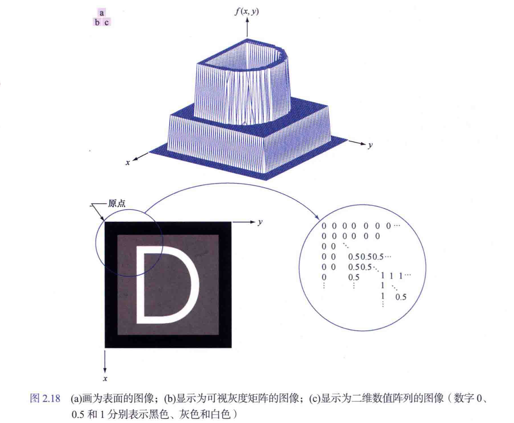

# Lecture2

[TOC]

## 基本概念

物理信号 → 连续电压 → 数字化：抽样 + 量化

**取样和量化的概念**：要将函数数字化，就要对该函数的坐标和幅度进行取样。对坐标值进行数字化称为取样（或采样），对幅度值进行数字化称为量化。数字图像的质量很大程度上取决于取样和量化中所用的样本数和离散灰度级。

数字他图像的表现形式主要有三种：

其中，对于第三种用矩阵表示的形式，矩阵中的每个元素称为<u>图像单元、图像元素或像素</u>

### 采样(Sampling)

原点的位置一般会给出，有时候是默认（python 一般是左上角，matlab 一般是左下角）坐标依旧满足笛卡尔右手坐标系

- 连续图像 -> 数字图像：空间采样 + 信号采样
- 物理分辨率与矩阵尺寸。分辨率降低，图像细节会丢失

图像网格化，空间数字化。

### 量化(Quantization)

图像强度 -> 矩阵值

图像范围 -> K。  离散灰度级数 $ L = 2^{K}$。K 叫灰阶数

灰度跨越的值为 动态范围，一般上限取决于饱和度、下限取决于噪声。 -> 图像对比度

TIP: 图像的亮度/强度数字化，信号数字化.

### 插值(Interpolation)

像素邻域插值 --> 4 邻域、8 邻域...选取周围的哪些点

插值方法见 [笔记](./笔记_by98/BIP_review_oneCol.pdf)

插值方法是一个很前沿的研究领域

---

### 物理分辨率(Physical resolution)

信息传来传去，且是以压缩格式传输，导致信息损失。

> 256 × 258 - > 128 × 128，信息模糊了。再插值成 256 × 256。这是模型模拟原始信息，但是不是最初的信息。
> 
>在医学中涉及，虽然都是 256 ×256，但是信息不同。

物理分辨率不仅仅取决于矩阵大小，还取决于显示媒介的大小。矩阵的大小是 M*N，显示媒介是 $x \text{mm/cm/m}$ 

## 彩色图像

### 颜色模型(Color models)

RGB, HIS, CMY

### 伪彩色(Pseudocolor)

强度切片，定义颜色。具有强大的颜色处理能力

> [!TIP]
>
> | 概念                   | 描述                                                     | 影响因素                           | 与矩阵的联系                     |
> | -------------------------- | ------------------------------------------------------------ | -------------------------------------- | -------------------------------- |
> | **采样 (Sampling) 📏**      | 决定在空间上每隔多远提取一个样本点。                         | 影响图像的 **分辨率**（清晰度）。       | 决定矩阵的大小。                 |
> | **量化 (Quantization) 🎨**  | 决定每个样本点的亮度或颜色用多少个级别来表示。               | 影响图像的 **颜色深度**（色彩平滑度）。 | 决定矩阵每个元素的取值范围       |
> | **插值 (Interpolation) 🔍** | 当我们需要在已有的样本点之间估计新点的值时（如放大图像）使用的数学方法。 | 影响图像缩放后的 **边缘质量**。         | 给新矩阵中那些“空白”的单元格填数 |
>
> - 矩阵越大，每个矩阵单元格包含的信息越少，信息不会平均化，整体可呈现的细节越丰富；每个元素取值范围越丰富，图像不同点的过渡越平滑。图像分辨率和物理分辨率之间也有区别。
>
> - 我们所说的 4K 分辨率，指的就是细节丰富的分辨率。但是有些时候 4K 看起来很模糊，就是因为图像传播过程中的压缩+插值，始终会导致原有信息的部分丢失。

---