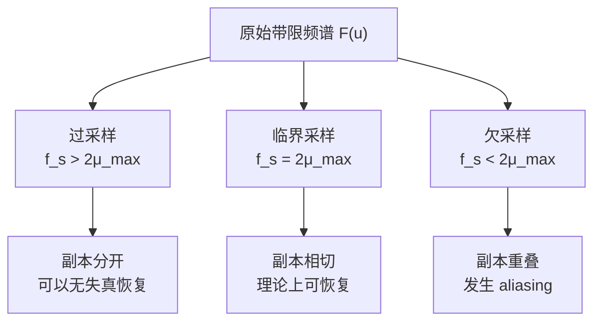

# Lecture 5 Revised

> 按照课程内容整理与重构后的复习笔记

[TOC]

## 课程主题与整体结构

本讲主题是 **Fourier Transform in Biomedical Image**。

和上一讲主要在 **空间域** 讨论滤波不同，这一讲开始把图像处理问题转到 **频率域** 来理解：为什么图像可以分解为不同频率成分、采样为什么会带来频谱复制、什么是混叠（aliasing）、为什么需要满足 Nyquist 条件，以及这些思想如何过渡到 **2D DFT、FFT、Wavelet** 等图像分析工具。

这一讲的主线：**Fourier Transform and its properties → 2-D Fourier Transform → 2-D Discrete Fourier Transform → FFT → Wavelet Transform**；而这节课中，最完整的部分主要是 **一维 Fourier background、采样与 aliasing**，2D DFT / FFT / Wavelet 更多以提纲形式出现，因此下面的笔记会在课件主线基础上做标准化整理与必要补全。（主要是没上到后面部分）

本讲可以整理为以下几条主线：

1. 从空间域走向频率域：为什么需要 frequency domain
2. 背景思想：投影（projection）、周期函数、Fourier series
3. 一维连续 Fourier Transform 及其逆变换
4. 采样如何产生离散信号，以及为什么会在频域中复制频谱
5. Sampling theorem 与 aliasing
6. 面向图像的 2D DFT 及常见性质
7. FFT 与 Wavelet 的位置与意义
8. 作业题背后的概念：冲激卷积、条纹图像频谱、相位反演与图像翻转。

------

## 一、为什么从空间域走向频率域

上一讲已经讲过低通、高通、带通滤波，也解释了为什么叫 “pass”——因为在频率意义上，有些频率成分被允许通过，有些被抑制。这一讲则进一步回答：**什么叫“频率成分”**，以及 **图像为什么可以在频域中分析**。

改善图像质量的方法分成三层：单像素增强、邻域像素、以及 **Frequency Domain**；这说明频域方法不是孤立的新话题，而是图像增强体系中的第三层工具。

理解上可以这样把握：

- **空间域**：直接看像素值怎么变；
- **频率域**：看图像中“变化有多快、重复得多密”。

因此：

- **低频** 对应缓慢变化的大结构、背景、照明趋势；
- **高频** 对应边缘、细节、纹理、噪声；
- 频域滤波本质上是在问：**哪些变化速度应该保留，哪些应该压制**。

------

## 二、背景思想：Projection、周期函数与 Fourier Series

### 1. Projection（投影） 的本质

课件在 background 部分先放了“向量投影 / 基底变化”的图，再放了 `top view`、`front view`、`side view` 的投影视图示意，这一段的核心不是几何本身，而是要说明：

> **同一个对象，在不同基底或不同观察方式下，可以得到不同表示。**

把这个思想迁移到信号上，就是：

- 原始信号是在时间域 / 空间域中的表示；
- 若把信号投影到一组特殊基函数上（例如正弦、余弦），就得到频率域表示。

>  [!IMPORTANT]
>
> 所以，Fourier transform 可以看成一种特殊的“投影”：
>
> - 不是投影到普通坐标轴；
> - 而是投影到 **不同频率的正弦 / 余弦基函数** 上。

### 2. 周期函数与频率分解

课件随后给出“复杂波形 + 正弦波”的示意图，并在下一页明确写出：

- Functions that are periodic to sines and/or cosines of different frequencies
- Time domain to Frequency domain
- Fourier series。

这说明课程先从 **Fourier series（傅里叶级数）** 入手：

- 对 **周期函数**，可以写成不同频率正弦 / 余弦的叠加；
- 每一个频率对应一个系数；
- 这些系数共同描述原函数在频率域中的组成。

直观上：

- 低频基函数变化慢；
- 高频基函数变化快；
- 原信号越尖锐、越细碎，往往需要更多高频成分参与表示。

### 3. 周期函数 vs 非周期函数

课件还专门放了一页写：

- Function that are not periodic
- Continuous function in frequency domain。

这说明一个重要区分：

- **周期函数** 的频谱通常表现为 **离散谱线**；
- **非周期函数** 的频谱通常是 **连续函数**。

也就是说：

- Fourier series 适合周期信号；
- Fourier transform 则把这个思想推广到更一般的非周期信号。

> [!TIP]
>
> 周期对应离散

------

## 三、一维连续傅里叶变换（FT of One Variable Function）

课件在 “FT of One Variable Function” 页中给出了一维连续函数的 Fourier transform 和 inverse Fourier transform 形式，并特别说明：

> U-space is called frequency domain because $u$ determines the frequency。

### 1. 定义

对于一维连续函数 $f(x)$，其 Fourier transform 为：

$$
F(u)=\int_{-\infty}^{\infty} f(x)e^{-j2\pi ux}\, dx
$$

逆变换为：

$$
f(x)=\int_{-\infty}^{\infty} F(u)e^{j2\pi ux}\, du
$$

这里的要点不是死记公式，而是理解三个变量：

- $x$：原始域中的位置变量，可理解为时间或空间坐标；
- $u$：频率变量；
- $F(u)$：原函数在不同频率上的响应强度和相位信息。

（有些教材会采用不同的归一化约定，例如把 $\frac{1}{2\pi}$ 放在逆变换前；只要正逆变换成对一致即可。）

### 2. 为什么 $u$ 是频率

因为积分核 $e^{-j2\pi ux}$ 本质上就是一个复指数振荡基函数。

又因为：

$$
e^{j\theta}=\cos\theta + j\sin\theta
$$

所以 Fourier transform 实际上就是在测量：

- 原函数在各个频率正弦 / 余弦上的“投影强度”；
- 哪些频率成分多，哪些少；
- 以及它们的相位关系。

### 3. 频域的物理意义

对信号来说：

- 若 $F(u)$ 在低频处很强，说明原信号整体变化较平缓；
- 若 $F(u)$ 在高频处显著，说明原信号中有很多快速变化、尖峰或边缘。

对图像来说，这个思想一模一样：

- 缓慢变化背景、阴影、不均匀照明 → 低频；
- 轮廓、纹理、条纹、细节 → 高频。

> 可以将 低高频对应的图像变化性 与 FT 变换完后的图像 进行对照分析

------

## 四、典型变换对与它们的意义

课件在 FT of One Variable Function 的后续页里给了两个非常重要的例子：

- **rect(selection) ↔ sinc**
- **impulse train(sample) ↔ copy and shift**。

这两个例子几乎贯穿后面的采样理论。

### 1. 矩形函数与 sinc 函数

若一个一维函数是宽度有限的矩形窗，其 Fourier transform 会变成 sinc 形状。可标准化写成：
$$
\operatorname{rect}\left(\frac{t}{W}\right)
\Longleftrightarrow
W\,\mathrm{sinc}(Wu)
$$
其中常用定义为：
$$
\mathrm{sinc}(x)=\frac{\sin(\pi x)}{\pi x}
$$
理解要点：

- **空间 / 时间域越窄，频域越宽**；
- **空间 / 时间域越宽，频域越窄**。

这件事非常重要，因为它预示了：

> 局部化和频率分辨率之间通常存在互相制约。

### 2. 冲激列与频谱复制

课件另一组图给出冲激列在时间域和频率域中的对应关系，本质可写为：
$$
\sum_{n =-\infty}^{\infty}\delta(t-n\Delta T)
\Longleftrightarrow
\frac{1}{\Delta T}\sum_{n =-\infty}^{\infty}\delta\left(u-\frac{n}{\Delta T}\right)
$$
这说明：

- 时间域 / 空间域中的 **等间隔采样**，
- 会在频率域中产生 **等间隔复制的频谱**。

这正是后面 sampling theorem 的核心基础。

------

## 五、采样如何产生离散信号

课件 “Sampling produces the discrete signal” 页给出了最关键的一步：用冲激列对连续信号采样。

### 1. 时间域表达

设采样间隔为 $\Delta T$，则采样冲激列为：
$$
s_{\Delta T}(t)=\sum_{n =-\infty}^{\infty}\delta(t-n\Delta T)
$$
连续信号 $f(t)$ 被采样后得到：
$$
f_s(t)= f(t)s_{\Delta T}(t)
=\sum_{n =-\infty}^{\infty}f(n\Delta T)\delta(t-n\Delta T)
$$
这条公式说明两件事：

- 连续信号并没有“整体消失”；
- 它被压缩成一系列离散采样值，挂在各个采样点的冲激上。

### 2. 频域表达

采样后的频谱满足：
$$
F_s(u)=\frac{1}{\Delta T}\sum_{n =-\infty}^{\infty}F\left(u-\frac{n}{\Delta T}\right)
$$
这意味着：

> 采样不会凭空创造新的单独频谱形状，而是把原频谱按 $1/\Delta T$ 的间隔不断复制。

课件中也直接写出了结论：

> The spectrum of the discrete signal consists of repetitions of the spectrum of the continuous signal every $1/\Delta T$。

### 3. 采样间隔与频谱间隔的关系

课件在 “Sampling in frequency domain” 页特别强调：

> Shorter sample interval means larger interval in frequency domain。

也就是：

- $\Delta T$ 越小，采样越密；
- $1/\Delta T$ 越大，频谱副本之间间隔越开；
- 越不容易发生重叠。

所以一定要把这个关系记清楚：

- **采样越密** → 频域复制越疏；
- **采样越稀** → 频域复制越挤。

------

## 六、Sampling Theorem 与 Aliasing

课件用一整页对比了 over-sampling、critical sampling、under-sampling，并给出结论：
$$
\frac{1}{\Delta T}\ge 2\mu_{\max}
$$
同时写明：

> The Nyquist criterion should be satisfied.
> Aliasing appears。

### 1. 采样定理的核心

若连续信号的最高频率为 $\mu_{\max}$，为了不丢失信息，需要采样频率满足：
$$
f_s =\frac{1}{\Delta T}\ge 2\mu_{\max}
$$
这就是 **Nyquist criterion / Nyquist sampling theorem**。

### 2. 这个结论是怎么来的

Nyquist 定理最好不要只背结论。真正应该掌握的逻辑链条是：

1. 连续信号采样，等价于在时间域把原信号乘上一个冲激列
2. 时间域乘法，对应频域卷积
3. 冲激列的 Fourier transform 仍然是冲激列
4. 因此原频谱会在频域中按采样频率 $f_s=1/\Delta T$ 周期性复制
5. 只要这些复制后的频谱彼此不重叠，就可以从中间那一份完整恢复原信号
6. 一旦重叠，就产生 aliasing

也就是说，**Nyquist 结论不是凭空规定出来的，而是由“采样导致频谱复制”这一事实直接推出来的。**

### 3. 为什么采样后在频域里会变成周期复制

先看时间域采样：

$$
f_s(t)= f(t)\sum_{n =-\infty}^{\infty}\delta(t-n\Delta T)
$$

由于时间域乘法对应频域卷积，所以：

$$
F_s(u)= F(u)*S_{\Delta T}(u)
$$

而采样冲激列的 Fourier transform 为：

$$
S_{\Delta T}(u)=\frac{1}{\Delta T}\sum_{n =-\infty}^{\infty}\delta\left(u-\frac{n}{\Delta T}\right)
$$

于是：

$$
F_s(u)= F(u)*\left [\frac{1}{\Delta T}\sum_{n =-\infty}^{\infty}\delta\left(u-\frac{n}{\Delta T}\right)\right]
=\frac{1}{\Delta T}\sum_{n =-\infty}^{\infty}F\left(u-\frac{n}{\Delta T}\right)
$$

>  [!NOTE]
>
> 这一步的物理意义非常关键：
>
> - 频域中的一个冲激 $\delta(u-u_0)$ 与函数卷积，相当于把函数平移到 $u_0$
>
> - 频域里有一串等间隔冲激，就会得到一串等间隔的频谱副本
>
> - 副本之间的间隔正是 $1/\Delta T=f_s$

所以采样后频域看起来像“周期重复”，并不是说原始连续信号本身变成了周期信号，而是说：

> **采样后的频谱由一份原频谱经 $1/\Delta T$ 放大后，沿频率轴每隔 $f_s$ 复制一次。**

### 4. 采样后的幅值变化

上式前面的系数是：

$$
\frac{1}{\Delta T}= f_s
$$

因此采样后每一份频谱副本的幅值，会带有一个比例系数 $1/\Delta T$。

这个系数的来源不是图像“变亮”或信号“变强”，而是 Fourier 变换的尺度关系。直观理解如下：

- 采样越密，单位时间内冲激越多
- 冲激列在频域里的总“权重”也相应增大
- 所以复制出来的频谱前面会乘上一个尺度因子

复习时可以这样记：

- **频谱副本的位置间隔** 由 $f_s=1/\Delta T$ 决定
- **频谱副本的整体缩放** 也会带上 $1/\Delta T$

在很多教材讨论“能否恢复原信号”时，更关注的是“副本是否重叠”，所以常把注意力放在间隔上，而不把幅值缩放当成主要矛盾。因为恢复时可以再通过理想低通滤波和相应比例因子把幅值校正回来。

### 5.  Nyquist 条件的推导

设原信号是带限信号，频谱只分布在：

$$
|u|\le \mu_{\max}
$$

则中间这一份频谱的宽度是从 $-\mu_{\max}$ 到 $+\mu_{\max}$，总宽度为：

$$
2\mu_{\max}
$$

而相邻两份频谱副本中心之间的距离是：

$$
f_s =\frac{1}{\Delta T}
$$

为了让相邻副本不重叠，必须至少满足：

$$
f_s\ge 2\mu_{\max}
$$

这就是 Nyquist 条件。

一句话概括：

> **副本间距必须至少大于等于原频谱宽度，才能把中间那一份单独截出来恢复原信号。**

### 6. 三种采样情况

下面把原频谱简化为“一个带限包”，只看它在频率轴上的复制情况。



把采样频率从高到低连续变化时，可以想成下面这个过程：

```text
高 f_s
   [----]         [----]         [----]
------|-------------|-------------|-------------->

降低 f_s
    [------]     [------]     [------]
------|-----------|-----------|-------------->

临界 f_s = 2μ_max
     [------][------][------]
------|---------|---------|-------------->

继续降低 f_s
   [---------[---重叠---]---------]
------|---------|---------|-------------->

更低 f_s
 [-----------[------大面积重叠------]-----------]
------|---------|---------|-------------->
```

#### 过采样（Over-sampling）

$$
f_s > 2\mu_{\max}
$$

```text
频率轴:

      [----]           [----]           [----]
--------|----------------|----------------|-------->
      -f_s               0               +f_s

每个 [----] 表示一份频谱副本
副本之间有明显空隙，不重叠
```

结论：

- 采样频率远高于两倍最高频
- 频谱副本分得很开
- 用低通滤波提取中间一份非常安全
- 对实际系统更稳健

#### 临界采样（Critical sampling）

$$
f_s = 2\mu_{\max}
$$

```text
频率轴:

    [------][------][------]
------|---------|---------|-------->
     -f_s        0        +f_s

相邻副本刚好相切
理论上还能分开，实际中容错很小
```

结论：

- 恰好达到 Nyquist 频率
- 频谱副本边缘刚好接触
- 数学上仍可恢复
- 一旦系统不理想、信号不是严格带限或滤波器不理想，就容易出问题

#### 欠采样（Under-sampling）

$$
f_s < 2\mu_{\max}
$$

```text
频率轴:

   [---------[---重叠---]---------]
------|---------|---------|-------->
     -f_s        0        +f_s

相邻副本发生重叠
```

结论：

- 采样频率过低
- 相邻频谱副本互相压在一起
- 高频分量折叠到低频区域
- 无法再唯一恢复原始信号

### 7. aliasing 到底“错”在哪里

aliasing 最本质的问题是：

> **采样后观察到的某个低频成分，可能其实来自原信号中的高频成分折叠。**

也就是说，系统已经分不清：

- 这是原本就低频的真实成分
- 还是高频被折叠后的伪低频

因此 aliasing 不是单纯“模糊”，而是 **频率身份被认错**。

### 8. 从直观到理论，应该怎么学 Nyquist

最有效的学习顺序通常不是“纯背结论”，也不是一上来就死推公式，而是：

1. **先记住结论**
   $$
   f_s\ge 2\mu_{\max}
   $$
   知道这是避免混叠的底线
2. **再看图像化效果**
   先建立“副本分开 / 相切 / 重叠”这三个直观画面
3. **最后再推公式**
   用“时间域乘冲激列 $\rightarrow$ 频域卷积 $\rightarrow$ 频谱复制”把结论真正推出来

也就是说：

- 如果是第一次学，先看结论和图像效果最容易入门
- 如果是为了考试和真正理解，最后一定要会从频谱复制推回 Nyquist 条件

比较准确的说法是：

> **先用结论建立直觉，再用推导把直觉变成真正会用的知识。**

------

## 七、从一维到二维：面向图像的 Fourier Transform

二维 Fourier 变换的核心，不是把一维公式机械地加一个变量，而是同时描述图像在两个方向上的变化。

课件在这一部分的展开顺序很明确：

1. 图像是二维数组，因此首先处于 **spatial domain**
2. 先沿一个方向做 Fourier transform
3. 再沿另一个方向做 Fourier transform
4. 得到二维频率域表示

因此二维 Fourier 变换的本质是：

> **把图像中“沿横向如何变化”和“沿纵向如何变化”同时分解成频率分量。**

### 1. 二维连续 Fourier Transform

对二维图像 $f(x,y)$，连续 Fourier transform 标准写法为：

$$
F(u, v)=\int_{-\infty}^{\infty}\int_{-\infty}^{\infty}
f(x, y)e^{-j2\pi(ux+vy)}\, dx\, dy
$$

逆变换为：

$$
f(x, y)=\int_{-\infty}^{\infty}\int_{-\infty}^{\infty}
F(u, v)e^{j2\pi(ux+vy)}\, du\, dv
$$

其中：

- $(x,y)$ 是空间坐标；
- $(u,v)$ 是频率坐标；
- $F(u,v)$ 就是图像的二维频谱。

还要进一步理解：

- $u$ 对应沿 $x$ 方向的频率
- $v$ 对应沿 $y$ 方向的频率

因此二维频谱上的一个点 $(u,v)$，表示图像中一种“在两个方向同时变化”的模式。

### 2. 二维 Fourier 变换为什么可以分两步做

课件两张示意图想表达的是：

- 先对每一行做一维 Fourier transform，得到中间结果
- 再对每一列做一维 Fourier transform，得到最终二维频谱

反过来也可以：

- 先列后行
- 结果相同

这说明二维 Fourier 变换并不是完全独立于一维变换的新对象，而是两个一维变换的组合。

### 3. 二维频谱中的“亮点”表示什么

课件图中提到：二维频率域中的 spike 对应某个频率分量的 **强度和位置**。

所以看二维频谱时要同时看两件事：

- 亮点离原点多远：决定频率高低
- 亮点朝哪个方向分布：决定图像变化方向

这就是二维频谱比一维频谱多出来的关键信息。

### 4. 医学图像中的 frequency domain 与 k-space

课件在二维 Fourier 变换之后专门插入了医学图像频率域说明，这一页很重要。

<span style="color:#FF0000; font-weight:bold;">空间域与频率域的量纲需要分清</span>：

- 空间域：位置 $x$，通常用像素或实际距离表示
- 频率域：每单位距离的变化次数

课件列出两种频率表示：

- 角频率 $\omega$，单位是 radians per unit distance
- 旋转频率 $f$，单位是 cycles per unit distance

二者关系为：

$$
\omega=2\pi f
$$

在 MRI 中：

> **k-space 就是 MRI 图像的 Fourier 变换域。**

这意味着：

- MRI 采集本身就在频率域进行
- 最终图像是通过逆 Fourier transform 从 k-space 重建得到
- 所以后面讲的采样、Nyquist、共轭对称，都会直接影响 MRI 重建质量

### 5. 二维离散 Fourier Transform（2D DFT）

数字图像最终要落到离散形式上。对大小为 $M\times N$ 的图像，2D DFT 常写为：

$$
F(u, v)=
\sum_{x = 0}^{M-1}\sum_{y = 0}^{N-1}
f(x, y)e^{-j2\pi\left(\frac{ux}{M}+\frac{vy}{N}\right)}
$$

逆变换为：

$$
f(x, y)=
\frac{1}{MN}
\sum_{u = 0}^{M-1}\sum_{v = 0}^{N-1}
F(u, v)e^{j2\pi\left(\frac{ux}{M}+\frac{vy}{N}\right)}
$$

课件明确给出下标范围：

- $u=0,1,\dots,M-1$
- $v=0,1,\dots,N-1$
- $x=0,1,\dots,M-1$
- $y=0,1,\dots,N-1$

这说明 2D DFT 对应的是：

- 有限尺寸图像
- 离散空间坐标
- 离散频率分量

这才是数字图像处理中真正落地使用的 Fourier 表达。

### 6. 图像频谱怎么理解

对图像频谱，最常用的直觉是：

- **中心附近**：低频，表示整体亮度、平缓背景、慢变化结构；
- **离中心越远**：频率越高，表示快速变化、边缘、纹理、细条纹；
- **方向**：对应空间中变化发生的方向。

例如：

- 若图像是 **竖直条纹**，则亮度只沿 **水平方向** 变化；
- 因此频谱主要落在 **水平频率轴** 上。

这也说明：

- 图像中的方向性结构
- 会在频谱中体现为对应方向的能量分布

这正是课件后面作业题和旋转性质的基础。

------

## 八、二维采样定理与二维 aliasing

课件在二维 DFT 后面紧接着讲了 `2-D Sampling Theorem` 和 `Aliasing`，并给了图像缩小前后混叠的示意图。这部分不能只一句话带过。

### 1. 二维采样的本质

二维图像采样，本质上是在两个方向上同时进行采样，因此：

- 空间域中对应二维冲激列
- 频域中对应二维网格状复制的频谱副本

可以把它理解成一维结论的二维推广：

- 一维里，频谱沿一条轴复制
- 二维里，频谱在平面上沿两个方向同时复制

### 2. 为什么二维也会发生混叠

只要复制后的二维频谱副本相互重叠，就会发生二维 aliasing。

二维混叠常见表现包括：

- 锯齿边缘
- 摩尔纹
- 伪条纹
- 纹理方向判断错误

### 3. 图像 resize 前为什么常要先低通滤波

课件给出的例子说明：

- 直接把图像缩小到较低分辨率，容易出现明显 aliasing
- 若缩小前先做平均滤波，则混叠会明显减轻

其频域原因是：

- 缩小图像，相当于降低采样密度
- 采样频率降低，频谱副本之间距离减小
- 若高频仍保留，副本就可能重叠

所以 resize 前的平滑处理，本质是在做 anti-aliasing。

### 4. 二维 Nyquist 的复习重点

二维图像中，Nyquist 条件不能只按一个标量频率去死记，而要理解为两个方向上都要满足采样要求。

因此：

- 横向采样不足，会导致横向频率复制重叠
- 纵向采样不足，会导致纵向频率复制重叠
- 任一方向不满足要求，最终图像都可能混叠

------

## 九、2D DFT 的几个关键性质

### 1. 空间间隔与频率间隔的关系

课件把这一条放在二维 DFT 性质的最前面。二维情况下，标准关系可以写成：

$$
\Delta u =\frac{1}{M\Delta x},\qquad
\Delta v =\frac{1}{N\Delta y}
$$

其中：

- $\Delta x,\Delta y$：空间采样间隔；
- $\Delta u,\Delta v$：频率采样间隔。

所以：

- 空间采样越密，频率范围越大；
- 图像尺寸越大，频率采样越细；
- 这和一维采样定理中的结论本质一致。

课件还特别把它与 `FOV` 和像素宽度联系起来。应理解：

- `FOV` 决定空间覆盖范围
- 像素宽度决定采样间隔
- 它们共同决定 k-space 中需要多少采样点

### 2. 零频项（Zero-frequency term）

课件单独用一页说明：

- $(u,v)=(0,0)$ 处的频谱值对应图像的平均亮度
- 它称为 `dc component(直流分量)`

常写为：

$$
F(0,0)=\sum_{x=0}^{M-1}\sum_{y=0}^{N-1}f(x,y)
$$

因此零频项本质上反映的是整幅图像的平均灰度水平。

### 3. 周期性（Periodicity）

课件把 `Periodicity` 单独列为一页性质。

理解重点：

- DFT 的频谱在离散频率坐标下本身具有周期延拓性质
- 实际显示的频谱图通常只是其中一个周期窗口

### 4. 平移性质（Shifting）

课件用两页说明 shifting。应掌握的核心不是背公式，而是结论：

- 空间域平移会导致频域相位发生线性变化
- 频谱幅值分布基本不变

所以图像整体挪位置时：

- 幅值谱基本保持
- 相位谱负责记录位置信息

### 5. 原点移动与频谱中心化

课件单独有一页 `Shift of the Origin Coordinates of the DFT`。它说明：

- 原始 DFT 的零频默认显示在四角附近
- 常见频谱图会把零频移到中心

常用操作是：

$$
f_c(x,y)=f(x,y)(-1)^{x+y}
$$

这样做的目的不是改变图像本身，而是让频谱更容易观察与设计滤波器。

课件还显示了对幅值谱取对数后，细节会更清楚。

### 6. 旋转性质（Rotation）

课件用旋转后的矩形和对应旋转后的频谱说明：

- 图像在空间域旋转多少角度
- 频谱也旋转相同角度

这说明频谱图中的方向和图像结构方向之间存在直接对应关系。

### 7. 分配律与尺度性质（Distributivity and scaling）

课件列出了 `Distributivity and scaling`。复习时可用线性来概括：

$$
\mathcal{F}\{af+bg\}=aF+bG
$$

这表示多个结构在空间域叠加后，频域中也会对应叠加。

### 8. 共轭对称（Conjugate Symmetry）

对实值图像 $f(x,y)$，其 Fourier spectrum 满足：

$$
F(-u,-v)= F^*(u, v)
$$

含义是：

- 频谱关于原点成共轭对称；
- 频谱幅值关于中心对称；
- 因此许多图像频谱图看起来左右 / 上下成对出现，并不是巧合，而是实值图像的固有性质。

这条性质在 MRI 中尤其重要，因为它意味着频谱中存在可利用的冗余信息。

### 9. 可分离性（Separability）

课件单独列出 `Separability`。它表示：

- 二维 DFT 可以拆成两个一维 DFT
- 可先按行算，再按列算
- 也可先按列算，再按行算

这和前面二维 Fourier 变换的两步图示是一一对应的，也是 FFT 加速二维变换的基础之一。

### 10. 卷积定理（Convolution Theorem）

课件把 `2D-DFT convolution theorem` 单独讲了两页。这是空间滤波与频域滤波之间最重要的桥梁：

$$
f(x, y)*g(x, y)\Longleftrightarrow F(u, v)G(u, v)
$$

即：

- **空间域卷积**
- 对应
- **频率域乘法**

反过来：

$$
f(x, y)g(x, y)\Longleftrightarrow F(u, v)*G(u, v)
$$

因此：

- 空间域卷积可以转成频域逐点乘法
- 频域乘法运算量往往更低
- 多个频域滤波器还可以直接相乘，实现多次滤波联合处理

### 11. 频域滤波的图像效果

课件最后用 `blurred` 与 `sharpened` 的例子说明：

- 低通滤波保留低频，结果更平滑、更模糊
- 高通滤波保留高频，结果更锐利、更强调边缘

这说明二维 DFT 的性质不是为了背公式，而是为了理解和设计频域滤波。

------

## 十、频谱中心化与相位的意义

课件 Homework 3 给出了一道很典型的图像相位题：左图 “B.I.P”，右图变成类似镜像 / 翻转的形式，并给出处理流程：

1. 先乘 $(-1)^{x+y}$
2. 计算 DFT
3. 反转 phase angle
4. inverse DFT
5. 再乘 $(-1)^{x+y}$。

这道题背后有两个极重要的概念。

### 1. 为什么要乘 $(-1)^{x+y}$

在二维图像处理中，常用：

$$
f_c(x, y)= f(x, y)(-1)^{x+y}
$$

其作用是把 DFT 的零频从左上角移动到频谱中心，便于观察与处理。也就是说：

- 这一步不是改变图像内容本质；
- 而是做 **频谱中心化（centering）**。

### 2. 相位比幅值更决定结构

若频谱写成：

$$
F(u, v)=|F(u, v)|e^{j\phi(u, v)}
$$

那么“反转 phase angle”就是把 $\phi$ 变成 $-\phi$，等价于变成频谱共轭：

$$
|F|e^{-j\phi}= F^*(u, v)
$$

对实值图像而言，频谱取共轭再做逆变换，会得到空间域的翻转结果。因此 Homework 3 的图像变形，本质上是在考：

- 相位的几何意义；
- 复共轭与空间反转之间的关系；
- 以及中心化 / 去中心化操作对显示位置的影响。

这道题也说明：

> **图像“长什么样”很大程度由相位决定，而不是只由幅值决定。**

------

## 十一、FFT：为什么需要 Fast Fourier Transform

课件并不是只在目录里提到 FFT，后面还专门给了计算量对比和奇偶拆分思路，因此这一部分不能只写一句“FFT 更快”。

应掌握的理解是：

- DFT 是数学定义；
- FFT 是高效实现；
- FFT 不改变结果，只减少计算量。

课件给出的数字非常直观：

- `2048 × 2048` 图像直接做 DFT/IDFT，约需要 `17 trillion computations`
- 使用 FFT 后，约为 `92 million computations`

所以 FFT 的意义是：把原本代价极高的频域处理变成可实际执行的计算。

课件还提到 FFT 的典型思想：

- 将一个 $M$ 点 DFT 拆成两部分
- 分别计算偶数项与奇数项
- 再把它们组合起来

这就是 `F_even(u)` 和 `F_odd(u)` 的来源。若样本数是 2 的整数次幂，处理尤其方便。

------

## 十二、Wavelet Transform：本讲中处于什么位置

课件目录页把 **Wavelet Transform** 放在 Fourier / DFT / FFT 之后；而在后面的缩略页中也能看到 “Wavelet Transforms” 和一些应用页，但在当前 PDF 可见页里没有完整展开公式讲解。

因此这一部分在本讲中的位置可以理解为：

- Fourier transform 擅长整体频率分析；
- Wavelet transform 更强调 **局部化分析**；
- 当信号 / 图像的频率特征随位置变化时，wavelet 往往更自然。

就复习层面，至少先知道：

- Fourier：更偏全局频率分解；
- Wavelet：更偏局部、分层、多尺度分解。

如果你后面还会上传更完整的 wavelet 课件，我可以再按同样风格把这一部分单独补成完整版。

------

## 十三、作业题背后的核心考点

### Homework 1：频谱中心化与零频移动

课件要求证明：图像乘以 $(-1)^{x+y}$ 后再做 Fourier transform，频谱的 DC 分量会移动到中心。

这题的核心不是卷积，而是 **频谱平移**。

应掌握的结论：

- 乘以 $(-1)^{x+y}$ 等价于在频域中把频谱平移半个周期
- 原本位于 $(0,0)$ 的零频项会被移到频谱中心
- 这是频谱显示和频域滤波前最常用的预处理操作

如果换成别的乘法因子，那么对应的就不再是“标准中心化”，而会产生别的频域平移结果。

### Homework 2：只改幅值、不改相位时图像为什么会那样变化

课件给出的处理流程是：

1. 计算 DFT 并把 DC 分量移到中心
2. 对幅值做反转处理
3. 计算逆 DFT

这道题考的是：

- 幅值谱与相位谱分别控制什么
- 为什么图像结构并不只由幅值决定
- 为什么相位对空间结构和位置关系特别重要

应理解：

- 只改幅值而尽量保留相位时，重建图像往往仍保留主要几何结构
- 相位决定了图像中各结构的相对位置关系
- 幅值主要决定各频率成分的强弱分布

### Homework 3：共轭对称与 MRI 采样数计算

课件最后一题包含三层要求：

1. 证明实值图像的 DFT 满足共轭对称性质
2. 对 2D MR 图像，根据 Nyquist 条件计算全采样所需的总 k-space 点数
3. 再利用共轭对称性质，讨论最少需要的采样点数

这道题综合考查：

- 共轭对称的数学意义
- MRI 中 k-space 的采样逻辑
- Nyquist 条件如何落到二维采样数量计算
- 利用频谱冗余减少采样量的思想

------

## 十四、本课应掌握的核心知识点清单

### 必须会区分的概念

- Fourier series 与 Fourier transform 的区别：周期函数 vs 一般函数
- 时间 / 空间域 与 频率域 的区别
- 连续 FT 与 离散 DFT 的区别
- 频谱幅值 与 相位 的区别
- 过采样、临界采样、欠采样 的区别
- 频谱复制 与 aliasing 的区别

### 必须会写或会认的公式

- 一维连续 Fourier transform 与 inverse transform
- 冲激列的 Fourier transform
- 采样后的频谱复制公式
- Nyquist 条件
- 2D DFT 的标准形式
- 卷积定理
- 实值图像频谱的共轭对称关系

### 必须理解的物理意义

- 低频 = 缓慢变化
- 高频 = 快速变化
- 采样越密，频谱副本间隔越大
- 欠采样导致频谱重叠，从而 aliasing
- 图像条纹、边缘、纹理可以从频谱位置和方向解释
- 相位对图像结构极其重要

### 必须注意的问题

- 频谱图的中心位置往往经过中心化处理
- 频域图像常呈对称，不是巧合而是实值信号性质
- FFT 是算法，不是新的数学变换
- 当前 PDF 可见页里，2D DFT / FFT / Wavelet 主要以提纲出现，复习时要把一维采样思想主动迁移到二维图像。

------

## AI 总结

本讲《Fourier Transform in Biomedical Image》主要讨论如何把生物医学图像从空间域表示转换到频率域表示，并利用频域视角理解采样、频谱复制、混叠以及二维图像的 DFT 分析框架。课程先通过 projection 的思想说明：同一个对象可以在不同基底下得到不同表示，而 Fourier transform 本质上就是把信号投影到不同频率的正弦 / 余弦基函数上；随后从周期函数的 Fourier series 过渡到非周期函数的连续 Fourier transform，建立“时间 / 空间域 ↔ 频率域”的基本概念。之后课程通过矩形函数与 sinc、冲激列与频谱复制两个典型变换对，引出采样如何把连续信号变成离散信号，以及为什么离散信号的频谱会表现为原频谱按 (1/\Delta T) 间隔不断重复。接着进一步讲解 sampling theorem，说明只有满足 Nyquist criterion，才能避免频谱重叠与 aliasing。对于图像部分，课程目录进一步指向 2D Discrete Fourier Transform、空间与频率采样间隔关系、conjugate symmetry、convolution theorem、FFT 与 wavelet transform，说明这些内容是后续图像频域处理的核心工具。最后，作业部分分别从冲激卷积、条纹图像频谱和相位反演三个角度，考查对卷积单位元、频率方向性、DC 分量、频谱中心化以及相位决定图像结构等关键概念的理解。整体来看，这一讲真正要掌握的主线是：**Fourier transform 把“像素怎么变”转化成“变化有多快”，而采样定理决定了这种频率表示能否被正确地离散记录和恢复。**

如果你愿意，我下一条可以继续把这份内容改成 **更像你 Lecture4-revised 的“考试背诵版”**，也就是再压缩成更适合期末突击记忆的版本。
