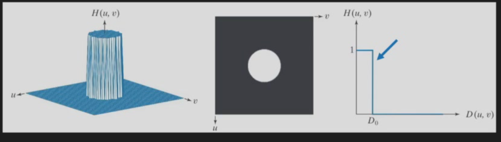
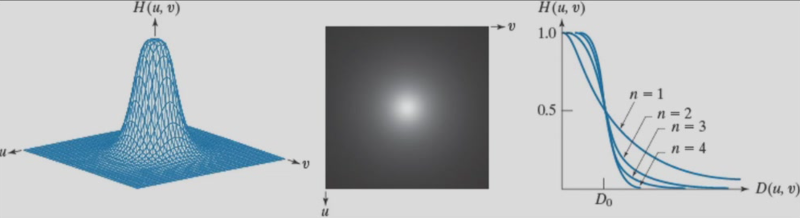

# Lecture 6

> 按照课程内容整理与重构后的复习笔记

[TOC]

## 课程主题与整体结构

本讲主题是 **Filter in Frequency Domain**，也就是把图像增强与滤波问题放到 **频率域** 中理解和实现。

如果说前几讲主要在空间域里直接对像素邻域做卷积、平滑、锐化，那么这一讲回答的是另外一条主线：

- 图像进入频率域以后，低频和高频分别代表什么；
- 为什么空间域卷积可以转成频率域乘法；
- 为什么频率域滤波必须注意 padding、shift、以及 wraparound error；
- 频率域中的低通、高通、带阻 / 陷波滤波器分别如何设计；
- 为什么理想滤波器容易产生 ringing，而 Gaussian 往往更平滑；
- 如何用 high-frequency emphasis、unsharp masking 等方法做锐化增强。

这一讲可以整理为以下几条主线：

1. 空间域与频率域之间的关系
2. 频率成分在图像中分别对应什么结构
3. 频率域滤波的标准流程与实现细节
4. 低通滤波器：Ideal、Butterworth、Gaussian
5. 高通滤波器与高频强调
6. 选择性滤波：带通、带阻、notch filter
7. 频率域方法在去噪、去条纹、锐化中的应用

------

## 一、为什么要在频率域中做滤波

频率域分析不是为了把图像变得更抽象，而是为了把“图像里变化有多快”这件事直接表示出来。

对图像来说：

- **低频** 对应缓慢变化的大结构、背景、照明趋势、整体灰度分布；
- **高频** 对应边缘、纹理、细节、尖锐过渡，也常常包含噪声；
- 频率域滤波本质上是在决定：**哪些变化速度保留，哪些变化速度抑制**。

因此：

- 做 **平滑 / 去噪** 时，通常希望保留低频、压制高频；
- 做 **锐化 / 边缘增强** 时，通常希望强化高频；
- 对于 **周期性干扰**，往往不是“所有高频都要去掉”，而是只去掉某些特定频率点，这时就需要 notch filtering。

> [!IMPORTANT]
>
> 频率域方法的优势，不只是“换个地方做滤波”，而是：
>
> - 有些滤波器在频域表达更自然；
> - 周期噪声在频谱中往往表现为局部亮点，更容易定点去除；
> - 大核卷积在频域中可以转成逐点乘法，计算上更方便。

------

## 二、空间域与频率域的关系

### 1. Fourier transform pair

空间域函数 $h(x,y)$ 与频率域函数 $H(u,v)$ 互为 Fourier transform：

$$
h(x, y)\Longleftrightarrow H(u, v)
$$

最重要的桥梁是卷积定理：

$$
f(x, y)*h(x, y)\Longleftrightarrow F(u, v)H(u, v)
$$

这意味着：

- 空间域中的 **卷积**
- 对应频率域中的 **乘法**

因此如果在频率域中设计好了传递函数 $H(u,v)$，那么就可以通过：

$$
G(u, v)= H(u, v)F(u, v)
$$

来完成滤波，再做逆变换得到输出图像 $g(x,y)$。

### 2. 低频和高频分别表示什么

对于图像频谱，通常可以这样理解：

- **接近频谱中心**：低频，反映图像的大轮廓、平均亮度、平滑变化；
- **远离频谱中心**：高频，反映边缘、细纹理、锐利跳变；
- **某个方向上的亮能量**：表示图像在对应方向上有较强的周期变化或结构纹理。

在 MRI 的语境里，常把频率域写成 **k-space**。直观上：

- 中心区域主要决定整体对比度和大结构；
- 外围区域主要决定边缘和细节清晰度。

### 3. 空间域尺度与频率域尺度的对应

这一讲还强调一个很重要的尺度关系：

> **窄的频率滤波器，往往对应更宽的空间域核；反之亦然。**

这意味着：

- 在频域中把通带压得很窄，空间域响应会更宽、更容易出现振荡；
- 在频域中过渡越平滑，空间域核通常也越平滑，伪影更少。

这正是后面理解 ideal、Butterworth、Gaussian 滤波器差异的关键。

------

## 三、频率域滤波的标准流程

频率域滤波不能简单理解为“做个 FFT 再乘一下”。真正稳定、规范的流程包括以下步骤。

### 1. 标准流程

1. 对原图进行适当 **padding**
2. 用 $(-1)^{x+y}$ 做频谱中心化
3. 计算 Fourier transform，得到 $F(u,v)$
4. 设计滤波器传递函数 $H(u,v)$
5. 做乘法得到 $G(u,v)=H(u,v)F(u,v)$
6. 做逆变换
7. 再乘一次 $(-1)^{x+y}$ 把中心移回去
8. 取实部并裁剪回原始大小

常见表达为：

$$
G(u, v)= H(u, v)F(u, v)
$$

$$
g_p(x, y)=\operatorname{real}\left [\mathcal{F}^{-1}(G(u, v))\right](-1)^{x+y}
$$

最后再从 padded 图像中裁剪出原大小区域。

### 2. 为什么要做 shift

原始 DFT 的低频默认不在中心，而是在角落附近。为了更直观地观察频谱，也为了更方便设计“以原点为中心”的低通 / 高通滤波器，常使用：

$$
f_c(x, y)= f(x, y)(-1)^{x+y}
$$

它的作用是把零频项移动到频谱中心。

### 3. 为什么要做 padding

课上专门强调了 **wraparound error（缠绕误差）**。原因在于：

- 频域乘法对应的是 **循环卷积**
- 如果不 padding，图像边界会“绕回”另一边（算法默认图像是无限循环拼接的）
- 这样会引入不真实的边缘污染和相位错误

所以 padding 的目的不是单纯“补零好看”，而是为了让循环卷积更接近我们真正想要的线性卷积。

> [!NOTE]
>
> 频率域滤波中，`padding + shift` 基本属于标准预处理步骤。

### 吉布斯现象（Gibbs phenomenon）/振铃效应（Ringing artifact）

假设在频率域，我们想要一个完美的“低通滤波器”。它的形状像一个完美的矩形（只保留特定频率，稍微高一点的频率被一刀切掉，完全为 0）。根据傅里叶变换的数学规律，频域里的完美矩形，转换到空间域（或时间域），就会变成一个 **Sinc 函数**（也就是 $\sin(x)/x$）。

问题就在 Sinc 函数，完美的 Sinc 函数在两端是无限延伸的。但是在计算机里，图像大小是有限的，我们不可能存储和计算一个无限长的数据。

窗的概念。把一个无限长的信号“咔嚓”一刀切断，只保留中间一部分，这个动作在数学上就叫做 **“加窗（Windowing）”**，既然计算机处理不了无限长的 Sinc 函数，我们就加窗，使其截断成有限的长度，剩余部分进行补零。

加窗后的函数 **（Spatial Sinc Zero-padding）**，在频域上便产生了边缘处的 **剧烈的上下震荡**。这种震荡就是 **吉布斯振铃**。

> 吉布斯伪影的典型可见表现，通常是在空间域（或时域）中，边缘附近出现振铃、过冲、欠冲。
>
> > [!NOTE]
> >
> > 频域中做了硬截断，其对应的空间域冲激响应会变成带有振荡尾巴的函数，卷积到图像边缘后，就产生边缘附近的振铃

### 取实部

取实部（`real`）是为了 **消除计算机在进行傅里叶变换时产生的“计算误差”，并强制让结果变回一张能显示的正常图片。**

------

## 四、从频率响应理解滤波器

频率域滤波器的核心不是公式本身，而是：

- **通带（passband）**：哪些频率允许通过；
- **阻带（stopband）**：哪些频率被压制；
- **过渡带（transition band）**：从保留到抑制是突然切换还是平滑切换。

一般来说：

- 切换越突然，空间域越容易出现振铃；
- 过渡越平滑，空间域响应越自然。

这就是为什么理想滤波器虽然定义简单，但实际效果往往不如 Gaussian。

------

## 五、低通滤波（Low pass Filtering）

低通滤波的目标是 **保留低频，抑制高频**，因此主要用于：

- 平滑；
- 去噪；
- 去除细碎纹理；
- 在分割或目标提取前先降低不必要细节。

### 1. 理想低通滤波器（Ideal Low pass Filter, ILPF）

理想低通的定义最直接：

$$
H(u, v)=
\begin{cases}
1, & D(u, v)\le D_0 \\
0, & D(u, v)> D_0
\end{cases}
$$

其中 $D(u,v)$ 表示频谱中心到点 $(u,v)$ 的距离，$D_0$ 是截止频率。

理解要点：

- 圆内完全保留；
- 圆外完全截断；
- 频率响应边界极其陡峭。

问题也正出在这里：

- 频域里“硬切断”过于突然；
- 空间域响应会出现明显振荡，类似“波纹”的效果；
- 容易产生 **ringing / Gibbs 效应**。

所以理想低通虽然最容易写公式，但通常不是实际中最平滑的选择。

### 2. Butterworth 低通滤波器（BLPF）

Butterworth 的思想是：保留低通思想，但让边缘过渡更平缓一些。

常写为：

$$
H(u, v)=\frac{1}{1+\left(\displaystyle \frac{D(u, v)}{D_0}\right)^{2n}}
$$

其中：

- $D_0$ 控制截止范围；
- $n$ 是阶数（order），控制过渡带陡峭程度。

应掌握的规律：

- $D_0$ 越小，平滑越强，模糊越明显；但是，对于截止频率的值来说不会特别准确（相对于 Ideal Filter）
- $n$ 越大，响应越接近理想低通，也更容易带来振铃；
- $n$ 较小时，过渡更柔和，视觉更自然。

### 3. Gaussian 低通滤波器（GLPF）

Gaussian 低通滤波器常写为：

$$
H(u, v)= e^{-\frac{D^2(u, v)}{2D_0^2}}
$$

Gaussian 在医学图像处理中的使用是最多的。它的关键特点是：

- 响应从中心向外平滑衰减；
- 没有理想滤波器那种突变边界，也就是没那么准确；
- 通常 **几乎不产生明显振铃**。

> [!TIP]
>
> - Ideal：最“硬”的截断，最容易振铃；
> - Butterworth ：折中方案，可选阶数多一些；
> - Gaussian：最平滑，通常视觉最自然，伪影最少。

### 4. 低通滤波的使用理解

低通滤波不是单纯“让图像更模糊”，而是主动去掉快速变化成分。

其效果既可能是优点，也可能是代价：

- 能去除随机噪声；
- 能减弱细碎纹理；
- 能让区域更连贯；
- 但也会损失边缘、微小病灶、精细结构。

> [!NOTE]
>
> 复习时要会区分：
>
> - **低通去噪**：降低高频噪声
> - **低通模糊**：同时也损失高频细节
>
> 去噪和模糊本质上是同一件事的两面。

### 5. 低通滤波的应用例子

课件上举的例子可以概括成两类：

- **文本 / 图样图像**：过强低通会让字符边缘变钝--低通修复、细节断裂；
- **脑 MRI**：适度平滑能抑制噪声，但过度平滑会掩盖白质小病灶或细小异常。

因此在医学图像中，低通滤波一定要平衡：

- 噪声抑制
- 结构保真

------

## 六、高通滤波（Highpass Filtering）

高通滤波与低通相反，目标是 **保留高频，抑制低频**，因此常用于：

- 边缘增强；
- 细节突出；
- 锐化；
- 去除缓慢变化背景。

### 1. 基本思想

若低通滤波器写为 $H_{lp}(u,v)$，则对应高通滤波器常写为：

$$
H_{hp}(u, v)= 1-H_{lp}(u, v)
$$

也就是说：

- 中心低频区域被压制；
- 外围高频区域被保留。

对应地，可得到：

- 理想高通 IHPF
- Butterworth 高通 BHPF
- Gaussian 高通 GHPF

### 2. 高频图像的特点

经过高通滤波后，图像通常表现为：

- 背景被压暗或接近零；
- 边缘和轮廓突出；
- 结果中可能出现正负值；
- 对噪声也会更敏感。

因此高通图像本身未必直接适合作为最终显示图，而更常作为：

- 边缘信息图；
- 锐化增强中的中间结果。

### 3. 高频滤波的风险

高通会强化一切快速变化，不只强化边缘，也会强化噪声。

所以需要记住：

- 图像越噪，高通越容易把噪声一起放大；
- 理想高通同样可能引入振铃；
- Gaussian 高通往往更平稳。

------

## 七、Laplacian 与频率域锐化

在空间域里，Laplacian 是二阶微分算子，强调灰度变化剧烈的位置；在频率域中，它也有对应的传递函数，因此可以用频率域形式实现锐化。

核心思想是：

- 空间域的微分对应频率域中的频率加权；
- 频率越高，被赋予的权重越大；
- 因而能够突出边缘和细节。

复习时应掌握：

- Laplacian 本质是高通增强的一种形式；
- 它强调高频，因此对噪声也敏感；
- 频率域表达的意义，在于把“锐化为什么能增强边缘”解释得更直接。

------

## 八、Unsharp Masking 与 High-Frequency Emphasis

这一部分是期末很容易考“概念区别”的地方。

### 1. Unsharp masking 的思想

先得到图像的低频部分 $f_L$，再用原图减去它，得到高频细节：

$$
f_h = f-f_L
$$

然后把高频细节按一定比例加回原图：

$$
g = f+kf_h
$$

这就是反锐化掩膜 / unsharp masking 的基本思想。

它的本质不是直接做纯高通，而是：

- 从原图中分离出细节；
- 再把这些细节受控地加回去。

### 2. High-frequency emphasis filtering

高频强调是在高通基础上进一步做“保留原图主体 + 强化高频”的折中。

理解上可以写成：

- 不是把低频全部去掉；
- 而是在保留低频背景的同时，提高高频部分权重。

因此它通常比纯高通更适合作为增强后的最终图像。

### 3. 与纯高通的区别

- **纯高通**：主要输出边缘和快速变化成分；
- **高频强调**：保留原图整体可读性，同时增强边缘；
- **Unsharp masking**：通过“原图减模糊图”的方式提取细节并加回。

> [!IMPORTANT]
>
> 这三者都属于锐化思路，但不要混为一谈：
>
> - 纯高通更像“提取高频”
> - 高频强调更像“边保留整体边增强细节”
> - Unsharp masking 更像“先构造细节层，再叠加回原图”

------

## 九、选择性滤波：带通、带阻与 Notch Filter

现实图像中，很多干扰不是“所有高频都不好”，而是只在某几个频率上异常明显。此时就要从“整体低通 / 高通”进入 **选择性滤波**。

### 1. 带阻滤波（Bandreject）

带阻滤波的目标是：

- 保留低频；
- 保留很高频；
- 只压制某一段中间频率。

可理解为“低通 + 高通”的组合。

适用场景：

- 某段频率对应不需要的周期结构；
- 想保留整体轮廓与细节，但去掉特定频带干扰。

### 2. 带通滤波（Bandpass）

带通与带阻相反：

- 只保留某一段频率；
- 低于和高于该范围的都被压制。

常用于分析特定尺度结构，但在一般增强中使用不如低通 / 高通常见。

### 3. Notch reject filter

notch filter 是更“定点”的滤波方式，它不是去掉一整个圆环频带，而是去掉频谱中 **若干局部频率点或窄区域**。

这在去除 **周期噪声 / 条纹噪声 / 干扰线** 时非常重要。

例如图像中若有近似周期性的横纹或竖纹，那么在频谱中通常会出现成对的亮点。此时：

- 不能粗暴地全部高通或低通；
- 而是应该在这些亮点附近放置 notch reject 区域；
- 这样既能压制干扰，又尽量保留其余正常结构。

### 4. 为什么 notch 往往成对出现

对实值图像，频谱往往具有共轭对称性，因此一个周期噪声频率点，通常会在频谱中心两侧对应出现成对亮点。

所以设计 notch filter 时，经常要 **成对处理**。

------

## 十、Gibbs / Ringing 效应为什么会出现

这一讲反复出现的一个关键词就是 **ringing**。

其本质原因是：

- 在频率域中做了过于突然的截断；
- 对应到空间域，就会出现振荡型响应；
- 在边缘附近表现为亮暗波纹、伪边缘或光晕。

因此：

- 理想低通、高通都更容易带来 ringing；
- Butterworth 次之；
- Gaussian 通常最平滑。

一句话记忆：

> **频域越“硬切”，空域越容易“振”。**

------

## 十一、频率域滤波与空间域滤波如何对应

这部分容易在考试中和前一讲串联起来。

### 1. 同一目标，两种实现

例如平滑和锐化，既可以在空间域实现，也可以在频率域实现。

- 空间域：直接设计卷积核；
- 频率域：设计传递函数 $H(u,v)$。

二者通过 Fourier transform 联系起来。

### 2. 不同实现方式的特点

- 小核、局部操作：空间域往往更直观；
- 大范围卷积、周期噪声抑制：频率域更方便；
- 频率域更适合解释“哪些频率被保留 / 抑制”。

### 3. 不要把“高通 = 边缘检测”简单等同

高通确实强调边缘，但它并不只对边缘响应，也会对噪声、细碎纹理、尖锐伪影响应。

所以：

- **边缘检测** 更偏向寻找边缘位置；
- **高通滤波** 更偏向保留所有高频成分。

两者有联系，但不是同义词。

------

## 十二、本课应掌握的核心知识点清单

### 必须会区分的概念

- 空间域滤波 vs 频率域滤波
- 低频 vs 高频
- 低通 vs 高通 vs 带通 vs 带阻 / 陷波
- 理想滤波器 vs Butterworth vs Gaussian
- 纯高通 vs 高频强调 vs Unsharp masking
- 周期噪声整体抑制 vs notch 定点抑制

### 必须会写或会认的公式

- 卷积定理
$$
f(x, y)*h(x, y)\Longleftrightarrow F(u, v)H(u, v)
$$
- 频率域乘法
$$
G(u, v)= H(u, v)F(u, v)
$$
- 理想低通
$$
H(u, v)=
\begin{cases}
1, & D(u, v)\le D_0 \\
0, & D(u, v)> D_0
\end{cases}
$$
- Butterworth 低通
$$
H(u, v)=\frac{1}{1+\left(\frac{D(u, v)}{D_0}\right)^{2n}}
$$
- Gaussian 低通
$$
H(u, v)= e^{-\frac{D^2(u, v)}{2D_0^2}}
$$
- 高通与低通关系
$$
H_{hp}(u, v)= 1-H_{lp}(u, v)
$$
- Unsharp masking
$$
f_h = f-f_L,\qquad g = f+kf_h
$$

### 必须理解的物理意义

- 频谱中心主要对应低频大结构
- 频谱外围主要对应细节与边缘
- padding 是为了避免循环卷积带来的 wraparound error
- shift 是为了把低频移到中心，便于设计滤波器
- 频率响应越陡，空间域越容易振铃
- notch filter 适合去除周期性条纹干扰

### 必须注意的问题

- 高频不仅包括边缘，也包括噪声
- 低通虽然能去噪，但也会损失病灶和小结构
- 理想滤波器定义简单，但实际伪影常更明显
- 频率域实现结果若异常，优先检查 padding / shift / 裁剪

------

## AI 总结

本讲《Filter in Frequency Domain》主要讨论如何从频率域角度理解和实现图像滤波。核心思想是：图像可以分解为不同频率成分，其中低频对应整体亮度、平缓背景和大尺度结构，高频对应边缘、纹理、细节以及部分噪声；因此图像增强本质上就是控制不同频率成分的保留与抑制。课程首先用 Fourier transform pair 和卷积定理建立空间域与频率域之间的联系，说明空间域卷积等价于频率域乘法；随后强调频率域滤波的标准流程，包括 padding、频谱中心化 shift、构造传递函数、逆变换和裁剪，并特别指出不做 padding 会导致 wraparound error。接着课程系统介绍了低通滤波器与高通滤波器的设计思想：理想滤波器边界最陡但容易产生 Gibbs / ringing，Butterworth 通过阶数控制过渡带陡峭程度，Gaussian 由于频率响应最平滑，通常振铃最弱。之后课程进一步讨论了高频强调、unsharp masking、带通 / 带阻 / notch filtering 等更有针对性的增强方式，说明周期噪声常常需要在频谱中做局部定点抑制，而不是简单地整体低通或高通。整体来看，这一讲真正要掌握的主线是：**频率域滤波并不是“换一种算图方式”，而是把图像增强问题直接转化成“哪些变化速度应该保留、哪些应该抑制”的设计问题。**

---

