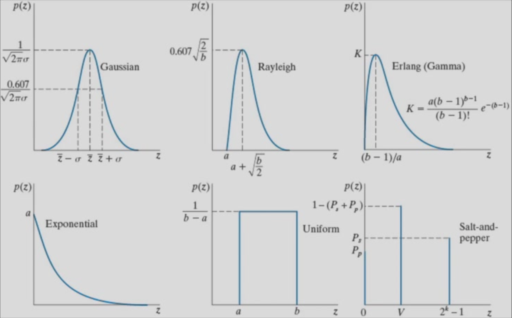

# Lecture 7 图像复原复习笔记

[TOC]

## 1. 本讲主题与整体框架

本讲的主题是 **图像复原（Image Restoration）**。它和前面讲过的 **图像增强（Image Enhancement）** 有连续性，但关注点已经发生了变化。

前面的增强更偏向“为了观察、显示或后续处理，让图像看起来更清楚、更突出某些结构”。例如低通滤波做平滑，高通滤波做锐化，陷波滤波去特定干扰，这些方法往往强调处理效果本身。图像复原则进一步追问：**图像为什么会变差，它的变差能不能用一个模型来描述，然后再根据模型尽量恢复原图**。

因此，本讲真正的逻辑链是：

1. 从增强过渡到复原，先建立统一的退化模型。
2. 把复杂问题拆开，先研究“只有噪声”的情况。
3. 区分不同噪声类型，并估计它们的参数。
4. 根据噪声类型选择合适的去噪滤波器。
5. 再从“纯噪声”回到“噪声 + 模糊退化”的一般复原问题。
6. 在这个总体框架下理解 Wiener filter 的位置与意义。

要抓住的一点是：**图像复原不是单纯换一组滤波器名字，而是围绕“退化模型”组织方法选择。**

> [!NOTE]
>
> 图像复原和图像增项都需要滤波器，但是滤波器选择的原理和目的不同

## 2. 图像退化与复原的基本模型

### 2.1 退化模型（Degradation Model）

图像复原的统一模型写成：

$$
g(x,y)=H[f(x,y)] + \eta(x,y)
$$

这个公式表示：观测到的退化图像 $g(x,y)$，来自原图 $f(x,y)$ 经过某个退化系统 $H$ 后，再叠加噪声 $\eta(x,y)$。其中：

- $f(x,y)$ 是理想原图；
- $H$ 描述成像系统或外界因素造成的退化，如模糊、失焦、运动拖影；
- $\eta(x,y)$ 是加性噪声；
- $g(x,y)$ 是实际拿到的图像。

~~这个公式说明：把“图像为什么变差”拆成两部分来看，一部分是**系统退化**，一部分是**噪声污染**。它和前面单纯做增强的思路不同，因为这里首先强调的是成因建模，而不是主观视觉效果。~~

复习时应抓住：**后面所有噪声模型、去噪滤波器、反卷积方法，都是在这个总公式下展开的。**

### 2.2 线性退化

若退化系统 $H$ 满足线性性质，则称为**线性退化**。线性的意义是：对输入的加权和，输出仍然保持同样的加权关系。
$$
{\mathcal{H}}[f_{1}(x,y)+f_{2}(x,y)]={\mathcal{H}}[f_{1}(x,y)]+{\mathcal{H}}[f_{2}(x,y)],\\
{\mathcal{H}}[a f_{1}(x,y)]=a{\mathcal{H}}[f_{1}(x,y)]
$$
它的重要性不在于定义本身，而在于：线性系统更容易分析，也更容易从空域转到频域表达。大量经典复原方法都建立在线性退化假设上。

### 2.3 空间不变退化

若退化系统对图像中各位置作用方式相同，则称为**空间不变退化（space-invariant / position-invariant degradation）**。此时系统可用点扩散函数（Point Spread Function, PSF）$h(x,y)$ 表示。
$$
\mathcal{H}[f(x-a,y-b)]=g(x-a,y-b)
$$

空域模型可写成：

$$
g(x,y)=(h*f)(x,y)+\eta(x,y)
$$

这里的 $*$ 表示卷积。

这个公式表示：原图被 PSF 进行卷积后产生模糊，再叠加噪声。把抽象的系统算子 $H$ 具体化为一个卷积核或点扩散函数，便于理解“模糊是如何扩散开的”。

它和一般的 $H[f(x,y)]$ 的区别在于：前者是更一般的算子写法，后者是在**线性且空间不变**条件下得到的具体形式。

复习时应该抓住：**一旦能写成卷积，频域中就能写成乘法，这就是后面复原滤波的基础。**

### 2.4 空域表达与频域表达

对上式做 Fourier 变换，可得频域形式：

$$
G(u,v)=H(u,v)F(u,v)+N(u,v)
$$

这个公式表示：频域中的退化图像频谱 $G$，等于原图频谱 $F$ 与退化函数频率响应 $H$ 的乘积，再加上噪声频谱 $N$。

它把空域卷积转为频域乘法，使复原问题更容易分析。特别是对模糊、周期噪声、Wiener filter 来说，频域表达非常关键。

它和空域模型的区别不是“换一种写法”这么简单，而是：

- 空域更适合直观看局部像素关系；
- 频域更适合看系统对不同频率的保留与抑制。

> [!TIP]
>
> 1. 空域卷积对应频域乘法。
> 2. 周期噪声在频域里往往更容易识别。
> 3. 复原任务通常包括：估计噪声、估计退化函数、再做复原滤波。

## 3. 噪声基础：什么是 signal，什么是 noise

### 3.1 基本概念

在图像处理中，**signal** 指的是与成像目标有关、携带结构信息的那部分内容；**noise** 指的是不希望出现、会干扰观察和分析的随机成分。

要注意，signal 和 noise 并不是绝对按“强度大小”区分，而是按**是否服务于成像目标**区分。真正有用的边缘、纹理、组织细节属于 signal；由采集、传输或硬件引入的随机波动属于 noise。

### 3.2 噪声来源

本讲课件把噪声来源概括为两大类：

- **采集过程（acquisition）**：如热噪声、电子器件波动、成像物理过程本身的随机性；
- **传输过程（transmission）**：如信号传输误码、A/D 转换误差等。

噪声既有**随机性（randomness）**，又常有一定的**规律性（regularity）**。~~所谓规律性，主要体现在它们往往符合某种概率分布，或者在频域中呈现可识别的结构。~~

### 3.3 医学图像中的理解方式

在医学图像里，噪声的影响比普通自然图像更值得重视，因为细小病灶、弱边界、低对比组织本来就不明显。噪声一旦过强，会直接影响：

- 组织边界判断；
- 小病灶显示；
- 定量测量结果；
- 后续分割、配准、重建等算法效果。

例如 MRI 中常出现明显随机噪声，若直接平滑，虽然噪声下降，但细节也可能一起被抹掉。因此噪声建模不是形式上的步骤，而是决定“该用什么方法去噪”的前提。

### 3.4 为什么噪声建模重要

因为不同噪声的统计规律不同，所以不能只问“怎么去噪”，还必须先问“是什么噪声”。这决定了：

- 是否适合均值类滤波；
- 是否适合中值类滤波；
- 是否需要到频域处理；
- 参数应该如何设定。

## 4. 常见噪声模型整理

### 4.1 Gaussian noise：高斯噪声

高斯噪声常写成：

$$
p(z)=\frac{1}{\sqrt{2\pi}\sigma}\exp\left[-\frac{(z-\mu)^2}{2\sigma^2}\right]
$$

它表示灰度扰动围绕均值 $\mu$ 对称分布，标准差 $\sigma$ 决定离散程度。

直观理解是：大多数噪声值集中在平均值附近，偏离越大，出现概率越小。**它是最常见、最经典的随机噪声模型之一**，常与热噪声联系在一起。

常见场景：

- 电子器件热噪声；
- 成像链路中的随机微小波动；
- 医学图像中近似连续型随机噪声。

对复原方法选择的影响：

- 通常适合均值类滤波、Gaussian smoothing、midpoint 或 alpha-trimmed mean 等方法；
- 不太适合用专门针对脉冲噪声的 max / min / median 来单独处理；
- 去噪时要权衡平滑与边缘模糊。

### 4.2 Rayleigh noise：瑞利噪声

Rayleigh 噪声是**非负、偏斜分布**，其概率密度在一侧快速上升后再缓慢下降，不是左右对称的。
$$
p(z)=
\begin{cases}
\dfrac{2}{b}(z-a)e^{-(z-a)^2/b}, & \text{for } z \ge a \\
0, & \text{for } z < a
\end{cases}
$$

$$
{\overline{{Z}}}=a+{\sqrt{\pi b/4}}, \quad \sigma^{2}={\frac{b(4-\pi)}{4}}
$$

直观上，它比高斯噪声更偏向某一侧灰度偏移，因此直方图常表现为单边偏斜。课件中把它列为常见随机噪声模型之一。

常见场景：

- 某些幅值类随机变量；
- 医学图像中特定成像条件下的噪声近似。

对复原方法选择的影响：

- 它仍属于随机噪声，许多平滑方法可以对其起作用；
- 但由于分布不对称，仅靠“按高斯理解”有时会带来偏差；
- 参数估计时更需要依赖局部直方图形状，而不是只看均值。

### 4.3 Erlang (Gamma) noise：Erlang / Gamma 噪声

Gamma 噪声：

$$
p(z)=
\begin{cases}
\dfrac{a^b z^{b-1}}{(b-1)!}e^{-az}, & z\ge 0 \\
0, & z<0
\end{cases}
$$
$$
\mu=\frac{b}{a},\qquad \sigma^2=\frac{b}{a^2}
$$

它表示一类非负、偏斜分布噪声，参数 $a,b$ 控制形状与尺度。课件中指出它常见于激光成像相关图像。

直观理解是：它和 Rayleigh、Exponential 一样都不是对称分布，但比指数分布更灵活，因为可通过参数改变形状。

常见场景：

- 激光成像；
- 一些具有乘性或能量积累特征的成像过程。

对复原方法选择的影响：

- 仍可看作随机噪声问题来处理；
- 参数估计比高斯噪声更重要，因为均值和方差与两个参数同时相关；
- 不能简单把它等同于“零均值扰动”。

### 4.4 Exponential noise：指数噪声

指数噪声是 Gamma 噪声的特殊情况：

$$
p(z)=
\begin{cases}
ae^{-az}, & z\ge 0 \\
0, & z<0
\end{cases}
$$
$$
\mu=\frac{1}{a},\qquad \sigma^2=\frac{1}{a^2}
$$

它的分布在低灰度偏移处概率最大，随后单调下降。

直观理解是：多数噪声值较小，少数值较大，整体呈单边衰减。

常见场景：

- 作为 Gamma 噪声的特例；
- 某些单边随机扰动模型。

对复原方法选择的影响：

- 仍需要先估参数再决定处理强度；
- 由于不对称，不宜机械地照搬只适合对称分布的直觉。

### 4.5 Uniform noise：均匀噪声

均匀噪声的 PDF 为：

$$
p(z)=
\begin{cases}
\frac{1}{b-a}, & a\le z\le b \\
0, & \text{otherwise}
\end{cases}
$$
$$
\mu=\frac{a+b}{2},\qquad \sigma^2=\frac{(b-a)^2}{12}
$$

它表示在区间 $[a,b]$ 内，各噪声值出现概率相同。课件把它与**量化噪声（quantization noise）**联系起来。

直观理解是：噪声值不会偏向区间内的某个位置，直方图常近似平顶。

常见场景：

- 量化误差；
- 某些数值离散化过程。

对复原方法选择的影响：

- 往往适合均值类滤波；
- midpoint filter 对 Gaussian 与 uniform 这类随机分布噪声也常有效；
- 与椒盐噪声相比，它不是“孤立极端点”问题。

### 4.6 Salt-and-pepper noise：椒盐噪声

椒盐噪声也叫**脉冲噪声（impulse noise）**。课件中给出的特点是：像素会以一定概率被直接替换成极大值或极小值。

可理解为：

- **salt noise**：像素被打成很亮的白点；
- **pepper noise**：像素被打成很暗的黑点。

它的核心不是“整体随机波动”，而是“少量像素发生剧烈跳变”。课件指出它常由 A/D 转换错误、传输误码等造成。

直观理解是：图像里出现孤立白点、黑点，直方图在极值处会出现额外尖峰。

常见场景：

- 数字传输比特错误；
- 采集链路中偶发脉冲错误；
- 医学图像中局部孤立异常亮点或暗点。

对复原方法选择的影响：

- 中值滤波通常比均值滤波更合适；
- max / min / contraharmonic mean 对单极性 salt 或 pepper 有针对性；
- 算术均值往往会把脉冲噪声扩散成模糊。

### 4.7 Periodic noise：周期噪声

周期噪声常来源于电学或机电干扰。它和前面几种随机噪声最大的不同在于：**它在空间上常表现为条纹、周期纹理，在频域里则会出现成对的离散亮点。**

直观理解是：这不是“每个像素都随机抖动”，而是有明确频率成分的干扰，因此更适合在频域识别和去除。

常见场景：

- 成像设备电源干扰；
- 扫描系统机械振动；
- MRI 等医学图像中的规则条纹伪影。

对复原方法选择的影响：

- 优先看 Fourier spectrum；
- 常用 notch filter 或相关频域方法抑制特定频率；
- 单纯空域平滑往往不能精准去除这种噪声。

## 5. 噪声参数估计思路

噪声建模不仅要识别种类，还要估计参数。因为很多滤波器和复原方法都依赖这些参数。

### 5.1 周期噪声怎么判断

周期噪声通常通过观察图像的 Fourier spectrum 来判断。原因是：

- 在空域中，周期条纹可能和图像结构混在一起；
- 在频域中，周期噪声往往表现为成对的离散峰值，识别更直观。

所以，看到规则条纹、重复干扰时，应优先想到：**先看频谱，而不是直接做均值滤波。**

### 5.2 随机噪声怎么估计

对于非周期随机噪声，课件给出两种基本思路：

1. 如果能够控制成像系统，就采集一组“平坦场景”图像来估计噪声。
2. 如果只有图像本身，就从灰度比较均匀的小区域中截取 patch 进行统计。

后者更常见，因为实际复习和考试中通常只给图像。

### 5.3 为什么从局部区域、直方图、均值、方差入手

如果选取的是一个灰度本应近似恒定的小区域，那么该区域里灰度的变化主要就来自噪声，而不是来自真实结构。这样做的目的，是尽量让“signal 的变化”最小化，让统计量更接近“纯噪声统计”。

之后可以：

- 计算局部直方图；
- 计算均值 $\mu$ 与方差 $\sigma^2$；
- 根据直方图形状判断最接近哪种 PDF；
- 再用均值、方差反推出参数。

课件中使用的统计公式是：

$$
\mu=\sum_{z_i\in S} z_i p(z_i)
$$

$$
\sigma^2=\sum_{z_i\in S}(z_i-\mu)^2p(z_i)
$$

这里 $p(z_i)$ 可以看作该小区域归一化直方图给出的概率估计。

复习时应抓住：**先找均匀区域，是为了尽量把结构变化排除出去；看直方图，是为了判断分布类型；算均值方差，是为了把定性识别变成定量估计。**

## 6. 纯噪声条件下的去噪方法（Denoise）

在只考虑噪声而暂不考虑模糊时，退化模型可简化为：

$$
g(x,y)=f(x,y)+\eta(x,y)
$$

这时任务主要是做去噪。课件先讲固定窗口下的空间滤波，再逐步过渡到更高级方法。

### 6.1 均值类滤波器/Mean(Average) Filters

#### 6.1.1 Arithmetic mean filter：算术均值滤波器

$$
\hat f(x,y)=\frac{1}{mn}\sum_{(s,t)\in S_{xy}}g(s,t)
$$

它表示在窗口 $S_{xy}$ 内直接取平均值。

这个公式解决的问题是：利用邻域平均抑制随机波动。它最直观，也最容易实现。

它和其他均值滤波的区别是：它对所有像素一视同仁，没有抑制极端值的机制。

复习时应抓住：

- 对 Gaussian、uniform 这类随机噪声较合适；
- 去噪本质依赖模糊，因此边缘会变钝；
- 对椒盐噪声往往不理想，因为极端值会把平均数拉偏。

#### 6.1.2 Geometric mean filter：几何均值滤波器

$$
\hat f(x,y)=\left[\prod_{(s,t)\in S_{xy}} g(s,t)\right]^{\frac{1}{mn}}
$$

它表示先把窗口内像素相乘，再取 $mn$ 次方根。

它解决的问题是：仍然做平滑，但相较算术均值，往往**细节损失更小，结果更锐一些**。

它和算术均值的区别在于：几何均值对大值的放大没有那么明显，因此有时模糊程度更轻。

复习时应抓住：

- 对随机型噪声可用；
- 通常比算术均值更“sharp”一些；
- 对零值敏感，含有 0 时会出问题，因此不适合处理 pepper noise。

#### 6.1.3 Harmonic mean filter：谐波均值滤波器

$$
\hat f(x,y)=\frac{mn}{\sum_{(s,t)\in S_{xy}}\frac{1}{g(s,t)}}
$$

它表示先对像素取倒数再求和，最后整体求倒数。

它解决的问题是：比普通平均更压制较大的异常值，因此对 **salt noise** 以及某些随机噪声有效。

它和几何均值、算术均值的区别是：它对小值非常敏感，所以当窗口里出现 0 或接近 0 的 pepper 噪声时会失败。

复习时应抓住：

- 适合 salt noise；
- 不适合 pepper noise；
- 一旦窗口中出现 0，计算和结果都会失稳。

#### 6.1.4 Contraharmonic mean filter：逆谐波均值滤波器

$$
\hat f(x,y)=\frac{\sum_{(s,t)\in S_{xy}}g(s,t)^{Q+1}}{\sum_{(s,t)\in S_{xy}}g(s,t)^Q}
$$

课件中特别强调：

- $Q=0$ 时退化为算术均值滤波器；
- $Q=-1$ 时退化为谐波均值滤波器。

这个公式表示通过参数 $Q$ 改变对大值和小值的偏好，因此它不是单纯平均，而是**带方向性的抑制极端值**。

它解决的问题是：针对单极性的脉冲噪声做更有针对性的去除。

它和其他均值类滤波最大的区别在于：**符号非常关键**。

- $Q>0$：适合去除 pepper noise；
- $Q<0$：适合去除 salt noise。

课件中的例子明确说明：**Q 的符号选错会非常糟糕，甚至是灾难性的。**

复习时必须死记这一点：

- pepper noise 是黑点，应用 $Q>0$；
- salt noise 是白点，应用 $Q<0$；
- 它不能同时有效去除 salt 和 pepper。

### 6.2 次序统计滤波器（Order-Statistics Filters）

这类方法不再直接求平均，而是先对窗口内灰度排序，再取某个统计量。

#### 6.2.1 Median filter：中值滤波器

$$
\hat f(x,y)=\operatorname{median}\{g(s,t)\}_{(s,t)\in S_{xy}}
$$

它表示输出窗口内排序后的中间值。主要作用是，去除脉冲噪声时，不让极端值直接影响结果，因此对 salt-and-pepper noise 特别有效。

它和均值滤波的区别在于：中值滤波不做求和平均，所以不会把孤立噪声点扩散成一团模糊。

复习时应抓住：

- 对 bipolar / unipolar impulse noise 都有效；
- 比线性平滑滤波器模糊更轻；
- 反复多次使用仍可能使图像变模糊。

#### 6.2.2 Max filter：最大值滤波器

$$
\hat f(x,y)=\max\{g(s,t)\}_{(s,t)\in S_{xy}}
$$

它输出窗口内最大值。

它解决的问题是：用较大的值覆盖局部，从而去除暗的小黑点，因此适合 **pepper noise**。

它和中值滤波的区别是：它非常偏向亮值，不是折中选择，而是有明确方向性。

复习时要抓住：**max filter 去 pepper noise，但会扩张亮区域。**

#### 6.2.3 Min filter：最小值滤波器

$$
\hat f(x,y)=\min\{g(s,t)\}_{(s,t)\in S_{xy}}
$$

它输出窗口内最小值。

它解决的问题是：用较小值覆盖局部，从而去除白亮孤立点，因此适合 **salt noise**。

它和 max filter 正好相反。

复习时要抓住：**min filter 去 salt noise，但会扩张暗区域。**

#### 6.2.4 Midpoint filter：中点滤波器

$$
\hat f(x,y)=\frac{1}{2}\left[\max\{g(s,t)\}_{(s,t)\in S_{xy}}+\min\{g(s,t)\}_{(s,t)\in S_{xy}}\right]
$$

它把窗口内最大值和最小值的平均作为输出。

它解决的问题是：结合次序统计与平均思想，对随机分布噪声做较温和的平滑。

它和 max / min 的区别是：不再只偏向某一端，而是用两端共同决定结果。

复习时应抓住：

- 对 Gaussian、uniform 这类随机噪声较有效；
- 对典型椒盐噪声不如中值滤波有针对性。

#### 6.2.5 Alpha-trimmed mean filter：$\alpha$-截尾均值滤波器

$$
\hat f(x,y)=\frac{1}{mn-d}\sum_{(s,t)\in S_{xy}} g_r(s,t)
$$

其中 $g_r(s,t)$ 表示对窗口内像素排序后，删除最低的 $d/2$ 个和最高的 $d/2$ 个，再对剩余像素求平均。

这个公式表示：它先丢掉两端极端值，再做平均，因此是“均值”和“中值”之间的折中方案。

其中：

- $d=0$ 时，就是算术均值滤波；
-  $d=mn-1$ ，中值滤波。这个特例可以作为与中值滤波对应的极端情形来帮助理解它与中值思想的关系。

它解决的问题是：既想保留均值滤波对随机噪声的平滑能力，又想降低极端脉冲噪声的干扰。

复习时应抓住：

- 对混合噪声特别有意义；
- 当图像里同时有 Gaussian 和 salt-and-pepper 时常比单纯均值更稳；
- $d$ 太小，抗脉冲能力不足；$d$ 太大，又会损失太多有效像素。

## 7. 各类滤波器之间的比较与选择

这一部分不能只背定义，必须学会“如何选”。

### 7.1 面对 Gaussian / uniform noise 怎么选

若噪声是随机连续分布，如 Gaussian 或 uniform noise，优先考虑：

- arithmetic mean；
- geometric mean；
- harmonic mean 的部分场景；
- midpoint filter；
- alpha-trimmed mean。

其中：

- 算术均值最基本，但模糊较明显；
- 几何均值通常更锐一点，但不能处理零值；
- midpoint 对随机分布噪声有一定效果；
- alpha-trimmed mean 在混有少量脉冲时更稳。

### 7.2 面对 salt noise 怎么选

salt noise 是高亮白点，适合压制亮极值的方法：

- min filter；
- harmonic mean；
- contraharmonic mean with $Q<0$；
- median filter。

若是纯 salt noise，方向性方法更直接；若同时还想保边，median 往往更实用。

### 7.3 面对 pepper noise 怎么选

pepper noise 是暗黑点，适合压制暗极值的方法：

- max filter；
- contraharmonic mean with $Q>0$；
- median filter。

几何均值和谐波均值都不适合 pepper noise，其中几何均值对 0 敏感，谐波均值会直接失效。

### 7.4 面对 salt-and-pepper 混合噪声怎么选

如果白点和黑点同时存在，优先想到：

- median filter；
- alpha-trimmed mean。

原因是：

- max 和 min 只能处理单侧；
- contraharmonic mean 也不能同时兼顾两种极性；
- median 对孤立极端值最稳健。

### 7.5 边缘保护与模糊程度的取舍

所有平滑方法都在做一个基本交换：

- 去噪越强，往往越模糊；
- 边缘保留越好，通常意味着对噪声抑制不可能无限强。

总体上可以这样记：

- 线性均值类：去随机噪声方便，但更容易模糊；
- 中值类：对脉冲噪声更强，边缘保护通常更好；
- alpha-trimmed mean：折中；
- 非局部方法：进一步改善“既去噪又保细节”的矛盾。

## 8. Non-local Mean 的思想提升

前面的大多数滤波器都属于**局部滤波**，即只看目标像素周围一个窗口内的灰度。

Non-local Mean（NLM）的核心思想是：**不只利用局部邻域，而是利用整幅图像中与目标像素“长得像”的像素来做加权平均。**

基本形式是：

$$
u(p)=\frac{1}{C(p)}\sum_{q\in \Omega} v(q)f(p,q),\qquad C(p)=\sum_{q\in \Omega}f(p,q)
$$

这里：

- $p$ 是目标像素；
- $q$ 是图像中其他像素；
- $\Omega$ 是整幅图像；
- $f(p,q)$ 是相似性权重。

这个公式表示：输出不是“窗口平均”，而是“全图相似像素的加权平均”。

它解决的问题是：传统局部滤波只能利用空间上邻近的信息，因此容易把边缘和细节也一并抹平；NLM 则利用图像中大量重复结构，把“相似性”而不是“距离近”当作主要依据。

它和 local mean 的本质区别是：

- local mean 看的是“离得近不近”；
- non-local mean 看的是“像不像”。

复习时应抓住：**NLM 代表了一种更高级的去噪思路，它说明去噪不一定只能靠局部平滑，还可以靠全图冗余信息做估计。**

涉及到了一些机器学习的思想

## 自适应滤波器（Adaptive Filter）

### ALNRF

### AMF

## 陷波（Notch Filter）

## 9. 回到一般图像复原问题

前面讨论的是 noise only，此时模型是：

$$
g(x,y)=f(x,y)+\eta(x,y)
$$

但更一般的图像复原问题是：

$$
g(x,y)=H[f(x,y)]+\eta(x,y)
$$

也就是图像既有噪声，又有系统退化，如模糊、失焦、运动拖影等。

### 9.1 从去噪到复原

这一步的过渡很重要。前面的去噪方法主要解决加性噪声，而这里还必须面对退化函数 $H$。因此问题不再只是“平滑一下”，而是：

- 退化函数是什么；
- 噪声有多大；
- 是否能进行反卷积；
- 如何在去模糊与抑噪之间折中。

### 9.2 Filter estimation 的位置

课件后半段强调要先估计退化函数，常见思路包括：

- observation：由已知输入输出关系估计；
- experimentation：通过实验测量系统响应；
- mathematical modelling：根据成像物理过程建立模型。

例如运动模糊可由成像期间的相对运动轨迹建模得到相应的 $H(u,v)$。

这一步说明：**复原不是盲目“套公式”，而是先尽量知道系统怎么把图像搞坏了。**

### 9.3 Wiener filter 的位置与意义

如果只做逆滤波，理论上会想到：

$$
\hat F(u,v)=\frac{G(u,v)}{H(u,v)}
$$

但一旦噪声存在，或 $H(u,v)$ 在某些频率上很小，这种做法会严重放大噪声。

Wiener filter 的意义就在于：它不是单纯追求“把模糊完全除掉”，而是追求**在复原误差意义下的最佳折中**。课件给出的经典形式是：

$$
\hat F(u,v)=\left[\frac{1}{H(u,v)}\cdot \frac{|H(u,v)|^2}{|H(u,v)|^2+S_{\eta}(u,v)/S_f(u,v)}\right]G(u,v)
$$

若噪声功率谱与原图功率谱难以准确获得，常用近似形式：

$$
\hat F(u,v)=\left[\frac{1}{H(u,v)}\cdot \frac{|H(u,v)|^2}{|H(u,v)|^2+K}\right]G(u,v)
$$

这个公式表示：在逆滤波的基础上，再根据噪声与信号的相对强弱进行抑制，避免把本来不可靠的频率成分无限放大。

它解决的问题是：当“去模糊”和“抑噪”不可兼得时，给出一个最小均方误差（MMSE）意义下的最优平衡。

它和逆滤波的区别是：

- 逆滤波更激进，想把退化完全除掉；
- Wiener 更稳健，承认噪声存在，并控制放大风险。

复习时应抓住：**Wiener filter 之所以出现在本讲最后，是因为它建立在前面所有内容之上：退化模型、频域表达、噪声估计、退化函数估计。**

## 10. 本讲易混点总结

### 10.1 图像增强 vs 图像复原

- 图像增强强调视觉改善或特征突出，主观性更强。
- 图像复原强调依据退化模型恢复原图，建模色彩更强。

### 10.2 退化模型 vs 去噪模型

- 一般退化模型：$g=H[f]+\eta$。
- 纯噪声模型：$g=f+\eta$。

后者只是前者在忽略模糊退化时的简化情况，不是新的独立体系。

### 10.3 各类噪声之间的区别

- Gaussian / uniform：连续型随机噪声，更适合均值类思路。
- salt-and-pepper：极端脉冲噪声，更适合中值类或极值类方法。
- periodic noise：有明确频率结构，通常要看频谱。

### 10.4 Mean filter vs Median filter

- mean filter 通过平均去噪，容易模糊边缘。
- median filter 通过排序取中值，对脉冲噪声更强，也更能保边。

不要把“都能去噪”理解成“可以随便替换”。

### 10.5 Local mean vs Non-local mean

- local mean 只依赖邻域窗口；
- non-local mean 利用全图相似像素。

两者差别不只是窗口大小，而是**信息来源与权重依据不同**。

### 10.6 容易混淆的适用场景

- harmonic mean 去 salt，不去 pepper；
- max filter 去 pepper；
- min filter 去 salt；
- contraharmonic 中，$Q>0$ 去 pepper，$Q<0$ 去 salt；
- alpha-trimmed mean 更适合混合噪声；
- Wiener filter 不是普通去噪滤波器，而是一般复原框架中的频域最优折中方法。

## 11. 本讲核心考点清单

1. 能说明为什么课程会从图像增强过渡到图像复原。
2. 能写出并解释统一退化模型 $g(x,y)=H[f(x,y)] + \eta(x,y)$。
3. 理解线性退化、空间不变退化、PSF、卷积之间的关系。
4. 能写出空域与频域表达：

$$
g(x,y)=(h*f)(x,y)+\eta(x,y)
$$

$$
G(u,v)=H(u,v)F(u,v)+N(u,v)
$$

5. 能区分 signal 与 noise，并说明医学图像里为什么噪声建模重要。
6. 能识别 Gaussian、Rayleigh、Gamma、Exponential、Uniform、Salt-and-pepper、Periodic noise 的主要特点。
7. 能说明周期噪声为什么要看频谱，随机噪声为什么常从局部均匀区域估计。
8. 掌握均值类滤波器的公式、适用对象和缺点。
9. 必须记住 contraharmonic mean 中 $Q$ 的作用与正负号含义。
10. 掌握 median、max、min、midpoint、alpha-trimmed mean 的区别。
11. 能根据噪声类型选择更合适的滤波器，而不是只会背定义。
12. 能说清 Non-local Mean 相比局部滤波提升了什么思想。
13. 理解为什么课程最后要回到 noise + degradation 的一般复原问题。
14. 能说明 Wiener filter 在整体框架中的位置：它是考虑噪声后的稳健复原，而不是简单逆滤波。

## 12. 总结

本讲的主线可以概括为：图像复原首先用统一退化模型把图像变差的原因写清楚，然后先从较简单的“纯噪声”问题入手，区分噪声类型、估计噪声参数，再根据不同统计特性选择合适的去噪滤波器；在此基础上，课程再回到更一般的“噪声 + 系统退化”问题，进一步引出退化函数估计、逆滤波与 Wiener filter。真正要掌握的不是一串滤波器名字，而是“**先判断退化类型，再选择合适模型与方法**”这条复原思路。

考前快速回看时，可以只抓住下面这条最终提要：

- 增强是让图更好看，复原是按退化模型尽量恢复原图。
- 总模型是 $g=H[f]+\eta$，纯噪声只是它的简化情况。
- Gaussian / uniform 更偏向均值类思路；椒盐噪声优先想中值类与极值类；周期噪声优先看频谱。
- 均值类滤波器去随机噪声方便，但更易模糊；中值滤波对脉冲噪声更稳。
- contraharmonic 的 $Q$ 必须记牢：$Q>0$ 去 pepper，$Q<0$ 去 salt。
- NLM 的提升在于按“相似性”而不是只按“邻近性”去平均。
- Wiener filter 出现在最后，是因为它要同时考虑退化函数和噪声，是一般图像复原框架中的核心方法。
