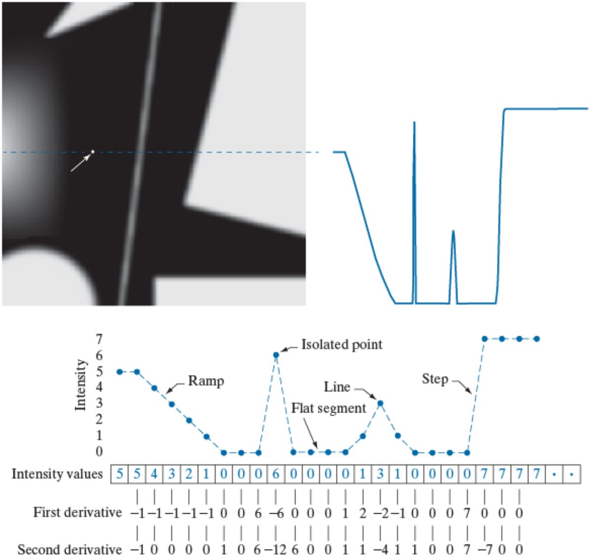
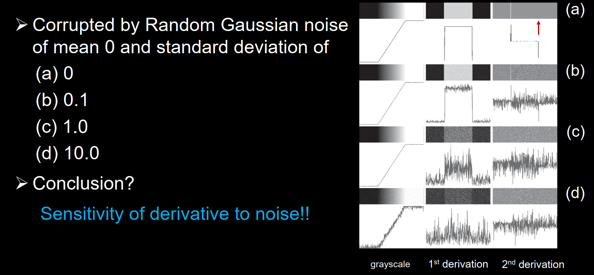
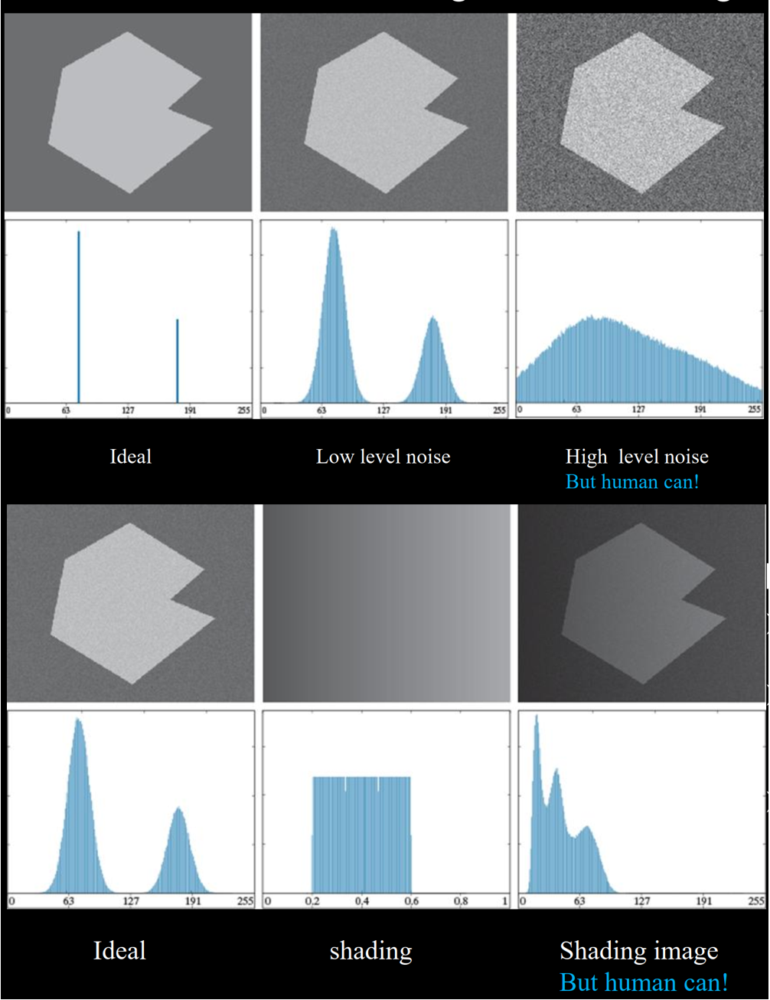

# Lecture9 Basis of Image Segmentation 复习笔记

## 本讲内容的整体逻辑

### 1. 本讲核心问题

本讲讨论的是 **图像分割的基础方法**。前面几讲主要围绕图像增强、滤波、复原和形态学处理展开，核心目标是让图像“更适合看”或“更适合后续处理”；图像分割则进一步回答：**如何把图像划分成具有实际意义的目标、区域或边界**。

在医学图像处理中，分割是从图像改善走向图像分析的关键步骤。医生拿到 MRI、CT、OCT 等图像时，不仅关心图像是否清楚，还关心病灶在哪里、器官边界在哪里、肿瘤区域有多大、多个病灶能否被区分。分割的输出往往不是一幅更好看的图像，而是用于测量、识别和诊断的区域标签。

图像分割通常依赖灰度值的两类性质：

- **不连续性**：利用灰度突变划分区域，例如点、线、边缘和角点检测。
- **相似性**：利用区域内部灰度相似性划分区域，例如阈值分割、区域生长、区域分裂与合并。

本讲重点放在两条基础路线：一条是基于 **灰度不连续** 的检测，尤其是边缘检测；另一条是基于 **灰度相似性** 的阈值分割。最后进一步引入主动轮廓模型，说明更高层的分割方法可以把边缘、区域和形状约束统一到能量最小化框架中。

### 2. 本讲展开主线

本讲内容按“从分割问题定义到具体检测方法，再到高层分割模型”的顺序展开。

1. **先明确图像分割在整门课中的位置**  
   图像处理可以粗略分为低层图像改善和高层图像分析。低层处理重在改善视觉效果，高层处理重在提取对象、区域、边界和结构信息。图像分割是图像分析的第一步，它把原始像素组织成对象或区域，为后续描述、测量、识别和解释提供输入。

2. **再定义什么是好的分割**  
   好的分割结果不仅要把目标分出来，还要满足区域内部简单、少孔洞，相邻区域灰度或特征差异明显，边界简单、平滑且空间位置准确。医学图像尤其要注意：人眼标注的边界可能并不绝对清晰，真实组织之间常存在渐变、噪声和模糊过渡。

3. **然后复习一阶与二阶导数**  
   灰度不连续检测的数学基础是导数。图像中的点、线和边缘都可以看成灰度函数的局部突变。一阶导数反映灰度变化率，二阶导数反映变化率的变化，二者分别对应不同的边缘定位和不连续检测思想。

4. **接着学习灰度不连续检测**  
   不连续检测包括点检测、线检测和边缘检测。边缘检测是重点，因为边缘通常对应不同组织、器官或病灶区域之间的边界。常用方法包括梯度算子、Laplacian、LoG、DoG、Canny 边缘检测以及边缘连接。

5. **随后转向阈值分割**  
   阈值分割利用灰度相似性，把像素分为目标和背景。全局阈值、Otsu 方法、自适应阈值、利用边缘特征辅助阈值选择，都是围绕“如何选出合适的阈值”展开的。

6. **最后引入主动轮廓模型**  
   主动轮廓模型把分割问题转化为能量最小化问题。曲线在内部平滑约束和外部图像特征约束的共同作用下演化，最终贴合目标边界。这部分说明现代分割方法不只是局部算子或单一阈值，还可以利用形状、连续性和图像特征共同决定边界。

### 3. 各主章节的作用

- **Introduction to Image Segmentation** 定义分割问题，说明分割在图像分析中的作用，并建立“基于不连续性”和“基于相似性”这两条主线。
- **Review: 1st / 2nd-order derivative** 复习卷积、一阶导数和二阶导数，为后续点、线、边缘检测提供数学基础。
- **Detection of Gray Level Discontinuities** 讲解如何检测灰度突变，包括点检测、线检测、边缘检测、梯度算子、Laplacian、LoG、Canny 和边缘连接。
- **Thresholding** 讲解基于灰度相似性的分割方法，包括全局阈值、Otsu 方法、平滑改善阈值分割、自适应阈值和利用边缘特征辅助阈值选择。
- **High-level Algorithm: Active Contour Model** 展示更高层的分割思想：通过能量函数综合边界、区域和形状约束，使分割从简单像素判别提升到曲线演化和优化问题。

### 4. 学习时应如何把握本讲

复习本讲时要抓住两个核心问题：

- **边缘类方法回答的是“哪里发生了突变”**。它们强调灰度变化、梯度方向、二阶导数零交叉和边缘连接。
- **阈值类方法回答的是“哪些像素属于同一类”**。它们强调灰度分布、目标与背景直方图、阈值选择和局部适应性。

最容易混淆的是 **edge 与 boundary**、**一阶导数与二阶导数**、**全局阈值与自适应阈值**、**边缘检测与区域分割**。边缘是局部概念，边界是区域层面的整体概念；一阶导数适合检测变化强度和方向，二阶导数适合定位零交叉但对噪声更敏感；全局阈值只使用一个阈值，自适应阈值允许阈值随空间或局部性质变化。

本讲需要重点掌握的内容包括：梯度幅值与方向、Laplacian 与 LoG、Canny 的基本步骤、全局阈值迭代算法、Otsu 方法的类间方差思想、自适应阈值的适用场景，以及主动轮廓模型中内部能量和外部能量的含义。

------

## Introduction to Image Segmentation

### 1. 图像分析与图像分割的位置

图像处理的目标可以分为两个层次：

- **图像改善**：属于低层图像处理，目的是改善图像的视觉外观，使人更容易观察。例如灰度变换、空间滤波、频域滤波和图像复原。
- **图像分析**：属于更高层的处理，目的是从图像中提取结构、对象和语义信息，使计算机能够进一步测量、识别和解释图像内容。

图像分析通常包括三个步骤：

1. **图像分割**：把图像划分为对象或区域。
2. **区域描述与表示**：把分割出的区域转换为适合计算机处理的形式，如边界、面积、形状、纹理、灰度统计量等。
3. **图像识别与解释**：根据区域特征判断图像中存在什么结构或病变。

因此，分割是从“像素图像”走向“对象信息”的第一步。分割质量会直接影响后续测量和识别结果。例如肿瘤体积估计、器官轮廓提取、血管中心线提取等任务，都高度依赖分割结果是否准确。

### 2. 图像分割的定义

图像分割是将图像细分为若干互不重叠的区域或对象。设整幅图像区域为 $R$，分割后得到 $n$ 个子区域 $R_1,R_2,\cdots,R_n$，则通常要求：

$$
\bigcup_{i = 1}^{n} R_i = R
$$

并且对任意 $i\neq j$：

$$
R_i \cap R_j = \varnothing
$$

这两个条件表达了分割的基本思想：

- 所有子区域合起来应覆盖完整图像区域；
- 不同子区域之间不应相互重叠。

在实际医学图像中，分割目标可能是器官、组织、病灶、血管、细胞或某种功能区。分割结果既可以是二值图像，也可以是多类别标签图像。

### 3. 分割依赖的两类灰度性质

图像分割主要依赖灰度值的两类性质：不连续性和相似性。

#### 1. 基于不连续性（Discontinuity）的分割

不连续性方法关注灰度值的突然变化。若两个区域之间存在明显灰度差异，则区域边界附近会出现灰度突变。典型方法包括：

- 点检测；
- 线检测；
- 边缘检测；
- 角点检测。

这类方法适合目标边界清晰、组织间灰度差异明显的图像。但在医学图像中，噪声、模糊、部分容积效应和弱边界会降低边缘检测的可靠性。

#### 2. 基于相似性（Similarity）的分割

相似性方法关注区域内部灰度或特征的一致性。若目标区域和背景区域灰度分布不同，可以通过相似性规则把像素划入不同区域。典型方法包括：

- 阈值分割；
- 区域生长；
- 区域分裂与合并。

这类方法适合目标与背景灰度分布差异明显的图像。若存在非均匀照明、强噪声或组织灰度重叠，单纯阈值分割通常会失败。

### 4. 好的图像分割应具备的性质

好的分割结果应同时考虑区域内部、相邻区域和边界质量。

| 方面 | 要求 | 含义 |
| --- | --- | --- |
| 区域内部 | 简单、少孔洞 | 同一区域内部应尽量连贯，不应被噪声打碎 |
| 相邻区域 | 特征差异明显 | 不同区域在灰度、纹理或其他特征上应可区分 |
| 边界 | 简单、不粗糙、位置准确 | 边界应贴合真实结构，不应出现明显锯齿或偏移 |

医学图像中的“好分割”不能只看视觉上是否平滑，还必须考虑解剖结构和临床意义。过度平滑可能抹掉真实病灶边界，过度敏感又可能把噪声当作目标边界。因此，分割方法的选择必须结合图像类型、目标尺度、噪声水平和后续任务。

### 5. 小结

图像分割把图像处理从“改善图像质量”推进到“提取对象结构”。本章建立了两条主线：基于不连续性的边缘类方法，以及基于相似性的阈值类方法。后续内容分别围绕这两条主线展开。

------

## Review: 导数复习->1st / 2nd-order Derivative

### 1. 卷积与局部算子

灰度不连续检测通常通过局部模板实现。设输入图像为 $f(x,y)$，模板系数为 $w(s,t)$，输出图像为 $g(x,y)$，二维卷积或相关形式可表示为：

$$
g(x, y)=\sum_{s =-a}^{a}\sum_{t =-b}^{b}w(s, t)f(x+s, y+t)
$$

模板系数决定了局部运算的性质。平滑模板通常系数和为 1，用于保留平均亮度；导数类模板通常系数和为 0，用于抑制灰度缓慢变化区域并增强灰度突变。

导数检测的直观含义是：在灰度基本不变的区域，模板响应接近 0；在灰度突变的区域，模板响应变大。因此，导数类算子可以突出点、线和边缘等不连续结构。

### 2. 一阶导数

一维离散图像中，一阶导数可以用前向差分、后向差分或中心差分近似：

$$
\frac{\partial f}{\partial x} \approx f(x+1)-f(x)
$$

$$
\frac{\partial f}{\partial x} \approx f(x)-f(x-1)
$$

$$
\frac{\partial f}{\partial x} \approx \frac{f(x+1)-f(x-1)}{2}
$$

一阶导数反映灰度变化率。对于理想阶跃边缘，一阶导数会在边缘处产生强响应；对于缓慢变化的斜坡边缘，一阶导数会在斜坡范围内产生响应。

一阶导数的特点：

- 对灰度阶跃响应强；
- 通常产生较厚的边缘；
- 可以得到梯度方向；
- 适合用于判断某点是否处于灰度变化区域。

### 3. 二阶导数

一维离散图像中，二阶导数常用如下近似：

$$
\frac{\partial^2 f}{\partial x^2} \approx f(x+1)+f(x-1)-2f(x)
$$

二阶导数反映灰度变化率本身的变化。它对细节、细线、孤立点和噪声更敏感，也常用于通过零交叉定位边缘中心。

二阶导数的特点：

- 对细小结构和噪声响应更强；
- 对阶跃或斜坡边缘容易产生双边缘响应；
- 可以通过符号判断灰度变化方向；
- 边缘中心常位于二阶导数的零交叉位置。

### 4. 一阶导数与二阶导数的区别

| 对比项 | 一阶导数 | 二阶导数 |
| --- | --- | --- |
| 主要含义 | 灰度变化率 | 灰度变化率的变化 |
| 边缘响应 | 通常为较厚边缘 | 常出现双边缘响应 |
| 对噪声敏感性 | 敏感 | 更敏感 |
| 方向信息 | 可提供梯度方向 | 通常不提供边缘方向 |
| 常见用途 | 梯度边缘检测、Canny | Laplacian、LoG、零交叉检测 |

二阶导数并不一定比一阶导数“更好”。它定位能力强，但噪声敏感性也更强，因此常需要先平滑再求二阶导数。

> [!TIP]
>
> | 项目         | 一阶导数 First-order derivative  | 二阶导数 Second-order derivative | 如何理解/特点                                  |
> | ------------ | -------------------------------- | -------------------------------- | ---------------------------------------------- |
> | 本质         | 检测灰度值的变化                 | 检测灰度变化速度的变化           | 一阶看“变没变”，二阶看“变化是否突然改变”       |
> | 常见模板     | `[-1, 1]`、`[-1, 0, 1]`          | `[1, -2, 1]`、Laplacian 模板     | 模板系数和通常为 0，平坦区域响应为 0           |
> | 对阶跃边缘   | 响应强，通常出现一个峰值         | 出现一正一负的双响应             | 一阶直接检测跳变，二阶检测跳变的开始和结束     |
> | 边缘厚度     | 通常产生较厚边缘                 | 通常边缘更细，但可能双边缘       | 一阶在整个过渡区都有响应，二阶集中在变化突变处 |
> | 对 ramp 斜坡 | 在斜坡区域持续响应               | 主要在斜坡开始和结束处响应       | ramp 中变化速度恒定，所以二阶中间接近 0        |
> | 对细线       | 有响应，但不如二阶敏感           | 响应更强                         | 细线是局部突变，二阶更容易突出                 |
> | 对孤立点     | 在孤立点前后产生响应             | 对孤立点非常敏感                 | 孤立点周围差异大，二阶响应强                   |
> | 对噪声       | 敏感                             | 更敏感                           | 噪声也是局部快速变化，所以二阶会放大噪声       |
> | 响应符号     | 符号表示灰度上升或下降           | 符号排列可判断边缘方向           | 具体正负取决于模板定义                         |
> | 典型应用     | Sobel、Prewitt、Roberts 边缘检测 | Laplacian 锐化、零交叉边缘检测   | 一阶更常用于找边缘，二阶更常用于增强细节和锐化 |
>
> 可结合图片理解：
>
> 

### 5. 小结

导数是灰度不连续检测的基础。一阶导数强调变化强度和方向，二阶导数强调变化率突变和零交叉。后续点检测、线检测、边缘检测、Laplacian、LoG 和 Canny 方法都建立在这些思想之上。

------

## 灰度不连续检测：Detection of Gray Level Discontinuities

### Point Detection

#### 1. 点检测的基本思想

点检测用于寻找与周围像素灰度显著不同的孤立点。孤立点可以理解为局部区域中的强不连续结构，因此常使用二阶导数型模板检测。

二维 Laplacian 定义为：

$$
\nabla^2 f(x, y)=\frac{\partial^2 f}{\partial x^2}+\frac{\partial^2 f}{\partial y^2}
$$

常用的四邻域离散近似为：

$$
\nabla^2 f(x, y)= f(x+1, y)+f(x-1, y)+f(x, y+1)+f(x, y-1)-4f(x, y)\\
N_4:
\begin{bmatrix}
0 & 1 & 0 \\
1 & -4 & 1 \\
0 & 1 & 0
\end{bmatrix}
\qquad
N_8:
\begin{bmatrix}
1 & 1 & 1 \\
1 & -8 & 1 \\
1 & 1 & 1
\end{bmatrix}
$$

若模板响应记为 $R$，则可通过阈值判断点是否存在：

$$
|R| \geq T
$$

这里 $T$ 是阈值。响应幅值越大，说明该点与邻域越不一致。

#### 2. 点检测的注意事项

点检测对噪声非常敏感，因为噪声本身就常表现为孤立的灰度突变。医学图像中如果直接用 Laplacian 检测点，可能把噪声点误认为微小病灶。因此实际应用中通常需要结合平滑、形态学后处理、连通域面积限制或医学先验。

### Line Detection

#### 1. 线检测的基本思想

线检测用于寻找细长结构，例如血管、骨小梁、导管或其他线状组织。线状结构具有方向性，因此线检测模板通常按不同方向设计，如水平、垂直、$45^\circ$ 和 $-45^\circ$。

某一方向的线检测模板会对该方向的一像素宽线产生更强响应。若要检测多方向线结构，可以分别使用多个方向模板，再比较响应幅值。
$$
\text{Horizontal}:
\begin{bmatrix}
-1 & -1 & -1 \\
2 & 2 & 2 \\
-1 & -1 & -1
\end{bmatrix}
\qquad
\text{+45}:
\begin{bmatrix}
2 & -1 & -1 \\
-1 & 2 & -1 \\
-1 & -1 & 2
\end{bmatrix}
$$

#### 2. 线检测与 Laplacian 的关系

Laplacian 对细线也有较强响应，但容易产生双边缘现象。对于线状结构，取 Laplacian 响应的绝对值、正响应或负响应，再结合阈值，可以突出线结构。但由于二阶导数对噪声敏感，线检测通常需要平滑和阈值配合。

### Edge Detection

#### 1. 边缘的定义

边缘是位于两个区域边界上的一组连通像素。它是一个 **局部概念**：边缘点说明局部灰度发生了明显变化，但不一定天然形成完整封闭边界。

边缘可以有不同形态：

- **理想阶跃边缘**：灰度从一个水平突然跳到另一个水平。
- **斜坡边缘**：真实成像中更常见，灰度在一定宽度内逐渐变化。
- **屋顶边缘**：灰度先增加后减少，常对应细线或脊状结构。

医学图像中的边缘通常不是理想阶跃，而是受光学系统、采样、噪声、组织混合和成像模糊影响的斜坡过渡。

#### 2. Edge 与 Boundary 的区别

| 概念 | 含义 | 关注层次 |
| --- | --- | --- |
| Edge | 局部灰度突变点或边缘元素 | 像素或小邻域 |
| Boundary | 区域之间的整体边界 | 连续曲线或闭合轮廓 |

边缘检测得到的是局部边缘元素，边界检测或区域分割需要把这些局部元素连接成有意义的区域边界。因此，边缘检测只是分割的一部分，不能直接等同于完整分割。

#### 3. 噪声对边缘检测的影响

导数对噪声敏感。一阶导数会放大局部随机变化，二阶导数对噪声更敏感。噪声标准差越大，导数响应越容易被噪声主导，真实边缘越难区分。

> [!NOTE]
>
> 边缘检测的一般步骤包括：
>
> 1. 对图像进行平滑以降低噪声；
> 2. 计算局部导数；
> 3. 使用一阶导数幅值检测边缘是否存在；
> 4. 使用二阶导数符号判断边缘位于亮侧还是暗侧；
> 5. 使用二阶导数零交叉定位灰度过渡中心。

平滑可以减少噪声，但也会削弱边缘响应、降低定位精度。因此边缘检测始终存在“抗噪声”和“定位精度”之间的权衡。

### Gradient Operators

#### 1. 梯度的定义

二维图像 $f(x,y)$ 在点 $(x,y)$ 处的梯度定义为：

$$
\nabla f =
\begin{bmatrix}
g_x \\
g_y
\end{bmatrix}
=
\begin{bmatrix}
\frac{\partial f}{\partial x} \\
\frac{\partial f}{\partial y}
\end{bmatrix}
$$

梯度方向指向灰度增长最快的方向，梯度幅值表示局部灰度变化强度。梯度幅值可写为：

$$
M(x, y)=|\nabla f|=\sqrt{g_x^2+g_y^2}
$$

为了简化计算，也常用近似形式：

$$
M(x, y)\approx |g_x|+|g_y|
$$

梯度方向为：

$$
\alpha(x, y)=\tan^{-1}\left(\frac{g_y}{g_x}\right)
$$

需要注意：边缘方向与梯度方向垂直。梯度方向表示灰度变化最快方向，而边缘本身沿着等灰度方向延伸。

#### 2. 有限差分近似

中心差分可以近似二维方向导数：

$$
\Delta_x f(x, y)=\frac{f(x+h, y)-f(x-h, y)}{2h}
$$

$$
\Delta_y f(x, y)=\frac{f(x, y+h)-f(x, y-h)}{2h}
$$

其中 $h$ 通常取 1。$h$ 太小会对细微噪声敏感，$h$ 太大则可能忽略重要细节。

#### 3. Roberts、Prewitt、Sobel 与 Kirsch 算子

常见一阶边缘算子本质上都是对 $g_x$ 和 $g_y$ 的局部近似。

| 算子 | 特点 | 适用理解 |
| --- | --- | --- |
| Roberts | 使用对角差分，模板小 | 定位紧凑，但抗噪声能力弱 |
| Prewitt | 使用 $3\times3$ 模板，包含简单平均 | 比 Roberts 稳定，可检测水平和垂直方向变化 |
| Sobel | 在 Prewitt 基础上加入权重 $2$ | 兼具差分和平滑，常用且抗噪声稍好 |
| Kirsch | 使用罗盘方向模板 | 对多个方向边缘响应，可用于方向性边缘检测 |

Sobel 算子常用模板为：（有人会把xy反过来，其实是因为对于坐标划分的不一致。）

$$
G_x =
\begin{bmatrix}
-1 & 0 & 1\\
-2 & 0 & 2\\
-1 & 0 & 1
\end{bmatrix}
$$

$$
G_y =
\begin{bmatrix}
-1 & -2 & -1\\
0 & 0 & 0\\
1 & 2 & 1
\end{bmatrix}
$$

Sobel 的权重设计使其在求导的同时具有一定平滑作用，因此在噪声图像中通常比简单差分更稳定。

#### 4. 平滑对梯度检测的影响

平滑可以减少噪声造成的伪边缘，使主要边缘更连通，但也会使所有边缘响应变弱（可以看课件 30+31/80）。平滑核越大，噪声抑制越明显，边缘定位越模糊。实际使用时应根据目标尺度选择平滑程度：若目标边界细小，过强平滑可能直接抹掉真实边界。

### Laplacian Operator

#### 1. Laplacian 的定义与性质

Laplacian 是二阶导数算子：

$$
\nabla^2 f =\frac{\partial^2 f}{\partial x^2}+\frac{\partial^2 f}{\partial y^2}
$$

它具有各向同性特点，对方向不敏感，适合检测灰度突变的存在。但 Laplacian 本身存在三个问题：

- 对噪声非常敏感；
- 幅值响应容易产生双边缘；
- 不提供梯度方向，不能直接得到边缘方向。

因此，Laplacian 更常用于配合平滑和零交叉定位，而不是单独作为最终边缘检测器。

> [!Contrast]
>
> 进行一波对比。可以从数学本质、向量与标量性质、边缘响应特性、噪声敏感、典型案例与应用等角度分析
> $$
> \nabla f =
> \begin{bmatrix}
> g_x \\
> g_y
> \end{bmatrix}
> =
> \begin{bmatrix}
> \frac{\partial f}{\partial x} \\
> \frac{\partial f}{\partial y}
> \end{bmatrix}
> \\
> \nabla^2 f =\frac{\partial^2 f}{\partial x^2}+\frac{\partial^2 f}{\partial y^2}
> $$
> 

#### 2. 四邻域与八邻域模板

常见四邻域 Laplacian 模板为：

$$
\begin{bmatrix}
0 & 1 & 0\\
1 & -4 & 1\\
0 & 1 & 0
\end{bmatrix}
$$

常见八邻域 Laplacian 模板为：

$$
\begin{bmatrix}
1 & 1 & 1\\
1 & -8 & 1\\
1 & 1 & 1
\end{bmatrix}
$$

模板系数和为 0，因此在灰度平坦区域响应接近 0，在灰度突变区域产生强响应。

### Laplacian of Gaussian（LoG）

#### 1. LoG 的基本思想

LoG 将 Gaussian 平滑和 Laplacian 二阶导数结合起来。先用 Gaussian 平滑抑制噪声，再用 Laplacian 检测二阶变化。由于卷积可结合，等价于先构造 LoG 模板，再与图像卷积。

Gaussian 函数可以表示为：

$$
G(x, y)=\frac{1}{2\pi\sigma^2}e^{-\frac{x^2+y^2}{2\sigma^2}}
$$

设 $r^2=x^2+y^2$，LoG 可写为：

$$
\nabla^2 G(x, y)=\frac{r^2-2\sigma^2}{\sigma^4}e^{-\frac{r^2}{2\sigma^2}}
$$

不同教材或课件可能在符号和常数项上略有差异，但核心结构一致：LoG 是一个具有中心和周围相反符号的二阶导数平滑模板，形状常被称为 Mexican hat。

#### 2. LoG 的边缘定位

LoG 结果常通过 **零交叉** 定位边缘。灰度从暗到亮或从亮到暗变化时，二阶导数会改变符号，零交叉位于灰度过渡的中间位置。

LoG 的关键参数是 $\sigma$：

- $\sigma$ 较小：保留细节，定位较精确，但对噪声更敏感；
- $\sigma$ 较大：抗噪声更强，检测较粗尺度边缘，但边缘定位更模糊。

#### 3. Marr-Hildreth 算法

Marr-Hildreth 边缘检测可以理解为 LoG 零交叉检测：

1. 使用 Gaussian 平滑图像；
2. 对平滑图像计算 Laplacian；
3. 寻找二阶导数结果中的零交叉；
4. 根据零交叉强度阈值保留可靠边缘。

阈值为 0 时会保留更多零交叉，可能包含许多噪声边缘；阈值较高时能去除弱响应，但也可能漏掉弱边界。

#### 4. DoG 对 LoG 的近似

LoG 可以用 Difference of Gaussians（DoG）近似。DoG 使用两个不同标准差的 Gaussian 平滑结果相减：

$$
DoG(x, y)= G_{\sigma_1}(x, y)-G_{\sigma_2}(x, y)
$$

其中：

$$
G_{\sigma}(x, y)=\frac{1}{2\pi\sigma^2}e^{-\frac{x^2+y^2}{2\sigma^2}}
$$

当两个标准差比例合适时，DoG 与 LoG 具有相近的零交叉结构。DoG 的计算通常更方便，因此常用于多尺度边缘和斑点检测思想中。

### Canny Edge Detector

#### 1. Canny 的设计目标

Canny 边缘检测器追求三个目标：

- **低错误率**：尽量检测所有真实边缘，同时少检测非边缘。
- **边缘定位准确**：检测到的边缘位置应尽量接近真实边缘。
- **单响应**：一个真实边缘尽量只产生一条边缘响应，避免多重边缘。

这三个目标正好对应普通导数边缘检测中的主要问题：噪声误检、定位偏移和边缘过厚。

#### 2. Canny 的基本步骤

Canny 边缘检测通常包括四步：

1. **Gaussian 平滑**  
   用 Gaussian 滤波器降低噪声，减少伪边缘。

2. **计算梯度幅值和方向**  
   计算 $g_x$、$g_y$、梯度幅值 $M(x,y)$ 和方向 $\alpha(x,y)$。

3. **非极大值抑制**  
   沿梯度方向比较当前像素与两侧邻域。如果当前像素不是局部最大值，则抑制为 0。这样可以把厚边缘细化为较细边缘。

4. **双阈值和连接分析**  
   使用高阈值和低阈值区分强边缘、弱边缘和非边缘。强边缘直接保留；与强边缘连通的弱边缘保留；孤立弱边缘去除。这一过程也称为滞后阈值处理。

#### 3. 非极大值抑制的含义

非极大值抑制不是普通阈值操作。它关注的是：当前像素在梯度方向上是否是局部最大响应。若不是最大响应，即使梯度幅值不小，也可能只是边缘旁边的扩散响应，应被删除。

因此，非极大值抑制解决的是边缘“变细”的问题；双阈值和连接分析解决的是边缘“可靠性”和“连通性”的问题。

#### 4. Canny 与 LoG 的区别

| 对比项 | LoG / Marr-Hildreth | Canny |
| --- | --- | --- |
| 基础 | 二阶导数零交叉 | 一阶梯度 |
| 抗噪声 | 依赖 Gaussian 平滑 | 依赖 Gaussian 平滑和双阈值 |
| 边缘细化 | 通过零交叉定位 | 通过非极大值抑制 |
| 连通性 | 需要额外处理 | 内置滞后阈值连接 |
| 方向信息 | 不直接提供梯度方向 | 明确使用梯度方向 |

Canny 通常能得到更细、更连续、更稳定的边缘，但参数选择仍然重要，包括 Gaussian 尺度、高低阈值和连接规则。

### Edge Linking and Boundary Detection

#### 1. 为什么需要边缘连接

边缘检测得到的是局部边缘点，而实际分割需要完整边界。由于噪声、弱边界、阈值选择和纹理干扰，检测到的边缘常常断裂或包含伪边缘。因此需要边缘连接，把局部边缘元素组织成连续边界。

#### 2. 局部边缘连接规则

在小邻域内，可以根据边缘点的两个特征判断是否连接：

- **梯度幅值相似**：

$$
\left||\nabla f(x, y)|-|\nabla f(x_0, y_0)|\right|\leq E
$$

- **梯度方向相似**：

$$
|\alpha(x, y)-\alpha(x_0, y_0)|\leq A
$$

其中 $E$ 是幅值阈值，$A$ 是角度阈值，$(x_0,y_0)$ 是当前参考边缘点。若邻域内边缘点的幅值和方向都足够接近，则可认为它们属于同一边界片段。

#### 3. 边缘连接与形态学后处理

边缘连接后常需要结合形态学细化、连接、闭运算或去除短小分支。这样可以改善边缘连通性，并减少厚边缘或噪声造成的冗余结构。

### 小结

灰度不连续检测的核心是用导数寻找局部突变。点检测和线检测关注特定局部结构，边缘检测关注区域之间的过渡。梯度算子提供幅值和方向，Laplacian 与 LoG 通过二阶导数和零交叉定位边缘，Canny 则综合平滑、梯度、非极大值抑制和双阈值连接，是更完整的边缘检测流程。

------

## 阈值分割：Thresholding

### Basic Concepts

#### 1. 阈值分割的定义

阈值分割是最基本的基于相似性的分割方法。对于灰度图像 $f(x,y)$，给定阈值 $T$，二值输出 $g(x,y)$ 可定义为：

$$
g(x, y)=
\begin{cases}
1, & f(x, y)> T\\
0, & f(x, y)\leq T
\end{cases}
$$

其中 $g(x,y)=1$ 的像素称为目标点，$g(x,y)=0$ 的像素称为背景点。

阈值可以写成更一般的形式：

$$
T = T(x, y, p(x, y), f(x, y))
$$

其中 $p(x,y)$ 表示像素邻域中的某种局部性质，例如局部均值、局部方差或局部梯度。

#### 2. 全局、局部与自适应阈值

| 类型 | 阈值依赖 | 含义 |
| --- | --- | --- |
| 全局阈值 | 只依赖灰度值或整幅图像统计 | 全图使用同一个阈值 |
| 局部阈值 | 依赖像素邻域性质 $p(x,y)$ | 不同局部区域可有不同阈值 |
| 动态 / 自适应阈值 | 依赖空间坐标 $(x,y)$ | 阈值随位置变化 |

全局阈值简单高效，但要求目标和背景灰度分布稳定。局部或自适应阈值更适合非均匀照明、背景变化明显或目标灰度随位置变化的图像。

### Noise, Illumination and Reflectance

#### 1. 噪声对阈值分割的影响

理想情况下，目标和背景的灰度直方图可以形成两个清晰峰值，中间有明显谷底，阈值容易选择。噪声会使两个峰变宽、重叠增加，从而导致：

- 目标像素被误分为背景；
- 背景像素被误分为目标；
- 阈值对小扰动变得敏感；
- 分割结果出现孔洞、孤立噪声点或边界粗糙。

人眼有时仍能识别目标，是因为人眼会利用形状、上下文和结构连续性，而单纯阈值方法只看灰度条件。

#### 2. 非均匀照明的影响

非均匀照明会使同一类物体在不同位置呈现不同灰度，导致全局阈值失效。图像形成模型可写为：

$$
f(x, y)= i(x, y)r(x, y)
$$

其中 $i(x,y)$ 是照明分量，$r(x,y)$ 是反射分量。若先拍摄一张均匀白色反射面的图像：

$$
g(x, y)= k i(x, y)
$$

则可以用归一化图像进行分割：

$$
h(x, y)=\frac{f(x, y)}{g(x, y)}=\frac{r(x, y)}{k}
$$

这样可以削弱照明不均对阈值选择的影响，使分割更接近对真实反射或组织特征的判断。

### Basic Global Thresholding

#### 1. 基本全局阈值迭代算法

基本全局阈值法通过迭代估计目标和背景均值来更新阈值：

1. 选择初始阈值 $T$。如果目标和背景面积相近，可取平均灰度；如果面积差异大，可取最大灰度和最小灰度的中点。
2. 用 $T$ 分割图像，得到两个区域 $G_1$ 和 $G_2$。
3. 分别计算两个区域的平均灰度 $m_1$ 和 $m_2$。
4. 更新阈值：

$$
T =\frac{m_1+m_2}{2}
$$

5. 重复步骤 2 到 4，直到 $T$ 收敛。

#### 2. 算法理解

这个算法假设图像主要由目标和背景两类组成，且两类灰度均值可以代表各自分布中心。阈值取两个均值的中间位置，相当于在两类灰度中心之间寻找分界。

它适合目标和背景直方图近似双峰且分离较明显的情况。若图像存在严重噪声、非均匀照明、多类目标或目标背景灰度重叠，迭代全局阈值可能得到不可靠结果。

### Otsu's Method

#### 1. Otsu 方法的核心思想

Otsu 方法是一种自动阈值选择方法。它的基本思想是：好的阈值应使分割后两类内部尽量紧凑，同时两类之间差异尽量大。在数学中，就是类间方差保持尽可能大。

（1）首先计算类间方差的公式

设图像灰度级为 $0,1,\cdots,L-1$，灰度 $i$ 的像素数为 $n_i$，总像素数为 $N$，则灰度概率为：

$$
p_i =\frac{n_i}{N}
$$

若阈值为 $k$，则两类分别为：

- $C_0=\{0,1,\cdots,k\}$；
- $C_1=\{k+1,k+2,\cdots,L-1\}$。

两类概率为：

$$
\omega_0(k)=\sum_{i = 0}^{k}p_i
$$

$$
\omega_1(k)=\sum_{i = k+1}^{L-1}p_i
$$

两类均值为：

$$
\mu_0(k)=\frac{\sum_{i = 0}^{k}i p_i}{\omega_0(k)}
$$

$$
\mu_1(k)=\frac{\sum_{i = k+1}^{L-1}i p_i}{\omega_1(k)}
$$

全局均值为：

$$
\mu_T =\sum_{i = 0}^{L-1}i p_i
$$

类间方差为：

$$
\sigma_B^2(k)=\omega_0(k)\left [\mu_0(k)-\mu_T\right]^2+\omega_1(k)\left [\mu_1(k)-\mu_T\right]^2
$$

也可写为：

$$
\sigma_B^2(k)=\omega_0(k)\omega_1(k)\left [\mu_0(k)-\mu_1(k)\right]^2
$$

（2）Otsu 方法就是找到使 $\sigma_B^2(k)$ 最大的阈值 $k$。并使用这个 $k$ 的值

#### 2. 类内方差与类间方差

Otsu 方法常被描述为最小化类内方差，也等价于最大化类间方差。原因是总方差固定时：

$$
\sigma_T^2 =\sigma_W^2+\sigma_B^2
$$

其中 $\sigma_T^2$ 是总方差，$\sigma_W^2$ 是类内方差，$\sigma_B^2$ 是类间方差。当总方差不变时，最小化类内方差等价于最大化类间方差。

#### 3. Otsu 方法的适用条件

Otsu 方法适合直方图具有明显双峰结构的图像。若目标和背景灰度分布重叠严重、目标面积很小、背景变化很大或存在多类别结构，Otsu 方法可能偏向占比更大的类别，导致小目标漏分。

### Smoothing and Edge Characteristics for Thresholding

#### 1. 平滑改善全局阈值

平滑可以降低噪声，使直方图峰值更集中、目标和背景分布更容易分离，从而改善全局阈值分割。但平滑也可能模糊边界，使小目标被削弱。因此平滑更适合噪声主导的情况，不适合需要保留细小边界或微小病灶的情况。

#### 2. 利用边缘特征辅助阈值选择

如果直方图峰值高、窄、对称，并且峰之间有深谷，阈值容易选择。若只依赖全图灰度信息，阈值会受到目标和背景相对面积影响。例如目标区域很小时，直方图可能主要由背景主导，阈值会偏向背景。

一种思路是只使用位于边缘或边缘附近的像素来估计阈值，因为边缘附近更能反映目标和背景的过渡关系。但这里存在一个矛盾：边缘往往需要分割后才能准确知道，而分割本身又依赖阈值。因此实际方法常用梯度或 Laplacian 近似边缘信息。

梯度可以判断像素是否位于边缘附近；Laplacian 可以反映边缘处灰度过渡的符号变化。将这些信息与灰度直方图结合，可以减少背景大面积像素对阈值的干扰。

### Multiple Thresholds

#### 1. 多阈值分割

当图像中不止目标和背景两类，而是存在多个灰度层次时，需要使用多个阈值。设有两个阈值 $T_1$ 和 $T_2$，可将图像划分为三类：

$$
g(x, y)=
\begin{cases}
0, & f(x, y)\leq T_1\\
1, & T_1 < f(x, y)\leq T_2\\
2, & f(x, y)> T_2
\end{cases}
$$

多阈值适合多组织、多材料或多灰度结构分割。例如医学图像中可能同时存在空气、软组织、骨组织或造影增强区域。

#### 2. 双阈值的意义

双阈值也可用于保留不确定区域。例如 Canny 中的双阈值将边缘分为强边缘、弱边缘和非边缘；阈值分割中也可以用两个阈值表示确定目标、确定背景和待判断区域。

### Basic Adaptive Thresholding

#### 1. 自适应阈值的动机

全局阈值在非均匀照明或背景缓慢变化时常失败。自适应阈值的基本思想是：图像不同位置使用不同阈值，使阈值能够跟随局部背景变化。

最简单的做法是：

1. 将图像划分为若干子图像；
2. 对每个子图像独立估计阈值；
3. 合并各子图像分割结果。

问题在于：子图像大小如何选、每个子图像是否包含目标边界、相邻子图像结果如何平滑衔接，都会影响最终分割。

#### 2. 基于子图像方差的处理

一种局部处理策略是根据子图像灰度方差判断其类型：

- 若子图像方差很小，说明区域较平坦，可能不包含目标边界；
- 若子图像方差较大，说明区域内灰度变化明显，可能包含目标边界。

平坦子图像可以合并后使用一个阈值，含边界子图像则分别阈值化。这样既能利用局部信息，又避免对所有区域机械地独立阈值。

#### 3. 重叠子图像与边界伪影

非重叠子图像容易在块边界处产生不连续分割结果。使用重叠子图像、插值阈值面或局部平滑可以减轻这种块状伪影。

阈值分割没有能处理所有情况的唯一方法。医学图像中的目标大小、噪声、照明、对比度和解剖结构差异很大，阈值方法通常需要结合先验、平滑、形态学或边缘信息。

### Variable Thresholding Based on Local Properties

#### 1. 基于局部均值和方差的判别

局部阈值可以根据像素邻域的均值 $m_{xy}$ 和标准差 $\sigma_{xy}$ 构造判别规则。例如：

$$
Q(\sigma_{xy}, m_{xy})=
\begin{cases}
true, & f(x, y)> a\sigma_{xy}\ \text{and}\ f(x, y)> b m_{xy}\\
false, & otherwise
\end{cases}
$$

输出为：

$$
g(x, y)=
\begin{cases}
1, & Q\ \text{is true}\\
0, & Q\ \text{is false}
\end{cases}
$$

其中 $a$ 和 $b$ 是控制局部标准差和局部均值影响的参数。

#### 2. 局部性质的意义

局部均值反映局部背景亮度，局部标准差反映局部对比度或纹理变化。利用这两个量可以让阈值随局部背景和局部变化程度调整。

这种方法适合背景变化明显但目标相对局部突出的情况。若局部窗口太小，统计量不稳定；若窗口太大，又会退化为接近全局阈值，无法适应局部变化。

### 小结

阈值分割的核心问题是阈值选择。全局阈值简单但依赖稳定灰度分布，Otsu 方法通过最大化类间方差自动选阈值，自适应阈值通过局部统计量应对非均匀背景。阈值分割容易受到噪声、照明、目标面积比例和灰度重叠影响，因此实际使用时常与平滑、边缘特征和形态学后处理结合。

------

## High-level Algorithm: Active Contour Model

### 1. 主动轮廓模型的基本思想

主动轮廓模型也称为 snakes。它把目标边界表示为图像平面中的一条参数曲线：

$$
\mathbf{v}(s)=(x(s), y(s)),\quad 0\leq s\leq 1
$$

曲线具有能量，分割问题被转化为寻找能量最小的曲线。总能量通常由内部能量、外部能量和约束能量组成：

$$
E_{snake}= E_{internal}+E_{external}+E_{constraint}
$$

核心思想是：曲线在内部约束下保持平滑连续，同时在外部图像力作用下向真实目标边界移动。最终曲线停留在能量较低的位置，即目标边界附近。

### 2. 内部能量与外部能量

主动轮廓模型可写成加权形式：

$$
E(C)=\alpha E_{int}(C)+\beta E_{ext}(C)
$$

其中：

- $C$ 表示轮廓曲线；
- $\alpha$ 和 $\beta$ 控制内部能量与外部能量的相对重要性；
- $E_{int}(C)$ 控制曲线平滑性和连续性；
- $E_{ext}(C)$ 由图像特征决定，用来吸引曲线靠近边缘或目标区域。

内部能量可以使用一阶或二阶平滑项。例如：

$$
E_{int}(C)=\int |C'(s)|^2 ds
$$

或：

$$
E_{int}(C)=\int |C''(s)|^2 ds
$$

一阶项倾向于保持曲线连续并控制拉伸，二阶项倾向于抑制过大曲率，使轮廓更平滑。

外部能量可由边缘特征定义：

$$
E_{ext}(C)=-\int |\nabla I(C(s))|^2 ds
$$

梯度越大的位置越可能是边界，负号使曲线趋向于梯度幅值大的位置。

外部能量也可由区域特征定义，例如：

$$
E_{ext}(C)=-\int (I(C(s))-\mu)^2 ds
$$

其中 $\mu$ 表示目标区域的平均灰度。区域型外部能量适合边缘较弱但区域统计特征明显的图像。

### 3. 力平衡与能量最小化

主动轮廓的演化过程可以理解为内部力和外部力的平衡：

- 内部力使曲线保持平滑、连续，避免过度弯曲或不规则；
- 外部力由图像边缘、灰度或区域特征产生，推动曲线靠近目标边界。

能量最小化对应变分条件：

$$
\frac{\delta E}{\delta C}= 0
$$

实际计算中通常通过迭代更新曲线位置：

$$
C(x, t+1)= C(x, t)+\Delta t \cdot F(x)
$$

其中 $C(x,t)$ 是当前迭代的曲线位置，$C(x,t+1)$ 是下一次迭代的位置，$\Delta t$ 是时间步长，$F(x)$ 是由能量函数导出的合力。

### 4. 主动轮廓模型的实现步骤

主动轮廓模型通常包括以下步骤：

1. **初始化**  
   给定初始轮廓。初始轮廓可以由人工标记、阈值分割、边缘检测或粗略先验得到。

2. **能量计算**  
   根据当前曲线位置计算内部能量和外部能量。

3. **力计算**  
   根据能量函数计算推动曲线演化的力。

4. **曲线变形**  
   按迭代公式更新曲线，使其向能量更低的位置移动。

5. **收敛检查**  
   若曲线变化很小、能量变化很小或达到最大迭代次数，则停止。

### 5. 主动轮廓在医学图像中的意义

主动轮廓适合器官、组织和病灶轮廓提取。与简单边缘检测相比，它具有几个优势：

- 可以利用边缘之外的平滑性和形状连续性；
- 可以在弱边界情况下通过区域信息辅助演化；
- 可以得到连续轮廓，而不是零散边缘点；
- 适合与人工初始化或医学先验结合。

但它也有局限：

- 对初始轮廓较敏感；
- 可能陷入局部最小值；
- 参数权重会影响结果；
- 强噪声、边界缺失或复杂拓扑变化会增加分割难度。

### 小结

主动轮廓模型把分割问题从像素级判别提升为曲线优化问题。它通过内部能量约束轮廓形状，通过外部能量利用图像边缘或区域信息，最终在能量最小化意义下获得目标边界。它是理解更高级医学图像分割方法的重要桥梁。

------

## 复习总结

### 1. 核心知识点清单

- 图像分割是图像分析的第一步，目标是把图像划分为有意义的区域或对象。
- 分割依赖两类基本性质：灰度不连续性和灰度相似性。
- 好的分割要求区域内部简单、少孔洞，相邻区域差异明显，边界准确且不粗糙。
- 一阶导数反映灰度变化率，适合检测边缘强度和方向。
- 二阶导数反映变化率的变化，适合零交叉定位，但对噪声更敏感。
- 点检测和线检测都属于灰度不连续检测，常依赖二阶导数或方向模板。
- 边缘是局部概念，边界是区域层面的整体概念。
- 梯度幅值表示边缘强度，梯度方向表示灰度增长最快方向，边缘方向与梯度方向垂直。
- Roberts、Prewitt、Sobel 和 Kirsch 都是梯度型边缘算子。
- Laplacian 是二阶导数算子，具有各向同性，但噪声敏感且容易产生双边缘。
- LoG 先平滑再求二阶导数，通过零交叉定位边缘。
- DoG 可以近似 LoG。
- Canny 包括 Gaussian 平滑、梯度计算、非极大值抑制、双阈值和连接分析。
- 阈值分割把灰度图像转换为目标和背景标签。
- 基本全局阈值迭代法根据两类均值更新阈值。
- Otsu 方法通过最大化类间方差自动选择阈值。
- 自适应阈值适合非均匀照明和局部背景变化明显的图像。
- 主动轮廓模型通过能量最小化获得连续目标边界。

### 2. 必须掌握的核心公式

| 内容 | 公式 | 复习要点 |
| --- | --- | --- |
| 分割区域覆盖 | $\bigcup_{i=1}^{n}R_i=R$ | 子区域合起来覆盖整幅图像 |
| 区域互不重叠 | $R_i\cap R_j=\varnothing$ | 不同区域不能交叠 |
| 卷积 / 局部模板 | $g(x,y)=\sum_{s=-a}^{a}\sum_{t=-b}^{b}w(s,t)f(x+s,y+t)$ | 导数模板系数和通常为 0 |
| 一阶差分 | $\frac{\partial f}{\partial x}\approx f(x+1)-f(x)$ | 检测灰度变化率 |
| 二阶差分 | $\frac{\partial^2 f}{\partial x^2}\approx f(x+1)+f(x-1)-2f(x)$ | 对细节和噪声敏感 |
| Laplacian | $\nabla^2 f=\frac{\partial^2 f}{\partial x^2}+\frac{\partial^2 f}{\partial y^2}$ | 二阶各向同性算子 |
| 梯度 | $\nabla f=[g_x,g_y]^T$ | 指向灰度增长最快方向 |
| 梯度幅值 | $M(x,y)=\sqrt{g_x^2+g_y^2}$ | 判断边缘强度 |
| 梯度方向 | $\alpha(x,y)=\tan^{-1}(g_y/g_x)$ | 边缘方向与其垂直 |
| 阈值分割 | $g(x,y)=1,\ f(x,y)>T;\ g(x,y)=0,\ f(x,y)\leq T$ | 目标与背景二值划分 |
| 全局阈值更新 | $T=(m_1+m_2)/2$ | 两类均值中点 |
| Otsu 类间方差 | $\sigma_B^2=\omega_0\omega_1(\mu_0-\mu_1)^2$ | 选择最大类间方差阈值 |
| 主动轮廓能量 | $E(C)=\alpha E_{int}(C)+\beta E_{ext}(C)$ | 内部平滑与外部图像力平衡 |

### 3. 必须会区分的概念

| 概念 | 关键区别 |
| --- | --- |
| 图像改善 vs 图像分析 | 图像改善面向视觉质量，图像分析面向对象、区域和结构信息 |
| 不连续性分割 vs 相似性分割 | 前者找灰度突变，后者找灰度或特征一致区域 |
| Edge vs Boundary | Edge 是局部边缘点，Boundary 是整体区域边界 |
| 一阶导数 vs 二阶导数 | 一阶检测变化强度和方向，二阶检测变化率突变和零交叉 |
| Gradient vs Laplacian | Gradient 有方向信息，Laplacian 各向同性但无边缘方向 |
| LoG vs Canny | LoG 基于二阶零交叉，Canny 基于一阶梯度、非极大值抑制和双阈值连接 |
| 全局阈值 vs 自适应阈值 | 全局阈值全图一个 $T$，自适应阈值随局部区域或空间位置变化 |
| Otsu vs 基本迭代阈值 | Otsu 最大化类间方差，基本迭代法根据两类均值更新阈值 |
| 边缘检测 vs 阈值分割 | 边缘检测找区域边界线索，阈值分割直接给像素类别 |
| 主动轮廓 vs 普通边缘检测 | 主动轮廓输出连续曲线，并引入平滑和图像力约束 |

### 4. 容易出错或容易混淆的点

1. **把边缘检测等同于完整分割**  
   边缘检测只产生局部边缘点，完整分割还需要边缘连接、区域闭合、标签生成和后处理。

2. **忽略导数对噪声的敏感性**  
   一阶和二阶导数都会放大噪声，二阶导数尤其敏感。使用 Laplacian 或 LoG 时必须考虑平滑和阈值。

3. **认为二阶导数一定比一阶导数定位更好**  
   二阶导数的零交叉有定位优势，但双边缘和噪声敏感会带来误检。Canny 通过一阶梯度、非极大值抑制和连接分析解决了许多实际问题。

4. **混淆梯度方向和边缘方向**  
   梯度方向是灰度增长最快方向，边缘方向与梯度方向垂直。

5. **把 Otsu 方法当作万能阈值法**  
   Otsu 适合双峰且类间差异明显的直方图。若目标很小、背景不均匀或灰度重叠严重，Otsu 可能失败。

6. **忽略非均匀照明对全局阈值的破坏**  
   同一目标在不同位置亮度不同，全局阈值会把同一类结构分成不同类别。此时应考虑照明补偿或自适应阈值。

7. **局部阈值窗口选择不当**  
   窗口太小会受噪声影响，窗口太大无法适应局部变化。窗口尺度应与目标尺度和背景变化尺度匹配。

8. **主动轮廓初始化随意**  
   主动轮廓依赖初始曲线和能量参数。初始位置过远或参数不合适时，曲线可能收敛到错误边界。

### 5. AI 总结

本讲的核心是理解图像分割如何从像素灰度走向目标区域。分割首先要求把图像划分为互不重叠且覆盖完整图像的区域，这一过程既可以利用灰度不连续性，也可以利用灰度相似性。基于不连续性的部分以导数为基础：一阶导数形成梯度幅值和方向，适合检测边缘强度；二阶导数形成 Laplacian 和 LoG，适合通过零交叉定位边缘，但对噪声更加敏感。Canny 边缘检测将平滑、梯度、非极大值抑制和双阈值连接组合起来，是较完整的边缘检测流程。基于相似性的部分以阈值分割为代表：全局阈值简单直接，Otsu 方法通过最大化类间方差自动选阈值，自适应阈值则解决非均匀照明和局部背景变化问题。最后，主动轮廓模型把分割提升为能量最小化问题，通过内部平滑约束和外部图像特征共同决定连续边界。整讲内容的主线是从局部灰度突变、整体灰度分类，再到曲线优化模型，逐步建立医学图像分割的基础框架。
